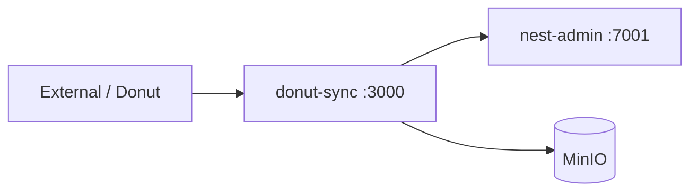

# donut-sync-backend

Service đồng bộ nội bộ (Donut Sync) — giao tiếp với nest-admin và MinIO. Nhẹ hơn nest-admin/ladipage, không import full `nest-core`.

## Công nghệ

- NestJS 11
- Module `sync` — internal + public sync endpoints
- Auth guard nội bộ (`SYNC_TOKEN` / `INTERNAL_KEY`)
- MinIO/S3 qua `S3_ENDPOINT`

## Port & URL

| Môi trường | Port | Ghi chú |
|------------|------|---------|
| Local | 3000 | `DONUT_SYNC_PORT` |
| Docker | 3000 | Service `donut-sync` |

## Vai trò trong stack



- `BACKEND_INTERNAL_URL=http://nest-admin:7001` (trong Docker)
- Token đồng bộ: `SYNC_TOKEN` / `INTERNAL_KEY` trong `.env`

## Chạy local

```bash
# Từ root
pnpm nx serve donut-sync-backend
```

Cần nest-admin (hoặc mock) và MinIO nếu test sync thật:

```bash
docker compose -f docker/docker-compose.yml --env-file .env up -d minio liora-nest-admin
```

## Chạy Docker

```bash
pnpm docker:up
# Hoặc chỉ donut-sync + dependencies:
docker compose -f docker/docker-compose.yml --env-file .env up -d minio liora-nest-admin donut-sync
```

## Migrate & seed

donut-sync **không** có schema riêng. Dùng chung DB đã migrate cho nest-admin:

```bash
pnpm db:migration:run
```

## Build

```bash
pnpm nx build donut-sync-backend
```

## Tài liệu

- [README root](../../README.md)
- [Docker](../../docker/README.md)
- [nest-admin](../nest-admin-backend/README.md)