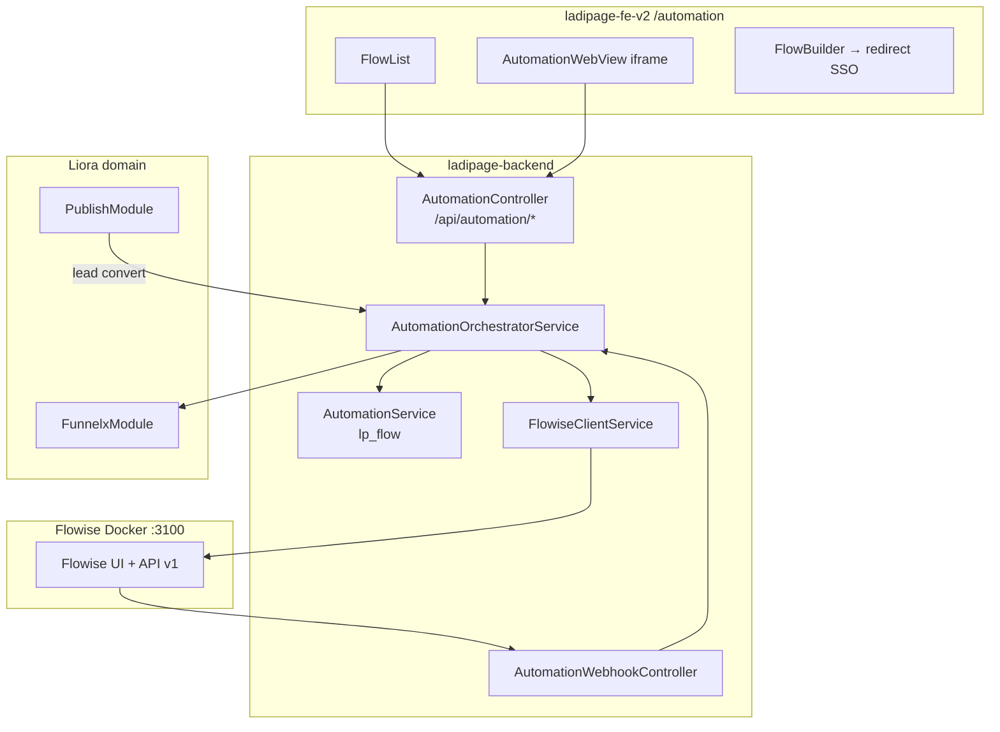

# Plan BE — Automation (Flowise Integration)

> **Nguồn checklist:** `Automation.md`  
> **App code kho:** `Automation` (FE id `5`, route `/automation`)  
> **Ngày:** 2026-07-01  
> **Phạm vi:** Xây dựng module NestJS trong `ladipage-backend` — FE chỉnh input cho khớp DTO

---

## 1. Nguyên tắc triển khai

### 1.1 Contract-first (giống Ecom/CRM)

```
modules/automation/dto/*.dto.ts          ← validation thật (class-validator)
        ↓
libs/api-types → ApplicationDto, FlowDto…
        ↓
ladipage-fe-v2/src/lib/endpoints/automation.api.ts
        ↓
components/automation/* + features/*
```

| Quy tắc | Chi tiết |
|---------|----------|
| **BE là nguồn sự thật** | Mọi field POST/PATCH phải có trong DTO |
| **FE được chỉnh** | Form/list map theo DTO; bỏ `localStorage flowise_url`, bỏ proxy `/api/flowise/*` trực tiếp |
| **Flowise = engine** | Nest không replicate drag-drop UI — chỉ SSO, proxy có kiểm soát, webhook sync |
| **Ladiflow parity** | Giữ entity `lp_flow` + RPC Ladiflow cho legacy; REST mới cho FE v2 |

### 1.2 Hiện trạng

| Layer | Trạng thái |
|-------|------------|
| BE `modules/automation/` | Entity `lp_flow`, `AutomationService`, Ladiflow RPC — **chưa có REST controller** |
| BE `modules/flowise/` | Skeleton rỗng |
| FE `/automation` | UI mock + gọi Next proxy `/api/flowise/chatflows` + `localStorage flowise_url` |
| FE types | `FlowItem { id, name, status, createdAt, triggerType? }` |
| Docker Flowise | Chưa có trong `docker/docker-compose.yml` |

---

## 2. Kiến trúc mục tiêu



**Phân vai:**
- `lp_flow` = index Liora (tenant, store, campaign link, billing)
- Flowise `chatflowId` = engine ID (lưu cột `flowise_external_id`)
- FE list đọc từ Nest — không đọc Flowise trực tiếp

---

## 3. Cấu trúc module BE

```
apps/ladipage-backend/src/modules/
  automation/
    automation.module.ts              # import FlowiseModule, PublishModule
    automation.controller.ts          # REST public cho FE
    automation-webhook.controller.ts  # @Public + signature guard
    dto/
      create-flow.dto.ts
      update-flow.dto.ts
      list-flows-query.dto.ts
      link-flow.dto.ts
      trigger-flow.dto.ts
      flowise-sso.dto.ts
    entities/
      flow.entity.ts                  # + flowise_external_id, campaign_id
      flow-execution-log.entity.ts    # NEW
    services/
      automation.service.ts           # giữ — Ladiflow RPC
      automation-orchestrator.service.ts  # NEW — REST business
      flowise-client.service.ts       # NEW — HTTP client Flowise API
      automation-sync.service.ts      # NEW — webhook handler
      automation-trigger.service.ts     # NEW — landing convert → run flow
  flowise/
    flowise.module.ts                 # config FLOWISE_BASE_URL, secrets
```

**Lib tùy chọn (phase 2):** `libs/flowise-client/` nếu cần reuse ngoài ladipage-backend.

---

## 4. Database & Entity

### 4.1 Migration `lp_flow` (bổ sung cột)

| Column | Type | Ghi chú |
|--------|------|---------|
| `flowise_external_id` | varchar(64) nullable | ID chatflow trên Flowise |
| `campaign_id` | varchar(64) nullable | Link FunnelX / campaign |
| `landing_page_id` | uuid nullable | Trigger source |
| `trigger_type` | varchar(50) nullable | `FORM_SUBMIT`, `PAGE_VIEW`, … |
| `last_synced_at` | timestamptz nullable | Webhook sync |

### 4.2 Bảng mới `lp_flow_execution_log`

| Column | Type |
|--------|------|
| `id` | uuid PK |
| `tenant_id`, `store_id` | FK |
| `flow_id` | FK → lp_flow |
| `flowise_external_id` | varchar |
| `trigger_source` | varchar |
| `status` | `SUCCESS` \| `FAILED` \| `RUNNING` |
| `payload` | jsonb |
| `created_at` | timestamptz |

---

## 5. API REST — Contract chi tiết

Base path: `POST/GET/PATCH` → `/api/automation/*`  
Auth: `JwtAuthGuard` + `TenantGuard` (trừ webhook)  
Response: `ResOp<T>` qua `TransformInterceptor`

### 5.1 SSO & Embed

| Method | Path | Input DTO | Output |
|--------|------|-----------|--------|
| `POST` | `/automation/sso` | `FlowiseSsoDto { redirectPath?: string }` | `{ embedUrl, token, expiresAt }` |
| `GET` | `/automation/embed-config` | — | `{ baseUrl, allowedOrigins }` |

**FE thay đổi:** `AutomationWebView` gọi `automationApi.getSso()` thay vì hardcode `localhost:3100`.

### 5.2 Flow CRUD (Liora index)

| Method | Path | Input | Output |
|--------|------|-------|--------|
| `GET` | `/automation/flows` | `ListFlowsQueryDto { page?, pageSize?, status?, search? }` | `PaginatedData<FlowListItemDto>` |
| `GET` | `/automation/flows/:id` | — | `FlowDetailDto` |
| `POST` | `/automation/flows` | `CreateFlowDto` | `FlowDetailDto` |
| `PATCH` | `/automation/flows/:id` | `UpdateFlowDto` | `FlowDetailDto` |
| `DELETE` | `/automation/flows/:id` | — | `void` |
| `POST` | `/automation/flows/:id/link` | `LinkFlowDto { campaignId?, landingPageId?, triggerType }` | `FlowDetailDto` |
| `POST` | `/automation/flows/:id/trigger` | `TriggerFlowDto { source, payload }` | `{ executionId, status }` |

### 5.3 Integrations & Broadcasts (parity Ladiflow)

| Method | Path | Ghi chú |
|--------|------|---------|
| `GET` | `/automation/integrations` | Map từ `IntegrationEntity` |
| `GET` | `/automation/broadcasts` | Map từ `BroadcastEntity` |

### 5.4 Webhook (Flowise → Nest)

| Method | Path | Guard |
|--------|------|-------|
| `POST` | `/automation/webhook/flowise` | `FlowiseSignatureGuard` + `@Public()` |

Body events: `CHATFLOW_CREATED`, `CHATFLOW_UPDATED`, `CHATFLOW_DELETED`, `EXECUTION_FINISHED`

---

## 6. DTO chi tiết & map FE

### 6.1 `CreateFlowDto`

```typescript
export class CreateFlowDto {
  @IsString() @MinLength(1) @MaxLength(255)
  name: string;

  @IsOptional() @IsEnum(['ACTIVE', 'INACTIVE'])
  status?: 'ACTIVE' | 'INACTIVE';

  @IsOptional() @IsString()
  triggerType?: string;

  /** Nếu true → tạo chatflow trên Flowise song song */
  @IsOptional() @IsBoolean()
  provisionOnFlowise?: boolean;
}
```

### 6.2 `FlowListItemDto` (output — FE `FlowItem`)

| BE field | FE field | Ghi chú |
|----------|----------|---------|
| `id` | `id` | string externalId hoặc uuid |
| `name` | `name` | |
| `status` | `status` | `ACTIVE` \| `INACTIVE` |
| `createdAt` | `createdAt` | ISO → mapper VN nếu cần |
| `triggerType` | `triggerType` | optional |
| `flowiseExternalId` | — | FE không hiển thị, dùng nội bộ |
| `hasFlowiseEmbed` | — | boolean — UI hiện nút "Mở builder" |

**FE chỉnh:** `FlowList.tsx` bỏ `fetch('/api/flowise/chatflows')` → `useAutomationFlows()`.

### 6.3 `LinkFlowDto`

```typescript
export class LinkFlowDto {
  @IsOptional() @IsString()
  campaignId?: string;

  @IsOptional() @IsUUID()
  landingPageId?: string;

  @IsOptional() @IsIn(['FORM_SUBMIT', 'PAGE_VIEW', 'ORDER_PAID', 'TAG_ADDED'])
  triggerType?: string;
}
```

**FE chỉnh:** Form "Liên kết Campaign" gửi đúng enum `triggerType` — bỏ free text.

### 6.4 `TriggerFlowDto` (landing convert)

```typescript
export class TriggerFlowDto {
  @IsIn(['LANDING_FORM', 'MANUAL', 'WEBHOOK'])
  source: string;

  @IsObject()
  payload: Record<string, unknown>;  // { leadId, pageId, email, phone, … }
}
```

**Tích hợp:** `PublishModule` / lead webhook gọi `AutomationTriggerService` nội bộ.

---

## 7. Services — logic chắc chẽ

### 7.1 `FlowiseClientService`

| Method | Flowise API | Retry |
|--------|-------------|-------|
| `createChatflow(name)` | `POST /api/v1/chatflows` | 2x |
| `updateChatflow(id, body)` | `PUT /api/v1/chatflows/:id` | 2x |
| `deleteChatflow(id)` | `DELETE /api/v1/chatflows/:id` | 1x |
| `runPrediction(id, input)` | `POST /api/v1/prediction/:id` | 1x |
| `issueEmbedToken(tenantId)` | custom JWT | — |

Config env: `FLOWISE_BASE_URL`, `FLOWISE_API_KEY`, `FLOWISE_WEBHOOK_SECRET`

### 7.2 `AutomationOrchestratorService`

Luồng `create()`:
1. Validate tenant + `status_active` app Automation (đọc `app-store`)
2. Tạo `lp_flow` record
3. Nếu `provisionOnFlowise` → gọi Flowise → lưu `flowise_external_id`
4. Emit `AutomationFlowCreated`
5. Trả `FlowDetailDto`

Luồng `syncFromWebhook()`:
1. Verify signature
2. Upsert `lp_flow` theo `flowise_external_id`
3. Ghi `lp_flow_execution_log`

### 7.3 Idempotency

- Header `Idempotency-Key` trên `POST /flows` và `POST /trigger` (reuse `IdempotenceInterceptor`)

---

## 8. Lộ trình PR (map checklist)

| PR | Phase checklist | Nội dung | Effort |
|----|-----------------|----------|--------|
| **PR-A1** | P1 Infra | `docker-compose` service `flowise`, env sample | 1d |
| **PR-A2** | P2 Nest base | DTO + `AutomationController` list/show/create | 2d |
| **PR-A3** | P2 SSO | `FlowiseClientService` + `/sso` + entity migration | 1.5d |
| **PR-A4** | P4 Sync | Webhook + `AutomationSyncService` + execution log | 2d |
| **PR-A5** | P4 Trigger | `AutomationTriggerService` + hook PublishModule | 1.5d |
| **PR-A6** | P5 Test | Contract spec + e2e SSO/webhook | 1d |
| **PR-A7** | FE wire | `automation.api.ts`, bỏ `/api/flowise` proxy | 1.5d (FE) |

**Tổng BE:** ~8–9 ngày (khớp checklist 8–12 ngày)

---

## 9. Contract test & DoD

```bash
# List flows
curl -H "Authorization: Bearer $TOKEN" \
  http://localhost:7002/api/automation/flows

# Create + provision Flowise
curl -X POST -H "Authorization: Bearer $TOKEN" \
  -d '{"name":"Welcome flow","provisionOnFlowise":true}' \
  http://localhost:7002/api/automation/flows

# SSO embed
curl -X POST -H "Authorization: Bearer $TOKEN" \
  http://localhost:7002/api/automation/sso
```

**DoD BE:**
- [ ] `lp_flow` có `flowise_external_id`
- [ ] REST list/create/link/trigger 200
- [ ] Webhook verify signature + sync
- [ ] `@liora/api-types` export `FlowListItemDto`, `CreateFlowDto`
- [ ] Contract test `test/contract/automation-rest.contract.spec.ts`
- [ ] Không expose Flowise URL trực tiếp ra FE (chỉ qua SSO URL signed)

**DoD FE (sau PR-A7):**
- [ ] `FlowList` dùng `useAutomationFlows()`
- [ ] `FlowBuilder` mở iframe qua SSO
- [ ] Bỏ `localStorage flowise_url`
- [ ] Form link campaign gửi `LinkFlowDto`

---

## 10. Rủi ro & giảm thiểu

| Rủi ro | Giảm thiểu |
|--------|------------|
| Flowise down | Feature flag `automation.flowise.enabled`; fallback list từ `lp_flow` only |
| Drift Ladiflow RPC vs REST | Orchestrator ghi cả hai; RPC giữ cho appv6 |
| iframe CSP | Nest trả `allowedOrigins` trong embed-config |
| Billing chưa có | Phase 2: đếm `lp_flow_execution_log` per tenant |

---

## 11. Tham chiếu file

| File | Vai trò |
|------|---------|
| `modules/automation/entities/flow.entity.ts` | Entity gốc |
| `modules/automation/services/automation.service.ts` | Ladiflow RPC |
| `libs/ladipage-types/.../flow.types.ts` | `LpFlow` contract |
| FE `components/automation/flows/FlowList.tsx` | Cần wire |
| FE `app/api/flowise/[...path]/route.ts` | Deprecate sau PR-A7 |
| Checklist gốc `Automation.md` | Phase 0–7 |