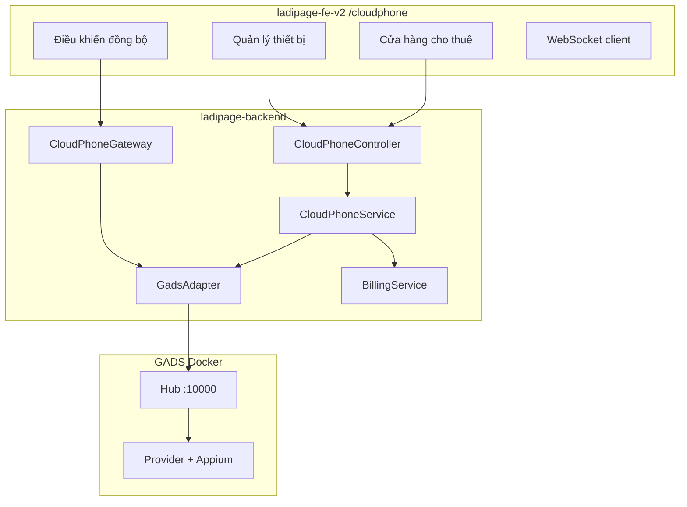

# Plan BE — CloudPhone (GADS Integration)

> **Nguồn checklist:** `cloude-phone.md`  
> **App code kho:** `CloudPhone` (FE id `14`, route `/cloudphone/cua-hang-cho-thue`)  
> **Ngày:** 2026-07-01  
> **Phạm vi:** Module Nest + GADS adapter — FE thay mock bằng API thật

---

## 1. Nguyên tắc triển khai

### 1.1 BE-first + GADS engine ngoài

```
FE CloudPhone UI → ladipage-backend /api/cloudphone/* → GadsAdapter → GADS Hub :10000
                              ↓
                    lp_cloud_phone_booking / session
                              ↓
                    BillingModule (per-minute quota)
```

| Quy tắc | Chi tiết |
|---------|----------|
| **GADS không expose ra FE** | Mọi call qua Nest — auth, audit, quota |
| **FE chỉnh input** | `DeviceData` mock → DTO chuẩn (`deviceId`, `planCode`, …) |
| **Realtime qua Nest** | WebSocket gateway — FE không nối thẳng GADS WS |
| **Idempotent booking** | Tránh double-book khi user click nhanh |

### 1.2 Hiện trạng

| Layer | Trạng thái |
|-------|------------|
| BE `modules/cloud-phone/` | ❌ Chưa có |
| GADS repo | ✅ Có trong workspace (`GADS/`) — chưa dockerize trong monorepo |
| FE `/cloudphone/*` | UI đầy đủ — **100% mock** (`dashboard/mockData.ts`, local state) |
| FE `DeviceData` | `{ id: number, name, serial, plan, online, proxyIp, … }` — không khớp BE |
| Catalog | ✅ Seed `CloudPhone` trong `app-store` |

---

## 2. Kiến trúc



---

## 3. Cấu trúc module BE

```
apps/ladipage-backend/src/modules/
  cloud-phone/
    cloud-phone.module.ts
    cloud-phone.controller.ts
    cloud-phone.gateway.ts              # WebSocket
    dto/
      list-devices-query.dto.ts
      create-booking.dto.ts
      release-booking.dto.ts
      start-session.dto.ts
      session-action.dto.ts
      landing-test.dto.ts
    entities/
      cloud-phone-device-cache.entity.ts
      cloud-phone-booking.entity.ts
      cloud-phone-session.entity.ts
      cloud-phone-action-log.entity.ts
    services/
      cloud-phone.service.ts
      gads-adapter.service.ts
      gads-auth.service.ts
      cloud-phone-billing.service.ts
      cloud-phone-audit.service.ts
    guards/
      cloud-phone-access.guard.ts       # app status_active + feature flag

libs/gads-client/
  src/
    gads-http.client.ts
    types/
      device.types.ts
      session.types.ts
      booking.types.ts
```

---

## 4. Database

### 4.1 `lp_cloud_phone_booking`

| Column | Type | Ghi chú |
|--------|------|---------|
| `id` | uuid PK | |
| `tenant_id`, `store_id` | | |
| `user_id` | varchar | |
| `gads_device_id` | varchar | ID từ GADS |
| `device_name` | varchar | cache display |
| `plan_code` | varchar | `basic`, `pro`, … |
| `status` | `ACTIVE` \| `RELEASED` \| `EXPIRED` | |
| `booked_at` | timestamptz | |
| `released_at` | timestamptz nullable | |
| `billing_started_at` | timestamptz | |

### 4.2 `lp_cloud_phone_session`

| Column | Type |
|--------|------|
| `id` | uuid |
| `booking_id` | FK |
| `gads_session_id` | varchar |
| `status` | `STARTING`, `RUNNING`, `ENDED`, `FAILED` |
| `stream_url` | varchar nullable |
| `started_at`, `ended_at` | timestamptz |
| `duration_seconds` | int |

### 4.3 `lp_cloud_phone_action_log`

Audit: tap, swipe, screenshot, appium command — jsonb payload.

---

## 5. API REST

Base: `/api/cloudphone/*`  
Auth: JWT + TenantGuard + `CloudPhoneAccessGuard`

### 5.1 Store — Cửa hàng cho thuê

| Method | Path | Input | Output |
|--------|------|-------|--------|
| `GET` | `/cloudphone/devices` | `ListDevicesQueryDto { os?, status?, plan?, search?, page?, pageSize? }` | `PaginatedData<CloudPhoneDeviceDto>` |
| `GET` | `/cloudphone/devices/:deviceId` | — | `CloudPhoneDeviceDto` |
| `GET` | `/cloudphone/plans` | — | `CloudPhonePlanDto[]` |

### 5.2 `CloudPhoneDeviceDto` — map FE `DeviceData`

| BE field | FE field hiện tại | Ghi chú |
|----------|-------------------|---------|
| `id` | `id` | **Đổi FE:** `string` thay `number` |
| `displayName` | `name` | |
| `serialNumber` | `serial` | |
| `planCode` | `plan` | |
| `status` | `online` + `screenState` | BE enum: `ONLINE`, `BUSY`, `OFFLINE` |
| `os` | `os` | `ios` \| `android` |
| `batteryPercent` | `battery` | |
| `proxyLabel` | `proxyName` | |
| `proxyHost` | `proxyIp` | |
| `runningApp` | `appRunning` | |
| `note` | `note` | |
| `actionLogs` | `actionLogs` | optional — có thể lazy load |

**FE chỉnh:** `features/cloudphone/dashboard/types.ts` — align với `@liora/api-types/CloudPhoneDeviceDto`.

### 5.3 Booking

| Method | Path | Input DTO | Output |
|--------|------|-----------|--------|
| `POST` | `/cloudphone/bookings` | `CreateBookingDto { deviceId, planCode }` | `CloudPhoneBookingDto` |
| `GET` | `/cloudphone/bookings` | query status | `CloudPhoneBookingDto[]` |
| `GET` | `/cloudphone/bookings/:id` | — | `CloudPhoneBookingDto` |
| `DELETE` | `/cloudphone/bookings/:id` | — | `void` (release) |

```typescript
export class CreateBookingDto {
  @IsString()
  deviceId: string;

  @IsString()
  @IsIn(['basic', 'standard', 'pro'])
  planCode: string;
}
```

**FE chỉnh:** Nút "Thuê" gửi `{ deviceId, planCode }` — bỏ mock state local.

### 5.4 Session & Control

| Method | Path | Input | Output |
|--------|------|-------|--------|
| `POST` | `/cloudphone/sessions` | `StartSessionDto { bookingId }` | `CloudPhoneSessionDto` |
| `GET` | `/cloudphone/sessions/:id` | — | `CloudPhoneSessionDto` |
| `DELETE` | `/cloudphone/sessions/:id` | — | end session |
| `POST` | `/cloudphone/sessions/:id/actions` | `SessionActionDto` | `{ accepted: true }` |
| `POST` | `/cloudphone/sessions/:id/screenshot` | — | `{ imageUrl }` |

```typescript
export class SessionActionDto {
  @IsIn(['TAP', 'SWIPE', 'INPUT', 'HOME', 'BACK', 'INSTALL_APP'])
  type: string;

  @IsObject()
  @IsOptional()
  params?: {
    x?: number;
    y?: number;
    x2?: number;
    y2?: number;
    text?: string;
    appPackage?: string;
  };
}
```

**FE chỉnh:** `SyncView` / remote control gửi `SessionActionDto` — không gọi mock handler.

### 5.5 WebSocket

| Event | Direction | Payload |
|-------|-----------|---------|
| `session.join` | FE → Nest | `{ sessionId }` |
| `session.stream` | Nest → FE | `{ frameUrl \| binary }` |
| `session.status` | Nest → FE | `{ status, battery, runningApp }` |
| `session.error` | Nest → FE | `{ code, message }` |

Gateway: `/cloudphone` namespace — auth JWT handshake.

### 5.6 Landing page test (business integration)

| Method | Path | Input |
|--------|------|-------|
| `POST` | `/cloudphone/landing-test` | `LandingTestDto { bookingId, landingPageId, deviceId? }` |

Nest lấy published HTML từ `PublishModule` → GADS `runAppium` / open URL trên device.

### 5.7 Workflows (phase 2 — FE đã có UI)

| Method | Path | Ghi chú |
|--------|------|---------|
| `GET` | `/cloudphone/workflows` | List workflow templates |
| `POST` | `/cloudphone/workflows/:id/run` | Chạy trên device group |

Phase 1: stub `501` — FE giữ UI read-only hoặc mock until phase 2.

---

## 6. GADS Adapter

```typescript
@Injectable()
export class GadsAdapterService {
  listDevices(filter: ListDevicesFilter): Promise<GadsDevice[]>;
  bookDevice(deviceId: string, userId: string): Promise<GadsBooking>;
  releaseDevice(bookingId: string): Promise<void>;
  startSession(bookingId: string): Promise<GadsSession>;
  endSession(sessionId: string): Promise<void>;
  sendAction(sessionId: string, action: SessionActionDto): Promise<void>;
  takeScreenshot(sessionId: string): Promise<Buffer>;
  runAppium(script: AppiumScriptDto): Promise<AppiumResult>;
}
```

### 6.1 Auth mapping

```
Nest JWT (user.uid, tenantId)
  → GadsAuthService.exchange()
  → GADS API token (client credentials hoặc per-hub user)
```

Env: `GADS_HUB_URL`, `GADS_CLIENT_ID`, `GADS_CLIENT_SECRET`, `GADS_WEBHOOK_SECRET`

### 6.2 Error handling

| GADS error | HTTP Nest |
|------------|-----------|
| Device busy | `409 Conflict` |
| Quota exceeded | `402 Payment Required` |
| Hub unreachable | `503 Service Unavailable` |

---

## 7. Business logic

### 7.1 `CloudPhoneService.bookDevice()`

1. `CloudPhoneAccessGuard` — app `CloudPhone` `status_active`
2. `CloudPhoneBillingService.assertQuota(tenantId)`
3. `GadsAdapter.bookDevice()`
4. Insert `lp_cloud_phone_booking`
5. Start billing timer
6. Audit log

### 7.2 Release & billing

- Cron/job: sessions idle > N phút → auto-release
- `ended_at` → `BillingModule` charge per minute

### 7.3 Feature flag

`cloudphone.gads.enabled` — false → trả empty list + message (FE hiện banner)

---

## 8. Map FE pages → API

| FE route | API phase 1 | Ghi chú |
|----------|-------------|---------|
| `/cloudphone/cua-hang-cho-thue` | `GET /devices`, `POST /bookings` | Store view |
| `/cloudphone/quan-ly-thiet-bi` | `GET /bookings`, `GET /devices` | Devices view |
| `/cloudphone/dieu-khien-dong-bo` | `POST /sessions`, WS | Sync view |
| `/cloudphone/social-accounts` | stub 501 | Phase 2 |
| `/cloudphone/workflow-*` | stub 501 | Phase 2 |
| `/cloudphone/file-manager` | stub 501 | Phase 2 |
| `/cloudphone/account-manager` | `GET /bookings` | Partial |

**FE chỉnh theo phase:** Phase 1 wire 3 trang chính; sub-pages giữ mock + banner "Sắp có API".

---

## 9. Lộ trình PR

| PR | Phase checklist | Nội dung | Effort |
|----|-----------------|----------|--------|
| **PR-C1** | P0–P1 | `docker/gads/docker-compose.gads.yml` + docs run local | 2d |
| **PR-C2** | P2 | Module skeleton + entities + migration | 2d |
| **PR-C3** | P3 | `gads-client` + `GadsAdapter` + auth | 3d |
| **PR-C4** | P3 | `GET /devices`, `POST/DELETE /bookings` | 2d |
| **PR-C5** | P4 | Sessions + actions + screenshot | 2d |
| **PR-C6** | P4 | WebSocket gateway + billing hook | 2d |
| **PR-C7** | P4 | `POST /landing-test` + PublishModule | 1.5d |
| **PR-C8** | P5 Test | Contract + E2E 1 device thật | 2d |
| **PR-C9** | P5 FE | `cloudphone.api.ts` + wire Store/Devices/Sync | 2d (FE) |

**Tổng BE:** ~14–16 ngày (khớp checklist 14–21 ngày)

---

## 10. Contract test & DoD

```bash
# List devices
curl -H "Authorization: Bearer $TOKEN" \
  http://localhost:7002/api/cloudphone/devices

# Book
curl -X POST -H "Authorization: Bearer $TOKEN" \
  -d '{"deviceId":"gads-dev-001","planCode":"basic"}' \
  http://localhost:7002/api/cloudphone/bookings

# Start session
curl -X POST -H "Authorization: Bearer $TOKEN" \
  -d '{"bookingId":"..."}' \
  http://localhost:7002/api/cloudphone/sessions
```

**DoD BE:**
- [ ] GADS adapter integration test (mock server + 1 real device staging)
- [ ] Booking idempotent
- [ ] Session audit log
- [ ] Tenant isolation
- [ ] `@liora/api-types` export `CloudPhoneDeviceDto`, `CreateBookingDto`
- [ ] `test/contract/cloudphone.contract.spec.ts`
- [ ] Không leak `GADS_CLIENT_SECRET` ra response

**DoD FE (PR-C9):**
- [ ] `DeviceData.id` → `string`
- [ ] Store/Devices/Sync dùng React Query
- [ ] Bỏ `mockData.ts` làm source chính
- [ ] WS connect qua Nest gateway

---

## 11. Rủi ro

| Rủi ro | Giảm thiểu |
|--------|------------|
| Cần thiết bị thật | Staging lab + mock GADS server cho CI |
| GADS auth phức tạp | PR-C3 blocker — spike 1 ngày trước PR-C4 |
| Stream latency | WebSocket + CDN fallback |
| FE nhiều sub-page mock | Phase 1 chỉ 3 route; stub 501 có message rõ |
| Billing per minute sai | Manual test + audit log đối soát |

---

## 12. Tham chiếu

| File | Vai trò |
|------|---------|
| `cloude-phone.md` | Checklist gốc |
| `GADS/docs/hub.md` | GADS API |
| FE `features/cloudphone/dashboard/types.ts` | Cần align DTO |
| FE `features/cloudphone/dashboard/mockData.ts` | Deprecate |
| `modules/app-store/` | `CloudPhone` catalog |
| `modules/publish/` | Landing test HTML source |