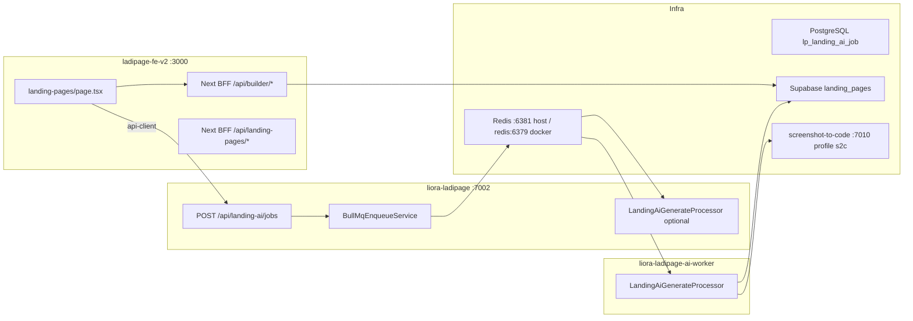

# Landing AI Pipeline — Trạng thái & Handoff (Codex / AI agents)

> **Cập nhật:** 2026-07-08  
> **Repo:** `liora-monorepo` (BE/worker) + `ladipage-fe-v2` (FE/BFF)  
> **Mục đích:** Mô tả toàn bộ vấn đề runtime để AI agent tiếp theo nắm context và giải quyết.

---

## 1. Mục tiêu hệ thống

User tạo landing page qua **AI Generator / Clone / PPC** trên FE → job async qua **BullMQ** → worker gọi **screenshot-to-code (S2C)** hoặc **mock** → lưu `landing_pages` trên **Supabase** → mở **builder** với `editor_data` thật.

**Landing page “đúng nghĩa”** = row tồn tại trong Supabase `landing_pages` với `editor_data` (block `html_code`, `preserveHtml: true`).

---

## 2. Kiến trúc



| Thành phần | Container / port | Vai trò |
|------------|------------------|---------|
| FE | `ladipage-fe-v2` :3000 | Tạo job, poll status, mở builder |
| API | `liora-ladipage-dev` :7002 | Enqueue BullMQ; dev có thể chạy processor |
| Worker | `liora-ladipage-ai-worker-dev` | Processor chính (production-style) |
| Redis | `liora-redis-dev` `6381:6379` | Queue `landing-ai-generate` |
| Job DB | `lp_landing_ai_job` (Postgres Nest) | Trạng thái job, events |
| Page DB | `landing_pages` (Supabase) | `editor_data`, `ai_source_html`, `generation_meta` |
| S2C | Docker profile `s2c`, :7010 | AI generate thật — **mặc định TẮT** (mock) |

---

## 3. Triệu chứng hiện tại (user report)

| # | Triệu chứng | Ý nghĩa kỹ thuật |
|---|-------------|------------------|
| A | “Build mock” nhưng **không có landing page thật** trong builder | Không có row `landing_pages` hoặc builder không load được |
| B | **Worker không log** xử lý job | BullMQ consumer không chạy / không nhận queue |
| C | **S2C không nhận request** | Bình thường khi `LANDING_AI_MOCK_GENERATE=true`; bất thường nếu đã tắt mock |
| D | FE: `Landing page chưa được lưu vào database` | `GET /api/builder/pages/{id}` 404 liên tục (poll 90s) |
| E | (Lịch sử) `403 Forbidden` mở builder | Nest user + `page.user_id` Supabase UUID — đã fix phần lớn |
| F | (Lịch sử) `invalid input syntax for type uuid: "undefined"` | Controller dùng `user.id` thay vì JWT `uid` — đã fix |

---

## 4. Luồng chuẩn (happy path)

```
1. FE: POST http://localhost:7002/api/landing-ai/jobs
   Headers: Authorization Bearer (Nest JWT), tenant context
   Response: { jobId, pageId, status: "queued" }

2. API: BullMQ add queue "landing-ai-generate", jobName "generate"
   Ghi lp_landing_ai_job status=queued, event "Job đã được đưa vào hàng đợi"

3. Consumer (API hoặc worker): LandingAiGenerateProcessor.processJob()
   - status=running
   - Mock: HtmlToEditorConverter.buildMockHtml() HOẶC S2C WebSocket
   - upsert Supabase landing_pages (editor_data, ai_source_html, generation_meta)
   - status=success, result={ pageId, slug, htmlLength, mock }

4. FE poll: GET /api/landing-ai/jobs/:jobId (mỗi 2s, useLandingAiJobPolling)
   status=success → openLandingBuilder(pageId, waitForPage: true)

5. FE: POST /api/builder/session (Next BFF, không qua Nest)
   waitForBuilderPagePersisted → GET /api/builder/pages/:id (Supabase admin)
   Navigate /builder/:pageId?session=...
```

---

## 5. Vấn đề đã xác định & fix đã merge (code)

### 5.1 Worker crash — `ClsService` / `UniqueConstraint` (BLOCKER lịch sử)

- **Nguyên nhân:** `DatabaseModule` đăng ký `UniqueConstraint` cần `ClsService`; worker `NestFactory.createApplicationContext` không resolve → process chết trước khi đăng ký BullMQ processor.
- **Fix:** `WorkerDatabaseModule` — TypeORM riêng, không import `DatabaseModule`.
- **Files:**
  - `apps/ladipage-ai-worker/src/app/worker-database.module.ts`
  - `apps/ladipage-ai-worker/src/app/worker-app.module.ts`
- **Runtime:** Cần `docker compose up -d --build liora-ladipage-ai-worker`.

### 5.2 API không chạy processor (Docker cũ)

- **Nguyên nhân:** `BULLMQ_RUN_WORKERS=false` trên `liora-ladipage` → chỉ enqueue, phụ thuộc 100% worker container.
- **Fix:** `BULLMQ_RUN_WORKERS: ${LADIPAGE_BULLMQ_RUN_WORKERS_IN_API:-true}` (dev fallback).
- **File:** `docker/docker-compose.yml`

### 5.3 FE proxy `/api/*` → Nest (404 builder)

- **Nguyên nhân:** `next.config.ts` rewrite `/api/:path*` → `:7002` → `/api/builder/pages` không tới Next BFF.
- **Fix:** Đã xóa rewrite blanket.
- **File:** `ladipage-fe-v2/next.config.ts`

### 5.4 `user_id = "undefined"` (UUID lỗi Supabase)

- **Nguyên nhân:** `@CurrentUser() user.id` undefined; JWT chỉ có `uid`.
- **Fix:** 2-tier user ID — Nest `uid` cho quota/job store; `sys_user.supabase_user_id` cho `landing_pages.user_id`.
- **Files:** `landing-ai.controller.ts`, `landing-ai.service.ts`, `landing-pages-storage.service.ts`, `landing-ai-job.payload.ts`

### 5.5 `403 Forbidden` mở builder (Nest login)

- **Nguyên nhân:** `canEditLandingPage` chặn Nest user khi page có `user_id` Supabase UUID.
- **Fix:** Resolve linked UUID qua `GET /account/profile`.
- **File:** `ladipage-fe-v2/src/lib/platform-auth.server.ts`, `builder-session.server.ts`

### 5.6 Upsert im lặng khi thiếu Supabase admin

- **Nguyên nhân:** Processor vẫn `success` dù skip upsert.
- **Fix:** `upsertLandingPage` throw nếu `!hasAdminClient()`.
- **File:** `landing-pages-storage.service.ts`

### 5.7 Migration Supabase thiếu cột

- **Cột:** `ai_source_html` (text), `generation_meta` (jsonb)
- **File:** `ladipage-fe-v2/supabase/migrations/20260707120000_landing_ai_source_html.sql`

### 5.8 FE mở builder trước khi có row DB

- **Fix:** `waitForBuilderPagePersisted()`; AI success chỉ add list sau khi builder page load OK.
- **Files:** `open-builder.ts`, `page.tsx`

### 5.9 Worker build (125 TS errors — đã fix trước đó)

- tsconfig paths, webpack aliases, exclude `*.spec.ts`, `ClsModule` trong worker-app (thay bằng WorkerDatabaseModule).

---

## 6. Vấn đề còn mở / chưa verify runtime

### 6.1 Mock mode bật mặc định — S2C không được gọi (by design)

```env
LANDING_AI_MOCK_GENERATE=true   # .env + docker-compose default
```

- `ScreenshotToCodeClient.isMockMode()` → processor dùng `buildMockHtml()` cục bộ.
- S2C container (profile `s2c`) **không cần** để test mock.
- **Kỳ vọng mock:** vẫn phải có row `landing_pages` + `editor_data`.
- User thấy “mock” nhưng **không có page** → **processor không chạy hoặc upsert fail**, không phải thiếu S2C.

### 6.2 Worker / processor không consume queue (vấn đề chính)

**Dấu hiệu:**

- Không log: `Processing job {id} on queue landing-ai-generate`
- `lp_landing_ai_job.status` kẹt `queued`
- Redis có job trong `liora:ladipage:landing-ai-generate:*`

**Nguyên nhân có thể (ưu tiên):**

| # | Nguyên nhân | Cách kiểm tra |
|---|-------------|---------------|
| 1 | Container worker chưa rebuild sau `WorkerDatabaseModule` | `docker logs liora-ladipage-ai-worker-dev` |
| 2 | API cũng không start processor | `docker logs liora-ladipage-dev \| grep Processing` |
| 3 | Redis lệch instance | Host `localhost:6381` vs docker `redis:6379` — cùng container `liora-redis-dev` |
| 4 | `BULLMQ_PREFIX` / queue name lệch | Phải `liora:ladipage`, queue `landing-ai-generate` |
| 5 | `BULLMQ_ENABLED=false` | Env trong container |

### 6.3 Builder load — RLS vs BFF

- Editor legacy load qua Supabase **anon** → RLS `auth.uid() = user_id` chặn Nest-only users.
- **Fix:** Builder route load qua BFF admin `/api/builder/pages/{id}` + `x-builder-session`.
- **Files:** `LandingBuilderShell.tsx`, `LandingEditorPageClient.tsx`, `editor-supabase-storage.ts`

### 6.4 Hai namespace user ID

| ID | Dùng cho |
|----|----------|
| Nest `uid` (số, JWT) | `lp_landing_ai_job.user_id`, AI quota (`LANDING_AI_JOBS_PER_USER`) |
| Supabase UUID | `landing_pages.user_id`, RLS, FE list filter |

Nest user chưa link Supabase → `landing_pages.user_id = null` (FE vẫn edit qua `canEditLandingPage`).

### 6.5 S2C thật chưa sẵn sàng

```bash
docker compose --profile s2c up -d screenshot-to-code
# Set LANDING_AI_MOCK_GENERATE=false trên API + worker
# Clone jobs cần SCREENSHOTONE_API_KEY
```

---

## 7. Cấu hình môi trường

### `liora-monorepo/.env` (host / env_file)

```env
BULLMQ_ENABLED=true
BULLMQ_PREFIX=liora:ladipage
REDIS_URL=redis://localhost:6381
BULLMQ_RUN_WORKERS=true
LANDING_AI_MOCK_GENERATE=true
SCREENSHOT_TO_CODE_HTTP_URL=http://localhost:7010
SCREENSHOT_TO_CODE_WS_URL=ws://localhost:7010
SUPABASE_URL=https://lrweyftvjumnvkiyplyg.supabase.co
SUPABASE_SECRET_KEY=...
```

### `docker-compose.yml` overrides (trong container)

| Service | REDIS_URL | BULLMQ_RUN_WORKERS | MOCK |
|---------|-----------|-------------------|------|
| `liora-ladipage` | `redis://redis:6379/0` | `true` (default) | `true` |
| `liora-ladipage-ai-worker` | `redis://redis:6379/0` | `true` | `true` |

### `ladipage-fe-v2/.env`

```env
NEXT_PUBLIC_API_URL=http://localhost:7002/api
NEXT_PUBLIC_SUPABASE_URL=https://lrweyftvjumnvkiyplyg.supabase.co
SUPABASE_SECRET_KEY=...   # BFF admin upsert/read
NEXT_PUBLIC_AUTH_MODE=legacy
```

---

## 8. File map

### Backend (`liora-monorepo`)

| File | Vai trò |
|------|---------|
| `apps/ladipage-backend/src/modules/landing-ai/landing-ai.controller.ts` | REST jobs, quota |
| `apps/ladipage-backend/src/modules/landing-ai/services/landing-ai.service.ts` | createJob, enqueue, resolve supabaseUserId |
| `apps/ladipage-backend/src/modules/landing-ai/processors/landing-ai-generate.processor.ts` | Xử lý job, mock/S2C, upsert |
| `apps/ladipage-backend/src/modules/landing-ai/services/landing-pages-storage.service.ts` | Upsert Supabase `landing_pages` |
| `apps/ladipage-backend/src/modules/landing-ai/clients/screenshot-to-code.client.ts` | S2C HTTP/WS, mock flag |
| `apps/ladipage-backend/src/modules/landing-ai/landing-ai-worker.module.ts` | Register processor + queues |
| `apps/ladipage-backend/src/config/bullmq.app.config.ts` | `isBullMqWorkerEnabled()` |
| `apps/ladipage-ai-worker/src/main.ts` | Worker bootstrap log |
| `apps/ladipage-ai-worker/src/app/worker-app.module.ts` | Worker module graph |
| `apps/ladipage-ai-worker/src/app/worker-database.module.ts` | TypeORM without UniqueConstraint |
| `docker/docker-compose.yml` | ladipage + ai-worker services |
| `libs/database/src/migrations/1756100000000-landing-ai-jobs.ts` | `lp_landing_ai_job` tables |

### Frontend (`ladipage-fe-v2`)

| File | Vai trò |
|------|---------|
| `src/app/(admin)/landing-pages/page.tsx` | Generator UI, poll, open builder |
| `src/features/landing-ai/hooks/useLandingAiJobPolling.ts` | React Query poll 2s |
| `src/lib/endpoints/landing-ai.api.ts` | Nest API client |
| `src/features/landing-builder/sdk/open-builder.ts` | Session + waitForPage |
| `src/app/api/builder/session/route.ts` | Builder session token |
| `src/app/api/builder/pages/[pageId]/route.ts` | BFF GET/PATCH page (admin) |
| `src/lib/platform-auth.server.ts` | Ownership Nest ↔ Supabase |
| `next.config.ts` | Không proxy /api → Nest |

### Plans / migrations liên quan

| File | Nội dung |
|------|----------|
| `ladipage-fe-v2/plans/LANDING-AI-S2C-SHIP.md` | Plan gốc PR-12/13/14 |
| `ladipage-fe-v2/supabase/migrations/20260707120000_landing_ai_source_html.sql` | Cột AI backup |

---

## 9. Checklist debug

```bash
# 1. Worker sống?
docker logs liora-ladipage-ai-worker-dev --tail 30
# Expect: "Landing AI worker ready | BULLMQ_ENABLED=true | queue=landing-ai-generate"

# 2. API có processor?
docker logs liora-ladipage-dev 2>&1 | grep -i "Processing job\|landing-ai"

# 3. Job status
curl -H "Authorization: Bearer $TOKEN" \
  http://localhost:7002/api/landing-ai/jobs/$JOB_ID

# 4. Redis queue
docker exec liora-redis-dev redis-cli KEYS "*landing-ai*"
docker exec liora-redis-dev redis-cli LLEN "liora:ladipage:landing-ai-generate:wait"

# 5. Supabase
# SELECT id, name, created_at, jsonb_typeof(editor_data) FROM landing_pages WHERE id = '$PAGE_ID';

# 6. Nest job DB
# SELECT id, status, page_id, error_message, bull_job_id FROM lp_landing_ai_job ORDER BY created_at DESC LIMIT 5;

# 7. Builder BFF
curl -H "x-builder-session: $SESSION_TOKEN" \
  http://localhost:3000/api/builder/pages/$PAGE_ID
```

### Restart sau khi sửa code

```bash
cd liora-monorepo/docker
docker compose up -d --build liora-ladipage liora-ladipage-ai-worker

cd ladipage-fe-v2
npm run dev   # restart nếu đổi next.config
```

---

## 10. Kế hoạch giải quyết (ưu tiên)

### P0 — Pipeline phải chạy (mock cũng phải tạo page)

1. Rebuild & restart `liora-ladipage` + `liora-ladipage-ai-worker`
2. Xác nhận log `Processing job` khi tạo AI job
3. Xác nhận `lp_landing_ai_job.status` → `success`
4. Xác nhận row `landing_pages` tồn tại
5. Xác nhận `GET /api/builder/pages/{id}` → 200

### P1 — Mock landing page đúng nghĩa

6. `LANDING_AI_MOCK_GENERATE=true`: verify `editor_data`, `ai_source_html`, builder mở được
7. Không add page vào FE list trước khi DB có row (đã implement `waitForPage`)

### P2 — S2C thật

8. `docker compose --profile s2c up -d screenshot-to-code`
9. `LANDING_AI_MOCK_GENERATE=false` trên API + worker
10. Test WebSocket `ws://screenshot-to-code:7010/generate-code`

### P3 — Production hardening

11. `LADIPAGE_BULLMQ_RUN_WORKERS_IN_API=false` — chỉ worker consume
12. Worker health / queue metrics endpoint
13. FE warning khi job `queued` > 30s

---

## 11. Tóm tắt (elevator pitch)

Pipeline Landing AI **đã build code thành công** (worker webpack, FE BFF) nhưng **runtime chưa tạo landing page** vì **BullMQ consumer không xử lý job** (worker từng crash DI `ClsService`; container có thể chưa rebuild). API enqueue job vào Redis, FE có thể thấy `queued` hoặc UI optimistic, nhưng **không upsert Supabase** → builder 404 → `waitForBuilderPagePersisted` timeout.

**S2C không nhận job là đúng** khi `LANDING_AI_MOCK_GENERATE=true`. Mock HTML phải do processor tạo cục bộ — nếu processor không chạy thì không có landing page nào.

**Ưu tiên cho agent tiếp theo:** verify consumer log → fix queue → confirm `landing_pages` row → sau đó mới tắt mock để test S2C.

---

## 12. Test đã pass (build time)

| Target | Kết quả |
|--------|---------|
| `nx build ladipage-ai-worker` | PASS |
| `landing-pages-storage.service.spec.ts` | 3/3 PASS |
| `landing-ai` module tests (scoped) | 6 suites, 12 tests PASS |
| `platform-auth.server.test.ts` (FE) | 5/5 PASS |

*Các test trên không thay thế E2E runtime với Docker + Supabase thật.*