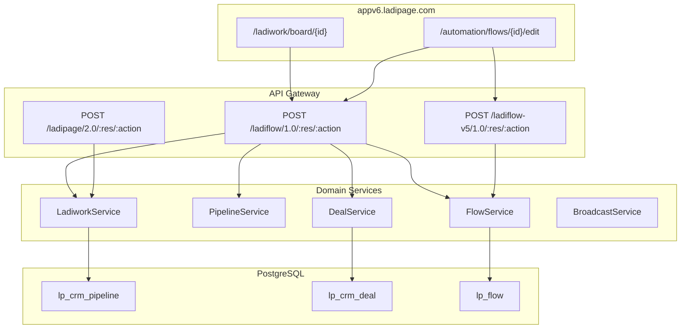
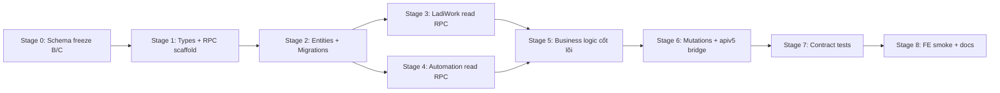

# Kế hoạch triển khai BE Phase B & C — LadiWork + Automation từ CDP

> **Mục tiêu:** Dựng lại logic backend **LadiWork** (CRM pipeline/deal) và **Automation** (LadiFlow) chặt chẽ, bám contract CDP Phase B/C, đủ để `appv6.ladipage.com` gọi API **không đổi UI**.  
> **Nguồn sự thật:** `tools/cdp-reverse-engineer/output/merged/` (merge P1–4 + P-A/B/C, 2026-06-23)  
> **Đích triển khai:** `apps/ladipage-backend/src/modules/{ladiwork,automation,ladiflow-rpc,ladipage-rpc}/`  
> **Tiền đề:** `plans/plan-be-phase3-4-implementation.md` (CRM read-path, `ladiflow-rpc` scaffold)  
> **Ngày:** 2026-06-23

---

## 1. Tóm tắt điều hành

### 1.1. Kết quả CDP đã chạy (Phase B/C bổ sung)

| Chỉ số | Trước P-B/C | Sau deep-link + board + editor |
|--------|-------------|--------------------------------|
| Unique routes (toàn merge) | 56 → 75 | **81** |
| Routes LadiWork (B) | 0 | **16** |
| Routes Automation (C) độc quyền | 1 (`broadcast/list`) | **8+** (+ `flow/show` apiv5) |
| Merged tables | 21 → 29 | **29** (ổn định) |
| Mutation routes | 0 → 1 | **1** (`application/update`) |
| Host mới phát hiện | — | **`apiv5.ladiflow.com`** (flow editor) |

### 1.2. Phát hiện kiến trúc quan trọng

| Module | FE URL | Host API read | Host API editor |
|--------|--------|---------------|-----------------|
| **LadiWork** | `/ladiwork`, `/ladiwork/board/{pipelineId}` | `api.ladiflow.com/1.0/` | Cùng host |
| **Automation** | `/automation/flows`, `/automation/flows/{id}/edit` | `api.ladiflow.com/1.0/` | **`apiv5.ladiflow.com/1.0/`** |

**Header context:**

| Host | Headers bắt buộc |
|------|------------------|
| `api.ladiflow.com` | `authorization` + **`owner-id`** |
| `apiv5.ladiflow.com` | `authorization` + **`owner-id`** (flow editor) |
| `api.ladipage.com` | `authorization` + **`store-id`** (`application/*`) |

**Domain model LadiWork:** “Công việc” = **`crm-deal`** trên pipeline Kanban, không phải `task/*` riêng.

### 1.3. Hành động BE tổng quát

| Hạng mục | Trạng thái BE | Hành động |
|----------|---------------|-----------|
| `ladiflow-rpc` dispatcher | 0 handler wired | Wire **16 route LadiWork** + **8 route Automation** |
| Module `ladiwork/` | Chưa có | **Tạo mới** — pipeline, deal, dashboard |
| Module `automation/` | Chưa có | **Tạo mới** — flow, broadcast, integration |
| `apiv5.ladiflow` adapter | Chưa có | **Gateway host** cho `flow/show` |
| Types `ladiwork/`, `automation/` | Một phần (`misc/`) | Re-export từ CDP → folder đúng |
| Mutations deal/flow | Chưa capture | Song song HAR/headed → Stage 6 |

---

## 2. Inventory CDP — Phase B (LadiWork)

### 2.1. Routes đã capture (16)

```
POST api.ladiflow.com/1.0/ladiwork-dashboard/config
POST api.ladiflow.com/1.0/ladiwork-dashboard/list-pipelines
POST api.ladiflow.com/1.0/ladiwork-dashboard/attention-stats
POST api.ladiflow.com/1.0/ladiwork-dashboard/member-performance
POST api.ladiflow.com/1.0/ladiwork-dashboard/job-status-stats
POST api.ladiflow.com/1.0/ladiwork-dashboard/pipeline-by-stage
POST api.ladiflow.com/1.0/crm-pipeline/list
POST api.ladiflow.com/1.0/crm-pipeline/search
POST api.ladiflow.com/1.0/crm-pipeline-category/list          ← mutations UI
POST api.ladiflow.com/1.0/crm-deal/list
POST api.ladiflow.com/1.0/crm-deal/get-summary
POST api.ladiflow.com/1.0/crm-deal-custom-field/list
POST api.ladiflow.com/1.0/crm-filter/get-system-filters
POST api.ladiflow.com/1.0/crm-label/list-all
POST api.ladiflow.com/1.0/crm-organization/list
POST api.ladiflow.com/1.0/crm-staff-configuration/get-list-staff-configuration
```

**Mutation đã có (app lifecycle, không phải deal):**

```
POST api.ladipage.com/2.0/application/update
Body: { lang, code: "LadiWork", status_active: true, status_pin: true }
```

### 2.2. Bảng schema → Entity

| Table CDP | Fields | Entity đề xuất | Module |
|-----------|--------|----------------|--------|
| `lp_ladiwork_dashboard` | 12 | `LadiworkDashboardWidgetEntity` *(DTO aggregate)* | `ladiwork` |
| `lp_crm_pipeline` | 28 | `CrmPipelineEntity` | `ladiwork` |
| `lp_crm_deal` | 21 | `CrmDealEntity` | `ladiwork` |
| `lp_crm_filter` | 12 | `CrmFilterEntity` | `ladiwork` |
| `lp_crm_pipeline_category` | *(empty sample)* | `CrmPipelineCategoryEntity` | `ladiwork` |

**IDs tham chiếu trial (từ capture):**

- Pipeline: `6a3a8d71da6cd800128221ee` (“Dự án Marketing”)
- Stage: `6a3a8d71da6cd800128221f2`
- Deal: `6a3a8eafda6cd800128266cf`

### 2.3. Routes chưa capture (cần HAR/headed)

| Route dự kiến | Mức ưu tiên |
|---------------|-------------|
| `crm-deal/show` | P0 |
| `crm-deal/create` / `update` / `delete` | P0 |
| `crm-deal-comment/list` | P1 |
| `crm-deal/activity` | P1 |
| `crm-pipeline/show` | P1 |

---

## 3. Inventory CDP — Phase C (Automation)

### 3.1. Routes đã capture (độc quyền Automation)

```
POST api.ladiflow.com/1.0/flow/list
POST api.ladiflow.com/1.0/flow-tag/list-all
POST api.ladiflow.com/1.0/integration/list-all
POST api.ladiflow.com/1.0/broadcast/list
POST apiv5.ladiflow.com/1.0/flow/show              ← flow editor graph
POST apiv5.ladiflow.com/1.0/integration/list-all
POST apiv5.ladiflow.com/1.0/customer-tag/list-all
POST apiv5.ladiflow.com/1.0/recurring-topic/list
POST apiv5.ladiflow.com/1.0/segment/list-all
```

**Flow ID trial:** `6a3a8bd0da6cd8001281cbd2`  
**FE deep-link editor:** `appv6.ladipage.com/automation/flows/{flowId}/edit`

### 3.2. Bảng schema → Entity

| Table CDP | Fields | Entity | Module |
|-----------|--------|--------|--------|
| `lp_flow` | 22 | `FlowEntity` | `automation` |
| `lp_flow_tag` | 11 | `FlowTagEntity` | `automation` |
| `lp_integration` | 20 | `IntegrationEntity` | `automation` |
| `lp_broadcast` | — | `BroadcastEntity` | `automation` |
| `lp_recurring_topic` | *(từ flow/show nested)* | `RecurringTopicEntity` | `automation` |

### 3.3. Routes chưa capture

| Route | Ghi chú |
|-------|---------|
| `flow/create`, `flow/save`, `flow/publish` | Editor mutation — HAR bắt buộc |
| `broadcast/create` | Mutations UI fail headless |
| `trigger/list`, `action/list` | Probe permission denied |

---

## 4. Kiến trúc BE

### 4.1. Sơ đồ tầng



### 4.2. Module map

```
apps/ladipage-backend/src/modules/
├── ladiflow-rpc/           # Mở rộng — host api.ladiflow.com
├── ladiflow-v5-rpc/        # MỚI — host apiv5.ladiflow.com (flow editor)
├── ladipage-rpc/           # application/update, application/list
├── ladiwork/               # MỚI
│   ├── pipeline/
│   ├── deal/
│   ├── dashboard/
│   └── filter/
└── automation/             # MỚI
    ├── flow/
    ├── broadcast/
    └── integration/
```

---

## 5. Lộ trình 8 giai đoạn



**Ước lượng:** 14–18 ngày (1 dev) | 9–12 ngày (2 dev song song B/C)

---

## 6. Stage 0 — Schema freeze Phase B/C (1 ngày)

### 6.1. Việc cần làm

- [x] CDP capture: `phaseB-{read,board,detail,mutations}`, `phaseC-{read,editor,mutations}`
- [x] Merge → `output/merged/` (81 routes)
- [ ] Ghi `docs/reverse/schema-freeze-bc.json` từ merged
- [ ] Liệt kê gaps mutations vào `schema-draft.json`

### 6.2. DoD

- File freeze commit với `routeCount: 81`, `phaseBRouteCount: 16`, `phaseCRouteCount: 8` (độc quyền)
- Mọi route B/C có `sourceRoutes` trong `schema-tables-merged.json` hoặc ghi gap rõ

---

## 7. Stage 1 — Types + RPC scaffold (2 ngày)

### 7.1. Generate types

```
libs/ladipage-types/src/
├── ladiwork/
│   ├── pipeline.types.ts      # lp_crm_pipeline (28)
│   ├── deal.types.ts          # lp_crm_deal (21)
│   ├── dashboard.types.ts     # lp_ladiwork_dashboard (12)
│   └── filter.types.ts        # lp_crm_filter (12)
└── automation/
    ├── flow.types.ts          # lp_flow (22) + flow/show graph
    ├── flow-tag.types.ts
    ├── integration.types.ts
    └── broadcast.types.ts
```

**Lệnh:** `cd tools/cdp-reverse-engineer && npm run export:ts-types`

### 7.2. RPC registry

Mở rộng `ladiflow-dispatcher.service.ts`:

```typescript
// LadiWork — P0 read
'crm-pipeline/list', 'crm-pipeline/search', 'crm-pipeline-category/list',
'crm-deal/list', 'crm-deal/get-summary', 'crm-deal-custom-field/list',
'crm-filter/get-system-filters', 'crm-label/list-all',
'crm-organization/list', 'crm-staff-configuration/get-list-staff-configuration',
'ladiwork-dashboard/config', 'ladiwork-dashboard/list-pipelines',
'ladiwork-dashboard/attention-stats', 'ladiwork-dashboard/member-performance',
'ladiwork-dashboard/job-status-stats', 'ladiwork-dashboard/pipeline-by-stage',

// Automation — P0 read
'flow/list', 'flow-tag/list-all', 'integration/list-all', 'broadcast/list',
```

**Tạo `ladiflow-v5-rpc/`** cho:

- `flow/show`
- `integration/list-all` (apiv5 variant)
- `customer-tag/list-all`, `segment/list-all`, `recurring-topic/list`

### 7.3. DTOs (class-validator + Zod)

Mỗi route read → 2 DTO:

| DTO | Nguồn |
|-----|-------|
| `CrmDealListRequestDto` | `crm-deal/list` requestBody |
| `CrmDealListResponseDto` | `items[]` shape từ CDP |
| `FlowShowRequestDto` | `flow/show` — `flow_id` / `_id` |
| `FlowShowResponseDto` | nodes, edges từ apiv5 sample |

**Quy tắc:** `lang: 'vi'` luôn optional default; pagination `page`, `limit` theo sample.

---

## 8. Stage 2 — Entities + Migrations (3 ngày)

### 8.1. Migrations Prisma/TypeORM

| Migration | Bảng | Ghi chú |
|-----------|------|---------|
| `20260623_crm_pipeline` | `lp_crm_pipeline` | JSONB `stages[]` nested |
| `20260623_crm_deal` | `lp_crm_deal` | FK `pipeline_id`, `stage_id` |
| `20260623_crm_filter` | `lp_crm_filter` | system filters |
| `20260623_flow` | `lp_flow` | JSONB `nodes`, `edges` sau flow/show |
| `20260623_flow_tag` | `lp_flow_tag` | |
| `20260623_integration` | `lp_integration` | |

### 8.2. Entity conventions

```typescript
// CrmDealEntity — map 21 fields CDP
@Entity('lp_crm_deal')
export class CrmDealEntity {
  @PrimaryGeneratedColumn('uuid') id: string;
  @Column({ name: 'external_id' }) externalId: string;  // Mongo _id
  @Column({ name: 'tenant_id' }) tenantId: string;
  @Column({ name: 'pipeline_id' }) pipelineId: string;
  @Column({ name: 'stage_id' }) stageId: string;
  @Column() title: string;
  @Column({ type: 'jsonb', nullable: true }) customFields: Record<string, unknown>;
  // ... 15 fields còn lại từ schema-tables-merged
}
```

### 8.3. Seed trial data

Seed pipeline `6a3a8d71da6cd800128221ee` + 1 deal từ CDP sample để contract test không empty.

---

## 9. Stage 3 — LadiWork read-path RPC (3 ngày)

### 9.1. Handler map

| Route | Service method | Mapper |
|-------|----------------|--------|
| `crm-pipeline/list` | `PipelineService.list()` | `toLadiflowPipelineListItem()` |
| `crm-deal/list` | `DealService.listByStage()` | `toLadiflowDealCard()` |
| `crm-deal/get-summary` | `DealService.summary()` | aggregate counts |
| `ladiwork-dashboard/*` | `LadiworkDashboardService.*()` | chart DTOs |

### 9.2. Business rules read-path

1. **Tenant scope:** mọi query filter `tenant_id` + `owner_id` từ `LadiflowContextGuard`
2. **Pipeline board:** `crm-deal/list` nhận `pipeline_id` + `pipeline_stage_id` — bắt buộc validate pipeline thuộc tenant
3. **Empty trial:** trả `{ items: [], total: 0 }` shape production, không 404
4. **ERR_FAILED headless:** nếu upstream fail, dùng DB local làm source (adapter pattern)

### 9.3. PR pilots (wire trước)

1. `crm-pipeline/list` — unblock board UI
2. `crm-deal/list` — unblock Kanban columns
3. `ladiwork-dashboard/config` — module bootstrap

---

## 10. Stage 4 — Automation read-path RPC (3 ngày)

### 10.1. Dual-host routing

```typescript
// LadiflowV5Dispatcher — flow editor only
if (host === 'apiv5.ladiflow.com' && resource === 'flow' && action === 'show') {
  return this.flowService.showDetail(body.flow_id, ctx);
}
```

### 10.2. Handler map

| Route | Host | Service |
|-------|------|---------|
| `flow/list` | api | `FlowService.list()` |
| `flow/show` | **apiv5** | `FlowService.showGraph()` |
| `flow-tag/list-all` | api | `FlowTagService.listAll()` |
| `integration/list-all` | api/apiv5 | `IntegrationService.listAll()` |
| `broadcast/list` | api | `BroadcastService.list()` |
| `recurring-topic/list` | apiv5 | nested trong flow editor |

### 10.3. Flow graph storage

`flow/show` response chứa nodes/edges — lưu JSONB `lp_flow.graph` để editor reload offline.

---

## 11. Stage 5 — Business logic cốt lõi (4 ngày)

### 11.1. LadiWork

| Use case | Logic |
|----------|-------|
| **Board bootstrap** | `pipeline/list` → default pipeline → `deal/list` per stage |
| **Dashboard widgets** | `attention-stats`, `member-performance` — aggregate từ `lp_crm_deal` |
| **Filter** | `get-system-filters` — merge saved filters + system presets |
| **Staff config** | `get-list-staff-configuration` — cross-ref `lp_staff` |
| **Pin app** | `application/update` — sync `lp_application.status_pin` |

### 11.2. Automation

| Use case | Logic |
|----------|-------|
| **Flow catalog** | `flow/list` — paginate, filter `tags`, `status` |
| **Flow editor load** | `flow/show` — full graph + variables |
| **Broadcast inbox** | `broadcast/list` — link flows |
| **Integration picker** | `integration/list-all` — editor sidebar |

### 11.3. Cross-module

- `segment/list-all` (apiv5) → reuse `SegmentService` từ CRM P3
- `customer-tag/list-all` (apiv5) → reuse `CustomerTagService`

---

## 12. Stage 6 — Mutations + apiv5 bridge (3 ngày)

> Phụ thuộc HAR/headed capture — chạy song song nếu CDP chưa có sample.

| Route | Module | Logic |
|-------|--------|-------|
| `crm-deal/create` | ladiwork | Tạo deal trên stage, validate pipeline |
| `crm-deal/update` | ladiwork | Drag-drop stage change |
| `crm-deal/delete` | ladiwork | Soft delete `is_delete` |
| `flow/create` | automation | Empty graph template |
| `flow/save` | automation | Persist nodes/edges JSONB |
| `application/update` | ladipage-rpc | Đã có sample — wire handler |
| `broadcast/create` | automation | Sau HAR capture |

---

## 13. Stage 7 — Contract tests (2 ngày)

### 13.1. Fixture source

```bash
npm run export:contract-fixtures
# Thêm filter phaseB, phaseC trong export script
```

### 13.2. Test matrix

| Suite | Routes | Assertion |
|-------|--------|-----------|
| `ladiwork-pipeline.contract.spec.ts` | `crm-pipeline/list` | `items[0].stages.length >= 1` |
| `ladiwork-deal.contract.spec.ts` | `crm-deal/list` | field subset 21 fields |
| `ladiwork-dashboard.contract.spec.ts` | 4 dashboard routes | chart keys |
| `automation-flow.contract.spec.ts` | `flow/list`, `flow/show` | graph nodes |
| `automation-broadcast.contract.spec.ts` | `broadcast/list` | list shape |

### 13.3. CI gate

```
nx run ladipage-backend:test --testPathPattern=contract/(ladiwork|automation)
```

---

## 14. Stage 8 — FE smoke + docs (1 ngày)

- [ ] Smoke: mở `/ladiwork/board/6a3a8d71da6cd800128221ee` — network chỉ hit local RPC
- [ ] Smoke: mở `/automation/flows/6a3a8bd0da6cd8001281cbd2/edit` — `flow/show` 200
- [ ] `docs/reverse/phaseB-ladiwork-api.md`
- [ ] `docs/reverse/phaseC-automation-api.md`

---

## 15. PR Plan DAG

| PR | Phụ thuộc | Nội dung | Ước lượng |
|----|-----------|----------|-----------|
| **PR-BC-01** | — | Schema freeze + types `ladiwork/`, `automation/` | 0.5d |
| **PR-BC-02** | 01 | `ladiflow-rpc` registry + guards `owner-id` | 1d |
| **PR-BC-03** | 02 | **`ladiflow-v5-rpc`** module (apiv5 host) | 1d |
| **PR-BC-04** | 01 | Migrations `lp_crm_pipeline`, `lp_crm_deal` | 1.5d |
| **PR-BC-05** | 04 | `PipelineService` + `crm-pipeline/list` handler | 1d |
| **PR-BC-06** | 05 | `DealService` + `crm-deal/list`, `get-summary` | 1.5d |
| **PR-BC-07** | 05 | `LadiworkDashboardService` + 4 dashboard routes | 1.5d |
| **PR-BC-08** | 04 | Migrations `lp_flow`, `lp_integration`, `lp_flow_tag` | 1d |
| **PR-BC-09** | 08, 03 | `FlowService.list` + `flow/show` apiv5 | 2d |
| **PR-BC-10** | 09 | `BroadcastService` + `integration/list-all` | 1d |
| **PR-BC-11** | 06, 10 | Cross-ref segment/tag từ CRM P3 | 1d |
| **PR-BC-12** | 06, 09 | Mutations deal + flow (sau HAR) | 2d |
| **PR-BC-13** | 02 | `application/update` handler (ladipage-rpc) | 0.5d |
| **PR-BC-14** | 06–10 | Contract tests B/C | 2d |
| **PR-BC-15** | 14 | FE smoke script + reverse docs | 1d |

**Stack đề xuất (Graphite):**

```
PR-BC-01 → PR-BC-02 → PR-BC-04 → PR-BC-05 → PR-BC-06 → PR-BC-14
          ↘ PR-BC-03 → PR-BC-08 → PR-BC-09 → PR-BC-10 ↗
```

---

## 16. Gaps còn lại & mitigation

| Gap | Mitigation | Owner |
|-----|------------|-------|
| `crm-deal/*` mutations | HAR khi drag-drop / tạo deal trên board | CDP |
| `flow/create/save` | HAR flow editor Save | CDP |
| `crm-deal/list` status=0 intermittent | DB adapter + retry; Frida hook | BE + CDP |
| Probe permission denied | Chỉ dùng browser-context capture, không raw probe | CDP |
| `lp_crm_pipeline_category` empty | Seed 1 category khi tạo deal | BE seed |

---

## 17. Lệnh vận hành

```bash
cd tools/cdp-reverse-engineer

# Capture Phase B/C (đã cấu hình)
npm run capture:phaseB:board
npm run capture:phaseB:mutations
npm run capture:phaseC:editor
npm run capture:phaseC:mutations

# Schema pipeline
npm run merge:schema && npm run export:typeorm && npm run export:ts-types

# BE build
cd ../.. && nx run ladipage-backend:build
```

---

## 18. Tham chiếu

| Tài liệu | Vai trò |
|----------|---------|
| `plan-capture-heap-cdp-frida-har.md` | Methodology capture 4 lớp |
| `plans/plan-be-phase3-4-implementation.md` | CRM/Analytics foundation |
| `output/merged/unique-routes.json` | 81 routes baseline |
| `output/phaseB-ladiwork-board/` | Board Kanban capture |
| `output/phaseC-automation-flow-editor/` | `flow/show` apiv5 sample |