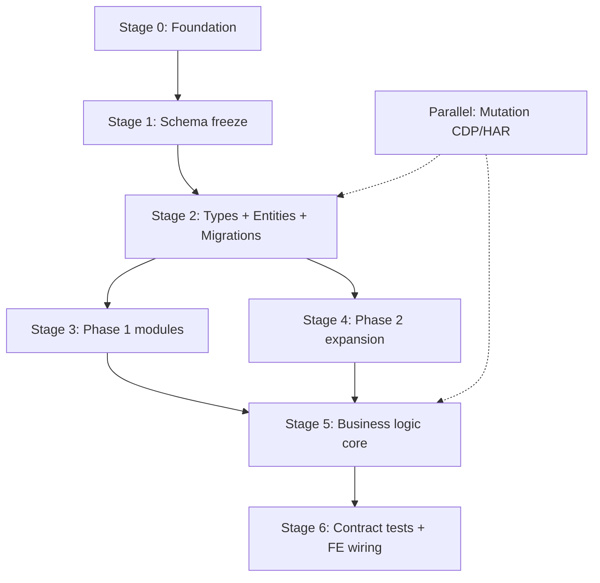

# Kế hoạch triển khai BE Phase 1 & 2 — Dựng lại logic từ CDP

> **Mục tiêu:** Dựng lại logic backend LadiPage (Landing + Bán hàng) **chặt chẽ**, bám contract thật từ CDP, đủ để `ladipage-fe` gọi API **không đổi UI**.  
> **Nguồn sự thật:** `tools/cdp-reverse-engineer/output/merged/`  
> **Đích triển khai:** `apps/ladipage-backend/src/modules/{website,domain,builder-bridge,publish,ecom-store}/`  
> **Ngày:** 2026-06-23  
> **Tiền đề:** Phase 0 (tenant context + auth) đã hoàn thành hoặc chạy song song PR đầu.

---

## 1. Tóm tắt điều hành

| Hạng mục | Trạng thái CDP | Hành động BE |
|----------|----------------|--------------|
| POST routes đã capture | **38** (`unique-routes.json`) | Map 1:1 → controller action |
| Bảng schema merged | **16** (`schema-tables-merged.json`) | Migration + Entity |
| `lp_order` fields | **144** (list + show) | Mở rộng entity hiện tại (~15 fields) |
| `lp_product` fields | **66** (list + show + search) | Mở rộng entity hiện tại (~10 fields) |
| `lp_order_item` | **27** (`order_details`) | Align entity + mapper |
| Mutation routes | **0** | Song song: HAR/headed capture → CREATE DTO |
| Module `website` | Scaffold rỗng | **Build mới toàn bộ** |
| Module `ecom-store` | CRUD cơ bản có | **Mở rộng + adapter FE** |

**Nguyên tắc vàng:** Mọi field trong response production phải trace được về `sourceRoutes` trong `schema-tables-merged.json`. Không thêm field “đoán”.

---

## 2. Kiến trúc tổng thể

### 2.1. Ba tầng bắt buộc

```
┌─────────────────────────────────────────────────────────────┐
│  ladipage-fe (appv6) — KHÔNG đổi UI                         │
│  Gọi POST /2.0/{resource}/{action} hoặc REST nội bộ         │
└──────────────────────────┬──────────────────────────────────┘
                           │
┌──────────────────────────▼──────────────────────────────────┐
│  Tầng 1: Ladipage RPC Adapter (BFF)                          │
│  - Nhận body giống production (lang, paged, search, …)       │
│  - Trả { data, message, code: 200 } giống LadiPage           │
│  - Route: POST /ladipage-rpc/* hoặc mirror host path         │
└──────────────────────────┬──────────────────────────────────┘
                           │
┌──────────────────────────▼──────────────────────────────────┐
│  Tầng 2: Domain Services (business logic)                    │
│  - OrderService, PageService, ProductService, …              │
│  - TenantScopedService + transaction                          │
└──────────────────────────┬──────────────────────────────────┘
                           │
┌──────────────────────────▼──────────────────────────────────┐
│  Tầng 3: Persistence (TypeORM Entity + Migration)            │
│  - Bảng lp_* theo schema-tables-merged.json                  │
└─────────────────────────────────────────────────────────────┘
```

### 2.2. Quy ước response

- **Nội bộ REST** (`documents/plan.md`): `{ code, message, data }` qua interceptor có sẵn.
- **RPC adapter** (FE compatibility): mirror chính xác shape LadiPage — ví dụ `order/list-order` trả `data.orders[]`, không flatten.

### 2.3. Multi-tenant

Mọi entity nghiệp vụ kế thừa `TenantScopedEntity`:

| LadiPage field | NestJS field | Ghi chú |
|----------------|--------------|---------|
| `store_id` (ObjectId) | `tenantId` (UUID/string) | Map qua bảng `tenant_external_id` nếu cần |
| `owner_id` / `creator_id` | `createdBy` / `ownerId` | Audit |
| `_id` (Mongo-style) | `externalId` (varchar) + `id` (PK auto) | Giữ `_id` trong response adapter |

---

## 3. Baseline CDP — Inventory artifact

### 3.1. File bắt buộc đọc trước khi code

| File | Dùng cho |
|------|----------|
| `output/merged/unique-routes.json` | Danh sách endpoint cần implement |
| `output/merged/ladipage-post-apis.json` | Sample request/response thật |
| `output/merged/schema-tables-merged.json` | Entity fields (ưu tiên cao nhất) |
| `output/merged/typeorm-hints.json` | Gợi ý column type |
| `output/merged/schema-draft.json` | `gaps[]` — việc còn thiếu |
| `output/api-probe/*/probe-hits.json` | `order/show`, `product/show` |

### 3.2. Map route → module (Phase 1)

| LadiPage route | Module BE | Ưu tiên |
|----------------|-----------|---------|
| `ladi-page/list` | `website` | P0 |
| `ladi-page/show` | `builder-bridge` | P0 |
| `ladi-page-tag/list` | `website` | P0 |
| `form-config/list` | `website` | P1 |
| `domain/list` | `domain` | P1 |
| `list-show-case`, `theme-list`, `theme-tag-list` | `website` (templates) | P1 |
| `data-form-error/list` | `website` (leads) | P2 — cần gói Core+ |
| `staff/list` | `settings` hoặc `website` | P2 |
| `store/info` | `settings` | P0 (đã có một phần) |
| `asset-list` | `builder-bridge` / `file-manager` | P1 |
| `application/list` | `plan` / `settings` | P2 |

### 3.3. Map route → module (Phase 2)

| LadiPage route | Module BE | Trạng thái hiện tại |
|----------------|-----------|---------------------|
| `order/list-order` | `ecom-store` | Có REST, thiếu adapter |
| `order/show` | `ecom-store` | Có `detail()`, thiếu 144 fields |
| `product/list-products` | `ecom-store` | Có REST, thiếu fields |
| `product/show` | `ecom-store` | Có `detail()`, thiếu fields |
| `product/search` | `ecom-store` | **Chưa có** |
| `order-tag/list`, `list-all` | `ecom-store` | Có tag CRUD cơ bản |
| `product-tag/list`, `list-all` | `ecom-store` | Scaffold |
| `product-category/list` | `ecom-store` | Scaffold (empty data) |
| `custom-field/list` | `ecom-store` | Có |
| `inventory/list` | `ecom-store` | Có |
| `product-review/list` | `ecom-store` | Có |
| `shipping/list` | `ecom-store` (delivery-note) | Có |
| `checkout/list`, `checkout-config/list` | `ecom-store` | **Chưa có** |
| `page-checkout/list-store` | `ecom-store` | **Chưa có** |
| `payment/list-gateways` | `payment` / `ecom-store` | **Chưa có** |
| `customer/show` | `crm` (cross-ref) | Facade từ order |
| `order-history/list` | `ecom-store` | **Chưa có** |
| `filter/list` | `ecom-store` | **Chưa có** |
| `store/get-user-info` | `settings` | Một phần |

---

## 4. Lộ trình triển khai (6 giai đoạn)



---

## 5. Stage 0 — Foundation (2–3 ngày)

### 5.1. Tạo `libs/ladipage-types`

```
libs/ladipage-types/
├── src/
│   ├── index.ts
│   ├── common.ts          # LadipageRpcResponse<T>, PagedSearch, SortBody
│   ├── landing/
│   │   ├── page.types.ts       # từ lp_page (41 fields)
│   │   ├── page-tag.types.ts
│   │   ├── domain.types.ts
│   │   ├── form-config.types.ts
│   │   └── template.types.ts
│   └── ecom/
│       ├── order.types.ts      # list item + show detail (144 fields)
│       ├── order-item.types.ts # order_details (27 fields)
│       ├── product.types.ts    # 66 fields
│       ├── tag.types.ts
│       ├── custom-field.types.ts
│       └── checkout.types.ts
├── package.json
└── tsconfig.json
```

**Script generate (bắt buộc):** mở rộng `tools/cdp-reverse-engineer/src/export-typeorm-hints.ts` → thêm `export-ts-types.ts` đọc `schema-tables-merged.json` → sinh interface TypeScript.

### 5.2. Ladipage RPC Adapter module

```
apps/ladipage-backend/src/modules/ladipage-rpc/
├── ladipage-rpc.module.ts
├── ladipage-rpc.controller.ts    # POST /2.0/:resource/:action
├── rpc-dispatcher.service.ts       # route table → handler
├── rpc-response.interceptor.ts     # wrap { data, message, code }
└── mappers/
    ├── landing.mapper.ts
    └── ecom.mapper.ts
```

**Route table mẫu:**

```typescript
const RPC_HANDLERS: Record<string, RpcHandler> = {
  'order/list-order': (body, ctx) => orderService.listRpc(body),
  'order/show':         (body, ctx) => orderService.showRpc(body.order_id),
  'product/list-products': ...
}
```

### 5.3. Field mapper utilities

```
apps/ladipage-backend/src/common/ladipage/
├── field-mapper.ts       # snake_case ↔ camelCase
├── id-mapper.ts          # externalId ↔ internal id
├── date-mapper.ts        # LadiPage datetime string → Date
└── pagination-mapper.ts  # paged/limit → page/pageSize
```

### 5.4. Deliverables Stage 0

- [ ] `libs/ladipage-types` publish trong monorepo
- [ ] `ladipage-rpc` module scaffold + 2 route pilot (`order/list-order`, `ladi-page/list`)
- [ ] Unit test mapper với fixture từ `ladipage-post-apis.json`

---

## 6. Stage 1 — Schema freeze & gap closure (2 ngày)

### 6.1. Freeze schema v1

1. Chạy pipeline CDP đầy đủ:
   ```bash
   cd tools/cdp-reverse-engineer
   npm run capture:phase-all
   ```
2. Commit artifact vào `tools/cdp-reverse-engineer/output/merged/` (hoặc export snapshot vào `docs/reverse/snapshots/2026-06-23/`).
3. Tạo `docs/reverse/schema-freeze-v1.json` — copy `schema-tables-merged.json` + metadata:
   - `frozenAt`, `routeCount`, `tableCount`, `knownGaps[]`

### 6.2. Gap closure song song (không block read-path)

| Gap | Cách đóng | Owner |
|-----|-----------|-------|
| Mutation routes = 0 | `--headed` + HAR manual → parse vào merge | CDP |
| `lp_product_category/tag` empty | Seed data trial store hoặc mock fixture | QA |
| `data-form-error/list` 499 | Document “Enterprise only”; stub empty | BE |
| `order-history/list` status 0 | Capture lại trên detail page | CDP |

### 6.3. Schema review checklist

Với mỗi bảng trong `schema-tables-merged.json`:

- [ ] Xác nhận `sourceRoutes` có response 200 trong `ladipage-post-apis.json`
- [ ] Đánh dấu field `P0` (FE hiển thị) vs `P1` (detail only) vs `P2` (internal)
- [ ] Quyết định: column DB vs JSONB (`source`, `tracking`, `seo`, `custom_fields`)
- [ ] Ghi quan hệ FK (order → order_item, product → inventory)

### 6.4. Quy tắc JSONB (field phức tạp)

| Entity | Field LadiPage | Lưu DB |
|--------|----------------|--------|
| `lp_page` | `source` (builder JSON 100KB+) | `content_json` JSONB, tách bảng `lp_page_content` |
| `lp_page` | `tracking`, `revenue` | JSONB |
| `lp_order` | `custom_fields[]` | Bảng `lp_order_custom_field_value` hoặc JSONB |
| `lp_order_item` | `options[]` | JSONB `variant_options` |
| `lp_product` | `seo`, `interface_options` | JSONB |

---

## 7. Stage 2 — Entities, Migrations, DTOs (4–5 ngày)

### 7.1. Thứ tự migration (dependency order)

```
PR-2.1  lp_page, lp_page_tag, lp_page_content
PR-2.2  lp_domain, lp_form_config, lp_template
PR-2.3  lp_product (alter), lp_product_option, lp_inventory (alter)
PR-2.4  lp_order (alter), lp_order_item (alter), lp_order_history
PR-2.5  lp_order_tag, lp_product_tag, lp_product_category (alter)
PR-2.6  lp_custom_field (alter), lp_checkout_config, lp_page_checkout
PR-2.7  lp_payment_gateway (mới), lp_order_custom_field_value
```

### 7.2. Entity mở rộng — ví dụ `lp_order`

**Hiện tại** (`order.entity.ts`): 12 cột đơn giản.  
**Mục tiêu:** 144 cột → nhóm hóa:

```typescript
// Cột scalar P0 (list view)
orderId, referenceNo, customerId, customerFirstName, customerPhone,
customerEmail, status, paymentStatus, shippingStatus, total, ...

// Nhóm billing (JSONB billing_address)
@Column({ type: 'jsonb', nullable: true }) billing: BillingAddressDto

// Nhóm shipping (JSONB)
@Column({ type: 'jsonb', nullable: true }) shipping: ShippingAddressDto

// Nhóm UTM (JSONB)
@Column({ type: 'jsonb', nullable: true }) utm: UtmDto

// Nhóm payment detail
paymentId, paymentMethod, transactionId, ...
```

**Quy tắc:** List endpoint chỉ trả subset (như production `list-order`); Show endpoint trả full (`order/show`).

### 7.3. Entity mới Phase 1

| Entity | Bảng | Ghi chú |
|--------|------|---------|
| `PageEntity` | `lp_page` | `externalId` = `_id` |
| `PageTagEntity` | `lp_page_tag` | |
| `PageContentEntity` | `lp_page_content` | `source` JSON tách riêng |
| `DomainEntity` | `lp_domain` | |
| `FormConfigEntity` | `lp_form_config` | |
| `TemplateEntity` | `lp_template` | từ theme-list |

### 7.4. DTO layers

Mỗi resource 4 lớp DTO:

```
dto/
├── {resource}-query.dto.ts      # REST query (page, filter)
├── {resource}-rpc-query.dto.ts  # Mirror LadiPage body (paged, search, sort)
├── create-{resource}.dto.ts
├── update-{resource}.dto.ts
└── {resource}-response.dto.ts   # Shape trả về adapter
```

**Validation:** `class-validator` + whitelist. RPC DTO accept `lang: 'vi'` (ignore nhưng không reject).

### 7.5. Script codegen

| Script | Input | Output |
|--------|-------|--------|
| `export-ts-types.ts` | `schema-tables-merged.json` | `libs/ladipage-types/src/**/*.ts` |
| `export-entities-draft.ts` | `typeorm-hints.json` | `*.entity.draft.ts` (review trước khi apply) |
| `export-rpc-registry.ts` | `unique-routes.json` | `rpc-handlers.registry.ts` stub |

### 7.6. Deliverables Stage 2

- [ ] 7 migration files (up/down tested)
- [ ] Entity coverage 16/16 bảng merged
- [ ] DTO + response mapper cho top 10 routes
- [ ] `pnpm typecheck` pass toàn monorepo

---

## 8. Stage 3 — Phase 1: Landing Pages (5–7 ngày)

### 8.1. Module `website` (build mới)

```
apps/ladipage-backend/src/modules/website/
├── website.module.ts
├── controllers/
│   ├── page.controller.ts           # REST /pages
│   ├── page-rpc.controller.ts       # hoặc delegate qua ladipage-rpc
│   ├── page-tag.controller.ts
│   ├── form-config.controller.ts
│   └── template.controller.ts
├── services/
│   ├── page.service.ts
│   ├── page-tag.service.ts
│   ├── form-config.service.ts
│   └── template.service.ts
├── entities/ ...
├── dto/ ...
└── mappers/
    └── page-response.mapper.ts      # Entity → ladi-page/list item shape
```

### 8.2. API REST nội bộ (Phase 1)

| Method | Path | Tương đương LadiPage |
|--------|------|----------------------|
| GET | `/pages` | `ladi-page/list` |
| GET | `/pages/:id` | `ladi-page/show` |
| POST | `/pages` | `ladi-page/create` *(chờ mutation CDP)* |
| PATCH | `/pages/:id` | `ladi-page/update` |
| POST | `/pages/:id/duplicate` | duplicate |
| POST | `/pages/:id/publish` | publish → `publish` module |
| GET | `/page-tags` | `ladi-page-tag/list` |
| POST | `/page-tags` | create tag |
| GET | `/forms` | `form-config/list` |
| GET | `/templates` | `theme-list` + `list-show-case` |

### 8.3. Module `builder-bridge`

Trách nhiệm:

- Trả `ladi-page/show` payload đầy đủ (`data.source` + `data.ladipage`)
- Proxy `asset-list` → `file-manager`
- Không parse/sửa builder JSON — lưu opaque JSONB

```
GET /builder/pages/:externalId → full show response
GET /builder/pages/:externalId/assets → asset-list shape
```

### 8.4. Module `domain`

```
GET    /domains          → domain/list
POST   /domains          → domain/create
DELETE /domains/:id      → domain/delete
POST   /domains/:id/verify
```

### 8.5. Module `publish` (mở rộng)

Liên kết `PageService.publish()`:

1. Validate page có content
2. Ghi `is_publish`, `publish_platform`, `page_url`
3. Trigger CDN/deploy stub (phase sau: thật)

### 8.6. RPC adapter handlers Phase 1

Implement theo thứ tự:

1. `ladi-page/list` — P0
2. `ladi-page/show` — P0
3. `ladi-page-tag/list` — P0
4. `domain/list` — P1
5. `form-config/list` — P1
6. `theme-list`, `list-show-case` — P1
7. `asset-list` — P1
8. `store/info` — P0 (delegate settings)

### 8.7. Test Phase 1

| Test | Cách verify |
|------|-------------|
| Contract | So sánh JSON adapter vs `ladipage-post-apis.json` (jest snapshot) |
| E2E | POST `ladi-page/list` → status 200, `data.items.length > 0` |
| Tenant isolation | 2 tenant không thấy page của nhau |

---

## 9. Stage 4 — Phase 2: Bán hàng (5–7 ngày)

### 9.1. Mở rộng `ecom-store` — không viết lại từ đầu

Tận dụng:

- `OrderController`, `ProductController` — đã có REST
- `OrderService`, `ProductService` — mở rộng mapper

### 9.2. RPC adapter handlers Phase 2 (ưu tiên)

| # | RPC route | Service method | Ghi chú |
|---|-----------|----------------|---------|
| 1 | `order/list-order` | `orderService.listRpc(dto)` | Mirror `search`, `from_date`, `tag_ids` |
| 2 | `order/show` | `orderService.showRpc(orderId)` | Include `order_details`, `tags`, `custom_fields` |
| 3 | `product/list-products` | `productService.listRpc(dto)` | |
| 4 | `product/show` | `productService.showRpc(productId)` | 66 fields |
| 5 | `product/search` | `productService.searchRpc(dto)` | Dùng trong form tạo đơn |
| 6 | `order-tag/list` + `list-all` | `tagService.listRpc()` | |
| 7 | `custom-field/list` | `customFieldService.listRpc()` | |
| 8 | `inventory/list` | `inventoryService.listRpc()` | |
| 9 | `product-review/list` | `reviewService.listRpc()` | |
| 10 | `shipping/list` | `deliveryNoteService.listRpc()` | |
| 11 | `checkout-config/list` | **mới** `checkoutConfigService` | |
| 12 | `page-checkout/list-store` | **mới** `pageCheckoutService` | |
| 13 | `payment/list-gateways` | delegate `payment` module | |
| 14 | `customer/show` | facade → `crm` `CustomerService` | |
| 15 | `order-history/list` | **mới** `orderHistoryService` | |
| 16 | `filter/list` | **mới** `savedFilterService` | |

### 9.3. Response shape — `order/list-order`

Adapter phải trả đúng structure:

```json
{
  "data": {
    "orders": [ { "order_id", "reference_no", "customer_phone", ... } ],
    "total_record": 1,
    "total_page": 1,
    "is_empty": 0
  },
  "message": "Thành công",
  "code": 200
}
```

Mapper `OrderEntity` → list item:

| DB column | Response field |
|-----------|----------------|
| `id` | `order_id` |
| `code` | `reference_no` |
| `customerName` | `customer_first_name` + `customer_last_name` |
| `tagMaps` | `tag_ids`, `tag_names`, `tag_colors` (denormalized) |

### 9.4. Response shape — `order/show`

Load quan hệ:

```
Order
├── order_details[]  → OrderItemEntity (map 27 fields)
├── tags[]           → OrderTagEntity
├── custom_fields[]  → CustomFieldValue
├── payment          → PaymentEntity (scalar columns)
└── shippings[]      → DeliveryNoteEntity
```

### 9.5. Logic tạo đơn (khi có mutation CDP)

```
createOrderRpc(body):
  1. Resolve/create customer (phone/email) via OrderCustomerResolver
  2. Validate products + inventory
  3. Transaction: insert order + items
  4. Apply tags, custom fields
  5. Emit order.created event
  6. Return shape giống order/show
```

### 9.6. Cross-module: CRM

`customer/show` → `CustomerService.findByExternalId(customer_id)`:

- Nếu chưa có CRM record: hydrate từ order fields
- `customer_id` LadiPage = `externalId` trong `lp_customer`

---

## 10. Stage 5 — Business logic cốt lõi (4–5 ngày)

### 10.1. Phase 1 — Landing logic

| Flow | Rules |
|------|-------|
| **List pages** | Filter `type=LADIPAGE`, sort `updated_at DESC`, pagination 20 |
| **Duplicate page** | Copy `content_json`, new `alias`, `origin_id` = source `_id` |
| **Publish** | `is_publish=true`, generate `page_url` / `alias` unique per tenant |
| **Tag assign** | M2M `lp_page_tag_map` |
| **Form config** | Link `form_inputs` JSONB với page |
| **Domain connect** | Unique domain per tenant, status `pending/active` |

### 10.2. Phase 2 — Sales logic

| Flow | Rules |
|------|-------|
| **List orders** | `SEARCH_ALL` type, date range default 30 ngày, filter `mark_spam`, `tag_ids` |
| **Incomplete orders** | `is_draft=1` OR status ∈ {Open, Pending, ...} |
| **Order status machine** | `Open → Paid → Shipped → Completed`, `Canceled` terminal |
| **Inventory subtract** | `is_subtract_inventory` flag khi confirm order |
| **Product types** | `Digital`, `Physical`, `Composite` — ảnh hưởng shipping |
| **Custom fields** | `entityType=ORDER|PRODUCT`, `data_type` validation |
| **Order totals** | `sub_total`, `shipping_fee`, `tax_fee`, `discount_*` recalc service |

### 10.3. Shared services

```
apps/ladipage-backend/src/common/services/
├── ladipage-pagination.service.ts
├── ladipage-search.service.ts     # search_v2, key_word
├── recalc-order-total.service.ts
└── external-id.service.ts
```

### 10.4. Events (optional nhưng khuyến nghị)

| Event | Subscriber |
|-------|------------|
| `page.published` | Analytics, CDN |
| `order.created` | CRM auto-link, Dashboard cache invalidate |
| `order.status_changed` | Notification, Inventory |

---

## 11. Stage 6 — Kiểm thử & nối FE (3–4 ngày)

### 11.1. Contract test suite

```
apps/ladipage-backend/test/contract/
├── fixtures/               # copy từ ladipage-post-apis.json (per route)
├── phase1/
│   ├── ladi-page-list.spec.ts
│   └── ladi-page-show.spec.ts
└── phase2/
    ├── order-list.spec.ts
    ├── order-show.spec.ts
    ├── product-list.spec.ts
    └── product-show.spec.ts
```

**Assert:**

- Deep equal keys (allow extra null fields)
- `code === 200`
- Response time < 500ms (local)

### 11.2. Integration test

- Seed 1 tenant, 4 pages, 1 product, 1 order (fixture builder)
- Full flow: create page → publish → order from landing source

### 11.3. FE wiring (không đổi UI)

1. Cấu hình `ladipage-fe` API base → `ladipage-backend`
2. Bật RPC adapter path `/2.0/*` proxy
3. Smoke test từng màn:
   - `/ladipage` — list load
   - `/editor/:id` — show load
   - `/ecommerce/orders` — list + detail drawer
   - `/ecommerce/products` — list + detail

### 11.4. Definition of Done (DoD)

- [ ] 38/38 routes có handler (hoặc documented skip với lý do)
- [ ] 16/16 bảng có migration + entity
- [ ] Contract test pass ≥ 95% field match
- [ ] Không regression tenant isolation
- [ ] Swagger document đầy đủ RPC + REST
- [ ] `routes.md` cập nhật

---

## 12. Kế hoạch PR (DAG)

```
main
 │
 ├─ PR-01  libs/ladipage-types + codegen scripts
 │
 ├─ PR-02  ladipage-rpc module scaffold
 │    └─ PR-03  RPC handlers: order/list, ladi-page/list (pilot)
 │
 ├─ PR-04  Migrations batch 1 (lp_page*, lp_domain, lp_form_config)
 │    └─ PR-05  website module: page + tag CRUD + list RPC
 │         └─ PR-06  builder-bridge: show + asset-list
 │              └─ PR-07  domain module + publish integration
 │
 ├─ PR-08  Migrations batch 2 (lp_order alter, lp_order_item alter)
 │    └─ PR-09  order/list-order + order/show RPC adapter
 │         └─ PR-10  product/list + show + search RPC
 │
 ├─ PR-11  checkout, payment, order-history, filter (new services)
 │
 ├─ PR-12  Business logic: status machine, totals, inventory
 │
 └─ PR-13  Contract tests + FE smoke + docs
```

**Song song không block:**

- PR-MUT: Mutation CDP/HAR capture → bổ sung CREATE/UPDATE handlers
- PR-CRM: `customer/show` facade

---

## 13. Ước lượng thời gian

| Stage | Ngày (1 dev) | Ngày (2 dev song song) |
|-------|--------------|------------------------|
| 0 Foundation | 2–3 | 2 |
| 1 Schema freeze | 2 | 1 |
| 2 Entities/DTOs | 4–5 | 3 |
| 3 Phase 1 | 5–7 | 4 |
| 4 Phase 2 | 5–7 | 4 |
| 5 Business logic | 4–5 | 3 |
| 6 Test + FE | 3–4 | 2 |
| **Tổng** | **25–33** | **19–24** |

---

## 14. Rủi ro & giảm thiểu

| Rủi ro | Mức | Giảm thiểu |
|--------|-----|------------|
| Mutation API chưa capture | Cao | Pilot read-path trước; HAR bổ sung; stub create trả 501 + log |
| `source` JSON quá lớn | Trung bình | Tách `lp_page_content`; lazy load show |
| FE gọi đúng host cũ (`apiv5.sales.*`) | Cao | API gateway mirror path + CORS |
| Field production đổi tên | Trung bình | Contract test + schema version `v1` |
| `store_id` vs `tenantId` mismatch | Cao | Bảng mapping + migration seed |
| Order 144 fields — performance | Trung bình | List vs Show DTO tách rời; index đúng |

---

## 15. Checklist hàng ngày (Daily)

1. Chạy `npm run merge:schema` — có route mới không?
2. Contract test diff — field nào lệch?
3. Cập nhật `rpc-handlers.registry.ts` — % coverage (mục tiêu 38/38)
4. Ghi vào `docs/reverse/implementation-log.md` — PR nào done

---

## 16. Tài liệu phải tạo kèm theo

| File | Nội dung |
|------|----------|
| `docs/reverse/phase1-landing-api.md` | Bảng 15 routes Phase 1: request/response |
| `docs/reverse/phase2-banhang-api.md` | Bảng 23 routes Phase 2 |
| `docs/reverse/field-mapping.md` | DB column ↔ LadiPage field |
| `docs/reverse/schema-freeze-v1.json` | Snapshot schema đã freeze |
| `apps/ladipage-backend/routes.md` | Cập nhật sau mỗi PR |

---

## 17. Lệnh nhanh

```bash
# CDP refresh
cd tools/cdp-reverse-engineer
npm run capture:phase-all

# Schema → TypeORM hints
npm run merge:schema && npm run export:typeorm

# Backend dev
cd apps/ladipage-backend
pnpm start:dev

# Contract test (sau khi tạo)
pnpm test:contract
```

---

## 18. Bước tiếp theo ngay (Action items)

1. **Hôm nay:** PR-01 `libs/ladipage-types` + script `export-ts-types.ts`
2. **Ngày 2:** PR-02 `ladipage-rpc` + pilot 2 routes
3. **Song song:** Chạy mutation capture `--headed` cho `ladi-page/create`, `order/create`
4. **Ngày 3–5:** PR-04/05 — `website` module + `lp_page` migration

---

## 19. Tham chiếu

| Tài liệu | Vai trò |
|----------|---------|
| `plan-reverse-engineering-ladipage.md` | CDP methodology + route inventory |
| `documents/plan.md` | Yêu cầu BE tổng thể, response format |
| `tools/cdp-reverse-engineer/output/merged/` | **Source of truth** schema |
| `apps/ladipage-backend/src/modules/ecom-store/` | Baseline Phase 2 |
| `apps/ladipage-backend/src/modules/website/` | Scaffold Phase 1 (rỗng) |