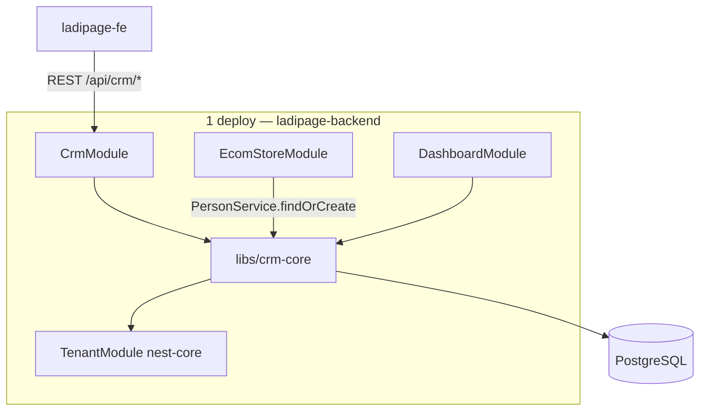
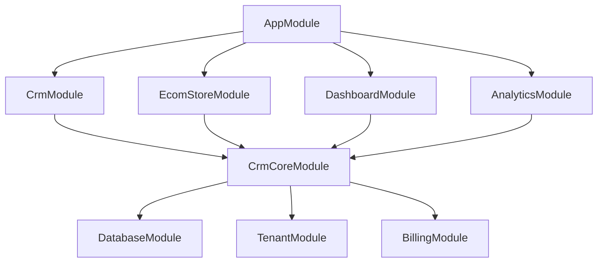

# Plan CRM — Hybrid Twenty-inspired trong Liora Monorepo

> **Mục tiêu:** CRM chặt chẽ, chạy **hoàn toàn trong `ladipage-backend`**, **một deploy**, **không** cần `twenty-server` microservice bên ngoài.  
> **Phương pháp:** Port **logic & mô hình nghiệp vụ** Twenty → viết lại NestJS services trong `libs/`; **không** copy `engine/twenty-orm` hay metadata runtime Twenty.

---

## 1. Kết quả hệ thống sau khi triển khai xong

### 1.1. CRM có hoạt động độc lập theo module không?

**Có.** CRM là **domain module** tách biệt trong monorepo:

```
libs/crm-core/          ← logic nghiệp vụ (dedup, pipeline, activity, utils Twenty-inspired)
libs/database/          ← entities + migrations crm_*
libs/ladipage-types/    ← DTO contract FE
apps/ladipage-backend/src/modules/crm/   ← controllers + wiring (thin layer)
```

- `CrmModule` import `CrmCoreModule` từ `libs/crm-core`.
- Các module khác (`ecom-store`, `dashboard`, `analytics`) gọi CRM qua **service interface** (`PersonService`, `OpportunityService`), không query bảng CRM trực tiếp từ controller.
- CRM **không** phụ thuộc process/network tới repo `twenty/` trong workspace.

### 1.2. Một deploy, không Twenty microservice?

**Có.**

| Thành phần | Deploy |
|------------|--------|
| `ladipage-backend` (:7002) | **1 container / 1 process** — gồm landing API + ecom + **CRM Hybrid** |
| `twenty-server` | **Không deploy** — chỉ dùng làm **reference** khi port utils/schema |
| PostgreSQL / Supabase | Chung schema Liora (`crm_*` + `lp_order` + `sys_*`) |
| Redis, MinIO | Như hiện tại |



### 1.3. Khả năng CRM đạt được (so với Twenty full)

| Khả năng | Sau plan | Ghi chú |
|----------|----------|---------|
| Person / Company CRUD + dedup | ✅ | Logic port từ `contact-creation-manager` |
| Deal / Opportunity + Pipeline | ✅ | Kanban stages |
| Task, Note | ✅ | Phase 4 |
| Activity / Timeline tự động | ✅ | Mọi mutation ghi `crm_activity` |
| Custom fields (Pro) | ✅ | Mở rộng từ `lp_customer_custom_field` → `crm_*` |
| Custom objects (Enterprise) | ✅ | Phase 6 — JSONB, không metadata engine |
| Order ↔ Customer chặt | ✅ | `lp_order.person_id` UUID |
| REST + ResOp cho FE | ✅ | Giữ `/api/crm/customers` … |
| Email / Calendar sync | ❌ | Phase tùy chọn — integration riêng |
| GraphQL CRM | ❌ | Không làm — FE dùng REST |
| Custom object runtime như Twenty | ❌ | Thay bằng Hybrid JSONB Enterprise |

---

## 2. Nguyên tắc kiến trúc (bắt buộc)

1. **Tenant:** Mọi bảng CRM có `tenantId` (int) — dùng `TenantContextService` + `TenantGuard`, **không** đổi sang `workspace_id` UUID hay schema-per-tenant Twenty.
2. **API:** REST `/api/crm/*`, response `{ code, message, data }` — **không** GraphQL CRM trong các phase MVP.
3. **Multi-tenancy:** Application-level filter trong services (giữ như hiện tại). RLS Supabase = phase tùy chọn sau MVP.
4. **ID:** `crm_person.id` = **UUID**; migrate từ `lp_customer` int qua bảng `crm_id_map`.
5. **Feature flag:** `CRM_V2_ENABLED=true|false` — rollback về `lp_*` trong cutover.
6. **Twenty repo:** Chỉ đọc utils + entity design; **rewrite** code, không import `twenty-shared/metadata` hay `GlobalWorkspaceOrmManager`.

---

## 3. Cấu trúc thư mục mục tiêu

```
liora-monorepo/
├── plan-crm.md                          ← tài liệu này
├── libs/
│   ├── crm-core/
│   │   ├── src/
│   │   │   ├── crm-core.module.ts
│   │   │   ├── utils/                   # port Twenty contact-creation-manager
│   │   │   ├── services/
│   │   │   │   ├── person.service.ts
│   │   │   │   ├── company.service.ts
│   │   │   │   ├── opportunity.service.ts
│   │   │   │   ├── pipeline.service.ts
│   │   │   │   ├── activity.service.ts
│   │   │   │   ├── task.service.ts
│   │   │   │   ├── note.service.ts
│   │   │   │   └── custom-field.service.ts
│   │   │   └── interfaces/
│   │   ├── project.json
│   │   └── package.json
│   ├── database/src/
│   │   ├── entities/crm/
│   │   └── migrations/                  # 1753xxxxxx-crm-v2-*.ts
│   └── ladipage-types/src/crm.ts        # cập nhật DTO (UUID, pipeline, activity)
└── apps/ladipage-backend/src/modules/crm/
    ├── crm.module.ts                    # import CrmCoreModule
    ├── controllers/                     # giữ routes hiện tại + mở rộng
    └── crm-v2.facade.ts                 # optional: map CustomerItem ↔ Person
```

---

## 4. Schema CRM v2 (Twenty-inspired, Ladipage-native)

### 4.1. Core tables

| Bảng | Thay thế | Nguồn tham chiếu Twenty |
|------|----------|-------------------------|
| `crm_person` | `lp_customer` | `PersonWorkspaceEntity` |
| `crm_company` | `lp_company` | `CompanyWorkspaceEntity` |
| `crm_person_company` | `lp_customer_company` | relation M:N |
| `crm_opportunity` | — (mới) | `OpportunityWorkspaceEntity` |
| `crm_pipeline` | — | pipeline stages |
| `crm_pipeline_stage` | — | `stage` field |
| `crm_task` | — | Task |
| `crm_note` | — | Note |
| `crm_activity` | — | `TimelineActivity` |
| `crm_custom_field_def` | `lp_customer_custom_field` | simplified |
| `crm_custom_field_value` | `lp_customer_field_value` | normalized |
| `crm_id_map` | — | migration legacy int → UUID |

### 4.2. Ecom link

```sql
ALTER TABLE lp_order ADD COLUMN person_id UUID NULL;
CREATE INDEX idx_lp_order_tenant_person ON lp_order ("tenantId", person_id);
```

Giữ snapshot `customerName`, `customerPhone` trên order để audit; FK chính = `person_id`.

### 4.3. Enterprise (Phase 6)

| Bảng | Mục đích |
|------|----------|
| `crm_object_definition` | Custom object slug, label (Enterprise tier) |
| `crm_field_definition` | Field metadata |
| `crm_dynamic_record` | `data JSONB` + `tenantId` |

---

## 5. Các phase triển khai chi tiết

### Phase 0 — Architecture lock & tenant fix

**Thời gian:** 1 tuần  
**Phụ thuộc:** Không

#### Công việc

- [ ] Viết `apps/ladipage-backend/crm-architecture.md` (ERD, map Twenty field → `crm_*`).
- [ ] Chốt: `tenantId` trên CRM; `organizationId` chỉ ở JWT/billing bridge.
- [ ] Fix `TenantGuard` / 403 trên business API (prerequisite từ smoke test).
- [ ] Thêm env `CRM_V2_ENABLED=false` (default).
- [ ] Review checklist cũ: **loại** GraphQL CRM và RLS khỏi MVP.

#### Kết quả đạt được

| # | Kết quả | Kiểm chứng |
|---|---------|------------|
| 0.1 | Tài liệu kiến trúc CRM v2 đã lock | File `crm-architecture.md` merged |
| 0.2 | JWT + `tenantId` ổn định trên business routes | `ladipage-tenant-smoke-test.js` ≥ pass auth + 1 CRM route |
| 0.3 | Team thống nhất **không** deploy Twenty service | Ghi rõ trong plan |
| 0.4 | Feature flag rollback sẵn sàng | Env documented trong `.env.example` |

---

### Phase 1 — `libs/crm-core` + Twenty utils port

**Thời gian:** 2 tuần  
**Phụ thuộc:** Phase 0

#### Công việc

- [ ] Scaffold `libs/crm-core` (Nx project, export `CrmCoreModule`).
- [ ] Port utils (rewrite) từ Twenty `contact-creation-manager/utils/`:
  - `parse-name`, `dedupe-contacts`, `email-domain`, `company-from-domain`
- [ ] Port adapt `match-participant` email filter → helper TypeORM.
- [ ] Unit test utils (Jest).
- [ ] Đăng ký `libs/crm-core` trong `tsconfig.base.json` paths (`@liora/crm-core`).

#### Kết quả đạt được

| # | Kết quả | Kiểm chứng |
|---|---------|------------|
| 1.1 | Package `@liora/crm-core` build được | `pnpm nx build crm-core` |
| 1.2 | Utils dedup/parse name có test | `pnpm nx test crm-core` pass |
| 1.3 | **Không** dependency tới repo `twenty/` lúc runtime | `package.json` không import twenty-* |
| 1.4 | Sẵn sàng inject vào services Phase 2 | `CrmCoreModule` export providers |

---

### Phase 2 — Database schema `crm_person` / `crm_company`

**Thời gian:** 2 tuần  
**Phụ thuộc:** Phase 1

#### Công việc

- [ ] Migration tạo `crm_person`, `crm_company`, `crm_person_company`.
- [ ] TypeORM entities trong `libs/database/src/entities/crm/`.
- [ ] `PersonService`, `CompanyService` trong `libs/crm-core` (CRUD + `findOrCreateByContact`).
- [ ] Soft delete (`deletedAt`), `search_vector` (tsvector) trên person.
- [ ] JSONB `emails`, `phones` (simplified Twenty composite types).
- [ ] Index: `(tenantId)`, `(tenantId, phone)`, `(tenantId, email primary)`.

#### Kết quả đạt được

| # | Kết quả | Kiểm chứng |
|---|---------|------------|
| 2.1 | Bảng `crm_*` core tồn tại trên DB dev | `pnpm db:migration:run` + `pnpm db:validate` |
| 2.2 | `findOrCreateByContact` dedup phone → email → create | Unit + integration test |
| 2.3 | Auto-suggest/link `crm_company` từ email domain | Test case domain công ty |
| 2.4 | Data **song song** `lp_*` (chưa cutover) | Flag `CRM_V2_ENABLED=false` vẫn dùng lp |

---

### Phase 3 — REST API v2 + facade (giữ contract FE)

**Thời gian:** 2 tuần  
**Phụ thuộc:** Phase 2

#### Công việc

- [ ] `CrmV2Facade` map `Person` ↔ `CustomerItem` (id string UUID).
- [ ] Controllers: khi `CRM_V2_ENABLED=true` route tới `PersonService`.
- [ ] Giữ nguyên paths:
  - `GET/POST/PATCH/DELETE /api/crm/customers`
  - `GET/POST/PATCH/DELETE /api/crm/companies`
- [ ] Cập nhật `libs/ladipage-types/src/crm.ts` (`id: string`, thêm fields optional).
- [ ] Swagger tags `CRM - Customers` không đổi.
- [ ] MSW handlers `ladipage-fe` cập nhật id UUID (breaking nhỏ, 1 sprint FE).

#### Kết quả đạt được

| # | Kết quả | Kiểm chứng |
|---|---------|------------|
| 3.1 | `/api/crm/customers` trả `ResOp` đúng format | `pnpm db:api:test` / manual Swagger |
| 3.2 | FE `/khach-hang` hoạt động với CRM v2 (flag on) | `ladipage-fe` build + manual QA |
| 3.3 | **1 deploy** — không service Twenty | Chỉ `ladipage-backend` :7002 |
| 3.4 | Rollback 1 env var về `lp_*` | Toggle `CRM_V2_ENABLED=false` |

---

### Phase 4 — Pipeline, Opportunity, Task, Note, Activity

**Thời gian:** 2 tuần  
**Phụ thuộc:** Phase 3

#### Công việc

- [ ] Migration: `crm_pipeline`, `crm_pipeline_stage`, `crm_opportunity`, `crm_task`, `crm_note`, `crm_activity`.
- [ ] `OpportunityService`: CRUD, move stage, link `person_id`, `company_id`.
- [ ] `ActivityService`: auto-log on person/opportunity/task changes.
- [ ] REST mới (optional FE phase sau):
  - `GET/POST /api/crm/opportunities`
  - `PATCH /api/crm/opportunities/:id/stage`
  - `GET/POST /api/crm/tasks`, `/api/crm/notes`
  - `GET /api/crm/activities?personId=`
- [ ] Default pipeline seed per tenant (on provision).

#### Kết quả đạt được

| # | Kết quả | Kiểm chứng |
|---|---------|------------|
| 4.1 | Deal pipeline Kanban API hoạt động | Postman / e2e tạo deal → đổi stage |
| 4.2 | Timeline activity tự sinh khi sửa person/deal | GET activities có entries |
| 4.3 | CRM **đủ chặt** cho sales workflow (không cần Twenty) | Demo nội bộ |
| 4.4 | Module độc lập: `OpportunityService` export từ `crm-core` | Ecom có thể link deal (optional) |

---

### Phase 5 — Tích hợp Ecom, Dashboard, Analytics

**Thời gian:** 1.5 tuần  
**Phụ thuộc:** Phase 4

#### Công việc

- [ ] `order.service.ts`: `findOrCreateByContact` → `PersonService` (CRM v2).
- [ ] Migration `lp_order.person_id`; backfill từ `crm_id_map`.
- [ ] `dashboard.service` / `analytics.service`: query `crm_person` thay `CustomerEntity` khi flag on.
- [ ] Báo cáo customers report dùng count person + segment (giữ segment hoặc map view).
- [ ] `EcomStoreModule` import `CrmCoreModule` thay export `CustomerService` cũ.

#### Kết quả đạt được

| # | Kết quả | Kiểm chứng |
|---|---------|------------|
| 5.1 | Tạo đơn → tự gắn `person_id` | POST `/api/ecom/orders` + verify FK |
| 5.2 | Dashboard summary đếm KH từ `crm_person` | GET `/api/dashboard/summary` |
| 5.3 | Analytics customers report khớp CRM | GET `/api/analytics/reports/customers` |
| 5.4 | **Single data path** khi flag on — ecom + CRM cùng module graph | Không gọi API ngoài |

---

### Phase 6 — Migration dữ liệu & cutover production

**Thời gian:** 1.5 tuần  
**Phụ thuộc:** Phase 5

#### Công việc

- [ ] Script `scripts/db/migrate-lp-crm-to-crm-v2.js`:
  - `lp_company` → `crm_company`
  - `lp_customer` → `crm_person`
  - maps → `crm_id_map`
  - backfill `lp_order.person_id`
- [ ] Validate count per tenant (legacy vs new).
- [ ] Staging cutover: `CRM_V2_ENABLED=true` default.
- [ ] Deprecate services đọc `lp_customer` (read-only 1 sprint).
- [ ] Document rollback: flag off + `crm_id_map` retained.

#### Kết quả đạt được

| # | Kết quả | Kiểm chứng |
|---|---------|------------|
| 6.1 | Không mất dữ liệu KH khi migrate | Count diff = 0 per tenant |
| 6.2 | Production chạy CRM v2 mặc định | Flag on prod |
| 6.3 | `lp_*` CRM tables deprecated (không xóa ngay) | Code không write lp_customer |
| 6.4 | **Hệ thống CRM hoàn toàn nội bộ** — 1 deploy | Không container Twenty |

---

### Phase 7 — Custom fields Pro (chuẩn hóa)

**Thời gian:** 1 tuần  
**Phụ thuộc:** Phase 6

#### Công việc

- [ ] Migrate `lp_customer_custom_field` → `crm_custom_field_def` + `crm_custom_field_value`.
- [ ] `CustomFieldService`: validate type, options, required.
- [ ] REST giữ `/api/crm/custom-fields`.
- [ ] Gắn `SubscriptionTier.PRO` gate (optional fields limit).

#### Kết quả đạt được

| # | Kết quả | Kiểm chứng |
|---|---------|------------|
| 7.1 | Custom field CRUD trên person/opportunity | API test |
| 7.2 | Một mô hình custom field thống nhất (không jsonb trùng lặp) | ERD review |
| 7.3 | Pro tier quota enforced | Billing guard test |

---

### Phase 8 — Enterprise custom objects (Hybrid tier 3)

**Thời gian:** 3–4 tuần  
**Phụ thuộc:** Phase 7

#### Công việc

- [ ] Tables: `crm_object_definition`, `crm_field_definition`, `crm_dynamic_record`.
- [ ] `DynamicRecordService` — CRUD JSONB, validate schema.
- [ ] `EnterpriseGuard` — `SubscriptionTier.ENTERPRISE | LIFETIME`.
- [ ] REST: `/api/crm/objects`, `/api/crm/objects/:slug/records`.
- [ ] Quota: max objects/records per tenant.

#### Kết quả đạt được

| # | Kết quả | Kiểm chứng |
|---|---------|------------|
| 8.1 | Enterprise tenant tạo custom object | API + admin QA |
| 8.2 | **Không** cần Twenty metadata engine | Code review — no dynamic ORM |
| 8.3 | Upsell path rõ: Free/Pro = core CRM, Enterprise = custom objects | Product doc |

---

### Phase 9 — Hardening, test, docs

**Thời gian:** 1.5 tuần  
**Phụ thuộc:** Phase 6+ (song song Phase 7–8)

#### Công việc

- [ ] Unit tests services critical (`person`, `opportunity`, `activity`).
- [ ] E2E: login → tạo person → tạo deal → tạo order → dashboard.
- [ ] `ladipage-tenant-smoke-test.js` mở rộng CRM v2 endpoints.
- [ ] Swagger + `libs/ladipage-types` sync `ladipage-fe`.
- [ ] Runbook: migrate, rollback, monitor.

#### Kết quả đạt được

| # | Kết quả | Kiểm chứng |
|---|---------|------------|
| 9.1 | CI test CRM pass | nx test / jest |
| 9.2 | Smoke test CRM v2 20/20 pass | script exit 0 |
| 9.3 | README module CRM cập nhật | `apps/ladipage-backend/README.md` |

---

### Phase 10 — Tùy chọn (sau MVP): Integrations

**Không bắt buộc cho “CRM chặt trong 1 deploy”.**

- Inbound email → note (pattern Atomic CRM).
- Chatwoot / Formbricks (đã có trong `structure.md` integration module).
- **Không** bắt buộc deploy Twenty — chỉ webhook/API third-party.

---

## 6. Timeline tổng hợp

| Milestone | Phases | Tuần tích lũy | Trạng thái CRM |
|-----------|--------|----------------|----------------|
| **M0 — Ready** | 0 | 1 | Tenant fix, arch locked |
| **M1 — Foundation** | 1–2 | 3 | Schema + utils |
| **M2 — API usable** | 3 | 5 | FE `/khach-hang` on v2 |
| **M3 — Sales CRM** | 4 | 7 | Pipeline + timeline |
| **M4 — Platform integrated** | 5–6 | 10 | Ecom + cutover |
| **M5 — Monetization** | 7–8 | 14–15 | Pro/Enterprise tiers |
| **M6 — Production grade** | 9 | 16–17 | Test + docs |

---

## 7. Module dependency graph (runtime trong 1 process)



**Không có edge tới `twenty-server`.**

---

## 8. API contract giữ nguyên (FE không đổi route)

| Route hiện tại | Phase | Ghi chú |
|----------------|-------|---------|
| `GET/POST/PATCH/DELETE /api/crm/customers` | 3+ | Backend = `crm_person` |
| `GET/POST /api/crm/companies` | 3+ | Backend = `crm_company` |
| `GET/POST /api/crm/segments` | 6+ | Giữ hoặc map pipeline views |
| `GET/POST /api/crm/tags` | 6+ | Giữ |
| `GET/POST /api/crm/custom-fields` | 7+ | Chuẩn hóa |
| `GET/POST /api/crm/opportunities` | 4+ | Mới |
| `GET /api/crm/activities` | 4+ | Mới |

---

## 9. Tiêu chí hoàn thành toàn plan (Definition of Done)

- [ ] CRM chạy trong **một** `ladipage-backend` — **không** container/process Twenty.
- [ ] `libs/crm-core` chứa toàn bộ logic CRM; `modules/crm` chỉ HTTP layer.
- [ ] `lp_order.person_id` liên kết `crm_person`.
- [ ] Pipeline + activity timeline hoạt động.
- [ ] Migrate `lp_*` → `crm_*` xong; không dual-write vĩnh viễn.
- [ ] `CRM_V2_ENABLED=true` production; rollback documented.
- [ ] `ladipage-fe` REST contract giữ path; id customer = UUID string.
- [ ] Smoke test tenant + CRM pass.
- [ ] **Không** import package từ repo `twenty/` at runtime.

---

## 10. FAQ

### CRM có “độc lập” như microservice không?

**Logic độc lập (module + lib), deploy không tách.** Giống `BillingModule` / `EcomStoreModule` — cùng process, ranh giới code rõ.

### Có cần clone repo Twenty vào monorepo không?

**Không.** Chỉ tham chiếu khi port utils; code sống trong `libs/crm-core`.

### Khi nào cần Twenty thật?

Chỉ khi sau này cần **email/calendar sync** hoặc **metadata CRM ngang Twenty 100%** — đó là **phase integration tùy chọn**, không thuộc plan này.

### AGPL Twenty có ảnh hưởng không?

Plan này **rewrite** logic, không embed Twenty binary — giảm rủi ro license; vẫn nên legal review nếu copy cụm code lớn.

---

## 11. Tham chiếu trong monorepo

| Tài liệu / code | Vai trò |
|-----------------|---------|
| `plan.md` | Plan Ladipage backend gốc |
| `twenty/checklist.md` | Checklist tham khảo (đã chỉnh theo plan này) |
| `apps/ladipage-backend/src/modules/crm/` | Module HTTP hiện tại |
| `libs/nest-core/modules/tenant/` | Multi-tenant |
| `workflow.md` | FE REST contract |
| `scripts/db/ladipage-tenant-smoke-test.js` | Smoke test |

---

*Cập nhật: 2026-06-17 — Plan CRM Hybrid Twenty-inspired, single deploy, no Twenty microservice.*