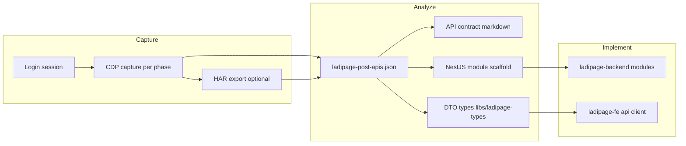

# Plan Reverse Engineering — LadiPage (`https://app.ladipage.com/`)

> **Mục tiêu:** Reverse engineer toàn bộ API contract của LadiPage production để rebuild `ladipage-backend` + đấu nối `ladipage-fe` mà **không đổi UI**.  
> **Phương pháp:** CDP (Chrome DevTools Protocol) làm nguồn chính + HAR làm nguồn đối chiếu / bổ sung.  
> **Tool:** `tools/cdp-reverse-engineer` (Playwright + CDP, đã có config & output mẫu).  
> **Ngày tạo:** 2026-06-23

---

## 1. Tổng quan kiến trúc LadiPage

### 1.1. Domain & redirect

| Domain | Vai trò |
|--------|---------|
| `https://app.ladipage.com/` | Entry point — login, redirect sang app v6 |
| `https://app.ladipage.com/auth/login` | Trang đăng nhập |
| `https://appv6.ladipage.com/` | **Admin SPA chính** (Next.js, CDN `w.ladicdn.com/ladipage-app-v6`) |
| `https://build.ladipage.com/` | Page builder / editor runtime |
| `w.ladicdn.com` | Static assets, editor bundles |

**Lưu ý:** User truy cập `app.ladipage.com` nhưng phần lớn nghiệp vụ chạy trên `appv6.ladipage.com`. Plan capture **cả hai** — login flow trên `app.ladipage.com`, business flow trên `appv6`.

### 1.2. API backends (đã xác nhận qua capture)

| Host | Module | Ví dụ route |
|------|--------|-------------|
| `api.ladipage.com` | Core (landing, store, staff, domain, form) | `POST /2.0/ladi-page/list` |
| `apiv5.ladipage.com` | Builder v5 (editor, asset, page show) | `POST /2.0/ladi-page/show` |
| `apiv5.sales.ldpform.net` | E-commerce / Sales | `POST /2.0/order/list-order` |
| `api.ladiflow.com` | Realtime (Socket.IO) | `wss://api.ladiflow.com/socket.io/` |

### 1.3. Pattern API LadiPage

- Hầu hết là **POST RPC** — path dạng `/2.0/{resource}/{action}` (không REST thuần).
- Headers bắt buộc (đã thấy trong capture):
  - `authorization` — token dài (session token sau login)
  - `store-id` — tenant/store context (`6a2c26caef58950011646639`)
  - `accept: application/json`
- Request body thường có `lang: "vi"`.
- Response: JSON object (không phải `{code, message, data}` của backend mới — cần **adapter layer** khi migrate).

### 1.4. Route FE (appv6) — map module

| Module | URL appv6 | Backend target (rebuild) |
|--------|-----------|--------------------------|
| Landing Pages | `/ladipage`, `/editor/:id`, `/ladipage/templates`, `/ladipage/domains`, `/ladipage/forms`, `/ladipage/leads`, `/ladipage/tags` | `website`, `domain`, `builder-bridge`, `publish` |
| Bán hàng | `/ecommerce/orders`, `/ecommerce/products`, … | `ecom-store` |
| Khách hàng | `/customers` (và sub-routes) | `crm` |
| Báo cáo | `/reports`, per-page report modal | `analytics` |
| Dashboard | `/dashboard` | `dashboard` |
| Cài đặt | `/settings` | `settings` |
| Billing | (trong settings / upgrade flow) | `payment` |

---

## 2. Phương pháp CDP + HAR

### 2.1. CDP — nguồn chính (automated)

Tool `tools/cdp-reverse-engineer` dùng Playwright attach CDP session:

```
Network.enable  → bắt request/response + body
Fetch.enable    → intercept request stage
Runtime.enable  → đọc globals (LadiPage config)
Page.enable     → navigation events
```

**Output mỗi lần capture** (thư mục `output/{phase}/{timestamp}/`):

| File | Nội dung |
|------|----------|
| `report.json` | Meta + summary |
| `apis.json` | Toàn bộ HTTP (method, headers, body) |
| `ladipage-post-apis.json` | **Chỉ POST Ladipage backend** — file quan trọng nhất |
| `ladipage-flow.json` | `uniqueRoutes`, sample bodies, rebuild notes |
| `nestjs-hints.json` | Gợi ý scaffold DTO/controller |
| `openapi-stub.json` | OpenAPI draft |
| `websockets.json` | Socket.IO frames |
| `state.json` | localStorage (`ladipage_store_info`, token, …) |

### 2.2. HAR — nguồn đối chiếu (manual supplement)

Dùng khi:
- CDP headless bị `net::ERR_FAILED` (đã thấy với một số route landing).
- Cần capture mutation phức tạp (upload file, drag-drop editor).
- Cần bằng chứng pháp lý / audit trail.

**Quy trình HAR:**

1. Mở Chrome thật (không headless) → DevTools → Network → **Preserve log** + **Disable cache**.
2. Đăng nhập `https://app.ladipage.com/auth/login`.
3. Thực hiện đúng checklist actions của phase (mục 4–8).
4. Export HAR → lưu `tools/cdp-reverse-engineer/har/{phase}/{date}.har`.
5. Parse HAR bằng script (tùy chọn phase 9) hoặc so sánh thủ công với `ladipage-post-apis.json`.

**Merge CDP + HAR:**

```
unique_routes = union(CDP.uniqueRoutes, HAR_filtered_POST_routes)
diff = routes_in_HAR_not_in_CDP  →  bổ sung capture actions
```

### 2.3. Sơ đồ pipeline



---

## 3. Phase 0 — Hạ tầng & Auth (bắt buộc trước mọi phase)

### 3.1. Mục tiêu

- Có session đăng nhập ổn định, tái sử dụng giữa các phase.
- Document auth flow, headers, token lifecycle.
- Baseline noise filter (Google Analytics, CDN static).

### 3.2. Chuẩn bị môi trường

```bash
cd tools/cdp-reverse-engineer
pnpm install
npm run install:browsers   # playwright chromium
```

Tạo thư mục:

```
tools/cdp-reverse-engineer/
├── .session/                    # gitignore — chứa auth JSON
├── output/
│   ├── phase0-auth/
│   ├── phase1-landing/
│   ├── phase2-banhang/
│   ├── phase3-khachhang/
│   └── phase4-baocao/
└── har/
    ├── phase0-auth/
    └── ...
```

### 3.3. Capture login (headed — một lần)

Config có sẵn: `config.ladipage.login.json`

```bash
npm run capture:ladipage:login
# headless: false, pauseForLoginMs: 180000
# User đăng nhập thủ công → lưu .session/ladipage-auth.json
```

**Cho appv6** (khuyến nghị — session dùng cho tất cả phase):

```bash
# Chỉnh config hoặc tạo config.ladipage.appv6.login.json:
# loginUrl: https://app.ladipage.com/auth/login
# saveStorageStatePath: .session/ladipage-appv6-auth.json
# url sau login: https://appv6.ladipage.com/dashboard
```

### 3.4. Deliverables Phase 0

| # | Deliverable | Path |
|---|-------------|------|
| 0.1 | Session file | `.session/ladipage-appv6-auth.json` |
| 0.2 | Auth flow doc | `docs/reverse/auth-flow.md` |
| 0.3 | Header contract | `docs/reverse/headers.md` (`authorization`, `store-id`, `owner-id`) |
| 0.4 | Store context snapshot | từ `state.json` → `ladipage_store_info` fields |
| 0.5 | Login API capture | `POST` routes liên quan auth (nếu có) |

### 3.5. Checklist xác nhận

- [ ] `finalUrl` không chứa `/auth/login` sau khi load config có `storageStatePath`
- [ ] `ladipage-post-apis.json` có ít nhất `POST api.ladipage.com/2.0/store/info`
- [ ] `store-id` header xuất hiện trong mọi request nghiệp vụ
- [ ] Token trong `state.json` khớp header `authorization`

### 3.6. API đã biết (auth / store)

| Method | Host | Path | Ghi chú |
|--------|------|------|---------|
| POST | api.ladipage.com | `/2.0/store/info` | Store metadata, pkg, addon |
| POST | api.ladipage.com | `/2.0/application/list` | Danh sách app (LCRM, WebsiteBuilder, …) |
| POST | apiv5.sales.ldpform.net | `/2.0/store/get-user-info` | User trong context sales |

---

## 4. Phase 1 — Landing Pages

### 4.1. Phạm vi

Reverse engineer toàn bộ flow **tạo / sửa / publish / báo cáo từng page** landing page.

### 4.2. URL cần capture

| # | URL | Hành vi cần trigger |
|---|-----|---------------------|
| 1.1 | `/ladipage` | List pages, filter, sort, pagination |
| 1.2 | `/ladipage/templates` | Browse templates, preview |
| 1.3 | `/ladipage/tags` | List + **Tạo tag mới** |
| 1.4 | `/ladipage/forms` | List form configs + **Tạo cấu hình Form** |
| 1.5 | `/ladipage/domains` | List domains, connect domain |
| 1.6 | `/ladipage/leads` | Lead list từ form submissions |
| 1.7 | `/editor/:pageId` | Mở editor, load page data, save |
| 1.8 | Row menu → **Nhân bản** | Duplicate page mutation |
| 1.9 | Row menu → **Báo cáo** | Per-page analytics (overlap Phase 4) |

### 4.3. Config CDP

**Đã có:** `config.ladipage.appv6.json` (read-heavy)  
**Đã có:** `config.ladipage.appv6.mutations.json` (duplicate + report menu)

Tạo thêm:

```
config.phase1-landing-read.json      # clone appv6.json
config.phase1-landing-mutations.json # create, update, delete, publish
config.phase1-landing-editor.json    # focus /editor/:id, thời gian chờ dài
```

**Script đề xuất:**

```bash
npm run capture -- --config config.ladipage.appv6.json
npm run capture -- --config config.ladipage.appv6.mutations.json
# Sau khi tạo config editor:
npm run capture -- --config config.phase1-landing-editor.json --headed
```

### 4.4. API đã capture (read) — baseline

Từ `output/ladipage-appv6-full/2026-06-22T15-03-02-972Z/ladipage-flow.json`:

| Host | Path | Action UI |
|------|------|-----------|
| api.ladipage.com | `/2.0/ladi-page/list` | Danh sách landing pages |
| api.ladipage.com | `/2.0/ladi-page-tag/list` | Tags |
| api.ladipage.com | `/2.0/domain/list` | Domains |
| api.ladipage.com | `/2.0/form-config/list` | Form configs |
| api.ladipage.com | `/2.0/data-form-error/list` | Form errors |
| api.ladipage.com | `/2.0/list-show-case` | Templates showcase |
| api.ladipage.com | `/2.0/theme-list` | Theme list |
| api.ladipage.com | `/2.0/theme-tag-list` | Theme tags |
| api.ladipage.com | `/2.0/staff/list` | Staff |
| apiv5.ladipage.com | `/2.0/ladi-page/show` | Chi tiết page (editor) |
| apiv5.ladipage.com | `/2.0/asset-list` | Assets trong editor |
| apiv5.ladipage.com | `/2.0/domain/list` | Domain (editor context) |

### 4.5. API cần capture thêm (mutations)

| Path (dự đoán) | UI trigger | Priority |
|----------------|------------|----------|
| `/2.0/ladi-page/create` | Tạo Landing Page | P0 |
| `/2.0/ladi-page/update` | Save editor | P0 |
| `/2.0/ladi-page/duplicate` | Nhân bản | P0 |
| `/2.0/ladi-page/delete` | Xóa page | P1 |
| `/2.0/ladi-page/publish` | Publish | P0 |
| `/2.0/ladi-page-tag/create` | Tạo tag | P1 |
| `/2.0/form-config/create` | Tạo form config | P1 |
| `/2.0/domain/create` | Thêm domain | P2 |

> **Cách tìm path thật:** Sau mỗi click mutation, diff `ladipage-post-apis.json` với baseline read-capture.

### 4.6. Deliverables Phase 1

| # | File | Mô tả |
|---|------|-------|
| 1.1 | `docs/reverse/phase1-landing-api.md` | Bảng đầy đủ method/path/request/response |
| 1.2 | `output/phase1-landing/{ts}/` | CDP artifacts |
| 1.3 | `har/phase1-landing/{date}.har` | HAR đối chiếu (editor + publish) |
| 1.4 | `libs/ladipage-types/src/landing.ts` | DTO types (draft) |
| 1.5 | Map → `apps/ladipage-backend/src/modules/website/` | Implementation checklist |

### 4.7. Map sang ladipage-backend

| LadiPage API | NestJS module | Endpoint mới (REST) |
|--------------|---------------|---------------------|
| `ladi-page/list` | `website` | `GET /api/pages` |
| `ladi-page/create` | `website` | `POST /api/pages` |
| `ladi-page/show` | `builder-bridge` | `GET /api/pages/:id` |
| `ladi-page/publish` | `publish` | `POST /api/publish` |
| `domain/list` | `domain` | `GET /api/domains` |
| `form-config/*` | `website` | `GET/POST /api/forms` |

---

## 5. Phase 2 — Bán hàng (E-commerce)

### 5.1. Phạm vi

Reverse engineer module **LadiSales** — đơn hàng, sản phẩm, kho, vận chuyển, tags, custom fields.

### 5.2. URL cần capture

| # | URL | Hành vi |
|---|-----|---------|
| 2.1 | `/ecommerce/orders` | List orders, filter, **Tạo đơn hàng** |
| 2.2 | `/ecommerce/orders/incomplete` | Đơn chưa hoàn thành |
| 2.3 | `/ecommerce/orders/shipments` | Vận chuyển |
| 2.4 | `/ecommerce/orders/tags` | Order tags CRUD |
| 2.5 | `/ecommerce/orders/custom-fields` | Custom fields (order) |
| 2.6 | `/ecommerce/products` | Products list + **Tạo sản phẩm** |
| 2.7 | `/ecommerce/products/categories` | Categories |
| 2.8 | `/ecommerce/products/tags` | Product tags |
| 2.9 | `/ecommerce/products/inventory` | Tồn kho |
| 2.10 | `/ecommerce/products/reviews` | Reviews |
| 2.11 | `/ecommerce/products/fields` | Custom fields (product) |
| 2.12 | Menu **Xuất/Đồng bộ dữ liệu** | Export/sync |

### 5.3. Config CDP

**Đã có:** `config.banhang.appv6.json`

Tạo thêm:

```
config.phase2-banhang-mutations.json  # create order, update status, create product
config.phase2-banhang-export.json     # export flow
```

```bash
npm run capture:banhang:appv6
npm run capture -- --config config.phase2-banhang-mutations.json
```

### 5.4. API đã capture (read) — baseline

Từ `output/banhang-appv6-full/2026-06-23T03-18-13-221Z/ladipage-flow.json`  
Host chính: **`apiv5.sales.ldpform.net`**

| Path | Màn hình |
|------|----------|
| `/2.0/order/list-order` | Danh sách đơn |
| `/2.0/product/list-products` | Danh sách SP |
| `/2.0/product/search` | Tìm SP (trong form tạo đơn) |
| `/2.0/product-category/list` | Categories |
| `/2.0/product-category/list-select` | Dropdown category |
| `/2.0/product-tag/list` | Product tags |
| `/2.0/product-tag/list-all` | All product tags |
| `/2.0/order-tag/list` | Order tags |
| `/2.0/order-tag/list-all` | All order tags |
| `/2.0/custom-field/list` | Custom fields |
| `/2.0/inventory/list` | Tồn kho |
| `/2.0/product-review/list` | Reviews |
| `/2.0/shipping/list` | Vận chuyển |
| `/2.0/checkout/list` | Checkout configs |
| `/2.0/page-checkout/list-store` | Store checkout pages |
| `/2.0/filter/list` | Bộ lọc nâng cao |

### 5.5. API cần capture thêm (mutations)

| Path (dự đoán) | UI trigger | Priority |
|----------------|------------|----------|
| `/2.0/order/create` | Tạo đơn hàng | P0 |
| `/2.0/order/update-status` | Đổi trạng thái | P0 |
| `/2.0/order/update` | Sửa đơn | P1 |
| `/2.0/product/create` | Tạo sản phẩm | P0 |
| `/2.0/product/update` | Sửa SP | P1 |
| `/2.0/inventory/update` | Cập nhật tồn kho | P1 |
| `/2.0/order-tag/create` | Tạo order tag | P2 |
| `/2.0/product-tag/create` | Tạo product tag | P2 |
| `/2.0/custom-field/create` | Tạo custom field | P2 |

### 5.6. Sample fields (từ capture thật)

Order list response chứa:

```
customer_id, customer_first_name, customer_last_name,
customer_email, customer_phone, total, status, ...
```

→ Dùng làm schema reference cho `lp_order` + liên kết CRM.

### 5.7. Deliverables Phase 2

| # | File |
|---|------|
| 2.1 | `docs/reverse/phase2-banhang-api.md` |
| 2.2 | `output/phase2-banhang/{ts}/` |
| 2.3 | `libs/ladipage-types/src/ecom.ts` (cập nhật từ capture) |
| 2.4 | Map → `apps/ladipage-backend/src/modules/ecom-store/` |

### 5.8. Map sang ladipage-backend

| LadiPage API | NestJS | REST mới |
|--------------|--------|----------|
| `order/list-order` | `ecom-store` | `GET /api/ecom/orders` |
| `order/create` | `ecom-store` | `POST /api/ecom/orders` |
| `product/list-products` | `ecom-store` | `GET /api/ecom/products` |
| `inventory/list` | `ecom-store` | `GET /api/ecom/inventory` |
| `custom-field/list` | `ecom-store` | `GET /api/ecom/custom-fields` |

---

## 6. Phase 3 — Khách hàng (CRM)

### 6.1. Phạm vi

Reverse engineer **LCRM** — danh sách khách, phân khúc, tags, custom fields, đồng bộ lỗi, liên kết order ↔ customer.

### 6.2. URL cần capture

| # | URL | Hành vi |
|---|-----|---------|
| 3.1 | `https://appv6.ladipage.com/customers` | List customers |
| 3.2 | `/customers` → tab segments | Phân khúc |
| 3.3 | `/customers` → tab tags | Customer tags |
| 3.4 | `/customers` → custom fields | Custom fields |
| 3.5 | **Tạo khách hàng** | Form create |
| 3.6 | **Chi tiết khách** | View + edit |
| 3.7 | `/ladipage/leads` | Leads (cross-ref với Phase 1) |
| 3.8 | Tạo đơn hàng → auto-link customer | Cross-ref Phase 2 |

> Route `/customers` đã thấy trong prefetch RSC của capture landing — chưa có POST CRM trong output hiện tại → **phase này cần chạy riêng**.

### 6.3. Config CDP (tạo mới)

Tạo `config.phase3-khachhang.appv6.json`:

```json
{
  "url": "https://appv6.ladipage.com/customers",
  "durationMs": 25000,
  "headless": true,
  "outputDir": "output/phase3-khachhang",
  "maxBodyBytes": 2097152,
  "storageStatePath": ".session/ladipage-appv6-auth.json",
  "actions": [
    { "type": "wait", "ms": 8000 },
    { "type": "click", "selector": "button:has-text('Tạo khách hàng'), button:has-text('Thêm khách hàng')" },
    { "type": "wait", "ms": 5000 },
    { "type": "navigate", "value": "https://appv6.ladipage.com/customers/segments" },
    { "type": "wait", "ms": 6000 },
    { "type": "navigate", "value": "https://appv6.ladipage.com/customers/tags" },
    { "type": "wait", "ms": 6000 },
    { "type": "click", "selector": "table tbody tr:first-child" },
    { "type": "wait", "ms": 8000 },
    { "type": "click", "selector": "button:has-text('Lọc nâng cao')" },
    { "type": "wait", "ms": 4000 }
  ]
}
```

Tạo `config.phase3-khachhang-mutations.json` cho create/update/delete.

```bash
npm run capture -- --config config.phase3-khachhang.appv6.json
npm run capture -- --config config.phase3-khachhang-mutations.json --headed
```

### 6.4. API dự kiến (chưa capture — cần xác nhận)

Host có thể là `api.ladipage.com` hoặc service LCRM riêng (`app_code: "LCRM"` trong store addon):

| Path (dự đoán) | Chức năng |
|----------------|-----------|
| `/2.0/customer/list` | Danh sách khách |
| `/2.0/customer/create` | Tạo khách |
| `/2.0/customer/show` | Chi tiết |
| `/2.0/customer/update` | Cập nhật |
| `/2.0/customer-segment/list` | Phân khúc |
| `/2.0/customer-tag/list` | Tags |
| `/2.0/customer-custom-field/list` | Custom fields |
| `/2.0/sync-error/list` | Log lỗi đồng bộ |

**Cách xác định host:** Sau capture, group `ladipage-post-apis.json` theo `host`, lọc path chứa `customer`, `segment`, `crm`.

### 6.5. Deliverables Phase 3

| # | File |
|---|------|
| 3.1 | `docs/reverse/phase3-khachhang-api.md` |
| 3.2 | `output/phase3-khachhang/{ts}/` |
| 3.3 | `har/phase3-khachhang/{date}.har` |
| 3.4 | `libs/ladipage-types/src/crm.ts` (sync với capture) |
| 3.5 | Cross-ref doc: order `customer_id` ↔ CRM person |

### 6.6. Map sang ladipage-backend

| LadiPage API | NestJS | REST mới |
|--------------|--------|----------|
| `customer/list` | `crm` | `GET /api/crm/customers` |
| `customer/create` | `crm` | `POST /api/crm/customers` |
| `customer-segment/*` | `crm` | `GET/POST /api/crm/segments` |
| `customer-tag/*` | `crm` | `GET/POST /api/crm/tags` |

Tham chiếu plan hiện có: `plan-crm.md`, `document.md`.

---

## 7. Phase 4 — Báo cáo (Analytics & Reports)

### 7.1. Phạm vi

Hai lớp báo cáo:

1. **Global reports** — `https://appv6.ladipage.com/reports`
2. **Per-page report** — menu "Báo cáo" trên từng landing page (Phase 1)
3. **Dashboard widgets** — `https://appv6.ladipage.com/dashboard` (summary charts)

### 7.2. URL cần capture

| # | URL | Hành vi |
|---|-----|---------|
| 4.1 | `/reports` | Báo cáo tổng — doanh thu, conversion, … |
| 4.2 | `/reports` → filter theo ngày | Date range picker |
| 4.3 | `/dashboard` | Summary cards + charts |
| 4.4 | `/ladipage` → row menu → Báo cáo | Per-page analytics |
| 4.5 | `/ecommerce/orders` → báo cáo bán hàng | Sales report tab (nếu có) |

### 7.3. Config CDP (tạo mới)

```
config.phase4-baocao-global.json
config.phase4-baocao-page.json      # từ row menu landing
config.phase4-dashboard.json
```

**Gợi ý actions cho global reports:**

```json
{
  "url": "https://appv6.ladipage.com/reports",
  "actions": [
    { "type": "wait", "ms": 10000 },
    { "type": "click", "selector": "[data-testid='date-range'], button:has-text('7 ngày'), button:has-text('30 ngày')" },
    { "type": "wait", "ms": 8000 },
    { "type": "click", "selector": "button:has-text('Doanh thu'), [role='tab']" },
    { "type": "wait", "ms": 6000 }
  ]
}
```

### 7.4. API dự kiến

| Path (dự đoán) | Báo cáo |
|----------------|---------|
| `/2.0/report/sales` | Doanh thu theo thời gian |
| `/2.0/report/order-summary` | Tổng đơn, AOV |
| `/2.0/report/conversion` | Conversion funnel |
| `/2.0/report/top-products` | SP bán chạy |
| `/2.0/report/customers` | Khách mới / quay lại |
| `/2.0/ladi-page/report` | Báo cáo từng page (views, leads) |
| `/2.0/dashboard/summary` | Dashboard tổng |

> Response cần document cấu trúc **chart-friendly** (`labels`, `series`, `summary`) để map ApexCharts trong FE.

### 7.5. Deliverables Phase 4

| # | File |
|---|------|
| 4.1 | `docs/reverse/phase4-baocao-api.md` |
| 4.2 | `output/phase4-baocao/{ts}/` |
| 4.3 | `libs/ladipage-types/src/analytics.ts` |
| 4.4 | Map → `apps/ladipage-backend/src/modules/analytics/` + `dashboard/` |

### 7.6. Map sang ladipage-backend

| LadiPage API | NestJS | REST mới |
|--------------|--------|----------|
| `report/sales` | `analytics` | `GET /api/analytics/reports/sales` |
| `report/customers` | `analytics` | `GET /api/analytics/reports/customers` |
| `dashboard/summary` | `dashboard` | `GET /api/dashboard/summary` |
| `ladi-page/report` | `analytics` | `GET /api/analytics/reports/pages/:id` |

---

## 8. Phase phụ — Settings, Billing, Realtime (tùy chọn)

| Phase | URL | API host | Module backend |
|-------|-----|----------|----------------|
| 5A Settings | `/settings` | api.ladipage.com | `settings` |
| 5B Billing | upgrade modals | api.ladipage.com / Stripe | `payment` |
| 5C Realtime | Socket.IO | api.ladiflow.com | deferred |

Capture billing **chỉ trên tài khoản test** — không capture thẻ thật.

---

## 9. Quy trình phân tích sau capture

### 9.1. Bước chuẩn (mỗi phase)

```
1. Chạy CDP capture
2. Mở output/{phase}/{latest}/ladipage-flow.json
3. Copy uniqueRoutes → docs/reverse/phase{N}-*-api.md
4. Với mỗi route: trích requestBody + responseBody mẫu
5. Đánh dấu: READ | CREATE | UPDATE | DELETE
6. So sánh với HAR (nếu có) → bổ sung routes thiếu
7. Sinh DTO draft từ JSON schema (thủ công hoặc script)
8. Cập nhật libs/ladipage-types
9. Tạo task implement trong plan.md / plan-crm.md
```

### 9.2. Script diff routes (gợi ý)

```bash
# So sánh 2 capture để tìm mutation mới
node -e "
const a=require('./output/phase1-landing/baseline/ladipage-flow.json').uniqueRoutes;
const b=require('./output/phase1-landing/mutations/ladipage-flow.json').uniqueRoutes;
console.log('New routes:', b.filter(r=>!a.includes(r)));
"
```

### 9.3. Tiêu chí hoàn thành mỗi phase

| Tiêu chí | Ngưỡng |
|----------|--------|
| Route coverage | ≥ 90% actions UI có POST tương ứng |
| Mutation coverage | 100% CRUD chính (create/update/delete) |
| Schema | Request + response mẫu cho mỗi route |
| Headers | Document đủ `authorization`, `store-id` |
| Map | Bảng LadiPage → NestJS REST hoàn chỉnh |
| Test | Replay 1 request bằng curl/Postman thành công |

---

## 10. Cấu trúc thư mục deliverable cuối

```
liora-monorepo/
├── plan-reverse-engineering-ladipage.md   ← file này
├── docs/reverse/
│   ├── auth-flow.md
│   ├── headers.md
│   ├── phase1-landing-api.md
│   ├── phase2-banhang-api.md
│   ├── phase3-khachhang-api.md
│   ├── phase4-baocao-api.md
│   └── api-master-index.md               ← tổng hợp tất cả routes
├── tools/cdp-reverse-engineer/
│   ├── config.phase*.json
│   ├── .session/
│   ├── output/
│   └── har/
└── libs/ladipage-types/src/
    ├── landing.ts
    ├── ecom.ts
    ├── crm.ts
    └── analytics.ts
```

---

## 11. Lịch thực hiện đề xuất

| Tuần | Phase | Effort | Phụ thuộc |
|------|-------|--------|-----------|
| W1 | Phase 0 — Auth | 1 ngày | — |
| W1–W2 | Phase 1 — Landing | 3–4 ngày | Phase 0 |
| W2–W3 | Phase 2 — Bán hàng | 3–4 ngày | Phase 0 (đã có baseline) |
| W3 | Phase 3 — Khách hàng | 2–3 ngày | Phase 0, 2 (customer_id) |
| W4 | Phase 4 — Báo cáo | 2–3 ngày | Phase 1, 2, 3 |
| W4+ | Phase 5 — Settings/Billing | 1–2 ngày | Phase 0 |

**Song song được:** Phase 1 và Phase 2 sau khi Phase 0 xong.

---

## 12. Rủi ro & mitigations

| Rủi ro | Impact | Mitigation |
|--------|--------|------------|
| Headless bị chặn (`net::ERR_FAILED`) | Thiếu response body | Chạy `--headed`; export HAR manual |
| Token hết hạn giữa session | Capture fail | Refresh login; `pauseForLoginMs` |
| API path khác host (sales vs core) | Map sai module | Group theo `host` trước khi map |
| Editor iframe cross-origin | Miss builder API | Capture riêng `config.phase1-landing-editor.json` trên `build.ladipage.com` |
| RPC POST không idempotent | Khó replay test | Lưu nhiều sample; document required fields |
| Rate limit / bot detection | Block IP | Dùng `--headed`, user-agent thật, delay giữa actions |
| Selector UI đổi | Click action fail | Ưu tiên `navigate` trực tiếp URL; cập nhật selector |

---

## 13. Lệnh nhanh (cheat sheet)

```bash
cd tools/cdp-reverse-engineer

# Phase 0 — login lần đầu
npm run capture:ladipage:login

# Phase 1 — landing (đã có config)
npm run capture:ladipage:appv6
npm run capture -- --config config.ladipage.appv6.mutations.json

# Phase 2 — bán hàng (đã có config)
npm run capture:banhang:appv6

# Phase 3–4 — sau khi tạo config
npm run capture -- --config config.phase3-khachhang.appv6.json
npm run capture -- --config config.phase4-baocao-global.json

# Debug — mở browser, xem UI
npm run capture -- --config config.ladipage.appv6.json --headed
```

---

## 14. Trạng thái hiện tại (2026-06-23)

| Phase | Trạng thái | Ghi chú |
|-------|------------|---------|
| Phase 0 | 🟡 Một phần | Session `ladipage-appv6-auth.json` đã dùng được |
| Phase 1 — read | 🟢 Đã capture | 12 unique routes trong `ladipage-appv6-full` |
| Phase 1 — mutations | 🟡 Một phần | Config mutations có; cần verify create/publish |
| Phase 2 — read | 🟢 Đã capture | 18 unique routes `apiv5.sales.ldpform.net` |
| Phase 2 — mutations | 🔴 Chưa | Cần `config.phase2-banhang-mutations.json` |
| Phase 3 | 🔴 Chưa | Cần tạo config + chạy capture |
| Phase 4 | 🔴 Chưa | Cần tạo config + chạy capture |

**Bước tiếp theo ngay:** Tạo 4 config còn thiếu (Phase 3, 4, mutations Phase 2) → chạy capture → viết `docs/reverse/phase*-api.md`.

---

## 15. Tham chiếu trong monorepo

| Tài liệu | Liên quan |
|----------|-----------|
| `plan.md` | Backend modules cần build |
| `plan-crm.md` | CRM hybrid architecture |
| `workflow.md` | FE integration flow |
| `apps/ladipage-backend/routes.md` | API đã implement |
| `tools/cdp-reverse-engineer/` | Tool capture |
| `document.md` | Hướng dẫn CRM FE |