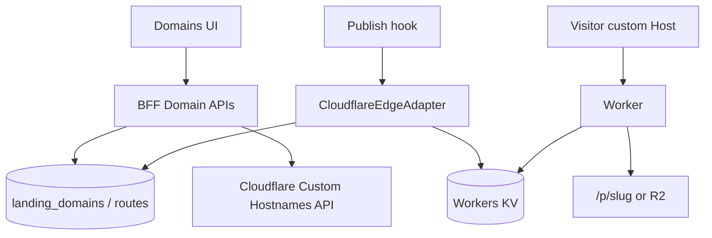

# Plan B — Customer Domain Delivery (Custom Domain)

> **Ngày:** 2026-07-11  
> **Repos:** `ladipage-fe-v2` + `liora-monorepo`  
> **Mục tiêu:** User gắn domain riêng (`www.shop.vn`) → verify DNS/SSL → publish/serve landing trên hostname khách.  
> **Không overlap:** Free subdomain `{slug}.liora.app` → [FREE-SUBDOMAIN-DELIVERY.md](./FREE-SUBDOMAIN-DELIVERY.md)  
> **Tham chiếu:** [docs/landing/structure.md](../docs/landing/structure.md) · Cloudflare for SaaS pattern · FE edge stub hiện có

---

## 0. Tóm tắt 1 đoạn

Schema + hook publish **đã phác** custom domain (`landing_domains`, `landing_domain_routes`, `domainId` trên publish body, `CloudflareEdgeAdapter` stub, Worker stub). Plan này **hoàn thiện lifecycle**: add domain → CNAME instructions → CF Custom Hostname → route map page/path → sync KV/Worker → SSL status → serve theo `Host`. **Không** thay free subdomain; `platformUrl` `/p/{slug}` luôn còn.

---

## 1. Audit code hiện tại (baseline)

### 1.1 Đã có sẵn

| Thành phần | Path | Trạng thái |
|------------|------|------------|
| Table domains | `supabase/migrations/20260630010000_landing_domains_leads.sql` | `landing_domains` (name, status, ssl_status) — **insert đang hardcode VERIFIED/ACTIVE** |
| Table routes | `.../20260709130000_landing_domain_routes.sql` | `domain_id`, `landing_page_id`, `path_prefix`, `origin_slug`, `edge_status`, `cloudflare_hostname_id` |
| API list/add domain | `app/api/landing-pages/domains/route.ts` | GET/POST; **không** CF API; status fake verified |
| Domain quota | `lib/access/domain-quota.server.ts` | Paid plan gate |
| Publish body | `api/landing-pages/[id]/publish` | `domainId?`, `path?` |
| Publish hook | `domain-edge-publish.hook.ts` | Load route → `resolvePublicUrls` → `syncRoute` nếu custom |
| resolve URLs | `domain-route.service.ts` | `customPublicUrl` khi flag + route |
| Flag | `LANDING_CUSTOM_DOMAIN_EDGE_ENABLED` | default off |
| CF adapter | `cloudflare-edge.adapter.ts` | **Stub** — pending message, chưa KV/Custom Hostname API |
| Worker stub | `cloudflare/landing-edge-worker.stub.ts` | KV key `hostname+path` → proxy `/p/{slug}` |
| Nest domain | `apps/ladipage-backend/.../domain/*` | List entity/fixture — **chưa** CF SaaS |
| Nest types | `ladipage-types/.../domain.types.ts` | `is_subdomain`, `is_ssl`, `is_verified` (legacy LadiPage) |

### 1.2 Gap phải đóng

```text
[x] Tables landing_domains + landing_domain_routes
[x] Publish optional domainId → customPublicUrl (flag on)
[x] Quota paid domain
[ ] POST domain: status=PENDING, không fake VERIFIED
[ ] Cloudflare Custom Hostname create / get / delete
[ ] User-facing CNAME target (fallback.yoursaas.com)
[ ] Poll SSL / verification → update status, ssl_status, edge_status
[ ] CRUD routes: gắn domain ↔ page + path_prefix
[ ] Real syncRoute → KV PUT + hostname id persist
[ ] Worker deploy: Host custom → KV → origin /p/slug (or R2)
[ ] Remove domain: CF delete + KV delete + cascade routes
[ ] UI: instructions DNS, status badge, connect page
```

### 1.3 Khác free subdomain (Plan A)

| | Free subdomain (A) | Customer domain (B) |
|--|--------------------|---------------------|
| Hostname | `{slug}.FREE_BASE` | User-owned domain |
| DNS user | Không | **CNAME bắt buộc** |
| CF product | Wildcard zone của bạn | **Custom Hostnames** (SaaS) |
| Cost | ~0 / site | CF SaaS + quota plan |
| Tables | Không cần `landing_domains` | **Bắt buộc** domains + routes |
| SSL | Wildcard sẵn | Per-hostname provision |

---

## 2. Mục tiêu & non-goals

### Goals

1. User thêm domain → nhận instruction CNAME → hệ thống tạo Custom Hostname.  
2. Verify + SSL active → user map domain (± path) tới landing page.  
3. Publish (hoặc auto on map) sync edge → `customPublicUrl` live.  
4. Visitor `Host: www.shop.vn` → đúng page published.  
5. Unmap / unpublish / delete domain không để orphan CF/KV.

### Non-goals

- Free wildcard `{slug}.base` implementation (Plan A).  
- Multi-tenant path hosting phức tạp kiểu cả site tree (chỉ `path_prefix` 1 page / path).  
- Email DNS / MX.  
- Apex `@` flattened (có thể phase 2: CNAME flattening / ANAME doc only).

### Definition of Done

- [ ] Flag on staging: full flow add → CNAME → verified → map page → open custom URL 200  
- [ ] `cloudflare_hostname_id` lưu DB; delete domain xóa CF resource  
- [ ] `edge_status` phản ánh KV sync thật (`synced` \| `error`)  
- [ ] Domain insert **không** default VERIFIED khi chưa check  
- [ ] Quota + RLS owner still enforced  
- [ ] Worker handles custom host keys  
- [ ] Tests: resolvePublicUrls, adapter mock CF, route unique path  

---

## 3. Kiến trúc target

```text
User (app host)
  → POST /api/landing-pages/domains  { name: "www.shop.vn" }
  → Nest or BFF CloudflareSaaS.createCustomHostname
  → DB: status=PENDING, ssl_status=PENDING, cloudflare_hostname_id=...
  → UI: CNAME www.shop.vn → fallback.liora.app

CF validates + issues SSL
  → Poll job / webhook / manual refresh
  → status=VERIFIED, ssl_status=ACTIVE

User map page
  → POST /api/landing-pages/domains/:id/routes
       { landingPageId, pathPrefix: "/" }
  → landing_domain_routes (origin_slug from page.slug)

Publish page (optional domainId)
  → applyDomainEdgePublishHook
  → CloudflareEdgeAdapter.syncRoute
       KV: "www.shop.vn/" → { originSlug, originBaseUrl, landingPageId }
  → customPublicUrl = https://www.shop.vn[/path]

Visitor
  → Host www.shop.vn
  → Worker KV lookup
  → proxy ORIGIN/p/{slug}  OR  R2 (nếu Plan A phase B đã có)
```



---

## 4. Thiết kế chi tiết

### 4.1 Env

| Env | Mô tả |
|-----|--------|
| `LANDING_CUSTOM_DOMAIN_EDGE_ENABLED=true` | Bật resolve + sync |
| `CLOUDFLARE_ACCOUNT_ID` | Account |
| `CLOUDFLARE_API_TOKEN` | Custom Hostnames + KV permissions |
| `CLOUDFLARE_ZONE_ID` | Zone chứa fallback / SaaS |
| `CLOUDFLARE_SAAS_FALLBACK_ORIGIN` | vd `fallback.liora.app` hoặc origin hostname |
| `CLOUDFLARE_LANDING_ROUTES_KV_ID` | KV namespace |
| `CLOUDFLARE_LANDING_EDGE_WORKER` | Worker name (đã có default) |
| `LANDING_ORIGIN_BASE_URL` / `NEXT_PUBLIC_APP_URL` | Proxy target |
| `CUSTOM_DOMAIN_CNAME_TARGET` | Hiện cho user: `fallback.liora.app` |

### 4.2 Sửa lifecycle domain (breaking fix so với code hiện tại)

**Hiện:** POST domain set `status: "VERIFIED"`, `ssl_status: "ACTIVE"` ngay — **sai** cho production.

**Target:**

```text
POST /domains
  name normalized (lowercase, no scheme)
  status = UNVERIFIED | PENDING
  ssl_status = INACTIVE | PENDING
  create CF Custom Hostname
  save cloudflare_hostname_id (cần cột mới nếu chưa có trên landing_domains)
```

Migration bổ sung (đề xuất):

```sql
ALTER TABLE public.landing_domains
  ADD COLUMN IF NOT EXISTS cloudflare_hostname_id TEXT,
  ADD COLUMN IF NOT EXISTS cname_target TEXT,
  ADD COLUMN IF NOT EXISTS verification_errors JSONB,
  ADD COLUMN IF NOT EXISTS last_checked_at TIMESTAMPTZ;
```

`landing_domain_routes.cloudflare_hostname_id` có thể giữ sync từ parent domain hoặc deprecate trùng — **ưu tiên hostname id trên domain row**.

### 4.3 API surface (FE BFF; Nest optional mirror)

| Method | Path | Việc |
|--------|------|------|
| GET | `/api/landing-pages/domains` | List (đã có) — enrich verification fields |
| POST | `/api/landing-pages/domains` | Create + CF hostname (sửa status) |
| GET | `/api/landing-pages/domains/:id` | Detail + DNS instructions |
| POST | `/api/landing-pages/domains/:id/refresh` | Poll CF status → update DB |
| DELETE | `/api/landing-pages/domains/:id` | CF delete + KV purge routes + DB |
| GET/POST | `/api/landing-pages/domains/:id/routes` | List / create map page+path |
| DELETE | `/api/landing-pages/domains/:id/routes/:routeId` | Unmap + KV remove |

Ownership: reuse `requireLandingPageOwner` / user_id RLS patterns.

### 4.4 CloudflareEdgeAdapter — thay stub

```text
syncRoute(route):
  ensure Custom Hostname active (or return pending)
  KV.put(`${hostname}${pathKey}`, JSON { originSlug, originBaseUrl, landingPageId })
  update edge_status = synced

removeRoute(route):
  KV.delete(key)
  edge_status = disabled or delete row

getStatus:
  CF GET custom_hostname + KV exists check
```

Port `CustomDomainDeliveryPort` **giữ nguyên** interface; chỉ thay implementation body (đúng comment file hiện tại).

### 4.5 Worker (nhánh custom — dùng chung binary Plan A)

```text
key = hostname + normalizedPath
config = KV.get(key)
if !config → 404
target = ORIGIN + /p/ + config.originSlug
return fetch(target)  // or R2 if artifact mode
```

Stub `resolveEdgeOriginPath` đã đúng hướng — implement `fetch` handler deploy.

### 4.6 Publish integration (đã gần xong)

`publishLandingPageServer` đã gọi:

```ts
applyDomainEdgePublishHook({ ..., context: { domainId, path } })
publicUrl = customPublicUrl ?? platformUrl
// sau Plan A: custom ?? subdomain ?? platform
```

Cần:

- Auto-sync **tất cả routes** của page khi publish (không chỉ khi body có `domainId`) — tránh quên truyền domainId từ UI.
- Unpublish: optional keep domain map nhưng origin 404; hoặc set edge to “unpublished” response.

**Đề xuất:** on publish page → query `landing_domain_routes` where `landing_page_id` → sync từng route. `domainId` body vẫn override path.

### 4.7 Nest module (phase song song / production harden)

| Nest | Việc |
|------|------|
| `domain.service.ts` | Thay fixture bằng CF + DB (TypeORM `lp_domain` **hoặc** call Supabase admin) |
| New `CloudflareSaasService` | Custom Hostnames REST |
| Internal cron | Refresh pending hostnames |
| Auth | Tenant JWT |

**Ship path ngắn:** hoàn thiện **BFF + Supabase + CF** trước; Nest mirror khi dual-run publish chuyển Nest (theo LANDING-PUBLISH-3-LAYER).

### 4.8 Quota & product

- Giữ `assertDomainQuota` — custom domain = paid.  
- Free subdomain (Plan A) **không** đếm domain quota.  
- Limit concurrent PENDING hostnames (abuse).

---

## 5. Work breakdown (PR-sized)

### PR-B1 — Schema + status model fix

- [ ] Migration columns CF on `landing_domains`  
- [ ] POST domain: PENDING defaults  
- [ ] GET returns `cnameTarget`, `sslStatus`, `verificationErrors`  
- [ ] Stop treating all domains as VERIFIED in UI formatters  

### PR-B2 — Cloudflare SaaS client

- [ ] `cloudflare-saas.client.ts` (create/get/delete custom hostname)  
- [ ] Wire token/account/zone env  
- [ ] Unit tests with mocked fetch  

### PR-B3 — Domain refresh + delete APIs

- [ ] `POST .../refresh`  
- [ ] `DELETE .../domains/:id`  
- [ ] Map CF statuses → DB enums  

### PR-B4 — Routes CRUD

- [ ] POST/GET/DELETE routes  
- [ ] Validate page ownership + unique (domain_id, path_prefix)  
- [ ] Set `origin_slug` from `landing_pages.slug`  

### PR-B5 — Real edge adapter + KV

- [ ] Replace stub body in `cloudflare-edge.adapter.ts`  
- [ ] Publish auto-sync all page routes  
- [ ] Unpublish / unmap KV cleanup  

### PR-B6 — Worker deploy custom host

- [ ] Production worker from stub  
- [ ] Routes: custom hostnames → worker  
- [ ] E2E staging with real CNAME  

### PR-B7 — UI Domains

- [ ] DNS instruction panel  
- [ ] Status badges (pending / active / error)  
- [ ] Connect landing page + path  
- [ ] Publish success shows `customPublicUrl`  

### PR-B8 — Nest harden (optional)

- [ ] CloudflareSaasService + domain controller  
- [ ] Cron refresh pending  

---

## 6. File map dự kiến

```text
ladipage-fe-v2/
  supabase/migrations/YYYYMMDD_landing_domains_cf.sql
  src/app/api/landing-pages/domains/
    route.ts                         # fix create status
    [id]/route.ts                    # NEW get/delete
    [id]/refresh/route.ts            # NEW
    [id]/routes/route.ts             # NEW
  src/features/landing-domain-edge/
    services/cloudflare-saas.client.ts      # NEW
    services/cloudflare-edge.adapter.ts     # implement
    services/domain-edge-publish.hook.ts    # sync all routes
    services/domain-route.service.ts        # keep + extend
    config/domain-edge.flags.ts
  cloudflare/landing-edge-worker.ts         # deployable
  src/lib/access/domain-quota.server.ts     # keep

liora-monorepo/apps/ladipage-backend/src/modules/domain/
  cloudflare-saas.service.ts         # optional
  domain.service.ts                  # real ops
```

---

## 7. Sequence

### Add + verify domain

```text
User → POST domains { name: www.shop.vn }
  → quota check
  → CF Custom Hostname create
  → DB PENDING + cname_target
  → UI: "CNAME www.shop.vn → fallback.liora.app"

User configures DNS at registrar
  → POST domains/:id/refresh
  → CF active → VERIFIED + ssl ACTIVE
```

### Map + publish + visit

```text
User → POST routes { pageId, path: "/" }
  → landing_domain_routes edge_status=pending

User → Publish page
  → published_html saved
  → syncRoute → KV synced
  → customPublicUrl = https://www.shop.vn

Visitor → https://www.shop.vn
  → Worker KV → /p/{slug} → HTML
```

---

## 8. Runbook / env mẫu

```env
LANDING_CUSTOM_DOMAIN_EDGE_ENABLED=true
CLOUDFLARE_ACCOUNT_ID=...
CLOUDFLARE_API_TOKEN=...
CLOUDFLARE_ZONE_ID=...
CLOUDFLARE_SAAS_FALLBACK_ORIGIN=fallback.liora.app
CUSTOM_DOMAIN_CNAME_TARGET=fallback.liora.app
CLOUDFLARE_LANDING_ROUTES_KV_ID=...
CLOUDFLARE_LANDING_EDGE_WORKER=liora-landing-edge
NEXT_PUBLIC_APP_URL=https://app.liora.app
LANDING_ORIGIN_URL=https://app.liora.app
```

Local:

```env
LANDING_CUSTOM_DOMAIN_EDGE_ENABLED=false
# publish → platformUrl only
```

---

## 9. Rủi ro & mitigation

| Rủi ro | Mitigation |
|--------|------------|
| User không trỏ DNS | UI clear + refresh; timeout PENDING |
| Apex domain khó CNAME | Doc: dùng `www` hoặc CF flattening |
| Hostname orphan (xóa DB quên CF) | Delete API always CF first / best-effort job |
| Path collision | UNIQUE (domain_id, path_prefix) đã có |
| Fake VERIFIED hiện tại | B1 fix trước khi bật flag prod |
| SSL delay | Poll + webhook CF nếu có |
| Open proxy Worker | Chỉ serve khi KV hit; không arbitrary host |

---

## 10. Phụ thuộc Plan A

```text
Khuyến nghị:
  1) Plan A Phase A (Worker binary + ORIGIN proxy) — nền edge
  2) Plan B — custom host + KV keys khác wildcard
  3) Plan A Phase B R2 — cả subdomain lẫn custom dùng chung artifact

Có thể ship B với worker proxy-only nếu A chưa R2.
Không gộp PR free subdomain + custom hostname cùng PR lớn.
```

Shared:

- `resolvePublicUrls` priority: `custom > subdomain > platform`  
- Worker entrypoint  
- `LANDING_ORIGIN_BASE_URL`  

---

## 11. Checklist test

- [ ] Create domain → PENDING + cname shown  
- [ ] Refresh before DNS → still pending  
- [ ] Refresh after DNS → VERIFIED/ACTIVE (staging)  
- [ ] Route map + publish → KV key exists  
- [ ] Custom URL 200 content = `/p/slug`  
- [ ] Wrong path → 404  
- [ ] Delete domain → CF gone, KV gone, public 404  
- [ ] Quota block free user  
- [ ] Flag off → customPublicUrl null even with domainId  

---

## 12. Ước lượng

| PR | Effort (rough) |
|----|----------------|
| B1 schema/status | 0.5–1d |
| B2 CF client | 1d |
| B3 refresh/delete | 0.5–1d |
| B4 routes CRUD | 1d |
| B5 adapter+publish | 1d |
| B6 worker deploy | 1–2d + CF SaaS setup |
| B7 UI | 1–2d |
| B8 Nest optional | 1–2d |

**MVP recommend:** B1–B6 + minimal B7 (instructions + status). Full polish UI sau.
