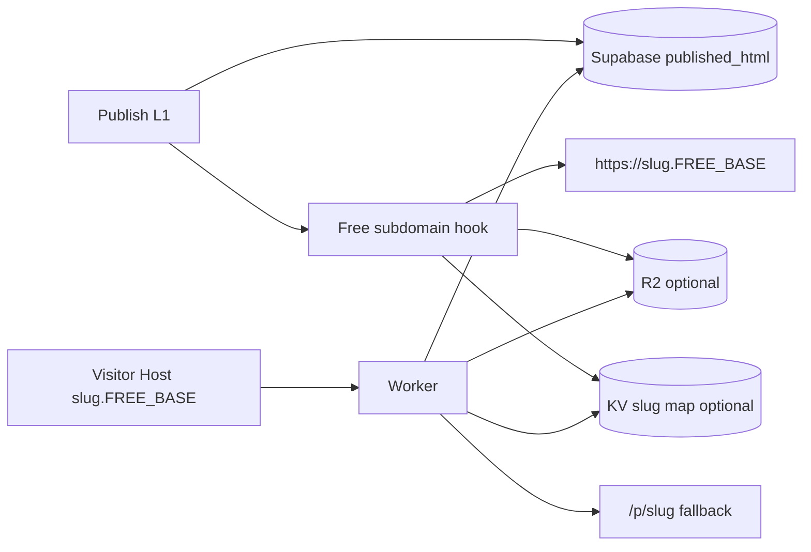

# Plan A — Free Subdomain Delivery (`{slug}.{FREE_BASE}`)

> **Ngày:** 2026-07-11  
> **Repos:** `ladipage-fe-v2` + `liora-monorepo`  
> **Mục tiêu:** Mỗi landing published có URL free dạng `https://{slug}.liora.app` (wildcard), serve HTML public qua edge; không bắt user trỏ DNS.  
> **Không overlap:** Custom domain khách → [CUSTOMER-DOMAIN-DELIVERY.md](./CUSTOMER-DOMAIN-DELIVERY.md)  
> **Tham chiếu kiến trúc:** [docs/landing/structure.md](../docs/landing/structure.md) · publish 3 lớp [ladipage-fe-v2/plans/LANDING-PUBLISH-3-LAYER.md](../../ladipage-fe-v2/plans/LANDING-PUBLISH-3-LAYER.md)

---

## 0. Tóm tắt 1 đoạn

Publish hiện tại đã tạo `published_html` + `status=published` và public path **`/p/{slug}`**. Plan này **giữ L1 render + store**, bổ sung **ghép URL subdomain free**, **(optional) đẩy HTML lên R2**, và **Worker wildcard** đọc `Host` → slug → HTML. Custom hostname / CNAME user **out of scope**.

---

## 1. Audit code hiện tại (baseline)

### 1.1 Publish (đã có — tái sử dụng)

| Thành phần | Path | Vai trò |
|------------|------|---------|
| BFF publish | `ladipage-fe-v2/src/app/api/landing-pages/[id]/publish/route.ts` | `POST/DELETE` → server publish |
| Core publish | `.../landing-publish/services/landing-publish.service.ts` | Render → `published_html` → version → revalidate → domain hook |
| Renderers | `.../landing-publish/renderers/*` | visual-editor / puck / instatic |
| Platform URL | `.../landing-domain-edge/services/domain-route.service.ts` | `platformUrl = ${origin}/p/${slug}` |
| Public path | `ladipage-fe-v2/src/app/p/[slug]/page.tsx` | SSR `published_html` từ Supabase |
| Revalidate | `.../publish-revalidate.server.ts` + `app/api/revalidate/landing` | Invalidate cache `/p/{slug}` |
| Nest publish | `apps/ladipage-backend/.../publish/*` | **Demo stub** — chưa ownership L1 |

### 1.2 Domain edge (chưa có free subdomain)

| Thành phần | Path | Ghi chú |
|------------|------|---------|
| Flags | `landing-domain-edge/config/domain-edge.flags.ts` | Chỉ `LANDING_CUSTOM_DOMAIN_EDGE_ENABLED` + origin base |
| Types | `domain-edge.types.ts` | `deliveryMode`: `"platform" \| "custom-domain"` — **thiếu** `"subdomain"` |
| Port comment | `ports/custom-domain-delivery.port.ts` | *"Subdomain routing will use a separate adapter"* — **chưa implement** |
| Hook publish | `domain-edge-publish.hook.ts` | Chỉ custom khi có `domainId` |
| Worker stub | `ladipage-fe-v2/cloudflare/landing-edge-worker.stub.ts` | Custom host → proxy `/p/{slug}`; **chưa** branch `*.FREE_BASE` |

### 1.3 Data model

| Store | Bảng / field | Free subdomain |
|-------|--------------|----------------|
| Supabase | `landing_pages.slug`, `published_html`, `status`, `visibility` | **Đủ** làm source of truth slug + HTML |
| Supabase | `landing_domains` / `landing_domain_routes` | **Không** dùng cho free subdomain |
| Nest | `lp_page.subdomain`, `lp_domain.is_subdomain` | Legacy reverse types — optional sync sau |
| R2 | — | **Chưa có** trong runtime publish |

### 1.4 Gap phải đóng

```text
[x] published_html + /p/{slug}
[ ] FREE_SITE_DOMAIN env + build https://{slug}.{base}
[ ] deliveryMode / publicUrl ưu tiên subdomain free khi flag bật
[ ] slug normalize + reserved names + global uniqueness enforcement
[ ] Publish hook: upload HTML → R2 (optional phase) + KV map slug→page
[ ] Worker: Host endsWith FREE_BASE → serve R2 or proxy origin /p/{slug}
[ ] Unpublish: xóa/invalidate R2 + KV
[ ] UI copy link free subdomain
```

---

## 2. Mục tiêu & non-goals

### Goals

1. Sau publish (flag on): response có  
   `subdomainUrl = https://{slug}.{FREE_SITE_DOMAIN}`  
   và `publicUrl` ưu tiên subdomain (fallback `/p/{slug}`).
2. Visitor mở subdomain thấy **cùng nội dung** `/p/{slug}` (proxy hoặc R2).
3. Zero DNS action từ end-user.
4. Local dev: flag off → vẫn chỉ `/p/{slug}` (như hôm nay).

### Non-goals

- Custom domain / Cloudflare for SaaS Custom Hostname → Plan B.
- Nest full ownership publish (có thể song song; plan này **không block** BFF L1).
- Instatic editor sync `editor_data` (publish artifact path đã có).

### Definition of Done

- [x] Config + URL builder + types + publish hook (code MVP, 2026-07-12)  
- [x] Publish trả `subdomainUrl` + `deliveryMode` gồm `subdomain`  
- [x] Unit tests FE + Nest util  
- [x] Worker stub: Host→slug→`/p/{slug}` helpers (deploy DNS/Worker = ops)  
- [ ] `LANDING_FREE_SUBDOMAIN_ENABLED=true` + domain thật + Worker deploy staging  
- [ ] Unpublish → subdomain 404 (E2E với edge live)  
- [x] Reserved slugs blocked in URL builder  
- [x] Doc env `.env.example`  
- [x] Unit tests: URL builder, reserved slug, resolve Host→slug  

---

## 3. Kiến trúc target

```text
Publish (BFF — giữ nguyên L1/L2)
  → published_html + status=published
  → triggerLandingRevalidate(slug)          // giữ
  → applyFreeSubdomainPublishHook(slug)     // MỚI
       ├─ build subdomainUrl
       ├─ [Phase A] no R2: chỉ URL + optional KV "slug→origin"
       └─ [Phase B] R2.put(sites/{slug}/index.html) + KV
  → response publicUrl / platformUrl / subdomainUrl

Traffic:
  app host /p/{slug}     → Next (như cũ)
  {slug}.FREE_BASE       → Worker
       Host → slug
       Phase A: fetch(`${ORIGIN}/p/${slug}`)  (proxy)
       Phase B: R2.get(`sites/${slug}/index.html`)
```



**Khuyến nghị ship 2 phase edge:**

| Phase | Serve subdomain | Ưu | Nhược |
|-------|-----------------|-----|--------|
| **A — Proxy** | Worker `fetch(ORIGIN/p/slug)` | Ship nhanh, 0 R2 | Origin chịu traffic |
| **B — R2** | Worker `R2.get` sau upload lúc publish | Scale + rẻ | Thêm adapter + unpublish cleanup |

Plan cho phép **A trước, B sau** cùng flag.

---

## 4. Thiết kế chi tiết

### 4.1 Config / env

| Env | Ví dụ | Mô tả |
|-----|--------|--------|
| `LANDING_FREE_SUBDOMAIN_ENABLED` | `true` | Bật ghép URL + hook |
| `FREE_SITE_DOMAIN` | `liora.app` | Base sau dấu chấm (không có `*.`) |
| `FREE_SUBDOMAIN_DELIVERY` | `proxy` \| `r2` | Phase A/B |
| `LANDING_R2_*` | account, bucket, token | Chỉ Phase B |
| `NEXT_PUBLIC_FREE_SITE_DOMAIN` | `liora.app` | FE hiển thị link |

Infra (1 lần, ngoài code):

```text
Cloudflare zone FREE_SITE_DOMAIN
DNS: *.liora.app → Worker route
SSL: wildcard / Universal SSL
```

### 4.2 URL builder (pure function)

```ts
// đề xuất: ladipage-fe-v2/src/features/landing-domain-edge/services/free-subdomain.service.ts
function buildFreeSubdomainUrl(slug: string, base = process.env.FREE_SITE_DOMAIN): string | null
// → https://{normalizedSlug}.{base}
function hostToSlug(host: string, base: string): string | null
// cafe-ha-noi.liora.app + base liora.app → cafe-ha-noi
```

Normalize slug: lowercase, `[a-z0-9-]+`, strip leading/trailing `-`, max length (vd 63 label DNS).

Reserved: `www`, `app`, `api`, `admin`, `static`, `cdn`, `mail`, `ftp`, `localhost`, `staging`, …

### 4.3 Mở rộng types delivery

```ts
// domain-edge.types.ts
export type LandingDeliveryMode = "platform" | "subdomain" | "custom-domain";

export interface ResolvedPublicUrls {
  deliveryMode: LandingDeliveryMode;
  platformUrl: string;       // luôn /p/slug
  subdomainUrl: string | null;
  customPublicUrl: string | null;
  edgeSyncStatus: EdgeSyncStatus;
}
```

Priority `publicUrl`:

```text
customPublicUrl  (Plan B, nếu có)
  ?? subdomainUrl (Plan A, flag on)
  ?? platformUrl
```

Custom domain plan **không** sửa priority này mâu thuẫn — cùng helper `resolvePublicUrls` mở rộng.

### 4.4 Publish hook

Trong `publishLandingPageServer` sau `triggerLandingRevalidate`:

```text
applyFreeSubdomainPublishHook({ slug, pageId, html })
  if !LANDING_FREE_SUBDOMAIN_ENABLED → subdomainUrl=null
  else:
    validate slug not reserved
    subdomainUrl = buildFreeSubdomainUrl(slug)
    if delivery === r2: upload + KV put
    if delivery === proxy: optional KV put { originSlug, originBaseUrl }
```

Unpublish:

```text
status=draft (đã có)
+ free subdomain: R2 delete / KV delete
+ revalidate (đã có)
```

### 4.5 Worker (mở rộng stub)

File: `ladipage-fe-v2/cloudflare/landing-edge-worker.stub.ts` → promote thành worker package hoặc `tools/landing-edge-worker/`.

```text
fetch(request):
  host = url.hostname
  if host === FREE_BASE or host endsWith "."+FREE_BASE:
    slug = label0
    if reserved or empty → 404
    if R2 mode → get object or 404
    if proxy mode → fetch ORIGIN/p/{slug} (follow, rewrite Location carefully)
  else:
    // custom domain path → Plan B
    return not handled / pass to custom resolver
```

### 4.6 Schema (tối thiểu)

**Phase A:** không migration mới (slug + published_html đủ).

**Phase B (optional columns trên `landing_pages`):**

```sql
-- optional migration
ALTER TABLE landing_pages
  ADD COLUMN IF NOT EXISTS r2_object_key TEXT,
  ADD COLUMN IF NOT EXISTS free_subdomain_sync_status TEXT DEFAULT 'disabled';
```

### 4.7 Nest (optional, không block)

- `DomainEntity.is_subdomain` / `PageEntity.subdomain` có thể sync mirror sau.
- Ưu tiên **không** chặn ship FE BFF + Worker.
- Sau này: Nest endpoint `GET /public/pages/by-slug/:slug` cho Worker thay vì hit Supabase/Next.

---

## 5. Work breakdown (PR-sized)

### PR-A1 — Config + URL builder + types (FE)

- [ ] `domain-edge.flags.ts`: free subdomain flags  
- [ ] `free-subdomain.service.ts` + unit tests  
- [ ] Extend `ResolvedPublicUrls` / `PublishResult` (`subdomainUrl`)  
- [ ] `resolvePublicUrls` / publish response wiring **không** bật edge thật  

### PR-A2 — Publish / unpublish hook

- [ ] `applyFreeSubdomainPublishHook`  
- [ ] Gọi từ `landing-publish.service.ts`  
- [ ] Unpublish cleanup no-op (proxy) / R2+KV (nếu A3 xong)  
- [ ] Tests mock env  

### PR-A3 — Worker proxy mode (Phase A)

- [ ] Implement worker route `*.FREE_SITE_DOMAIN`  
- [ ] Proxy to `LANDING_ORIGIN_BASE_URL/p/{slug}`  
- [ ] wrangler.toml + deploy notes  
- [ ] Staging E2E: publish → open subdomain → 200  

### PR-A4 — R2 upload (Phase B, optional)

- [ ] `r2-publish.adapter.ts`  
- [ ] Upload on publish, delete on unpublish  
- [ ] Worker prefer R2, fallback origin  
- [ ] Metrics / log miss  

### PR-A5 — UI + slug rules

- [ ] Landing list / publish toast: show subdomain link  
- [ ] Create/update page: reserved slug validation (API + FE)  
- [ ] Enforce unique slug globally (DB unique index nếu chưa)  

---

## 6. File map dự kiến

```text
ladipage-fe-v2/
  src/features/landing-domain-edge/
    config/domain-edge.flags.ts          # + free flags
    services/free-subdomain.service.ts   # NEW
    services/free-subdomain-publish.hook.ts  # NEW
    services/r2-artifact.adapter.ts      # NEW (B)
    services/domain-route.service.ts     # resolvePublicUrls extend
    types/domain-edge.types.ts           # deliveryMode + subdomainUrl
  src/features/landing-publish/
    services/landing-publish.service.ts  # call free hook
    types/publish.types.ts               # subdomainUrl
  cloudflare/  or tools/landing-edge-worker/
    worker.ts                            # from stub
    wrangler.toml

liora-monorepo/  (optional later)
  apps/ladipage-backend/.../publish/     # public by-slug if needed
```

---

## 7. Sequence — publish + visit

### Publish

```text
Editor → POST /api/landing-pages/:id/publish
  → render HTML
  → UPDATE landing_pages (published_html, status)
  → revalidate /p/slug
  → free subdomain hook → subdomainUrl
  → { publicUrl, platformUrl, subdomainUrl, deliveryMode }
```

### Visit

```text
GET https://cafe-ha-noi.liora.app/
  Host: cafe-ha-noi.liora.app
  Worker → slug=cafe-ha-noi
  → R2 or proxy /p/cafe-ha-noi
  → HTML 200
```

---

## 8. Runbook / env mẫu

```env
# FE / BFF
LANDING_FREE_SUBDOMAIN_ENABLED=true
FREE_SITE_DOMAIN=liora.app
NEXT_PUBLIC_FREE_SITE_DOMAIN=liora.app
FREE_SUBDOMAIN_DELIVERY=proxy
NEXT_PUBLIC_APP_URL=https://app.liora.app
LANDING_ORIGIN_URL=https://app.liora.app

# Phase B
# FREE_SUBDOMAIN_DELIVERY=r2
# CLOUDFLARE_ACCOUNT_ID=...
# LANDING_R2_BUCKET=liora-landing-sites
# CLOUDFLARE_API_TOKEN=...
```

Local:

```env
LANDING_FREE_SUBDOMAIN_ENABLED=false
# publicUrl = http://localhost:3000/p/{slug}
```

---

## 9. Rủi ro & mitigation

| Rủi ro | Mitigation |
|--------|------------|
| Slug collision / takeover | Unique index + reserved list |
| Cookie leak app ↔ subdomain | Tách host `app.` vs `*.FREE_BASE`; không share session cookie domain parent bừa |
| SEO duplicate `/p` vs subdomain | Canonical tag → subdomain khi free enabled |
| Worker cold + origin down | Phase B R2; health check |
| SSL wildcard delay | Universal SSL / advanced cert trước ship |

---

## 10. Phụ thuộc & thứ tự với Plan B

```text
Plan A (free subdomain) ── có thể ship độc lập, khuyến nghị TRƯỚC
Plan B (customer domain) ── tái sử dụng cùng Worker + KV pattern
```

Worker nên **một binary** hai nhánh Host; Plan A implement nhánh wildcard trước.

---

## 11. Checklist test

- [ ] Flag off: response không có subdomainUrl; `/p/slug` OK  
- [ ] Flag on: `subdomainUrl` đúng format  
- [ ] Reserved slug publish/create → 400  
- [ ] Staging Worker: unknown slug → 404  
- [ ] Known published slug → HTML khớp `/p/slug`  
- [ ] Unpublish → subdomain 404  
- [ ] Re-publish cập nhật nội dung (proxy: revalidate; R2: overwrite)  

---

## 12. Ước lượng

| PR | Effort (rough) |
|----|----------------|
| A1 types/URL | 0.5–1d |
| A2 publish hook | 0.5–1d |
| A3 Worker proxy + DNS | 1–2d + infra |
| A4 R2 | 1–2d |
| A5 UI/slug | 0.5–1d |

**MVP recommend:** A1 + A2 + A3 (proxy) — không chặn R2.
