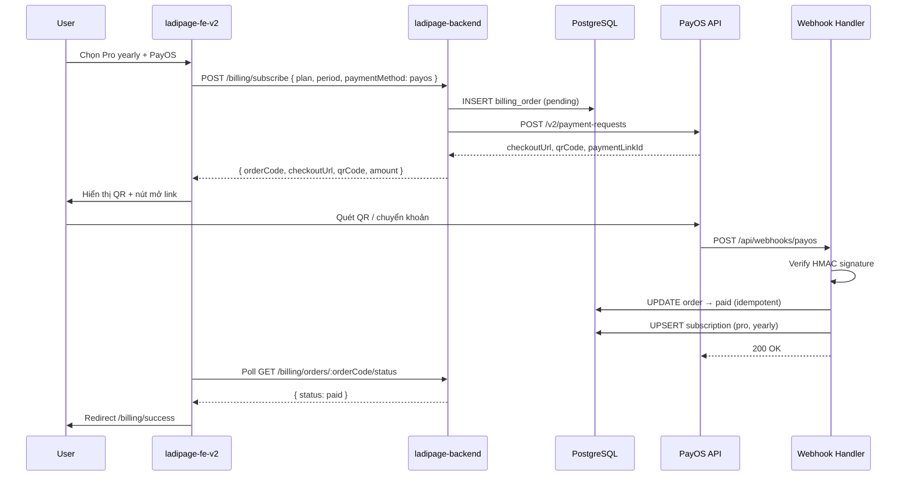

# Kế hoạch triển khai — PayOS (phương thức thanh toán thứ 2)

> **Ngày:** 2026-07-03  
> **Phạm vi:** Tích hợp PayOS song song Stripe cho billing subscription LadiPage/Liora  
> **Tham chiếu:** `docs/landing/structure.md` (Bước 1), PayOS API `https://api-merchant.payos.vn`  
> **BE:** `ladipage-backend` + `libs/nest-core/modules/billing`  
> **FE:** `ladipage-fe-v2`

---

## 0. Mục tiêu

| Mục tiêu | Mô tả |
|----------|--------|
| **PayOS là PTTT #2** | Giữ Stripe (thẻ quốc tế, subscription tự động); thêm PayOS (VND, link/QR, phù hợp thị trường VN) |
| **Luồng chuẩn** | User chọn gói → Nest tạo Order → PayOS link/QR → Webhook xác nhận → Kích hoạt org |
| **Không phá Stripe** | Cùng `SubscriptionService`, cùng `PlanConfigService`, khác `paymentProvider` |
| **Idempotent webhook** | Tránh double-activate khi PayOS retry webhook |

---

## 1. Hiện trạng (audit)

### Đã có

| Thành phần | Path | Ghi chú |
|------------|------|---------|
| Stripe checkout | `nest-core/billing/stripe/` | `POST /billing/subscribe`, webhook `/api/webhooks/stripe` |
| Webhook pattern | `@StripeWebhookHandler` + `StripeWebhookExplorerService` | Decorator + explorer — **mẫu để copy cho PayOS** |
| Subscription entity | `sys_subscription` | `subscriptionTier`, `period`, `identifier` |
| Organization | `sys_organization` | `paymentId` (Stripe customer) |
| FE billing API | `ladipage-fe-v2/src/lib/endpoints/billing.api.ts` | `subscribe`, `usage`, `portal`, `check/:sessionId` |
| PaymentModule | `ladipage-backend/.../payment/payment.module.ts` | Re-export `BillingModule` |
| App access rules | `application-access.config.ts` | `priceVnd` — chưa gate billing |

### Chưa có

- PayOS client / module
- Bảng `billing_order` (order pending → paid)
- Webhook PayOS handler
- FE chọn phương thức thanh toán (Stripe vs PayOS)
- Đồng bộ Logto roles sau thanh toán (structure.md — phase sau nếu chưa có adapter)

### Phân biệt Stripe vs PayOS

| | Stripe (#1) | PayOS (#2) |
|---|-------------|------------|
| Tiền tệ | USD/EUR (config) | **VND** (bắt buộc integer) |
| Recurring | Native subscription | **Link thanh toán đơn** — gia hạn = tạo order mới mỗi kỳ |
| UX | Redirect Stripe Checkout | `checkoutUrl` + `qrCode` (hiển thị modal QR) |
| Webhook | `stripe-signature` HMAC | `signature` HMAC_SHA256 (checksum key) |
| Customer ID | `paymentId` trên org | `orderCode` nội bộ map org + plan |

---

## 2. Kiến trúc mục tiêu

```
┌─────────────────────────────────────────────────────────────────┐
│  ladipage-fe-v2                                                 │
│  /billing — chọn plan + paymentMethod: stripe | payos             │
│  PayOS: modal QR + link  |  Stripe: redirect checkout           │
│  /billing/success?orderCode=...  |  /billing/success?session=..│
└────────────────────────────┬────────────────────────────────────┘
                             │ JWT
                             ▼
┌─────────────────────────────────────────────────────────────────┐
│  ladipage-backend — BillingController (mở rộng)                 │
│  POST /billing/subscribe  → routing theo paymentMethod          │
│  GET  /billing/orders/:orderCode/status                         │
└────────────┬───────────────────────────────┬────────────────────┘
             │                               │
             ▼                               ▼
┌────────────────────────┐    ┌──────────────────────────────────┐
│  StripeService         │    │  PayOsService                    │
│  (giữ nguyên)          │    │  createPaymentLink, verifySig     │
└────────────────────────┘    └──────────────┬───────────────────┘
                                             │
                             POST /v2/payment-requests
                                             ▼
                                    ┌─────────────────┐
                                    │  api-merchant   │
                                    │  .payos.vn      │
                                    └────────┬────────┘
                                             │ webhook
                                             ▼
┌─────────────────────────────────────────────────────────────────┐
│  POST /api/webhooks/payos  (@Public)                            │
│  PayOsWebhookController → verify signature → PayOsWebhookHandlers │
│    → BillingOrderService.markPaid()                             │
│    → SubscriptionService.activateFromOrder()                    │
│    → ApplicationAccessService (optional: auto-install apps)      │
└─────────────────────────────────────────────────────────────────┘
```

---

## 3. Luồng chi tiết — PayOS



---

## 4. Data model

### 4.1. Bảng mới: `billing_order`

```sql
CREATE TABLE billing_order (
  id              UUID PRIMARY KEY DEFAULT gen_random_uuid(),
  tenant_id       INT NOT NULL,
  organization_id UUID NOT NULL REFERENCES sys_organization(id),
  order_code      BIGINT NOT NULL UNIQUE,  -- PayOS orderCode (integer, unique globally)
  payment_provider VARCHAR(20) NOT NULL DEFAULT 'payos',  -- 'payos' | 'stripe'
  plan_tier       VARCHAR(20) NOT NULL,    -- free | pro | enterprise
  period          VARCHAR(20) NOT NULL,    -- monthly | yearly | lifetime
  amount_vnd      INT NOT NULL,
  currency        VARCHAR(3) NOT NULL DEFAULT 'VND',
  status          VARCHAR(20) NOT NULL DEFAULT 'pending',
  -- pending | paid | cancelled | expired | failed
  payos_payment_link_id VARCHAR(64),
  payos_checkout_url    TEXT,
  payos_qr_code         TEXT,
  description     TEXT,
  metadata        JSONB DEFAULT '{}',
  paid_at         TIMESTAMPTZ,
  expires_at      TIMESTAMPTZ,
  webhook_event_id VARCHAR(128),  -- idempotency: PayOS reference / composite key
  created_at      TIMESTAMPTZ NOT NULL DEFAULT now(),
  updated_at      TIMESTAMPTZ NOT NULL DEFAULT now()
);

CREATE INDEX idx_billing_order_org ON billing_order(organization_id);
CREATE INDEX idx_billing_order_status ON billing_order(status);
CREATE UNIQUE INDEX idx_billing_order_webhook ON billing_order(webhook_event_id)
  WHERE webhook_event_id IS NOT NULL;
```

### 4.2. `orderCode` generation

PayOS yêu cầu `orderCode` là **integer unique**. Chiến lược:

```typescript
// Timestamp ms (13 digit) + random 3 digit → tránh collision
// Hoặc: DB sequence billing_order_code_seq bắt đầu từ 1_000_000_000
orderCode = await orderCodeSequence.next()
```

Lưu mapping `orderCode → organizationId + plan + period` trong `billing_order`.

### 4.3. Mở rộng `sys_subscription` (optional)

```sql
ALTER TABLE sys_subscription
  ADD COLUMN payment_provider VARCHAR(20) DEFAULT 'stripe',
  ADD COLUMN last_order_id UUID REFERENCES billing_order(id);
```

---

## 5. Module NestJS — cấu trúc file

Mirror pattern Stripe trong `nest-core`:

```
libs/nest-core/src/modules/billing/
├── payos/                              # MỚI
│   ├── payos.module.ts
│   ├── payos.service.ts                # createPaymentLink, cancelLink, getLinkInfo
│   ├── payos-signature.util.ts         # HMAC_SHA256 create + verify
│   ├── payos.constants.ts              # PAYOS_CONFIG_TOKEN
│   ├── interfaces/payos-config.interface.ts
│   ├── dto/
│   │   ├── create-payment-link.dto.ts
│   │   └── payos-webhook-payload.dto.ts
│   ├── controllers/
│   │   └── payos-webhook.controller.ts # @Controller('webhooks/payos') @Public()
│   ├── decorators/
│   │   └── payos-webhook-handler.decorator.ts
│   └── services/
│       ├── payos-webhook-explorer.service.ts
│       └── payos-webhook.handlers.ts
├── entities/
│   └── billing-order.entity.ts         # MỚI
├── services/
│   ├── billing-order.service.ts        # MỚI
│   └── billing.service.ts                # Mở rộng subscribe() routing
```

**ladipage-backend** chỉ cần:

```typescript
// payment.module.ts
@Module({
  imports: [BillingModule], // đã export PayOsModule sau khi merge nest-core
})
export class PaymentModule {}
```

Handler LadiPage-specific (nếu cần auto-install app sau thanh toán):

```
apps/ladipage-backend/src/modules/payment/
├── payos-ladipage.handlers.ts   # @PayOsWebhookHandler('payment.success')
```

---

## 6. API contract

### 6.1. Mở rộng `POST /billing/subscribe`

**Request (thêm field):**

```typescript
{
  tier: 'pro' | 'enterprise',
  period: 'monthly' | 'yearly',
  paymentMethod: 'stripe' | 'payos',  // default 'stripe' — backward compatible
}
```

**Response khi `paymentMethod: 'payos'`:**

```typescript
{
  provider: 'payos',
  orderCode: number,
  amount: number,           // VND
  currency: 'VND',
  checkoutUrl: string,
  qrCode: string,           // VietQR string — FE render QR
  paymentLinkId: string,
  expiresAt: string,
  returnUrl: string,
  cancelUrl: string,
}
```

**Response khi `paymentMethod: 'stripe'`:** giữ nguyên `{ url }` hoặc `{ clientSecret }`.

### 6.2. `GET /billing/orders/:orderCode/status`

```typescript
{
  orderCode: number,
  status: 'pending' | 'paid' | 'cancelled' | 'expired',
  planTier: PlanTier,
  period: SubscriptionPeriod,
  paidAt?: string,
}
```

FE poll mỗi 3–5s sau khi hiển thị QR (tối đa 15 phút).

### 6.3. `POST /api/webhooks/payos` (@Public)

- Body: PayOS webhook payload (`code`, `desc`, `success`, `data`, `signature`)
- Verify signature trước khi xử lý
- Trả `200` + `{ success: true }` — PayOS retry nếu không 2xx

### 6.4. api-types (`@liora/api-types`)

```typescript
// packages/@liora/api-types/src/billing.ts
export type PaymentProvider = 'stripe' | 'payos'

export interface PayOsCheckoutDto {
  provider: 'payos'
  orderCode: number
  amount: number
  currency: 'VND'
  checkoutUrl: string
  qrCode: string
  paymentLinkId: string
  expiresAt: string
}

export interface BillingOrderStatusDto {
  orderCode: number
  status: 'pending' | 'paid' | 'cancelled' | 'expired'
  planTier: PlanTier
  period: SubscriptionPeriod
  paidAt?: string
}
```

---

## 7. PayOS integration — chi tiết kỹ thuật

### 7.1. Tạo payment link

```http
POST https://api-merchant.payos.vn/v2/payment-requests
Headers:
  x-client-id: {PAYOS_CLIENT_ID}
  x-api-key: {PAYOS_API_KEY}
Body:
{
  orderCode: 1234567890123,
  amount: 990000,
  description: "LadiPage Pro yearly",
  cancelUrl: "{FRONTEND_URL}/billing?cancelled=1",
  returnUrl: "{FRONTEND_URL}/billing/success?orderCode=1234567890123",
  expiredAt: 1700000000,
  signature: HMAC_SHA256(checksumKey, sortedFields)
}
```

Signature create (sorted alphabet):

```
amount=$amount&cancelUrl=$cancelUrl&description=$description&orderCode=$orderCode&returnUrl=$returnUrl
```

### 7.2. Webhook verify

Theo [PayOS webhook signature docs](https://payos.vn/docs/tich-hop-webhook/kiem-tra-du-lieu-voi-signature/):

- Dùng `PAYOS_CHECKSUM_KEY` (từ kênh thanh toán my.payos.vn)
- Verify `signature` trên payload `data` trước khi activate subscription

### 7.3. Đăng ký webhook URL

Sau deploy staging/production:

```http
POST https://api-merchant.payos.vn/confirm-webhook
{ "webhookUrl": "https://api.liora.app/api/webhooks/payos" }
```

Hoặc cấu hình trên dashboard my.payos.vn.

### 7.4. Env variables

```env
# PayOS
PAYOS_CLIENT_ID=
PAYOS_API_KEY=
PAYOS_CHECKSUM_KEY=
PAYOS_API_URL=https://api-merchant.payos.vn
PAYOS_WEBHOOK_PATH=/api/webhooks/payos

# Giá VND (hoặc đọc từ plan.config)
PLAN_PRO_MONTHLY_VND=299000
PLAN_PRO_YEARLY_VND=2990000
PLAN_ENTERPRISE_YEARLY_VND=9990000
```

---

## 8. Kích hoạt feature sau thanh toán

Webhook handler `payment.success` (khi `data.code === '00'` && `success === true`):

```typescript
async handlePaymentSuccess(payload: PayOsWebhookPayload) {
  const { orderCode, amount } = payload.data

  // 1. Idempotent mark paid
  const order = await billingOrderService.markPaid(orderCode, payload.signature)
  if (order.alreadyProcessed) return

  // 2. Activate subscription (reuse SubscriptionService)
  await subscriptionService.updateSubscription(order.organizationId, {
    subscriptionTier: order.planTier,
    period: order.period,
    identifier: `payos:${order.orderCode}`,
    paymentProvider: 'payos',
  })

  // 3. Optional: gia hạn expires_at (yearly = +365d, monthly = +30d)
  await subscriptionService.setExpiresAt(order.organizationId, computeExpiry(order.period))

  // 4. Phase 2: Logto role sync, app-store auto-install
  // await logtoService.syncOrgRoles(order.organizationId, order.planTier)
  // await appLifecycleService.activateDefaultApps(order.organizationId)

  // 5. Audit log + SSE notify FE (optional)
  await sseService.emit(order.organizationId, 'billing.payment.completed', { orderCode })
}
```

**Quota landing pages** (`BillingUsageDto`) tự cập nhật khi `subscriptionTier` đổi — `PlanConfigService.getLimits(tier)`.

---

## 9. Thay đổi Frontend

### 9.1. Trang billing

| UI | Hành vi |
|----|---------|
| Toggle PTTT | `Stripe (thẻ)` / `PayOS (QR ngân hàng)` |
| Stripe selected | Giữ flow hiện tại `billingApi.subscribe` → redirect |
| PayOS selected | Nhận `qrCode` + `checkoutUrl` → modal QR (thư viện `qrcode.react`) |
| Polling | `GET /billing/orders/:orderCode/status` mỗi 3s |
| Success | `/billing/success?orderCode=...` hiển thị tier mới |

### 9.2. File cần sửa

```
ladipage-fe-v2/
├── src/lib/endpoints/billing.api.ts       # subscribe payload + getOrderStatus
├── packages/@liora/api-types/src/billing.ts
├── src/features/billing/                  # (tạo nếu chưa có) PayOsQrModal.tsx
└── src/mocks/handlers.ts                  # mock PayOS response
```

---

## 10. Lộ trình PR (DAG)

| PR | Nội dung | Phụ thuộc |
|----|----------|-----------|
| **PR-P0** | Migration `billing_order` + entity + `BillingOrderService` | — |
| **PR-P1** | `PayOsService` + signature util + unit test | P0 |
| **PR-P2** | Mở rộng `BillingService.subscribe` routing payos | P1 |
| **PR-P3** | `PayOsWebhookController` + handlers + idempotency | P1, P0 |
| **PR-P4** | `GET /billing/orders/:orderCode/status` | P0 |
| **PR-P5** | api-types + FE billing UI (QR modal + poll) | P2, P4 |
| **PR-P6** | Plan VND prices trong `plan.config.ts` | P2 |
| **PR-P7** | E2E sandbox PayOS + webhook tunnel (ngrok) | P3 |
| **PR-P8** | (Optional) Logto sync + app-store auto-activate | P3 |

**MVP ship:** P0 → P1 → P2 → P3 → P4 → P5 (6 PR).

---

## 11. Testing

| Loại | Nội dung |
|------|----------|
| Unit | `payos-signature.util.spec.ts` — create/verify với vector PayOS docs |
| Unit | `billing-order.service.spec.ts` — idempotent markPaid |
| Unit | `payos-webhook.handlers.spec.ts` — mock payload → subscription updated |
| Contract | Fixture `payos-webhook-success.json` trong `test/contract/` |
| Integration | PayOS sandbox + `confirm-webhook` → ngrok → local Nest |
| FE | MSW mock `subscribe` payos + poll status → success page |
| Smoke | `scripts/payos-webhook-smoke.mjs` — replay webhook signed payload |

---

## 12. Bảo mật & vận hành

| Rủi ro | Giải pháp |
|--------|-----------|
| Webhook giả mạo | Bắt buộc verify HMAC signature |
| Double payment | `webhook_event_id` unique + transaction DB |
| OrderCode collision | DB sequence dedicated |
| PayOS retry storm | Handler idempotent, luôn trả 200 sau khi đã xử lý |
| Amount mismatch | So sánh `payload.data.amount` với `billing_order.amount_vnd` |
| Expired link | Cron/job mark `expired` + cho phép tạo order mới |

**Logging:** Log `orderCode`, `organizationId`, **không** log full API key / checksum key.

---

## 13. So sánh với structure.md Bước 1

| Bước structure.md | PR map |
|-------------------|--------|
| User → NestJS → Tạo Order | PR-P0, P2 |
| PayOS link/QR | PR-P1, P2 |
| Webhook → NestJS | PR-P3 |
| Cập nhật Supabase + Logto | PR-P3 (subscription DB), PR-P8 (Logto) |
| Kích hoạt feature Organization | PR-P3 (`SubscriptionService` + quota) |

Supabase: subscription data nằm trên **PostgreSQL Nest** (`sys_subscription`), không cần dual-write Supabase trừ khi FE đọc trực tiếp — hiện FE đọc qua `/billing/usage` Nest.

---

## 14. Kết quả đạt được sau MVP

1. User VN chọn **PayOS** → thấy **QR VietQR** + link thanh toán trên trang billing
2. Chuyển khoản xong → webhook → **tier Pro/Enterprise active** trong vài giây
3. **Landing pages quota** (`pages.limit`) tăng theo plan — gate publish hoạt động
4. Stripe vẫn hoạt động song song cho user quốc tế / thẻ tín dụng
5. Admin có thể tra `billing_order` để đối soát với PayOS dashboard

---

## 15. Việc KHÔNG làm trong MVP

- PayOS **payout** (chi hộ) — out of scope
- Tự động gia hạn PayOS recurring (cần cron nhắc user + tạo link mới)
- Hóa đơn điện tử PayOS (`invoice` block)
- Thay thế Stripe hoàn toàn

---

**Kết luận:** PayOS được tích hợp như **provider thứ 2** trong `BillingModule`, tái sử dụng pattern webhook của Stripe, thêm `billing_order` làm sổ cái VND, và kích hoạt subscription qua cùng `SubscriptionService` — đúng luồng Bước 1 trong `structure.md` mà không ảnh hưởng Stripe hiện có.