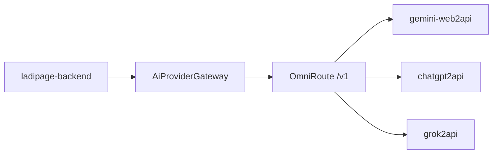

# FE Settings/API & OmniRoute Provider Connection Plan

Ngày lập: 2026-07-14

Phạm vi: lập kế hoạch tiếp theo sau khi backend đã có nền MCP Landing + `AiProviderGateway`. Tài liệu này không triển khai code.

## 1. Kết quả đã đạt được

### 1.1 Backend MCP/AiProviderGateway

Đã triển khai trong `ladipage-backend`:

- Có `AiProviderGateway` abstraction.
- Có `FakeAiProviderGateway` cho local/test.
- Có `OmniRouteAiProviderGateway` gọi OmniRoute `/v1`.
- Backend không gọi trực tiếp:
  - `chatgpt2api`
  - `gemini-web2api`
  - `grok2api`
- `LandingAiGenerateProcessor` đã chuyển sang sinh HTML qua gateway abstraction.
- OmniRoute trace headers đã được map về usage/trace:
  - provider
  - model
  - latency
  - token in/out
  - estimated cost
  - fallback attempts

### 1.2 Settings/API backend

Đã có API key lifecycle trong `settings`:

- `GET /settings/api-keys`
- `POST /settings/api-keys`
- `POST /settings/api-keys/:id/revoke`
- `POST /settings/api-keys/:id/rotate`

Nguyên tắc bảo mật đã có:

- Chỉ trả plaintext API key một lần khi create/rotate.
- Lưu key bằng hash.
- Có `keyPrefix` để hiển thị.
- Có scopes:
  - `workspace:read`
  - `landing:read`
  - `landing:create`
  - `landing:update`
  - `landing:publish`
  - `landing:delete`
  - `asset:generate`
  - `asset:upload`
  - `lead:read`
  - `order:read`
- Có revoke/rotate/last used/expires.

### 1.3 MCP Landing endpoint

Đã có public MCP endpoint dùng Bearer API key:

- `GET /mcp/landing/tools`
- `POST /mcp/landing/tools/call`

Tool hiện có:

- `ladipage_workspace_get`
- `landingpage_create_draft`
- `landingpage_get`

### 1.4 Verification đã chạy

Đã pass:

- Unit tests mới cho OmniRoute gateway, HTML generator, MCP landing service.
- `npm run build:ladipage`
- Contract tests cũ:
  - `phase1-phase4-landing-report.contract.spec.ts`
  - `landing-ai-jobs.contract.spec.ts`

## 2. Mục tiêu tiếp theo

### 2.1 FE Settings/API

Mục tiêu: dựng UI trong khu vực Settings/API tương tự `appv6.ladipage.com/settings/api`, để user có thể quản lý API key phục vụ MCP workflow.

FE cần hỗ trợ:

- List API keys.
- Create API key.
- Hiển thị plaintext key đúng một lần sau khi tạo.
- Copy key.
- Rotate key.
- Revoke key.
- Xem scopes.
- Chọn scopes khi tạo key.
- Hiển thị trạng thái:
  - active
  - revoked
  - expired
- Hiển thị metadata:
  - prefix
  - created date
  - last used
  - expires at

### 2.2 OmniRoute provider connection

Mục tiêu: OmniRoute là gateway chính, phía sau OmniRoute mới cấu hình 3 provider:

- `gemini-web2api`: text/copy/landing content.
- `chatgpt2api`: image generation/edit.
- `grok2api`: optional fallback cho text/image/video, default disabled.

Backend tiếp tục chỉ gọi OmniRoute. Không thêm direct provider adapter vào backend.

## 3. Plan FE Settings/API

### 3.1 Route/UI placement

Route đề xuất:

- `/settings/api`

Tên màn hình:

- `API Keys`
- Hoặc tiếng Việt: `Khoá API`

Navigation:

- Nằm trong nhóm Settings.
- Nếu app hiện đã có menu `Settings`, thêm item `API`.
- Không đưa vào landing/marketing page.

### 3.2 Layout

Màn hình gồm 4 vùng:

1. Header
   - Title: `API Keys`
   - Action chính: `Create API Key`

2. Summary strip
   - Total active keys.
   - Last used key time.
   - Warning nếu chưa có key.

3. API key table
   - Name
   - Prefix
   - Scopes
   - Status
   - Last used
   - Expires
   - Created
   - Actions

4. Create/rotate result modal
   - Chỉ hiện plaintext key một lần.
   - Có copy button.
   - Có warning: sau khi đóng sẽ không xem lại được key.

### 3.3 API calls FE cần dùng

List:

```http
GET /settings/api-keys
```

Create:

```http
POST /settings/api-keys
Content-Type: application/json

{
  "name": "MCP Production Key",
  "scopes": ["workspace:read", "landing:read", "landing:create", "asset:generate"],
  "expiresAt": "2026-12-31T00:00:00.000Z"
}
```

Revoke:

```http
POST /settings/api-keys/:id/revoke
```

Rotate:

```http
POST /settings/api-keys/:id/rotate
```

### 3.4 FE state model

`ApiKeyListItem`:

- `id`
- `name`
- `keyPrefix`
- `scopes`
- `status`
- `isDefault`
- `lastUsedAt`
- `expiresAt`
- `createdAt`

`CreatedApiKey` extends `ApiKeyListItem`:

- `key`

FE không được persist field `key` vào local storage/session storage.

### 3.5 Create API key modal

Fields:

- `name`
- `expiresAt` optional
- scope selector

Scope presets:

- Read only:
  - `workspace:read`
  - `landing:read`
- Landing draft:
  - `workspace:read`
  - `landing:read`
  - `landing:create`
  - `asset:generate`
- Landing publish:
  - `workspace:read`
  - `landing:read`
  - `landing:create`
  - `landing:update`
  - `landing:publish`
  - `asset:generate`
- Full MCP:
  - all scopes except destructive `landing:delete` by default.

Destructive scope handling:

- `landing:delete` phải có explicit checkbox riêng.
- Không bật mặc định trong preset.

### 3.6 Key reveal modal

Khi create/rotate thành công:

- Hiển thị key plaintext.
- Có copy button.
- Có secondary action: `I have saved this key`.
- Không cho đóng modal bằng click outside nếu chưa confirm.
- Khi đóng modal, xoá plaintext key khỏi FE state.

### 3.7 Table actions

Actions theo status:

- active:
  - rotate
  - revoke
- revoked:
  - disabled actions
- expired:
  - rotate disabled hoặc create new key CTA

Confirm revoke:

- Modal xác nhận.
- Hiển thị tên key và prefix.
- Nói rõ MCP clients đang dùng key này sẽ ngừng hoạt động.

Confirm rotate:

- Modal xác nhận.
- Nói rõ key cũ sẽ không còn dùng được sau rotate.
- Sau rotate hiển thị plaintext key mới một lần.

### 3.8 FE validation

Validation:

- `name` required.
- `name` max 255 chars.
- scopes phải có ít nhất một scope.
- expiresAt nếu có phải là future date.

Error handling:

- 401/403: show auth/workspace permission error.
- 409 nếu sau này backend thêm duplicate name: show inline error.
- 5xx: show retry toast.

### 3.9 FE acceptance criteria

- User tạo được key mới.
- Plaintext key chỉ hiện một lần.
- Refresh page không còn plaintext key.
- User revoke được key active.
- User rotate được key active và nhận key mới.
- Table update sau create/revoke/rotate.
- Scope labels hiển thị dễ hiểu.
- FE không log key plaintext ra console.
- FE không lưu key plaintext vào browser storage.

## 4. Plan MCP Usage UX trong Settings/API

### 4.1 MCP quick start panel

Thêm panel dưới table:

- Base URL:
  - `/mcp/landing`
- Tools endpoint:
  - `GET /mcp/landing/tools`
- Call endpoint:
  - `POST /mcp/landing/tools/call`

Hiển thị example ngắn:

```http
Authorization: Bearer lp_xxx
```

Không hiển thị real key từ table.

### 4.2 Tool preview

FE có thể hiển thị static list:

- `ladipage_workspace_get`
- `landingpage_create_draft`
- `landingpage_get`

Sau này có thể gọi live:

```http
GET /mcp/landing/tools
```

Vì endpoint cần API key, live preview chỉ nên có khi user vừa tạo key và modal vẫn còn plaintext key.

## 5. Plan connect OmniRoute với 3 web2api

### 5.1 Kiến trúc kết nối



Nguyên tắc:

- Backend chỉ biết OmniRoute.
- OmniRoute giữ provider credentials/cookies.
- Backend không có env/base URL/token của 3 web2api.
- Nếu một upstream chưa sẵn sàng, disable capability ở OmniRoute, không bypass bằng backend direct call.

### 5.2 OmniRoute deployment plan

Môi trường:

- Local dev
- Staging
- Production beta

Network:

- OmniRoute nằm private network.
- Chỉ `ladipage-backend` gọi được `/v1`.
- Dashboard/admin của OmniRoute không public internet.

Required env:

```env
PORT=20128
REQUIRE_API_KEY=true
DATA_DIR=/data/omniroute
JWT_SECRET=
API_KEY_SECRET=
STORAGE_ENCRYPTION_KEY=
INITIAL_PASSWORD=
```

Backend env:

```env
AI_GATEWAY_DRIVER=omniroute
AI_GATEWAY_FAIL_MODE=warn
AI_GATEWAY_ENABLE_VIDEO=false
OMNIROUTE_BASE_URL=http://omniroute:20128/v1
OMNIROUTE_API_KEY=
OMNIROUTE_TIMEOUT_MS=60000
OMNIROUTE_DEFAULT_TEXT_MODEL=
OMNIROUTE_DEFAULT_IMAGE_MODEL=
OMNIROUTE_DEFAULT_VIDEO_MODEL=
OMNIROUTE_NO_MEMORY=true
OMNIROUTE_NO_CACHE=false
OMNIROUTE_COMPRESSION=auto
```

### 5.3 Provider mapping trong OmniRoute

#### 5.3.1 Gemini web2api

Role:

- Content generation.
- Landing copy.
- SEO text.
- FAQ.
- CTA variants.

Expected model alias:

- `gemini-auto`
- Hoặc alias OmniRoute tương ứng.

Routing:

- Capability: `text`.
- Priority: primary.
- Fallback: Grok text nếu được bật.

Safety:

- Không gửi secrets.
- Không bật memory cross-tenant.
- Dùng `x-omniroute-no-memory=true`.

#### 5.3.2 chatgpt2api

Role:

- Image generation.
- Image edit.
- Hero/product visual.

Expected model alias:

- `gpt-image-*` hoặc alias OmniRoute tương ứng.

Routing:

- Capability: `image`.
- Priority: primary image provider.
- Fallback: Grok image nếu được bật.

Safety:

- Chỉ dùng prompt marketing hợp lệ.
- Không gửi dữ liệu nhạy cảm của customer.
- Có quota riêng cho image generation.

#### 5.3.3 grok2api

Role:

- Optional fallback text.
- Optional fallback image.
- Optional video provider sau safety review.

Default:

- Disabled ở production.
- Enable theo workspace allowlist.

Routing:

- Capability: `text`: fallback only.
- Capability: `image`: fallback only.
- Capability: `video`: off-by-default.

Safety:

- Chặn NSFW/unsafe prompt trước gateway.
- Không expose public endpoints của grok2api.
- Không bật video cho tenant đại trà trước khi có quota, moderation, review.

### 5.4 Routing policy đề xuất trong OmniRoute

Text:

```text
landing_text:
  primary: gemini-web2api
  fallback: grok2api nếu enabled
  strategy: quality
```

Image:

```text
landing_image:
  primary: chatgpt2api
  fallback: grok2api nếu enabled
  strategy: quality
```

Video:

```text
landing_video:
  primary: grok2api
  fallback: none
  enabled: false
```

### 5.5 Health checks

OmniRoute cần expose hoặc backend cần kiểm tra:

- `GET /v1/models`
- Text route canary.
- Image route canary.
- Provider fallback telemetry.

Backend health behavior:

- Nếu OmniRoute unavailable:
  - dev/test: dùng fake/static nếu được cấu hình.
  - staging/prod: trả controlled error hoặc text-only degrade theo `AI_GATEWAY_FAIL_MODE`.
- Không retry vô hạn.
- Không fallback sang direct web2api.

### 5.6 Observability

Persist hoặc log structured fields:

- `gateway=omniroute`
- `provider`
- `model`
- `latencyMs`
- `fallbackAttempts`
- `inputTokens`
- `outputTokens`
- `estimatedCost`
- `workspaceId`
- `pageId`
- `toolName`
- `invocationId`

Không log:

- OmniRoute API key.
- Provider cookies.
- Raw Authorization headers.
- Plaintext MCP API key.

### 5.7 Acceptance criteria OmniRoute connection

- Backend can call OmniRoute `/v1/chat/completions`.
- Backend can call OmniRoute `/v1/images/generations` when image enabled.
- OmniRoute returns provider/model trace headers.
- Backend records trace in landing generation metadata.
- `gemini-web2api`, `chatgpt2api`, `grok2api` credentials are stored only in OmniRoute/sidecars.
- Runtime source has no direct provider base URL env for 3 web2api.
- Disabling one upstream in OmniRoute does not require backend code change.

## 6. Checklist thực hiện tiếp

### 6.1 FE Settings/API

- [ ] Xác định app FE/repo chứa route `settings/api`.
- [ ] Tìm pattern hiện có cho Settings pages.
- [ ] Tạo API client cho `/settings/api-keys`.
- [ ] Tạo type `ApiKeyListItem`.
- [ ] Tạo type `CreatedApiKey`.
- [ ] Build API key table.
- [ ] Build create modal.
- [ ] Build scope selector + presets.
- [ ] Build one-time key reveal modal.
- [ ] Build revoke confirmation.
- [ ] Build rotate confirmation + reveal modal.
- [ ] Build empty state.
- [ ] Build error/loading states.
- [ ] Thêm MCP quick start panel.
- [ ] Test plaintext key không persist sau close/refresh.
- [ ] Test revoke/rotate refresh table.

### 6.2 Backend support nếu FE cần thêm

- [ ] Thống nhất response shape cuối cho Settings/API.
- [ ] Nếu cần, thêm `description`/`createdBy` vào API key metadata.
- [ ] Nếu cần, thêm `PATCH /settings/api-keys/:id/scopes`.
- [ ] Nếu cần, thêm duplicate-name validation.
- [ ] Nếu cần, thêm audit event cho create/revoke/rotate.

### 6.3 OmniRoute setup

- [ ] Deploy OmniRoute local.
- [ ] Bật `REQUIRE_API_KEY=true`.
- [ ] Tạo gateway API key riêng cho backend.
- [ ] Cấu hình `OMNIROUTE_BASE_URL` và `OMNIROUTE_API_KEY` trong backend env.
- [ ] Kết nối `gemini-web2api` vào OmniRoute.
- [ ] Test text canary qua OmniRoute.
- [ ] Kết nối `chatgpt2api` vào OmniRoute.
- [ ] Test image canary qua OmniRoute.
- [ ] Kết nối `grok2api` vào OmniRoute nhưng giữ disabled ở prod.
- [ ] Test fallback trong staging.
- [ ] Kiểm tra trace headers.
- [ ] Kiểm tra backend không log secrets.
- [ ] Kiểm tra kill switch từng provider.

## 7. Thứ tự triển khai khuyến nghị

1. Làm FE Settings/API trước với backend hiện có.
2. Test create/list/revoke/rotate API key bằng UI.
3. Dùng key vừa tạo để gọi `GET /mcp/landing/tools`.
4. Deploy OmniRoute local/staging.
5. Connect Gemini web2api cho text trước.
6. Test `landingpage_create_draft` sinh content qua OmniRoute.
7. Connect chatgpt2api cho image.
8. Bật image capability có quota/warning.
9. Connect grok2api ở staging, disabled production.
10. Sau khi ổn định mới mở rộng MCP tools: update, publish, list real landing pages.

## 8. Rủi ro chính

- FE vô tình lưu plaintext API key vào state global/local storage.
- User rotate key nhưng MCP client cũ chưa cập nhật.
- OmniRoute dashboard/admin bị expose public.
- Provider reverse-web bị rate limit hoặc đổi behavior.
- Image/video cost tăng nhanh nếu không có quota.
- Grok/video capability cần safety review riêng.

## 9. Kết luận

Backend đã đủ nền để FE Settings/API bắt đầu đấu nối ngay. OmniRoute nên được triển khai như gateway độc lập, sau đó mới lần lượt connect 3 web2api phía sau nó. Không cần và không nên thêm direct integration từ `ladipage-backend` tới `chatgpt2api`, `gemini-web2api`, hoặc `grok2api`.
