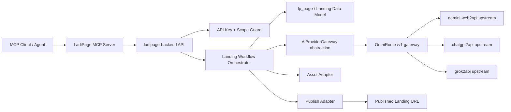

# LadiPage MCP Integration Plan

Ngày lập: 2026-07-14

Mục tiêu: hoàn thiện luồng MCP cho `ladipage-backend` để agent có thể tạo, chỉnh sửa, lưu nháp và publish landing page với workflow tương tự `appv6.ladipage.com`, dựa trên kết quả phase 1-4 và nghiên cứu các repo trong checklist.

Phạm vi tài liệu này chỉ là plan tích hợp. Không triển khai code trong bước này.

## 1. Kết quả phase 1-4 đã có

### 1.1 CDP reverse/capture

Artifact chính:

- `plans/REVERSE-RESULTS-appv6-capture-report.md`
- `tools/cdp-reverse-engineer/output/merged/manifest.json`
- `docs/reverse/schema-freeze-v2.json`

Kết quả hiện tại:

- Manifest đã merge được 86 route, 33 table.
- Các nhóm capture đã có:
  - `phase1-landing-create`: 28 POST samples.
  - `settings-api`: 28 POST samples.
  - `settings-api-mutations`: 22 POST samples.
- Landing read flow đã thấy các route như:
  - `ladi-page/list`
  - `ladi-page/show`
  - `ladi-page-tag/list`
  - `domain/list`
  - `form-config/list`
  - `data-form-error/list`
  - `staff/list`
  - `store/info/show`
  - `theme-list`
  - `theme-tag-list`
  - `list-show-case`
  - `asset-list`
- Settings/API capture đã thấy được:
  - `api-key/list`
  - `auth/userinfo`
  - `auth/renew-token`
  - `workspace/get-usage-resource`

Khoảng trống còn lại:

- Chưa capture được mutation thật cho tạo API key, revoke API key.
- Chưa capture được mutation thật cho landing create/save/publish từ editor.
- Cần thêm manual/headed CDP capture hoặc dựa vào luồng backend-native để dựng API mới có contract rõ ràng.

### 1.2 Schema/backend seed đã có

Các phần đã được chuẩn bị ở phase 1-4:

- Entity/API key cho Settings API:
  - `lp_api_key` với 12 columns.
- Mapping landing page:
  - `lp_page` có 41 fields.
  - Các field phục vụ MCP/publish như `renderEngine`, `externalSiteId`, `externalPageId`, `publishedAt`.
- Migration nền:
  - `1756200000000-mcp-api-key-landing-schema.ts`
- Build/contract test đã từng pass:
  - `npm run build:ladipage`
  - Contract test phase1-phase4 landing/report.

Ý nghĩa cho phase sau:

- Có thể dùng `lp_api_key` làm nền auth cho MCP.
- Có thể dùng `lp_page` làm canonical page record trong backend.
- Route read flow của appv6 đủ để dựng parity cho list/show/template/domain/tag/report ở mức đầu tiên.

## 2. Nghiên cứu 4 repo trong checklist

### 2.1 `Lyang77/chatgpt2api`

Nguồn: https://github.com/Lyang77/chatgpt2api

Vai trò phù hợp:

- Adapter tạo/sửa ảnh theo kiểu OpenAI-compatible.
- Có thể dùng cho hero image, product visual, image edit/composition trong landing page.

Điểm kỹ thuật đáng chú ý:

- API base thường là `/v1`.
- Có các endpoint tương thích OpenAI như:
  - `POST /v1/images/generations`
  - `POST /v1/images/edits`
  - `POST /v1/chat/completions`
  - `POST /v1/responses`
  - `GET /v1/models`
- Auth qua `Authorization: Bearer <auth-key>`.
- Hỗ trợ Docker, data directory, nhiều storage backend như JSON/SQLite/Postgres/Git.
- Có cấu hình WARP/Privoxy/FlareSolverr để tăng độ ổn định khi đi qua web reverse flow.

Rủi ro:

- Đây là reverse-engineering ChatGPT web, không nên mặc định dùng production khi chưa review pháp lý/chính sách.
- Có rủi ro rate limit, account lock, Cloudflare, thay đổi giao diện web.
- Nên đặt sau feature flag, giới hạn usage, audit và kill switch.

Đề xuất tích hợp:

- Dùng như `ImageGenerationProvider`.
- Chỉ enable cho workspace nội bộ/beta.
- Nếu production cần ổn định, giữ abstraction để thay bằng provider chính thức sau này.

### 2.2 `Sophomoresty/gemini-web2api`

Nguồn: https://github.com/Sophomoresty/gemini-web2api

Vai trò phù hợp:

- Adapter tạo nội dung/copy/outline/SEO/FAQ cho landing page.
- Có thể làm provider chính cho bước planning/content generation vì API gần OpenAI-compatible.

Điểm kỹ thuật đáng chú ý:

- Endpoint:
  - `POST /v1/chat/completions`
  - `GET /v1/models`
  - `POST /v1/responses`
  - Google native compatible `/v1beta/models`
- Hỗ trợ streaming SSE, tool calling, web search.
- Auth có thể để rỗng hoặc dùng Bearer/x-api-key khi cấu hình `api_keys`.
- Các model được expose theo alias Gemini web.
- Không hỗ trợ image/multimodal input đúng nghĩa; image input có thể bị ignore.
- Context multi-turn là mô phỏng từ message list, không phải session web dài hạn thật.

Rủi ro:

- Dựa vào cookie/session web.
- Có rate limit và thay đổi behavior theo tài khoản.
- Một số model Pro cần cookie/tài khoản phù hợp.

Đề xuất tích hợp:

- Dùng như `ContentGenerationProvider`.
- Task phù hợp:
  - page brief to section outline
  - headline/subheadline/CTA
  - benefit blocks
  - FAQ
  - SEO title/description
  - form copy và thank-you copy
- Không dùng cho image input hoặc visual inspection.

### 2.3 `XianYuDaXian/grok2api`

Nguồn: https://github.com/XianYuDaXian/grok2api

Vai trò phù hợp:

- Adapter chat/content phụ.
- Adapter image/video generation tùy chọn.
- Có thể làm fallback hoặc provider experimental cho visual asset generation.

Điểm kỹ thuật đáng chú ý:

- FastAPI service, thường chạy port `8000`.
- Endpoint nổi bật:
  - `POST /v1/chat/completions`
  - `GET /v1/models`
  - public chat/model endpoints nếu bật public mode
  - image imagine/edit endpoints
  - video start/sse/stop/cache endpoints
- Auth/cấu hình:
  - `APP_KEY`
  - `API_KEY`
  - `PUBLIC_ENABLED`
  - `PUBLIC_KEY`
  - storage local/Redis/MySQL/Postgres
  - proxy/FlareSolverr/browser bridge options
- Có Docker image và Docker Compose.

Rủi ro:

- Reverse web flow, phụ thuộc session/account/proxy/browser.
- Có các capability nhạy cảm trong upstream; LadiPage không nên expose trực tiếp.
- Cần content safety layer và chỉ cho phép use case marketing hợp lệ.

Đề xuất tích hợp:

- Dùng như provider experimental:
  - `GrokTextProvider` fallback cho content.
  - `GrokImageProvider` fallback cho image.
  - `GrokVideoProvider` off-by-default.
- Chặn NSFW/unsafe prompt ở gateway trước khi gọi provider.
- Không expose public endpoints của grok2api trực tiếp ra tenant.

### 2.4 `diegosouzapw/OmniRoute`

Nguồn đúng: https://github.com/diegosouzapw/OmniRoute.git

Vai trò phù hợp:

- Gateway trung tâm cho toàn bộ provider AI của luồng MCP landing page.
- Cung cấp một endpoint `/v1` OpenAI-compatible để `ladipage-backend` gọi thay vì gọi từng provider trực tiếp.
- Quản lý routing, fallback, quota/cost telemetry, proxy, guardrails, compression và dashboard vận hành.

Điểm kỹ thuật đáng chú ý:

- README mô tả OmniRoute là AI gateway với một endpoint cho nhiều provider, auto-fallback, OpenAI/Claude/Gemini/Responses API translation.
- Default gateway URL trong tài liệu: `http://localhost:20128/v1`.
- Endpoint API quan trọng:
  - `POST /v1/chat/completions`
  - `POST /v1/responses`
  - `POST /v1/images/generations`
  - `POST /v1/embeddings`
  - `GET /v1/models`
- Auth API dùng `Authorization: Bearer <api-key>`.
- Có cost/usage headers như:
  - `X-OmniRoute-Response-Cost`
  - `X-OmniRoute-Tokens-In`
  - `X-OmniRoute-Tokens-Out`
  - `X-OmniRoute-Model`
  - `X-OmniRoute-Provider`
  - `X-OmniRoute-Latency-Ms`
  - `X-OmniRoute-Fallback-Attempts`
- Có request headers hữu ích:
  - `Idempotency-Key`
  - `X-Session-Id`
  - `X-OmniRoute-No-Cache`
  - `x-omniroute-no-memory`
  - `x-omniroute-compression`
- Có MCP server riêng:
  - stdio: `omniroute --mcp`
  - HTTP: `http://localhost:20128/api/mcp/stream`
  - SSE: `http://localhost:20128/api/mcp/sse`
- Có A2A endpoint: `http://localhost:20128/.well-known/agent.json`.
- Chạy được bằng npm, Docker, Desktop/Electron, Termux, PWA.
- Biến môi trường quan trọng theo docs:
  - `PORT`, default `20128`
  - `REQUIRE_API_KEY`
  - `DATA_DIR`
  - `JWT_SECRET`
  - `API_KEY_SECRET`
  - `INITIAL_PASSWORD`
  - `STORAGE_ENCRYPTION_KEY`

Đề xuất tích hợp:

- Dùng OmniRoute làm `AiProviderGateway` primary.
- `ladipage-backend` chỉ gọi OmniRoute `/v1`, không gọi `chatgpt2api`, `gemini-web2api`, `grok2api` trực tiếp trong happy path.
- `chatgpt2api`, `gemini-web2api`, `grok2api` được cấu hình như upstream/provider hoặc sidecar phía sau OmniRoute nếu OmniRoute hỗ trợ provider dạng OpenAI-compatible/custom base URL.
- `ladipage-backend` không tạo direct adapter tới `chatgpt2api`, `gemini-web2api`, `grok2api`. Nếu upstream chưa map được vào OmniRoute thì capability đó để disabled/fallback ở OmniRoute, không bypass gateway trong backend.
- Dùng OmniRoute response headers để ghi `lp_ai_provider_trace`, cost estimate, fallback attempts và model/provider thật đã chạy.

Rủi ro:

- OmniRoute là gateway giàu capability; không nên expose dashboard/admin/MCP của OmniRoute trực tiếp cho tenant.
- Cần harden deployment: API key required, dashboard auth, network private, secret encryption, backup data dir.
- Một số upstream provider vẫn có rủi ro reverse-web hoặc quota; OmniRoute giảm rủi ro vận hành bằng fallback nhưng không xoá rủi ro pháp lý/chính sách của từng provider.

## 3. Kiến trúc mục tiêu



Nguyên tắc:

- MCP chỉ gọi `ladipage-backend`, không gọi trực tiếp provider reverse-web.
- `ladipage-backend` là nơi enforce workspace, scope, quota, audit, idempotency.
- Provider AI được giấu sau `AiProviderGateway`; implementation chính là OmniRoute.
- Landing page materialization phải đi qua model/backend chính thức, không ghi tắt vào storage ngoài luồng.
- Publish flow trả về URL/editor state tương tự appv6.

## 4. Workflow parity với appv6

### 4.1 Luồng tạo landing page từ agent

1. Agent gọi MCP `landingpage_create_draft`.
2. Backend xác thực API key và scope `landing:create`.
3. Backend lấy context workspace:
   - domain list
   - tag list
   - template/theme list
   - usage/quota
4. Orchestrator dựng page brief:
   - ngành hàng
   - mục tiêu chuyển đổi
   - audience
   - offer
   - tone/brand
   - form/lead requirements
5. Gọi `AiProviderGateway.generateText`, implementation OmniRoute, để sinh:
   - sitemap/section plan
   - headline/subheadline
   - CTA
   - benefit blocks
   - FAQ
   - SEO metadata
6. Nếu cần visual:
   - Gọi `AiProviderGateway.generateImage`, implementation OmniRoute.
   - OmniRoute tự route tới upstream image provider nếu đã cấu hình.
   - Nếu image/video capability chưa bật, backend tạo page text-only và trả warning.
7. Materialize thành landing document:
   - page metadata
   - editor JSON/schema
   - HTML/render payload nếu backend hiện yêu cầu
   - asset references
8. Lưu `lp_page` ở trạng thái draft.
9. Trả về:
   - `pageId`
   - `status`
   - `editorUrl`
   - `previewUrl` nếu có
   - warnings nếu provider bị fallback.

### 4.2 Luồng chỉnh sửa landing page

1. Agent gọi MCP `landingpage_update`.
2. Backend load `lp_page` theo workspace.
3. Agent gửi patch dạng semantic:
   - đổi headline
   - thêm section
   - đổi CTA
   - đổi form fields
   - tạo ảnh mới
4. Orchestrator chuyển semantic patch sang editor/page schema.
5. Lưu version mới và audit event.
6. Trả về diff summary, preview URL và validation warnings.

### 4.3 Luồng publish

1. Agent gọi MCP `landingpage_publish`.
2. Backend kiểm tra:
   - scope `landing:publish`
   - workspace quota
   - domain/path hợp lệ
   - page đã validate
3. Backend gọi publish adapter hiện có hoặc luồng publish mới.
4. Cập nhật `publishedAt`, publish status, external IDs nếu có.
5. Trả về public URL và publish metadata.

## 5. MCP tool contract đề xuất

### 5.1 Nhóm workspace/settings

- `ladipage_workspace_get`
  - Mục tiêu: lấy workspace hiện tại, quota, usage, plan.
  - Scope: `workspace:read`.

- `ladipage_domain_list`
  - Mục tiêu: chọn domain/path khi publish.
  - Scope: `landing:read`.

- `ladipage_template_list`
  - Mục tiêu: list theme/template/showcase tương tự appv6.
  - Scope: `landing:read`.

- `ladipage_tag_list`
  - Mục tiêu: gắn tag cho page.
  - Scope: `landing:read`.

### 5.2 Nhóm landing page

- `landingpage_list`
  - Scope: `landing:read`.
  - Dựa trên route parity `ladi-page/list`.

- `landingpage_get`
  - Scope: `landing:read`.
  - Dựa trên route parity `ladi-page/show`.

- `landingpage_create_draft`
  - Scope: `landing:create`.
  - Input chính:
    - `workspaceId`
    - `prompt`
    - `templateId` optional
    - `businessContext`
    - `targetAudience`
    - `offer`
    - `language`
    - `brandTone`
    - `generateAssets`
  - Output chính:
    - `pageId`
    - `status`
    - `editorUrl`
    - `previewUrl`
    - `providerTraceId`

- `landingpage_update`
  - Scope: `landing:update`.
  - Input chính:
    - `pageId`
    - `patchMode`: `semantic` hoặc `schema`
    - `instructions`
    - `assetRequests`
  - Output chính:
    - `pageId`
    - `version`
    - `validationWarnings`

- `landingpage_publish`
  - Scope: `landing:publish`.
  - Input chính:
    - `pageId`
    - `domainId`
    - `path`
    - `publishMode`: `preview` hoặc `production`
  - Output chính:
    - `publicUrl`
    - `publishedAt`
    - `publishStatus`

- `landingpage_archive`
  - Scope: `landing:delete`.
  - Guarded destructive action; require explicit confirmation at MCP client layer.

### 5.3 Nhóm AI/asset

- `landingpage_generate_content`
  - Scope: `asset:generate`.
  - Gateway default: OmniRoute text capability.
  - Upstream dự kiến phía sau OmniRoute: `gemini-web2api`.
  - Output: structured sections, SEO, CTA, FAQ.

- `landingpage_generate_image`
  - Scope: `asset:generate`.
  - Gateway default: OmniRoute image capability.
  - Upstream dự kiến phía sau OmniRoute: `chatgpt2api`.
  - Fallback provider nếu có phải do OmniRoute route, backend không gọi trực tiếp.

- `landingpage_generate_video`
  - Scope: `asset:generate`.
  - Gateway default: off.
  - Upstream dự kiến phía sau OmniRoute: `grok2api`.
  - Chỉ enable sau khi có policy/safety review.

## 6. Backend integration modules cần thiết

### 6.1 API Key & Scope

Nền đã có từ phase 1-4: `lp_api_key`.

Scope đề xuất:

- `workspace:read`
- `landing:read`
- `landing:create`
- `landing:update`
- `landing:publish`
- `landing:delete`
- `asset:generate`
- `asset:upload`
- `lead:read`
- `order:read`

Yêu cầu:

- Hash API key, không lưu plaintext.
- Prefix key để hiển thị trong Settings/API.
- Audit last used IP/user agent.
- Rate limit theo key và workspace.
- Có revoke/rotate.

### 6.2 MCP Controller/Transport

`ladipage-backend` nên expose một trong hai mô hình:

- MCP server riêng chạy cạnh backend, gọi internal service.
- Hoặc HTTP endpoint tương thích MCP tool call, do gateway/agent wrapper expose ra MCP.

Khuyến nghị trước mắt:

- Tách `McpLandingService` trong backend.
- Sau đó bọc bằng MCP server mỏng.
- Tránh để MCP layer chứa business logic.

### 6.3 Landing Workflow Orchestrator

Trách nhiệm:

- Validate input.
- Lấy workspace context.
- Chọn template/theme/domain mặc định.
- Gọi AI gateway.
- Chuẩn hóa response thành page schema.
- Lưu draft/version.
- Gọi publish adapter.
- Ghi audit và provider trace.

Tránh:

- Không để controller gọi thẳng provider.
- Không để provider response raw chảy vào page schema mà không validate.

### 6.4 AI Provider Gateway

Mục tiêu thiết kế:

- Xây dựng abstraction trong `ladipage-backend` trước, để workflow landing không phụ thuộc trực tiếp vào SDK/API của provider cụ thể.
- Implementation chính là `OmniRouteAiProviderGateway`, gọi OmniRoute `/v1`.
- `chatgpt2api`, `gemini-web2api`, `grok2api` chỉ nằm phía sau OmniRoute, không có direct adapter trong backend.
- Backend chỉ nhận output chuẩn hóa: text blocks, asset result, model/provider trace, usage/cost, warnings.

Interface logical đề xuất:

```ts
export interface AiProviderGateway {
  generateText(request: AiTextRequest): Promise<AiTextResult>;
  generateImage(request: AiImageRequest): Promise<AiImageResult>;
  editImage(request: AiImageEditRequest): Promise<AiImageResult>;
  generateVideo(request: AiVideoRequest): Promise<AiVideoResult>;
  listModels(request?: AiListModelsRequest): Promise<AiModel[]>;
  healthCheck(): Promise<AiGatewayHealth>;
}

export type AiCapability = 'text' | 'image' | 'image_edit' | 'video' | 'embedding';

export interface AiGatewayRequestBase {
  workspaceId: string;
  invocationId: string;
  idempotencyKey?: string;
  sessionId?: string;
  capability: AiCapability;
  modelHint?: string;
  routingHint?: 'quality' | 'speed' | 'cost' | 'balanced';
  timeoutMs?: number;
  metadata?: {
    pageId?: string;
    toolName?: string;
    source?: 'mcp' | 'admin' | 'worker';
  };
}

export interface AiTextRequest extends AiGatewayRequestBase {
  capability: 'text';
  messages: Array<{
    role: 'system' | 'user' | 'assistant';
    content: string;
  }>;
  responseFormat?: 'text' | 'json';
  temperature?: number;
  maxTokens?: number;
}

export interface AiTextResult {
  text: string;
  json?: unknown;
  usage: AiUsage;
  trace: AiProviderTrace;
  warnings: string[];
}

export interface AiImageRequest extends AiGatewayRequestBase {
  capability: 'image';
  prompt: string;
  size?: '1024x1024' | '1024x1536' | '1536x1024';
  count?: number;
  styleHint?: string;
}

export interface AiImageEditRequest extends AiGatewayRequestBase {
  capability: 'image_edit';
  prompt: string;
  sourceAssetIds: string[];
  maskAssetId?: string;
}

export interface AiImageResult {
  assets: Array<{
    temporaryUrl?: string;
    assetId?: string;
    mimeType?: string;
    width?: number;
    height?: number;
  }>;
  usage: AiUsage;
  trace: AiProviderTrace;
  warnings: string[];
}

export interface AiVideoRequest extends AiGatewayRequestBase {
  capability: 'video';
  prompt: string;
  imageAssetId?: string;
  durationSeconds?: number;
}

export interface AiVideoResult {
  jobId?: string;
  temporaryUrl?: string;
  status: 'queued' | 'running' | 'completed' | 'failed';
  usage: AiUsage;
  trace: AiProviderTrace;
  warnings: string[];
}

export interface AiUsage {
  inputTokens?: number;
  outputTokens?: number;
  estimatedCost?: number;
  currency?: string;
}

export interface AiProviderTrace {
  gateway: 'omniroute';
  requestId?: string;
  provider?: string;
  model?: string;
  latencyMs?: number;
  fallbackAttempts?: number;
  rawHeaders?: Record<string, string>;
}

export interface AiGatewayHealth {
  ok: boolean;
  gateway: 'omniroute';
  latencyMs?: number;
  availableCapabilities: AiCapability[];
  errorCode?: string;
}
```

Implementation trong backend:

- `OmniRouteAiProviderGateway`
  - Gọi `POST {OMNIROUTE_BASE_URL}/chat/completions` cho text.
  - Gọi `POST {OMNIROUTE_BASE_URL}/responses` nếu workflow cần Responses API.
  - Gọi `POST {OMNIROUTE_BASE_URL}/images/generations` cho image.
  - Gọi `GET {OMNIROUTE_BASE_URL}/models` cho model discovery.
  - Map response headers `X-OmniRoute-*` vào `AiProviderTrace` và `AiUsage`.

Không tạo các class sau trong backend phase 5-6:

- `GeminiWeb2ApiAdapter`
- `ChatGpt2ApiAdapter`
- `Grok2ApiAdapter`

Các adapter web2api nếu cần sẽ được cấu hình ở OmniRoute hoặc chạy như sidecar upstream phía sau OmniRoute.

Routing policy:

- Backend gửi `capability`, `modelHint`, `routingHint`, `workspaceId`, `idempotencyKey`.
- OmniRoute quyết định provider thật theo config của gateway.
- Backend chỉ biết provider thật qua response headers/tracing.
- Text/copy: route qua OmniRoute; upstream dự kiến sau này là `gemini-web2api`.
- Image: route qua OmniRoute; upstream dự kiến sau này là `chatgpt2api`.
- Video: route qua OmniRoute; upstream dự kiến sau này là `grok2api`, default disabled.
- Không expose direct provider endpoint cho tenant, MCP client hoặc backend service khác.

### 6.5 Persistence/audit bổ sung

Bổ sung sau phase 5, không bắt buộc ngay:

- `lp_mcp_invocation`
  - tool name
  - workspace id
  - api key id
  - request hash
  - status
  - error code
  - duration
  - created at

- `lp_ai_provider_trace`
  - provider
  - model
  - workspace id
  - token/credit estimate
  - request id
  - latency
  - fallback reason

- `lp_ai_asset_job`
  - asset type
  - provider
  - status
  - source prompt hash
  - output asset id/url

## 7. Phase plan trước khi thực hiện 5-6

### Phase 5: Backend contract, MCP surface & AiProviderGateway abstraction

Mục tiêu:

- Chốt contract backend trước khi nối provider.
- Có MCP tool schema ổn định cho create/update/publish/list/get.
- Xây dựng `AiProviderGateway` abstraction ngay trong phase 5, nhưng dùng fake/mock implementation để test workflow trước.
- Chuẩn bị sẵn `OmniRouteAiProviderGateway` contract/config ở mức interface, chưa bắt buộc gọi OmniRoute thật.

Việc cần làm:

1. Hoàn thiện API key mutation:
   - create
   - list
   - revoke
   - rotate
   - last-used tracking
2. Tạo backend service contract:
   - `landingpage_create_draft`
   - `landingpage_update`
   - `landingpage_publish`
   - `landingpage_get`
   - `landingpage_list`
3. Tạo DTO/schema validation cho tool input/output.
4. Tạo `AiProviderGateway` interface và các DTO chuẩn:
   - text request/result
   - image request/result
   - video request/result
   - usage/cost
   - provider trace
   - gateway health
5. Tạo `FakeAiProviderGateway` cho test/local:
   - deterministic text response
   - deterministic image placeholder response
   - fake usage/cost/trace
6. Tạo `OmniRouteAiProviderGateway` skeleton contract:
   - config keys
   - request mapping
   - response mapping
   - error mapping
   - header tracing mapping
   - chưa cần gọi provider thật nếu môi trường chưa có OmniRoute.
7. Tạo mock orchestration không gọi provider thật:
   - prompt -> deterministic page draft
   - publish -> dry-run hoặc local status
8. Thêm contract tests bằng fixture đã capture từ appv6.
9. Thêm negative tests:
   - thiếu scope
   - API key revoked
   - invalid prompt
   - provider timeout giả lập
   - provider trả unsafe warning
10. Ghi rõ rule kiến trúc trong docs/test:
   - backend không gọi `gemini-web2api`, `chatgpt2api`, `grok2api` trực tiếp.
   - mọi AI call đi qua `AiProviderGateway`.

Acceptance criteria:

- MCP client có thể list tools và gọi create draft bằng mock provider.
- Draft được lưu vào `lp_page`.
- Response có `pageId`, `editorUrl` hoặc placeholder route, `status`.
- `LandingWorkflowOrchestrator` chỉ phụ thuộc interface `AiProviderGateway`, không phụ thuộc OmniRoute SDK/API trực tiếp.
- Có fake gateway để chạy test không cần network.
- Có config placeholder cho OmniRoute nhưng 3 web2api chưa được gọi từ backend.
- Không cần provider AI thật ở phase này.

Checklist chi tiết Phase 5:

- [ ] Chốt MCP tool schema cho `landingpage_create_draft`, `landingpage_update`, `landingpage_publish`, `landingpage_get`, `landingpage_list`.
- [ ] Chốt response envelope chung: `data`, `warnings`, `trace`, `requestId`.
- [ ] Tạo scope matrix cho từng tool.
- [ ] Tạo DTO validation cho prompt/business context/asset request/publish target.
- [ ] Tạo `AiProviderGateway` interface.
- [ ] Tạo model request/result dùng chung.
- [ ] Tạo `FakeAiProviderGateway`.
- [ ] Inject gateway qua module/provider token, không new trực tiếp trong service.
- [ ] Tạo `LandingWorkflowOrchestrator` dùng gateway interface.
- [ ] Lưu draft vào `lp_page` bằng deterministic output.
- [ ] Ghi `lp_mcp_invocation` hoặc mock audit event nếu bảng chưa có.
- [ ] Contract test MCP list/call.
- [ ] Contract test create draft dry-run.
- [ ] Contract test update semantic patch dry-run.
- [ ] Contract test publish dry-run.
- [ ] Test bảo đảm không có env/config direct tới 3 web2api trong backend.

### Phase 6: OmniRoute gateway integration & orchestration

Mục tiêu:

- Kết nối `OmniRouteAiProviderGateway` làm implementation chính của `AiProviderGateway`.
- Mọi text/image/video request từ backend đi qua OmniRoute `/v1`.
- 3 web2api chỉ được cấu hình phía sau OmniRoute, không gọi trực tiếp từ backend.
- Có timeout, retry có giới hạn, audit trace, cost/usage mapping và feature flags.

Việc cần làm:

1. Cấu hình OmniRoute gateway:
   - `OMNIROUTE_BASE_URL`
   - `OMNIROUTE_API_KEY`
   - `OMNIROUTE_TIMEOUT_MS`
   - `OMNIROUTE_DEFAULT_TEXT_MODEL`
   - `OMNIROUTE_DEFAULT_IMAGE_MODEL`
   - `OMNIROUTE_DEFAULT_VIDEO_MODEL`
2. Implement request mapping:
   - `generateText` -> `POST /v1/chat/completions` hoặc `/v1/responses`.
   - `generateImage` -> `POST /v1/images/generations`.
   - `editImage` -> OmniRoute image/edit path nếu available; nếu chưa available thì trả controlled unsupported capability.
   - `generateVideo` -> disabled cho tới khi OmniRoute/upstream hỗ trợ ổn định.
   - `listModels` -> `GET /v1/models`.
3. Implement headers:
   - `Authorization: Bearer <OMNIROUTE_API_KEY>`.
   - `Idempotency-Key` từ MCP invocation.
   - `X-Session-Id` theo workspace/page/session.
   - `X-OmniRoute-No-Cache` khi cần deterministic create.
   - `x-omniroute-no-memory` để tránh memory cross-tenant.
   - `x-omniroute-compression` nếu prompt/page context dài.
4. Implement response/telemetry mapping:
   - `X-OmniRoute-Response-Cost` -> `usage.estimatedCost`.
   - `X-OmniRoute-Tokens-In` -> `usage.inputTokens`.
   - `X-OmniRoute-Tokens-Out` -> `usage.outputTokens`.
   - `X-OmniRoute-Model` -> `trace.model`.
   - `X-OmniRoute-Provider` -> `trace.provider`.
   - `X-OmniRoute-Latency-Ms` -> `trace.latencyMs`.
   - `X-OmniRoute-Fallback-Attempts` -> `trace.fallbackAttempts`.
5. Thêm gateway policy ở backend:
   - timeout ngắn hơn HTTP worker timeout.
   - retry chỉ cho lỗi transient.
   - circuit breaker theo OmniRoute health.
   - fallback nội bộ chỉ là degrade UX, không gọi web2api trực tiếp.
6. Chuẩn hóa response provider:
   - structured content blocks
   - asset references
   - provider warnings
7. Thêm safety layer trước khi gọi OmniRoute:
   - block unsafe/NSFW prompt
   - mask secrets
   - không log raw cookie/token
   - chặn prompt chứa credential/API key/private token.
8. Tạo end-to-end workflow:
   - prompt -> content -> assets -> page draft.
9. Tạo health check:
   - backend kiểm tra `GET /v1/models` hoặc endpoint health của OmniRoute nếu có.
   - degrade sang fake/static draft khi gateway unavailable trong môi trường dev/test.
10. Chuẩn bị cấu hình upstream sau này ở OmniRoute:
   - `gemini-web2api` cho text/copy.
   - `chatgpt2api` cho image.
   - `grok2api` cho optional video/image fallback.

Acceptance criteria:

- Một MCP call tạo được landing draft có content sinh qua OmniRoute.
- Nếu image capability ở OmniRoute chưa sẵn sàng hoặc provider fail, page vẫn tạo được với warning.
- Provider credentials không lộ trong log/test snapshot.
- Có audit trace cho mỗi invocation.
- Trace ghi được gateway `omniroute`, provider/model thực tế nếu OmniRoute trả header.
- Backend không có HTTP client/config nào trỏ thẳng tới `gemini-web2api`, `chatgpt2api`, `grok2api`.

Checklist chi tiết Phase 6:

- [ ] Khởi tạo config service cho OmniRoute.
- [ ] Implement `OmniRouteAiProviderGateway`.
- [ ] Map chat completion request/response.
- [ ] Map responses API nếu chọn dùng structured JSON.
- [ ] Map image generation request/response.
- [ ] Map unsupported capability rõ ràng cho image edit/video nếu chưa available.
- [ ] Parse và persist `X-OmniRoute-*` headers.
- [ ] Thêm `Idempotency-Key` cho mọi call.
- [ ] Thêm `X-Session-Id` theo workspace/page.
- [ ] Thêm timeout/retry/circuit breaker.
- [ ] Thêm provider health check.
- [ ] Thêm test bằng mocked OmniRoute HTTP server.
- [ ] Thêm e2e test create draft qua mocked OmniRoute.
- [ ] Thêm test provider failure vẫn tạo draft text-only hoặc trả warning đúng.
- [ ] Thêm test không log secret/API key.
- [ ] Thêm architecture test/grep test không có direct web2api base URL trong backend.
- [ ] Viết runbook cấu hình OmniRoute local/staging.

### Phase 7: Publish parity & appv6 behavior

Mục tiêu:

- Hoàn thiện publish flow tương tự appv6.

Việc cần làm:

1. Capture bổ sung mutation create/save/publish nếu vẫn cần parity chính xác.
2. Map page schema sang render/publish engine hiện có.
3. Gắn domain/path validation.
4. Update `publishedAt`, external IDs, publish status.
5. Trả public URL, preview URL, editor URL.

Acceptance criteria:

- MCP có thể tạo draft rồi publish ra URL hợp lệ.
- Page xuất hiện trong list/show tương tự appv6.
- Có rollback hoặc unpublish path nếu publish fail giữa chừng.

### Phase 8: Hardening, quota, observability

Mục tiêu:

- Đưa workflow vào trạng thái vận hành ổn định.

Việc cần làm:

1. Rate limit theo API key/workspace/provider.
2. Quota AI asset generation.
3. Dashboard audit Settings/API.
4. Alert provider failure.
5. Kill switch theo provider.
6. Security review reverse-web providers.
7. Load test workflow create/update/publish.

Acceptance criteria:

- Có thể tắt từng provider mà không làm sập MCP.
- Tenant không vượt quota.
- Có dashboard/trace để debug lỗi tạo landing page.

## 8. Cấu hình đề xuất

Environment logical:

```env
MCP_ENABLED=true
MCP_PUBLIC_BASE_URL=
MCP_REQUIRE_API_KEY=true

AI_GATEWAY_ENABLED=true
AI_GATEWAY_DRIVER=omniroute
AI_GATEWAY_FAIL_MODE=warn
AI_GATEWAY_ENABLE_VIDEO=false

OMNIROUTE_BASE_URL=http://localhost:20128/v1
OMNIROUTE_API_KEY=
OMNIROUTE_TIMEOUT_MS=60000
OMNIROUTE_DEFAULT_TEXT_MODEL=
OMNIROUTE_DEFAULT_IMAGE_MODEL=
OMNIROUTE_DEFAULT_VIDEO_MODEL=
OMNIROUTE_NO_MEMORY=true
OMNIROUTE_NO_CACHE=false
OMNIROUTE_COMPRESSION=auto
```

Cấu hình trong `ladipage-backend`:

- Chỉ khai báo OmniRoute config.
- Không khai báo `GEMINI_WEB2API_BASE_URL`, `CHATGPT2API_BASE_URL`, `GROK2API_BASE_URL` trong backend.
- Không lưu cookie/session của 3 web2api trong backend.
- Không để MCP client chọn trực tiếp upstream provider; nếu cần chỉ cho chọn `routingHint`, `modelHint` ở mức trừu tượng.

Cấu hình phía OmniRoute sau này:

- Bật `REQUIRE_API_KEY=true`.
- Đặt OmniRoute trong private network, chỉ `ladipage-backend` gọi được `/v1`.
- Cấu hình provider/upstream trong OmniRoute:
  - `gemini-web2api` cho text/copy workflow.
  - `chatgpt2api` cho image generation/edit workflow.
  - `grok2api` cho optional video/image fallback, mặc định disabled.
- Cấu hình routing/fallback trong OmniRoute:
  - text: Gemini primary, Grok optional fallback nếu được phép.
  - image: chatgpt2api primary, Grok optional fallback nếu được phép.
  - video: Grok optional, off-by-default.
- Cấu hình quota/cost/dashboard trong OmniRoute nhưng không expose dashboard cho tenant.
- Cấu hình secret encryption:
  - `JWT_SECRET`
  - `API_KEY_SECRET`
  - `STORAGE_ENCRYPTION_KEY`
  - `INITIAL_PASSWORD`
- Cấu hình persistent `DATA_DIR` và backup.
- Tách API key:
  - OmniRoute admin/dashboard key.
  - OmniRoute gateway API key cho `ladipage-backend`.
  - Upstream provider credentials/cookies chỉ nằm trong OmniRoute hoặc sidecar provider.

Provider flags ở backend:

- `AI_GATEWAY_DRIVER=omniroute`: driver chính.
- `AI_GATEWAY_FAIL_MODE=warn`: nếu image/video fail, vẫn tạo page text-only và trả warning.
- `AI_GATEWAY_ENABLE_VIDEO=false`: video off-by-default.
- Workspace feature flags chỉ bật/tắt capability, không trỏ backend sang provider trực tiếp.

## 9. Rủi ro và quyết định cần chốt

### 9.1 OmniRoute gateway boundary

Quyết định cần chốt:

- OmniRoute sẽ là gateway chính trong phase 5-6.
- `ladipage-backend` không gọi trực tiếp `gemini-web2api`, `chatgpt2api`, `grok2api`.
- Dashboard/admin/MCP endpoint của OmniRoute chỉ dùng nội bộ, không expose tenant.
- Cần chốt network boundary: OmniRoute cùng private network với backend hay chạy service riêng.
- Cần chốt credential ownership: ai quản lý OmniRoute gateway key và upstream provider credentials.

Khuyến nghị:

- Phase 5 chỉ cần fake gateway + config contract.
- Phase 6 mới gọi OmniRoute thật.
- Nếu OmniRoute chưa sẵn sàng, workflow degrade bằng fake/static provider trong môi trường dev/test, không bypass sang web2api.

### 9.2 Reverse-web provider

Quyết định cần chốt:

- Có cho phép dùng trong production không?
- Nếu có, workspace nào được dùng?
- SLA/rate limit/account ownership thế nào?
- Ai chịu trách nhiệm credential rotation?

Khuyến nghị:

- Chỉ dùng beta/internal trước.
- Không hứa SLA production dựa trên reverse-web provider.
- Giữ abstraction để thay provider chính thức.

### 9.3 Mutation capture còn thiếu

Quyết định cần chốt:

- Capture tiếp appv6 editor/create/publish bằng CDP headed.
- Hoặc dựng backend-native workflow trước, sau đó chỉ dùng appv6 làm behavioral reference.

Khuyến nghị:

- Phase 5 đi backend-native với contract rõ.
- Phase 7 capture thêm mutation để tăng parity.

## 10. Definition of done cho luồng MCP hoàn chỉnh

Một workflow được coi là hoàn chỉnh khi:

1. User tạo API key trong Settings/API.
2. MCP client dùng API key để list workspace context.
3. MCP client gọi `landingpage_create_draft` với prompt marketing.
4. Backend tạo content qua `AiProviderGateway`, implementation OmniRoute.
5. Backend tạo hoặc gắn asset visual qua OmniRoute nếu capability được bật.
6. Backend lưu draft vào `lp_page`.
7. User/agent mở được editor URL.
8. MCP client gọi `landingpage_publish`.
9. Backend publish ra public URL.
10. Page xuất hiện trong list/show/report tương tự appv6.
11. Tất cả invocation có audit, quota, trace, error handling.

## 11. Plan hành động ngắn hạn

Thứ tự nên làm tiếp:

1. Chốt MCP tool schema cho phase 5.
2. Hoàn thiện API key mutations và scope guard.
3. Tạo `AiProviderGateway` interface và DTO chuẩn.
4. Tạo `FakeAiProviderGateway` cho dry-run/test.
5. Tạo `OmniRouteAiProviderGateway` skeleton/config contract.
6. Tạo mock Landing Workflow Orchestrator dùng gateway interface.
7. Viết contract tests cho MCP create/list/get/publish dry-run.
8. Sau khi phase 5 pass, nối OmniRoute thật ở phase 6.
9. Cấu hình 3 web2api phía sau OmniRoute, không trong backend.
10. Capture thêm create/save/publish appv6 trong phase 7 để tinh chỉnh parity.

Kết luận:

- Không nên nhảy thẳng vào provider integration khi API key mutation, MCP tool contract và landing draft contract chưa ổn định.
- `AiProviderGateway` là abstraction bắt buộc trong backend trước khi nối provider thật.
- OmniRoute là gateway chính cho phase 5-6.
- `gemini-web2api`, `chatgpt2api`, `grok2api` nằm phía sau OmniRoute, không phải dependency trực tiếp của `ladipage-backend`.
- Lộ trình đúng là phase 5 khóa backend contract + gateway abstraction, phase 6 nối OmniRoute, phase 7 hoàn thiện publish parity.
