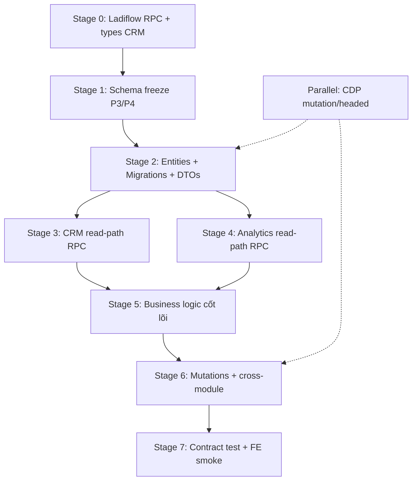
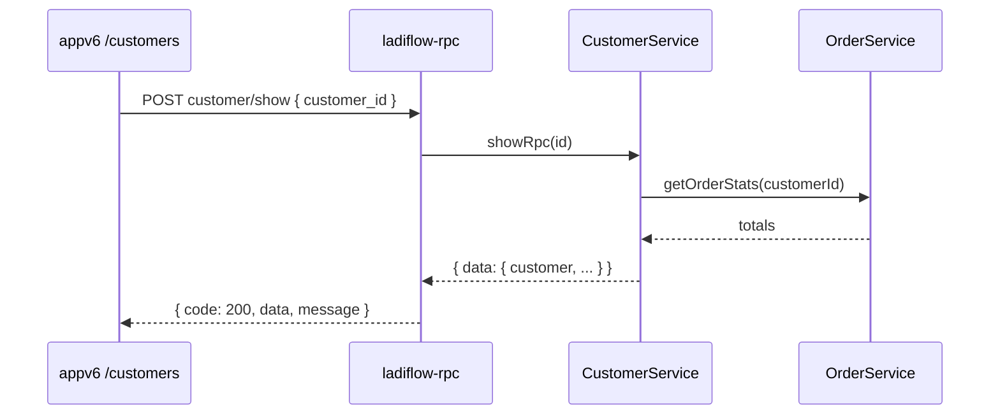

# Kế hoạch triển khai BE Phase 3 & 4 — Dựng lại logic CRM + Báo cáo từ CDP

> **Mục tiêu:** Dựng lại logic backend **Khách hàng (LCRM)** và **Báo cáo/Analytics** chặt chẽ, bám contract thật từ CDP Phase 3–4, đủ để `appv6.ladipage.com` gọi API **không đổi UI**.  
> **Nguồn sự thật:** `tools/cdp-reverse-engineer/output/merged/` (đã merge P1–P4)  
> **Đích triển khai:** `apps/ladipage-backend/src/modules/{crm,analytics,dashboard,ladipage-rpc}/`  
> **Tiền đề:** Phase 1–2 BE (landing + ecom) theo `plan-be-phase1-2-implementation.md` — ít nhất Stage 0–2 (types, RPC scaffold, entity baseline) đã xong hoặc chạy song song.  
> **Ngày:** 2026-06-23

---

## 1. Tóm tắt điều hành

| Hạng mục | CDP (merged P1–P4) | Trạng thái BE hiện tại | Hành động |
|----------|-------------------|------------------------|-----------|
| Unique POST routes | **56** (+18 so với P1–2) | `ladipage-rpc`: 0 handler wired | Thêm **18 route P3/P4** vào registry |
| Merged tables | **21** (+5) | CRM entity ~5 cột/`lp_customer` | **Mở rộng** theo 68 fields CDP |
| Host CRM | `api.ladiflow.com/1.0/*` | Chưa có adapter | **Tạo Ladiflow RPC layer** |
| Host báo cáo sales | `apiv5.sales.ldpform.net/2.0/report/*` | `analytics` REST nội bộ | **Thêm RPC adapter** |
| Host dashboard CRM | `api.ladiflow.com/1.0/dash-board/*` | `dashboard` REST nội bộ | Bridge + RPC |
| `lp_customer` fields | **68** (list + show) | 5 cột (`name, phone, email, status`) | Migration alter + JSONB |
| `lp_customer_segment` | **16** fields | `lp_segment` (4 cột, tên bảng lệch) | Rename/align + rules JSONB |
| `lp_analytics_report` | **10** fields | Tính từ `OrderEntity` aggregate | Mapper RPC `report/*` |
| Mutation routes | **0** (toàn bộ phases) | CRM có REST CRUD | Song song HAR/headed → RPC create |

**Nguyên tắc vàng:** Mọi field response production trace về `sourceRoutes` trong `schema-tables-merged.json`. Không đoán field; gap ghi vào `schema-draft.json → gaps[]`.

**Phạm vi Phase 3–4 (18 routes mới so với baseline P1–2):**

| Phase | Routes mới | Host |
|-------|-----------|------|
| **P3 CRM** | 15 | `api.ladiflow.com/1.0/` (13) + `apiv5.sales` customer (2 cross-ref) |
| **P4 Báo cáo** | 3 core | `apiv5.sales` report (2) + ladiflow dashboard (1+) |

---

## 2. Kiến trúc tổng thể

### 2.1. Bốn tầng (mở rộng từ P1–2)

```
┌──────────────────────────────────────────────────────────────────┐
│  appv6.ladipage.com — KHÔNG đổi UI                               │
│  Gọi POST api.ladiflow.com/1.0/*  (CRM)                          │
│       POST apiv5.sales.ldpform.net/2.0/report/*  (Sales reports) │
└────────────────────────────┬─────────────────────────────────────┘
                             │ API Gateway / reverse proxy
┌────────────────────────────▼─────────────────────────────────────┐
│  Tầng 1a: Ladiflow RPC Adapter  POST /ladiflow/1.0/:res/:action  │
│  Tầng 1b: Ladipage RPC Adapter  POST /ladipage/:res/:action      │
│  - Headers: authorization, owner-id (ladiflow), store-id (sales) │
│  - Body: { lang: "vi", ... } giữ nguyên                          │
│  - Response: { data, message, code: 200 }                        │
└────────────────────────────┬─────────────────────────────────────┘
                             │
┌────────────────────────────▼─────────────────────────────────────┐
│  Tầng 2: Domain Services                                         │
│  CustomerService, SegmentService, TagService,                    │
│  AnalyticsReportService, DashboardWidgetService                  │
└────────────────────────────┬─────────────────────────────────────┘
                             │
┌────────────────────────────▼─────────────────────────────────────┐
│  Tầng 3: Persistence (TypeORM)                                   │
│  lp_customer*, lp_analytics_*, lp_dashboard_widget               │
└──────────────────────────────────────────────────────────────────┘
```

### 2.2. Khác biệt host — bắt buộc implement đúng

| Host | Path prefix | Header context | Module BE |
|------|-------------|----------------|-----------|
| `api.ladiflow.com` | `/1.0/` | `authorization` + **`owner-id`** | `crm`, `dashboard` |
| `apiv5.sales.ldpform.net` | `/2.0/` | `authorization` + **`store-id`** | `analytics`, `ecom-store` |
| `api.ladipage.com` | `/2.0/` | `store-id` | P1–2 (đã có plan) |

**Quy tắc mapping tenant:**

| LadiPage | NestJS |
|----------|--------|
| `owner_id` (ladiflow) | `tenant.ownerExternalId` hoặc `createdBy` |
| `store_id` | `tenantId` |
| `customer_id` (integer) | `CustomerEntity.externalId` (varchar) + `id` PK |
| `_id` (Mongo ObjectId) | `externalId` trên mọi entity CRM |

### 2.3. Dual-mode CRM (đã có trong codebase)

`CrmFacade` hỗ trợ:

- **V1 (LadiPage rebuild):** `CustomerService` → `lp_customer`
- **V2 (Enterprise CRM core):** `CrmPersonService` → `@liora/crm-core`

Phase 3 RPC adapter **ưu tiên V1 shape** (68 fields LCRM). Khi `isCrmEnabled()` → facade delegate nhưng **mapper output** phải giống `customer/list` production.

---

## 3. Baseline CDP — Inventory Phase 3 & 4

### 3.1. File bắt buộc

| File | Dùng cho |
|------|----------|
| `output/merged/unique-routes.json` | 56 routes — 18 route P3/P4 cần handler |
| `output/merged/schema-tables-merged.json` | 21 bảng — 5 bảng mới P3/P4 |
| `output/merged/ladipage-post-apis.json` | Sample request/response |
| `output/merged/typeorm-hints.json` | Column type gợi ý |
| `output/merged/schema-draft.json` | `gaps[]` — 176 gaps hiện tại |
| `output/api-probe-phase34/*/probe-hits.json` | Probe bổ sung |

### 3.2. Map route → module (Phase 3 — CRM)

| # | LadiPage route | Host | Schema table | Ưu tiên | Trạng thái BE |
|---|----------------|------|--------------|---------|---------------|
| 1 | `customer/list` | ladiflow | `lp_customer` | **P0** | REST có, RPC thiếu, 5/68 fields |
| 2 | `customer/show` | ladiflow | `lp_customer` | **P0** | Thiếu RPC + fields |
| 3 | `customer/customer-detail` | ladiflow | `lp_customer` | **P0** | Chưa có |
| 4 | `customer/activity` | ladiflow | `lp_customer_activity` *(mới)* | **P0** | Chưa có |
| 5 | `customer/list-customer-merge` | ladiflow | `lp_customer` | P1 | Chưa có |
| 6 | `segment/list` | ladiflow | `lp_customer_segment` | **P0** | `lp_segment` lệch tên |
| 7 | `customer-tag/list` | ladiflow | `lp_customer_tag` | **P0** | Có cơ bản |
| 8 | `customer-tag/list-all` | ladiflow | `lp_customer_tag` | **P0** | Có cơ bản |
| 9 | `custom-field/list-all` | ladiflow | `lp_customer_custom_field` | **P0** | Có scaffold |
| 10 | `crm-organization/list` | ladiflow | `lp_company` | P1 | items rỗng trial |
| 11 | `sync-error/list` | ladiflow | `lp_sync_error_log` | P2 | Entity có, route chưa capture |
| 12 | `ladipage-notification/list` | ladiflow | `lp_notification` | P2 | Chưa có |
| 13 | `progress-bar/list-sections-latest` | ladiflow | `lp_onboarding` | P2 | Delegate `dashboard/onboarding` |
| 14 | `call-center/list-integrations` | ladiflow | — | P3 | Stub empty |
| 15 | `broadcast/list` | ladiflow | `lp_broadcast` | P2 | Chưa có |
| 16 | `customer/show` | sales | `lp_customer` | P0 | Cross-ref order (đã có plan P2) |
| 17 | `data-form-error/list` | ladipage | `lp_lead` | P2 | Enterprise 499 — stub |

### 3.3. Map route → module (Phase 4 — Báo cáo)

| # | LadiPage route | Host | Output shape | Ưu tiên | Trạng thái BE |
|---|----------------|------|--------------|---------|---------------|
| 1 | `report/overview` | sales | summary + series chart | **P0** | `AnalyticsService` có logic tương tự REST |
| 2 | `report/top-product` | sales | `items[]` top SP | **P0** | Cần RPC mapper |
| 3 | `dash-board/list-subscriber-by-time` | ladiflow | time series subscribers | **P0** | Chưa có (status 0 headless) |
| 4 | `crm-insight-folder/list` | ladiflow | widget folders | P1 | Empty trial |
| 5 | `ladi-page/report` | ladipage/sales | per-page analytics | P1 | **Chưa capture** — probe miss |
| 6 | `report/sales`, `conversion`, … | sales | Dự đoán | P2 | Chưa capture — implement sau probe |

### 3.4. Bảng schema mới / cần mở rộng (P3/P4)

| Table | Fields CDP | Entity hiện tại | Hành động |
|-------|-----------|-----------------|-----------|
| `lp_customer` | **68** | 5 cột | **ALTER** + JSONB groups |
| `lp_customer_segment` | **16** | `lp_segment` 4 cột | **Rename/migrate** + align fields |
| `lp_customer_tag` | **13** | 1 cột `name` | ALTER thêm `alias`, `color`, `total`, … |
| `lp_customer_custom_field` | **4** | Có entity | Align `data_type`, `options` |
| `lp_company` | 0 (empty) | `CompanyEntity` có | Giữ entity, mapper khi có data |
| `lp_analytics_report` | **10** | Không có entity | **View/DTO only** — aggregate từ orders |
| `lp_dashboard` | 0 (ERR_FAILED) | Không có | DTO + cache từ `DashboardService` |
| `lp_customer_activity` | — | Không có | **Bảng mới** từ `customer/activity` |
| `lp_sync_error_log` | — | Có entity | Wire RPC khi capture |
| `lp_broadcast` | — | Không có | P2 — stub |

---

## 4. Lộ trình triển khai (7 giai đoạn)



**Ước lượng:** 18–24 ngày (1 dev) | 12–16 ngày (2 dev song song P3/P4)

---

## 5. Stage 0 — Foundation Ladiflow + Types (2–3 ngày)

### 5.1. Mở rộng `libs/ladipage-types`

```
apps/ladipage-backend/libs/ladipage-types/src/
├── crm/
│   ├── customer.types.ts         # 68 fields — list item + show detail
│   ├── customer-activity.types.ts
│   ├── segment.types.ts          # 16 fields
│   ├── customer-tag.types.ts     # 13 fields
│   ├── custom-field.types.ts
│   ├── company.types.ts
│   └── sync-error.types.ts
└── analytics/
    ├── report-overview.types.ts  # chart-friendly: labels, series, summary
    ├── report-top-product.types.ts
    ├── dashboard-subscriber.types.ts
    └── page-report.types.ts      # placeholder ladi-page/report
```

**Script:** mở rộng `tools/cdp-reverse-engineer/src/export-ts-types.ts`:

```bash
cd tools/cdp-reverse-engineer
npm run export:ts-types -- --tables lp_customer,lp_customer_segment,lp_customer_tag,lp_analytics_report
```

### 5.2. Ladiflow RPC module (mới)

```
apps/ladipage-backend/src/modules/ladiflow-rpc/
├── ladiflow-rpc.module.ts
├── ladiflow-rpc.controller.ts      # POST /ladiflow/1.0/:resource/:action
├── ladiflow-dispatcher.service.ts
├── ladiflow-context.guard.ts       # validate owner-id ↔ tenant
├── ladiflow-response.interceptor.ts
└── mappers/
    ├── customer.mapper.ts
    ├── segment.mapper.ts
    ├── tag.mapper.ts
    └── dashboard.mapper.ts
```

**Route registry mẫu:**

```typescript
const LADIFLOW_HANDLERS: Record<string, RpcHandler> = {
  'customer/list':       (b) => customerService.listRpc(b),
  'customer/show':       (b) => customerService.showRpc(b.customer_id),
  'customer/activity':   (b) => activityService.listRpc(b),
  'customer/customer-detail': (b) => customerService.detailRpc(b),
  'segment/list':        (b) => segmentService.listRpc(b),
  'customer-tag/list':   (b) => tagService.listRpc(b),
  'customer-tag/list-all': (b) => tagService.listAllRpc(b),
  'custom-field/list-all': (b) => customFieldService.listAllRpc(b),
  'crm-organization/list': (b) => companyService.listRpc(b),
  'dash-board/list-subscriber-by-time': (b) => dashboardService.subscribersByTimeRpc(b),
  // ...
};
```

### 5.3. Mở rộng `ladipage-rpc` — Phase 4 sales reports

Thêm vào `rpc-dispatcher.service.ts`:

```typescript
'report/overview':    (b) => analyticsReportService.overviewRpc(b),
'report/top-product': (b) => analyticsReportService.topProductRpc(b),
```

### 5.4. Gateway routing (production parity)

| FE gọi | Proxy tới |
|--------|-----------|
| `https://api.ladiflow.com/1.0/customer/list` | `ladipage-backend/ladiflow/1.0/customer/list` |
| `https://apiv5.sales.ldpform.net/2.0/report/overview` | `ladipage-backend/ladipage/report/overview` |

### 5.5. Deliverables Stage 0

- [ ] `libs/ladipage-types` — package `crm/` + `analytics/`
- [ ] `ladiflow-rpc` module scaffold
- [ ] 2 pilot handlers: `customer/list` + `report/overview`
- [ ] Unit test mapper với fixture `ladipage-post-apis.json`

---

## 6. Stage 1 — Schema freeze P3/P4 & gap closure (2 ngày)

### 6.1. Freeze schema v2

1. Chạy pipeline CDP P3/P4:
   ```bash
   cd tools/cdp-reverse-engineer
   npm run capture:phase34
   ```
2. Snapshot: `docs/reverse/snapshots/schema-freeze-v2-2026-06-23.json`
3. Metadata: `routeCount: 56`, `tableCount: 21`, `phase3Routes: 15`, `phase4Routes: 3`

### 6.2. Gap closure — ưu tiên P3/P4

| Gap | Mức | Cách đóng | Block BE? |
|-----|-----|-----------|-----------|
| Mutations CRM = 0 | Cao | `--headed` mutations config + HAR | Không — read-path trước |
| `customer/activity` status 0 | Cao | Re-capture detail + probe | Mapper stub `items: []` |
| `lp_company` items rỗng | Trung bình | Seed company trial | Entity + empty list OK |
| `lp_dashboard` ERR_FAILED | Trung bình | Headed `/dashboard` capture | Tính từ `CustomerEntity` fallback |
| `ladi-page/report` not found | Trung bình | Probe thêm hosts | Delegate `report/overview` + `page_id` filter |
| `data-form-error/list` 499 | Thấp | Document Enterprise | Stub `{ items: [], code: 499 }` |

### 6.3. Schema review checklist (P3/P4 tables)

Với mỗi bảng `lp_customer*`, `lp_analytics_report`:

- [ ] Đối chiếu `sourceRoutes` ↔ response 200 trong `ladipage-post-apis.json`
- [ ] Phân loại field **P0** (list UI) / **P1** (detail drawer) / **P2** (analytics internal)
- [ ] Quyết định column vs JSONB (xem §6.4)
- [ ] FK: `customer` ↔ `segment` (M2M), `customer` ↔ `tag` (M2M), `customer` ↔ `company` (M2M)
- [ ] Cross-ref: `customer_id` trong `lp_order` ↔ `lp_customer.externalId`

### 6.4. Quy tắc JSONB — CRM (field phức tạp)

| Entity | Field LadiPage (CDP) | Lưu DB |
|--------|----------------------|--------|
| `lp_customer` | `addresses[]` | JSONB `addresses` hoặc bảng `lp_customer_address` |
| `lp_customer` | `channels[]`, `social_profiles[]` | JSONB |
| `lp_customer` | `custom_fields[]` | `lp_customer_field_value` (đã có) |
| `lp_customer` | `order_stats` (avg_*, total_*) | Cột scalar denormalized + trigger recalc |
| `lp_customer_segment` | `multi_conditions[]` | JSONB `rules` (đã có trên `SegmentEntity`) |
| `lp_customer_activity` | `metadata`, `payload` | JSONB |
| `lp_analytics_report` | — | **Không persist** — materialized view hoặc query aggregate |

### 6.5. Field nhóm hóa `lp_customer` (68 → manageable)

```
Nhóm A — List P0 (customer/list table columns):
  customer_id, name, phone, email, avatar_color, tags[], segment_name,
  total_order, total_spent, updated_at, creator_id

Nhóm B — Detail P1 (customer/show):
  addresses, channels, custom_fields, social_profiles, note, gender, dob, ...

Nhóm C — Analytics denormalized P1:
  avg_order_value, avg_paid_order_value, bounce, complaint, total_pageviews, ...

Nhóm D — Internal P2:
  alias, merge_status, sync_*, ladiflow-specific ids
```

---

## 7. Stage 2 — Entities, Migrations, DTOs (4–5 ngày)

### 7.1. Thứ tự migration (dependency)

```
PR-P34-2.1  lp_customer ALTER (externalId, 68 fields grouped)
PR-P34-2.2  lp_customer_segment (rename lp_segment → lp_customer_segment OR alter)
PR-P34-2.3  lp_customer_tag ALTER
PR-P34-2.4  lp_customer_custom_field + lp_customer_field_value align
PR-P34-2.5  lp_customer_activity (NEW)
PR-P34-2.6  lp_customer_address (NEW, optional nếu tách khỏi JSONB)
PR-P34-2.7  lp_company align (crm-organization)
PR-P34-2.8  lp_sync_error_log (wire existing entity)
PR-P34-2.9  Indexes: (tenant_id, external_id), (tenant_id, phone), (tenant_id, email)
```

### 7.2. Entity mở rộng — `CustomerEntity`

**Hiện tại:** 5 cột.  
**Mục tiêu:** Map 68 fields CDP.

```typescript
@Entity('lp_customer')
export class CustomerEntity extends TenantScopedEntity {
  @Column({ type: 'varchar', length: 24, nullable: true })
  externalId: string | null          // LadiPage customer_id / _id

  @Column({ type: 'varchar', length: 255 })
  name: string

  @Column({ type: 'varchar', length: 30 })
  phone: string

  // ... scalar P0/P1 fields từ CDP ...

  @Column({ type: 'jsonb', nullable: true })
  addresses: CustomerAddressDto[]

  @Column({ type: 'jsonb', nullable: true })
  channels: Record<string, unknown>[]

  @Column({ type: 'int', default: 0 })
  totalOrder: number

  @Column({ type: 'decimal', precision: 14, scale: 2, default: 0 })
  totalSpent: number

  // Denormalized stats — recalc từ orders
  @Column({ type: 'int', default: 0 })
  avgOrderValue: number
}
```

### 7.3. Entity align — `SegmentEntity`

| CDP field | Hiện tại | Action |
|-----------|----------|--------|
| `_id` | — | `externalId` |
| `alias` | — | thêm column |
| `multi_conditions` | `rules` JSONB | rename mapper |
| `type` (DEFAULT/CUSTOM) | — | enum column |
| `total` (count) | — | computed hoặc cached |
| `operator` (OR/AND) | — | column |
| `use_by_flow` | — | boolean |

**Quyết định bảng:** Migration `RENAME lp_segment TO lp_customer_segment` hoặc giữ `lp_segment` + `@Entity('lp_customer_segment')` — **chọn 1**, document trong `field-mapping.md`.

### 7.4. DTO layers (mỗi resource CRM)

```
apps/ladipage-backend/src/modules/crm/dto/
├── customer.dto.ts              # REST (đã có — mở rộng)
├── customer-rpc-query.dto.ts    # Mirror ladiflow body
├── customer-rpc-response.dto.ts # Shape list/show/activity
├── segment-rpc.dto.ts
├── tag-rpc.dto.ts
├── custom-field-rpc.dto.ts
├── company-rpc.dto.ts
└── activity-rpc.dto.ts
```

**RPC query DTO ví dụ (`customer/list`):**

```typescript
export class CustomerListRpcDto {
  @IsOptional() @IsString() lang?: string;
  @IsOptional() @IsObject() search?: { name?: string };
  @IsOptional() @IsInt() page?: number;
  @IsOptional() @IsInt() limit?: number;
  @IsOptional() @IsArray() tags?: string[];
  @IsOptional() @IsObject() sort?: Record<string, 'ASC' | 'DESC'>;
}
```

### 7.5. DTO layers (Analytics)

```
apps/ladipage-backend/src/modules/analytics/dto/
├── report-query.dto.ts           # REST (đã có)
├── report-overview-rpc.dto.ts    # from_date, to_date, lang
├── report-top-product-rpc.dto.ts
└── report-response.dto.ts        # chart shape
```

### 7.6. Script codegen

| Script | Input | Output |
|--------|-------|--------|
| `export-ts-types.ts` | `schema-tables-merged.json` | `libs/ladipage-types/src/crm/*.ts` |
| `export-entities-draft.ts` | `typeorm-hints.json` (filter P3/P4) | `*.entity.draft.ts` |
| `export-ladiflow-registry.ts` | ladiflow routes từ `unique-routes.json` | `ladiflow-handlers.registry.ts` |

### 7.7. Deliverables Stage 2

- [ ] 8–9 migration files P3/P4
- [ ] `CustomerEntity` coverage ≥ 90% P0+P1 fields
- [ ] Segment/Tag/CustomField align CDP
- [ ] RPC DTO + response mapper cho 8 route P0
- [ ] `pnpm typecheck` pass

---

## 8. Stage 3 — Phase 3: CRM read-path RPC (5–6 ngày)

### 8.1. `customer/list` — P0

**Request mẫu (CDP):**

```json
{
  "lang": "vi",
  "search": { "name": "" },
  "page": 1,
  "limit": 20,
  "tags": [],
  "sort": { "updated_at": "DESC" }
}
```

**Response mẫu:**

```json
{
  "data": {
    "total": 1,
    "limit": 20,
    "items": [ { "customer_id": 13427358, "name": "...", ... } ]
  },
  "message": "Thành công",
  "code": 200
}
```

**Implement:**

```typescript
async listRpc(dto: CustomerListRpcDto): Promise<CustomerListRpcResponse> {
  const tenantId = this.requireTenantId();
  const qb = this.customerRepository.createQueryBuilder('c')
    .where('c.tenantId = :tenantId', { tenantId });

  if (dto.search?.name) {
    qb.andWhere('c.name ILIKE :name', { name: `%${dto.search.name}%` });
  }
  if (dto.tags?.length) {
    qb.innerJoin('c.tagMaps', 'tm').andWhere('tm.tagId IN (:...tags)', { tags: dto.tags });
  }
  // sort mapper: updated_at → updatedAt
  const { items, total } = await paginate(qb, { page: dto.page, limit: dto.limit });
  return {
    total,
    limit: dto.limit ?? 20,
    items: items.map(CustomerMapper.toListItem),
  };
}
```

### 8.2. `customer/show` + `customer/customer-detail` — P0

| Route | Khác biệt |
|-------|-----------|
| `customer/show` | Full customer + tags + segments + order summary |
| `customer/customer-detail` | Extended: activities preview, merge info, custom fields |

Load relations:

```
Customer
├── tagMaps[]        → CustomerTagEntity
├── segmentMaps[]    → CustomerSegmentEntity
├── fieldValues[]    → CustomerFieldValueEntity
├── companyMaps[]    → CompanyEntity
└── (computed)       → order stats từ OrderEntity
```

### 8.3. `customer/activity` — P0

**Bảng mới `lp_customer_activity`:**

| Column | Type | Ghi chú |
|--------|------|---------|
| `customerId` | FK | |
| `activityType` | varchar | order, note, email, pageview, … |
| `title` | varchar | |
| `occurredAt` | timestamptz | |
| `metadata` | jsonb | opaque payload |

Nguồn dữ liệu ban đầu (rebuild):

1. `OrderEntity` → activity type `ORDER_CREATED`
2. CRM notes (nếu có)
3. Stub pageview khi chưa có tracking service

### 8.4. `segment/list` — P0

Response CDP: `data.items[]` với `multi_conditions`, `total` (subscriber count).

```typescript
async listRpc(dto): Promise<{ items: SegmentRpcItem[]; total: number }> {
  const segments = await this.segmentRepository.find({ where: { tenantId } });
  const items = await Promise.all(segments.map(async (s) => ({
    ...SegmentMapper.toRpcItem(s),
    total: await this.countCustomersInSegment(s.id),
  })));
  return { items, total: items.length };
}
```

### 8.5. `customer-tag/list` + `list-all` — P0

| Route | Khác biệt |
|-------|-----------|
| `list` | Paginated + search |
| `list-all` | Toàn bộ tags (dropdown) — không phân trang |

### 8.6. `custom-field/list-all` — P0

Trả definitions (không có values). Values nằm trong `customer/show → custom_fields[]`.

### 8.7. `crm-organization/list` — P1

Map `CompanyEntity` → LadiPage `items[]`. Trial empty → `{ total: 0, items: [] }` (đúng production).

### 8.8. RPC handlers — thứ tự implement

1. `customer/list` — P0
2. `customer/show` — P0
3. `segment/list` — P0
4. `customer-tag/list` + `list-all` — P0
5. `custom-field/list-all` — P0
6. `customer/activity` — P0
7. `customer/customer-detail` — P0
8. `customer/list-customer-merge` — P1
9. `crm-organization/list` — P1
10. `ladipage-notification/list` — P2 stub
11. `progress-bar/list-sections-latest` — P2 → `dashboard/onboarding`
12. `broadcast/list` — P2 stub
13. `call-center/list-integrations` — P3 stub `[]`

### 8.9. Test Phase 3

| Test | Verify |
|------|--------|
| Contract `customer/list` | Keys match `ladipage-post-apis.json` |
| Contract `segment/list` | `multi_conditions` structure |
| Tenant isolation | 2 tenant không thấy customer của nhau |
| Cross-ref order | `order.customer_id` resolve được `customer/show` |
| Facade dual-mode | `isCrmEnabled()` output shape giống V1 |

---

## 9. Stage 4 — Phase 4: Analytics read-path RPC (4–5 ngày)

### 9.1. `report/overview` — P0

**Host:** `apiv5.sales.ldpform.net`  
**Request:**

```json
{
  "lang": "vi",
  "from_date": "2026-05-24 00:00:00 +07:00",
  "to_date": "2026-06-23 23:59:59 +07:00"
}
```

**Response shape (chart-friendly):**

```json
{
  "data": {
    "summary": {
      "total_revenue": 0,
      "total_orders": 1,
      "total_customers": 1,
      "conversion_rate": 0
    },
    "labels": ["2026-06-01", "..."],
    "series": {
      "revenue": [0, 100, ...],
      "orders": [0, 1, ...]
    }
  },
  "code": 200
}
```

**Implement:** Tận dụng `AnalyticsService.getSalesReport()` — thêm `overviewRpc()` wrap đúng shape LadiPage (khác REST nội bộ).

```typescript
async overviewRpc(dto: ReportOverviewRpcDto) {
  const range = parseLadipageDateRange(dto.from_date, dto.to_date);
  const internal = await this.getSalesReport(range.from, range.to);
  return ReportMapper.toOverviewRpc(internal);
}
```

### 9.2. `report/top-product` — P0

**Response CDP (`lp_analytics_report` fields):**

```
name, product_id, product_type, quantity, num_order, total, source, refund, restock, up_sell_ids
```

**Query:**

```sql
SELECT p.name, p.external_id AS product_id, ...
FROM lp_order_item oi
JOIN lp_order o ON ...
JOIN lp_product p ON ...
WHERE o.tenant_id = ? AND o.created_at BETWEEN ? AND ?
GROUP BY p.id
ORDER BY quantity DESC
LIMIT 20
```

### 9.3. `dash-board/list-subscriber-by-time` — P0

**Host:** ladiflow  
**Fallback khi CDP gap:** Tính từ `CustomerEntity.createdAt` grouped by day.

```typescript
async subscribersByTimeRpc(dto) {
  const rows = await this.customerRepository
    .createQueryBuilder('c')
    .select("DATE_TRUNC('day', c.created_at)", 'day')
    .addSelect('COUNT(*)', 'count')
    .where('c.tenantId = :tenantId', { tenantId })
    .andWhere('c.created_at BETWEEN :from AND :to', { from, to })
    .groupBy('day')
    .getRawMany();
  return DashboardMapper.toSubscriberSeries(rows);
}
```

### 9.4. `crm-insight-folder/list` — P1

Widget folders cho dashboard CRM. Trial empty → stub. Sau này: bảng `lp_analytics_widget`.

### 9.5. Per-page report (`ladi-page/report`) — P1

**Trạng thái CDP:** chưa capture.  
**Chiến lược tạm:**

```typescript
async pageReportRpc(dto: { id: string; from_date; to_date }) {
  // Filter report/overview + leads từ lp_page WHERE external_id = dto.id
  const overview = await this.overviewRpc({ ...dto, page_id: dto.id });
  const leads = await this.leadService.countByPage(dto.id, range);
  return { ...overview, pageviews: 0, leads };
}
```

Re-capture khi có sample → adjust mapper.

### 9.6. REST ↔ RPC mapping

| REST nội bộ (đã có) | RPC LadiPage |
|---------------------|--------------|
| `GET /analytics/reports/sales` | `report/overview` (subset) |
| `GET /analytics/reports/business` | `report/top-product` + conversion |
| `GET /dashboard/summary` | `dash-board/*` + cards |
| `GET /crm/customers` | `customer/list` |

### 9.7. RPC handlers Phase 4 — thứ tự

1. `report/overview` — P0
2. `report/top-product` — P0
3. `dash-board/list-subscriber-by-time` — P0
4. `crm-insight-folder/list` — P1
5. `ladi-page/report` — P1 (composite)
6. `report/sales`, `conversion` — P2 (sau probe)

---

## 10. Stage 5 — Business logic cốt lõi (4–5 ngày)

### 10.1. CRM — Customer logic

| Flow | Rules |
|------|-------|
| **List customers** | Default `sort.updated_at DESC`, limit 20, search `name` ILIKE |
| **Dedup phone/email** | Unique per tenant — `findOrCreateFromOrder()` đã có, mở rộng |
| **Auto-create from order** | `OrderCustomerResolver` → `CustomerService.findOrCreate` → set `externalId` |
| **Tag assign** | M2M `lp_customer_tag_map` — denormalize `tag_names[]` trong list response |
| **Segment membership** | Static: explicit map; Dynamic: evaluate `multi_conditions` (phase 2 logic) |
| **Merge customers** | `list-customer-merge` → detect same phone/email — mark `merge_status` |
| **Stats denormalize** | On `order.paid` → recalc `total_order`, `total_spent`, `avg_*` trên customer |
| **Activity feed** | Append-only `lp_customer_activity` on order/note/tag change |

### 10.2. CRM — Segment logic

| Flow | Rules |
|------|-------|
| **Default segments** | Seed `New Subscribers`, `All Customers` (`type: DEFAULT`) on tenant create |
| **Custom segment** | `type: CUSTOM`, `multi_conditions` JSONB |
| **Count refresh** | `last_count_at` + `total` — cron hoặc on-demand khi `list` |
| **Operator** | `OR` / `AND` across condition groups |

### 10.3. CRM — Custom field logic

| Flow | Rules |
|------|-------|
| **Definitions** | `custom-field/list-all` — global per tenant |
| **Values** | Per customer in `customer/show` |
| **Validation** | `data_type`: text, number, date, select — mirror LadiPage |

### 10.4. Analytics — Report logic

| Flow | Rules |
|------|-------|
| **Date range** | Parse `from_date`/`to_date` với timezone `+07:00` |
| **Default range** | 30 ngày nếu body thiếu |
| **Revenue** | Sum `order.total` WHERE `status IN (Paid, Completed, ...)` |
| **Top products** | Aggregate `order_item` JOIN `product`, sort `quantity DESC` |
| **Empty state** | Trả `series: []` + `summary zeros` — không 404 |
| **Cache** | Redis/in-memory 5 phút cho `report/overview` (optional P1) |

### 10.5. Dashboard — Widget logic

| Flow | Rules |
|------|-------|
| **Subscriber chart** | `dash-board/list-subscriber-by-time` |
| **Onboarding** | `progress-bar/list-sections-latest` → derive từ data thật (pages, products, orders) |
| **Insight folders** | CRM widgets — stub until capture |

### 10.6. Cross-module flows



| Trigger | Action |
|---------|--------|
| `order.created` | Upsert customer + activity + recalc stats |
| `order.status → Paid` | Update `avg_paid_order_value`, `total_spent` |
| `customer.created` | Increment dashboard subscriber count |
| `segment.updated` | Invalidate segment `total` cache |

### 10.7. Shared services (mới / mở rộng)

```
apps/ladipage-backend/src/common/services/
├── ladiflow-pagination.service.ts   # page/limit ↔ offset
├── customer-stats.service.ts        # recalc denormalized fields
├── segment-evaluator.service.ts     # multi_conditions (P1)
└── report-aggregate.service.ts      # shared SQL cho overview + top-product
```

---

## 11. Stage 6 — Mutations & Enterprise stubs (3–4 ngày)

> Chạy song song CDP headed; không block read-path đã ship.

### 11.1. CRM mutations (dự kiến từ CDP/HAR)

| Route dự kiến | REST equivalent | Ghi chú |
|---------------|-----------------|---------|
| `customer/create` | `POST /crm/customers` | Form "Tạo khách hàng" |
| `customer/update` | `PATCH /crm/customers/:id` | Detail drawer |
| `customer/delete` | `DELETE /crm/customers/:id` | Soft delete `is_delete` |
| `segment/create` | `POST /crm/segments` | |
| `customer-tag/create` | `POST /crm/tags` | |

### 11.2. Implement pattern

```typescript
async createRpc(dto: CustomerCreateRpcDto) {
  assertLpCrmWritable(tenant);  // trial limit
  const customer = await this.create(this.fromRpcDto(dto));
  return { customer: CustomerMapper.toShowItem(customer) };
}
```

### 11.3. Enterprise-only stubs

| Route | Behavior |
|-------|----------|
| `data-form-error/list` | `{ code: 499, message: '...' }` hoặc empty |
| `call-center/list-integrations` | `{ data: { items: [] } }` |
| `broadcast/list` | `{ data: { items: [] } }` |

---

## 12. Stage 7 — Kiểm thử & nối FE (3–4 ngày)

### 12.1. Contract test suite

```
apps/ladipage-backend/test/contract/
├── fixtures/phase3/
│   ├── customer-list.json
│   ├── customer-show.json
│   ├── segment-list.json
│   └── customer-tag-list.json
├── fixtures/phase4/
│   ├── report-overview.json
│   └── report-top-product.json
├── phase3/
│   ├── customer-list.spec.ts
│   ├── customer-show.spec.ts
│   └── segment-list.spec.ts
└── phase4/
    ├── report-overview.spec.ts
    └── report-top-product.spec.ts
```

**Assert:**

- Deep equal keys (cho phép extra `null`)
- `code === 200`
- `data.items` hoặc `data.summary` structure đúng
- Field `customer_id` là number trong response (adapter convert từ `externalId`)

### 12.2. Integration test flows

| # | Flow |
|---|------|
| 1 | Seed tenant → 2 customers, 1 segment, 2 tags → `customer/list` |
| 2 | Create order với phone → auto-link → `customer/show` có order stats |
| 3 | Date range 30 ngày → `report/overview` + `report/top-product` |
| 4 | Dashboard subscriber chart ≥ 1 point |

### 12.3. FE smoke (không đổi UI)

| Màn appv6 | RPC cần pass |
|-----------|--------------|
| `/customers` | `customer/list`, `customer-tag/list-all`, `custom-field/list-all` |
| `/customers` → detail | `customer/show`, `customer/activity` |
| `/customers/segments` | `segment/list` |
| `/customers/tags` | `customer-tag/list` |
| `/reports` | `report/overview`, `report/top-product` |
| `/dashboard` | `dash-board/list-subscriber-by-time` |
| `/ladipage` → Báo cáo | `report/overview` (filtered) hoặc `ladi-page/report` |

### 12.4. Definition of Done (DoD) Phase 3–4

- [ ] 18/18 route P3/P4 có handler (hoặc documented stub)
- [ ] 5 bảng CRM mới/alter có migration
- [ ] `lp_customer` ≥ 90% field P0+P1 trong show response
- [ ] Contract test pass ≥ 95% key match
- [ ] Gateway proxy ladiflow + sales report hoạt động
- [ ] Cross-ref `order.customer_id` ↔ `customer/show` verified
- [ ] `routes.md` + `field-mapping.md` cập nhật

---

## 13. Kế hoạch PR (DAG)

```
main (sau P1–2 PR-01..05)
 │
 ├─ PR-P34-01  libs/ladipage-types crm/ + analytics/
 │
 ├─ PR-P34-02  ladiflow-rpc module + context guard
 │    └─ PR-P34-03  Handlers: customer/list, customer/show (pilot)
 │
 ├─ PR-P34-04  Migrations: lp_customer alter + indexes
 │    └─ PR-P34-05  CustomerMapper + list/show RPC hoàn chỉnh
 │         └─ PR-P34-06  customer/activity + customer-detail
 │
 ├─ PR-P34-07  lp_customer_segment align + segment/list RPC
 │    └─ PR-P34-08  customer-tag + custom-field RPC
 │
 ├─ PR-P34-09  crm-organization/list + company mapper
 │
 ├─ PR-P34-10  Analytics: report/overview + top-product RPC
 │    └─ PR-P34-11  dash-board/list-subscriber-by-time
 │
 ├─ PR-P34-12  Business logic: stats recalc, activity feed, segment count
 │
 ├─ PR-P34-13  ladi-page/report composite + crm-insight-folder stub
 │
 ├─ PR-P34-14  Mutations (sau CDP headed): customer/segment/tag create
 │
 └─ PR-P34-15  Contract tests + FE smoke + docs
```

**Song song không block:**

- PR-MUT-P34: CDP mutation capture headed
- PR-GW: API gateway ladiflow host routing
- PR-ENTERPRISE: stubs call-center, broadcast, data-form-error

---

## 14. Ước lượng thời gian

| Stage | 1 dev | 2 dev (P3 ∥ P4) |
|-------|-------|------------------|
| 0 Foundation ladiflow | 2–3 | 2 |
| 1 Schema freeze P3/P4 | 2 | 1 |
| 2 Entities/DTOs | 4–5 | 3 |
| 3 CRM RPC | 5–6 | — |
| 4 Analytics RPC | — | 4–5 |
| 5 Business logic | 4–5 | 3 |
| 6 Mutations | 3–4 | 2 |
| 7 Test + FE | 3–4 | 2 |
| **Tổng** | **23–29** | **15–20** |

*Ghi chú: Nếu Phase 1–2 Stage 0–2 chưa xong, cộng thêm 3–5 ngày.*

---

## 15. Rủi ro & giảm thiểu

| Rủi ro | Mức | Giảm thiểu |
|--------|-----|------------|
| Ladiflow `owner-id` ≠ `store-id` | **Cao** | `ladiflow-context.guard` + mapping table |
| `customer/list` ERR_FAILED headless | Cao | Probe + fixture; contract test dùng captured JSON |
| 68 fields customer — mapper phức tạp | Trung bình | Nhóm P0/P1/P2; JSONB cho array |
| `lp_segment` vs `lp_customer_segment` | Trung bình | Migration rename 1 lần, document |
| Không có `ladi-page/report` sample | Trung bình | Composite từ overview + page filter |
| Trial account limits (LCRM TRIAL) | Trung bình | `assertLpCrmWritable` + graceful errors |
| Dual CRM mode (V1/V2) shape lệch | Cao | Facade always map → LadiPage shape |
| Report timezone +07:00 | Trung bình | `parseLadipageDateRange` utility |

---

## 16. Checklist hàng ngày

1. `npm run capture:phase34` — route/gap mới?
2. Contract test diff P3/P4
3. `%` ladiflow handler coverage (mục tiêu 15/15)
4. `%` report handler coverage (mục tiêu 3/3 core)
5. Log vào `docs/reverse/implementation-log.md`

---

## 17. Tài liệu phải tạo kèm theo

| File | Nội dung |
|------|----------|
| `docs/reverse/phase3-khachhang-api.md` | 15 routes CRM: request/response tables |
| `docs/reverse/phase4-baocao-api.md` | Report routes + chart shape |
| `docs/reverse/field-mapping-p34.md` | DB ↔ LadiPage field (customer 68 fields) |
| `docs/reverse/schema-freeze-v2.json` | Snapshot merged P1–P4 |
| `docs/reverse/ladiflow-vs-ladipage-hosts.md` | Host routing guide |
| `apps/ladipage-backend/routes.md` | Cập nhật RPC registry |

---

## 18. Lệnh nhanh

```bash
# CDP refresh P3/P4
cd tools/cdp-reverse-engineer
npm run capture:phase34

# Schema → types + TypeORM
npm run merge:schema && npm run export:typeorm && npm run export:ts-types

# Backend dev
cd apps/ladipage-backend
pnpm start:dev

# Contract test (sau khi tạo)
pnpm test:contract -- --grep "phase3|phase4"
```

---

## 19. Bước tiếp theo ngay (Action items)

| # | Việc | PR | ETA |
|---|------|-----|-----|
| 1 | `export-ts-types` cho `lp_customer`, `lp_customer_segment` | PR-P34-01 | Ngày 1 |
| 2 | Scaffold `ladiflow-rpc` + pilot `customer/list` | PR-P34-02/03 | Ngày 2–3 |
| 3 | Migration `lp_customer` alter (externalId + stats) | PR-P34-04 | Ngày 3–4 |
| 4 | Song song: `report/overview` RPC | PR-P34-10 | Ngày 3–5 |
| 5 | CDP headed mutations CRM | PR-MUT-P34 | Song song |
| 6 | Contract test `customer/list` + `report/overview` | PR-P34-15 | Tuần 3 |

---

## 20. Tham chiếu

| Tài liệu | Vai trò |
|----------|---------|
| `plan-be-phase1-2-implementation.md` | Pattern 6 stage, RPC adapter, PR DAG |
| `plan-reverse-engineering-ladipage.md` §6–7 | CDP methodology Phase 3/4 |
| `tools/cdp-reverse-engineer/output/merged/` | **Source of truth** schema |
| `apps/ladipage-backend/src/modules/crm/` | Baseline CRM (5-field customer) |
| `apps/ladipage-backend/src/modules/analytics/` | Baseline reports (REST) |
| `apps/ladipage-backend/src/modules/dashboard/` | Baseline dashboard |
| `apps/ladipage-backend/src/modules/ladipage-rpc/` | RPC dispatcher (mở rộng report/*) |