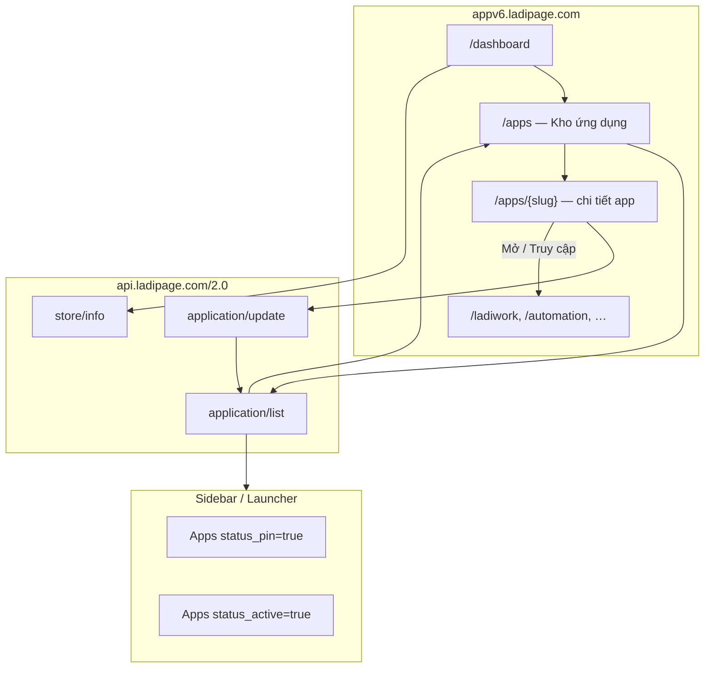

# Kế hoạch BE — Phase A Kho ứng dụng (từ CDP 2026-06-24)

> **Nguồn sự thật:** `tools/cdp-reverse-engineer/output/phaseA-kho-ung-dung-{read,mutations}/2026-06-24*`  
> **Merged:** `lp_application` 15 fields · routes `application/list`, `application/update`  
> **Host:** `api.ladipage.com/2.0/` · Header: `store-id` + `authorization`  
> **FE URL:** `https://appv6.ladipage.com/apps` (không dùng `/applications` — redirect dashboard)

---

## 1. Kết quả CDP vừa chạy

### 1.1. Lệnh đã chạy

```bash
# Read-path
node src/index.ts --config config.phaseA-kho-ung-dung-read.json
# → output/phaseA-kho-ung-dung-read/2026-06-24T13-53-04-470Z

# Mutations (headed)
node src/index.ts --config config.phaseA-kho-ung-dung-mutations.json --headed
# → output/phaseA-kho-ung-dung-mutations/2026-06-24T13-55-42-948Z

# Merge + export
npm run merge:schema && npm run export:ts-types && npm run export:contract-fixtures
```

### 1.2. Routes Phase A (Ladipage POST)

| Route | Loại | Status | Ghi chú |
|-------|------|--------|---------|
| `POST api.ladipage.com/2.0/application/list` | read | 200 | Catalog toàn bộ app của store |
| `POST api.ladipage.com/2.0/application/update` | **mutation** | 200 | Kích hoạt + ghim + cập nhật trạng thái |
| `POST api.ladipage.com/2.0/store/info` | read (bootstrap) | 200 | Context store + user + app hiện tại |
| `POST apiv5.sales.ldpform.net/2.0/store/get-user-info` | read | 200 | Profile user |
| `POST apiv5.sales.ldpform.net/2.0/store/show` | read | 200 | Settings apps page |

**Không capture được** (không tồn tại hoặc UI không gọi):
- `application/search`, `application/show`, `application/activate`, `application/install`, `application/pin` — **tất cả gộp vào `application/update`**

### 1.3. Mutation samples (2026-06-24)

**Kích hoạt + ghim LadiWork** (từ phaseB/board capture trước):
```json
{ "lang": "vi", "code": "LadiWork", "status_active": true, "status_pin": true }
```

**Ghim Affiliate** (headed mutations hôm nay):
```json
{ "lang": "vi", "code": "Affiliate", "status_pin": true }
```

### 1.4. Catalog `application/list` — 8 app codes

| code | name | price (VND) | Trial state |
|------|------|-------------|-------------|
| `WebsiteBuilder` | Business Website | 0 | active + pin |
| `LinkBuilder` | Link Builder | 259000 | active + pin |
| `BlogNewsletter` | Blog & Newsletter | 259000 | active + pin |
| `Dynamic` | Dynamic | 259000 | active + pin |
| `Automation` | Automation | 0 | active (cần kích hoạt trên trial mới) |
| `Ecommerce` | Ecommerce | 259000 | active + pin |
| `LadiWork` | LadiWork | 0 | active + pin |
| `Elearning` | Elearning | — | trong list |

`Affiliate` xuất hiện sau khi user điều hướng `/apps/affiliate` và pin.

### 1.5. Schema `lp_application` (15 fields)

`_id`, `store_id`, `owner_id`, `ladi_uid`, `name`, `code`, `logo`, `thumb`, `price`, `status_active`, `status_actived_at`, `status_pin`, `is_delete`, `created_at`, `updated_at`

Types: `libs/ladipage-types/src/landing/application.types.ts` → `LpApplication`

### 1.6. Gap CDP còn lại

| Gap | Hành động sau |
|-----|---------------|
| `status_active: false` / deactivate | Headed: tắt app trên UI → capture `application/update` |
| Activate Automation từ chưa active | Selector `activate-automation` chưa click đúng — cần inspect UI |
| `application/search` | Có thể FE filter client-side — verify Network khi đấu nối FE |
| HAR / Heap / Frida | Theo `plan-capture-heap-cdp-frida-har.md` §4.5 (tùy chọn) |

---

## 2. Luồng hoạt động Kho ứng dụng

### 2.1. Tổng quan kiến trúc

Kho ứng dụng **không phải** microservice riêng — là **catalog + lifecycle** trên nền Ladipage Store. Mỗi app (`code`) khi active sẽ mở module FE riêng (LadiWork → `/ladiwork`, Automation → `/automation`, …).



### 2.2. Luồng chi tiết — Mở Kho ứng dụng

1. User đăng nhập → session cookies (`SSID`, `STORE_ID`) trong `.session/ladipage-appv6-auth.json`
2. FE load `/apps` (hoặc click menu **Kho ứng dụng**)
3. **Bootstrap song song** (sidebar đã mount):
   - `ladipage-notification/list` — badge thông báo
   - `store/info` — gói STARTER, addon trial, staff limits
   - `store/get-user-info` — profile owner
4. **Core:** `POST application/list { lang: "vi" }` + header `store-id`
5. FE render grid/list app từ `data[]` — mỗi item có `code`, `name`, `logo`, `thumb`, `price`, `status_active`, `status_pin`
6. Tìm kiếm: CDP fill `"LadiWork"` vào search — **không thấy POST mới** → filter **client-side** trên catalog đã load

### 2.3. Luồng — Kích hoạt / Ghim app

1. User chọn app (vd. Automation, Affiliate) trên `/apps` hoặc `/apps/affiliate`
2. Click **Kích hoạt** / **Dùng thử** / **Ghim**
3. FE gọi **một** endpoint mutation:

```
POST api.ladipage.com/2.0/application/update
Headers: store-id, authorization
Body: { lang, code, status_active?, status_pin? }
```

4. Response trả record `lp_application` đã cập nhật
5. FE gọi lại `application/list` (hoặc patch local state) → sidebar cập nhật pin/active

**Quy tắc business (suy từ CDP):**
- `code` là khóa nghiệp vụ (không phải `_id`) — unique per store
- `status_active: true` → app xuất hiện trong launcher, cho phép **Mở**
- `status_pin: true` → app ghim sidebar
- `price > 0` → app trả phí; `price === 0` → miễn phí / trial (LadiWork, Automation, WebsiteBuilder)
- Record chưa từng kích hoạt: `application/update` có thể **tạo mới** (Affiliate `_id` mới khi pin)

### 2.4. Luồng — Mở app từ catalog

1. User click **Mở** / **Truy cập** trên app `status_active === true`
2. FE navigate theo `code`:
   - `LadiWork` → `/ladiwork` → Phase B APIs (`crm-pipeline/list`, …)
   - `Automation` → `/automation/flows` → Phase C APIs
   - `Ecommerce` → module bán hàng → Phase 2 APIs
3. `store/info` có thể gọi lại với `app_code` để load context app

### 2.5. Quan hệ Store ↔ Application

```
Store (1) ──< Application (N)   [per code, per store_id]
Owner (ladi_uid) ── owns ──> Store
```

Mỗi bản ghi `lp_application` gắn `store_id` + `owner_id` + `code` catalog cố định.

---

## 3. Kiến trúc BE đề xuất

### 3.1. Module layout

```
apps/ladipage-backend/src/modules/
  app-store/                          # NEW — Phase A domain
    app-store.module.ts
    entities/
      store-application.entity.ts     # lp_application
    services/
      application-catalog.service.ts  # list, search (client mirror)
      application-lifecycle.service.ts # update (activate/pin/deactivate)
      application-seed.store.ts       # pilot: fixture phaseA (giống ladiwork)
    app-store-rpc.registrar.ts        # wire ladipage-rpc handlers
  ladipage-rpc/
    mappers/landing/application.mapper.ts
```

**Pilot nhanh (sau đấu nối FE):** `ApplicationSeedStore` đọc `fixtures/phaseA/application__list.json` — pattern giống `LadiworkSeedStore`.

**Production:** TypeORM `StoreApplicationEntity` bảng `lp_store_application` hoặc `lp_application`.

### 3.2. RPC wiring (ladipage-rpc)

| Route | Handler | Service method |
|-------|---------|----------------|
| `application/list` | `ApplicationCatalogService.list` | Trả `data: LpApplication[]` |
| `application/update` | `ApplicationLifecycleService.update` | Upsert theo `code` + patch flags |

Registrar pattern: copy `LadiworkRpcRegistrar` → `AppStoreRpcRegistrar` + `RpcDispatcherService.registerHandler()`.

### 3.3. Entity `StoreApplicationEntity`

| Column | Type | CDP field |
|--------|------|-----------|
| `id` | UUID PK | — |
| `externalId` | varchar | `_id` Mongo |
| `tenantId` / `storeId` | FK | `store_id` |
| `ownerId` | varchar | `owner_id` |
| `ladiUid` | varchar | `ladi_uid` |
| `code` | varchar unique(store) | `code` |
| `name` | varchar | `name` |
| `logo`, `thumb` | text | URLs |
| `price` | int | VND |
| `statusActive` | boolean | `status_active` |
| `statusActivedAt` | timestamptz | `status_actived_at` |
| `statusPin` | boolean | `status_pin` |
| `isDelete` | boolean | `is_delete` |
| `createdAt`, `updatedAt` | timestamptz | |

**Catalog master:** Bảng `lp_application_catalog` (optional) — metadata app cố định (name, logo, price default) seed từ list lần đầu.

### 3.4. `ApplicationLifecycleService.update` logic

```typescript
// Input: { lang, code, status_active?, status_pin? }
// 1. Resolve store từ header store-id (guard)
// 2. Find by (storeId, code) — nếu không có → insert từ catalog template
// 3. Patch flags + updated_at / status_actived_at khi active lần đầu
// 4. Return single LpApplication (mapper)
```

**Không** tách activate/pin endpoint — khớp production Ladipage.

### 3.5. Bootstrap routes (không thuộc app-store nhưng FE cần khi mở /apps)

Wire song song hoặc stub (đã có fixture phase1):

| Route | Module |
|-------|--------|
| `store/info` | `settings` hoặc `ecom-store` |
| `store/get-user-info` | `settings` |
| `ladipage-notification/list` | stub / notification module |

---

## 4. Lộ trình triển khai (4 PR)

### PR-A1 — Pilot fixture-seed (0.5–1 ngày)

**Mục tiêu:** `/apps` load catalog + update pin/active local 200

| Task | File |
|------|------|
| `RpcDispatcherService.registerHandler()` | Nếu chưa có (ladipage-rpc) |
| `ApplicationSeedStore` | `app-store/data/` — đọc phaseA fixtures |
| `ApplicationCatalogService.list` | |
| `ApplicationLifecycleService.update` | Patch in-memory seed |
| `application.mapper.ts` | `StoreApplication` → `LpApplication` |
| `AppStoreRpcRegistrar` | wire list + update |
| `phaseA-appstore.contract.spec.ts` | 2 route vs fixture |

**DoD:**
```bash
curl -X POST http://localhost:3000/ladipage/2.0/application/list \
  -H 'store-id: 6a2c26caef58950011646639' \
  -d '{"lang":"vi"}' | jq '.code'  # → 200, 8 apps

curl -X POST http://localhost:3000/ladipage/2.0/application/update \
  -H 'store-id: 6a2c26caef58950011646639' \
  -d '{"lang":"vi","code":"Automation","status_active":true}' | jq '.code'  # → 200
```

---

### PR-A2 — Migration + seed catalog (1–1.5 ngày)

| Task | Chi tiết |
|------|----------|
| Migration `lp_store_application` | 15 cột khớp CDP |
| Seed catalog master | 8 codes từ `application/list` capture |
| Seed trial store | `store_id: 6a2c26caef58950011646639` |
| Refactor services | Repository thay seed store |
| Unit tests | list, update activate, update pin, upsert new code |

---

### PR-A3 — Guard + store context (0.5 ngày)

| Task | Chi tiết |
|------|----------|
| `LadipageStoreContextGuard` | Validate `store-id` header ↔ tenant |
| Map `authorization` | Session token (pilot: pass-through) |
| `store/info` pilot | Trả store + user shape từ CDP fixture |

---

### PR-A4 — Contract + FE smoke (0.5 ngày)

| Task | Chi tiết |
|------|----------|
| Export fixtures | `application__list`, `application__update` (Affiliate pin mới) |
| Contract test | Keys 15 fields |
| Smoke script | Hit list + update + verify list drift |
| `docs/reverse/schema-freeze-phaseA.json` | routeCount: 2, handlersWired: 2 |

---

## 5. PROMPT triển khai PR-A1 (copy-paste)

```
Triển khai Phase A Kho ứng dụng pilot theo plans/plan-be-phaseA-kho-ung-dung.md PR-A1.

Phạm vi:
1. Tạo modules/app-store/ — ApplicationSeedStore (fixtures phaseA), ApplicationCatalogService, ApplicationLifecycleService
2. RpcDispatcherService.registerHandler — wire application/list, application/update
3. AppStoreRpcRegistrar trong ladipage-rpc.module
4. application.mapper.ts — map entity/seed → LpApplication
5. test/contract/phaseA-appstore.contract.spec.ts

Contract truth:
- test/contract/fixtures/phaseA/application__list.json
- test/contract/fixtures/phaseA/application__update.json

Ràng buộc:
- Host path: POST /ladipage/2.0/application/{action}
- Header: store-id (không owner-id)
- Response: { data, message: 'Thành công', code: 200 }
- update() upsert theo code — không endpoint activate/pin riêng
- Mọi lệnh shell dùng rtk
- Không migration DB trong PR-A1

DoD: nx build + test pass; curl list trả 8 apps; update Automation status_active true.
```

---

## 6. Phụ thuộc với Phase B/C

| Hành vi Kho ứng dụng | Phase tiếp theo |
|----------------------|-----------------|
| Activate `LadiWork` | Mở `/ladiwork` → W2 LadiWork RPC (đã pilot) |
| Activate `Automation` | Mở `/automation` → W2-4 Flow RPC |
| Pin app | Chỉ UI sidebar — không API thêm |
| `store/info` + `app_code` | Context khi switch app |

**Thứ tự đề xuất:** PR-A1 (app store pilot) → đấu nối FE `/apps` → PR-A2 migration → song song stub route 501 từ Network log.

---

## 7. Checklist DoD Phase A BE

- [ ] `application/list` RPC 200 — ≥8 items, fields 15
- [ ] `application/update` RPC 200 — activate + pin + upsert
- [ ] Contract test phaseA pass
- [ ] FE `/apps` load catalog từ local
- [ ] Activate LadiWork/Automation → navigate module OK
- [ ] `schema-freeze-phaseA.json` committed
- [ ] (Optional) Capture deactivate `status_active: false`

---

## 8. Tham chiếu file

| File | Vai trò |
|------|---------|
| `output/phaseA-kho-ung-dung-read/2026-06-24T13-53-04-470Z/` | Read capture mới |
| `output/phaseA-kho-ung-dung-mutations/2026-06-24T13-55-42-948Z/` | Mutation pin Affiliate |
| `test/contract/fixtures/phaseA/` | Contract fixtures |
| `libs/ladipage-types/src/landing/application.types.ts` | `LpApplication` |
| `plans/plan-w2-1-ladiwork-board-pilot.md` | Pattern seed store pilot |
| `src/modules/ladiwork/` | Reference registrar + seed |