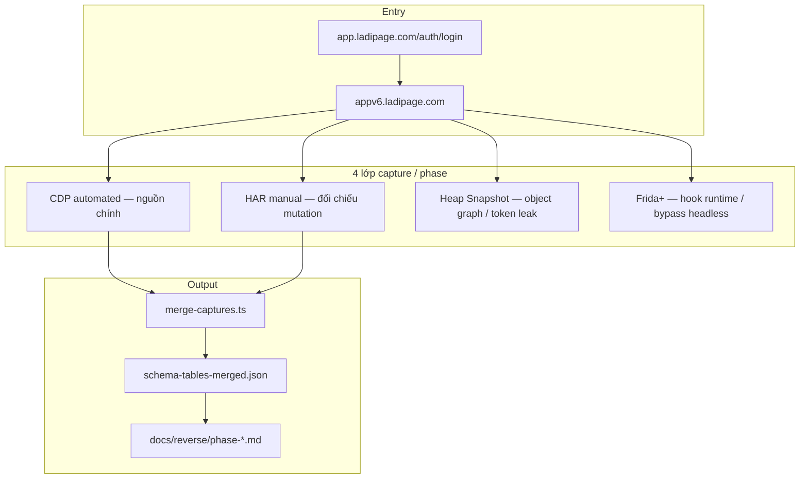

# Kế hoạch Capture — Heap Snapshot + CDP + Frida+ + HAR

> **Target:** [`https://app.ladipage.com/`](https://app.ladipage.com/) → redirect `appv6.ladipage.com`  
> **Phạm vi:** 3 module tách phase — **Kho ứng dụng**, **LadiWork**, **Automation**  
> **Mục tiêu:** Thu thập contract API, runtime state, memory object graph, và bằng chứng HAR để rebuild backend / adapter.  
> **Tool hiện có:** `tools/cdp-reverse-engineer` (CDP + state)  
> **Ngày:** 2026-06-23

---

## 1. Tổng quan

### 1.1. Ba phase độc lập

| Phase | Tên UI | `application/list` code | URL FE (dự kiến) | Host API chính |
|-------|--------|-------------------------|------------------|----------------|
| **P-A** | **Kho ứng dụng** | *(catalog)* — `WebsiteBuilder`, `LCRM`, … | `appv6.ladipage.com` → menu **Kho ứng dụng** / app launcher | `api.ladipage.com/2.0/application/*` |
| **P-B** | **LadiWork** | `LadiWork` | `appv6.ladipage.com/ladiwork` (+ sub-routes) | `api.ladipage.com` + có thể subdomain riêng *(xác nhận capture)* |
| **P-C** | **Automation** | `Automation` (LadiFlow) | `appv6.ladipage.com/automation` hoặc embed LadiFlow | `api.ladiflow.com/1.0/*` (flow, broadcast, trigger, …) |

**Đã xác nhận qua CDP cũ:** `POST api.ladipage.com/2.0/application/list` trả catalog gồm `LadiWork`, `Automation`, `Ecommerce`, `WebsiteBuilder`, …

### 1.2. Bốn lớp capture (mỗi phase chạy đủ 4 lớp)



| Lớp | Vai trò | Khi bắt buộc |
|-----|---------|--------------|
| **CDP** | POST body, response, WebSocket, localStorage | Mọi phase — automated baseline |
| **HAR** | Mutation phức tạp, upload, drag-drop | Khi CDP headless `status=0` / form không submit |
| **Heap Snapshot** | Object graph JS, closure, Redux/Zustand store | Khi cần map FE state ↔ API field ẩn |
| **Frida+** | Hook `fetch`/XHR, token lifecycle, anti-bot | Khi CDP+HAR thiếu route; SSL / obfuscation |

### 1.3. Thư mục output (mở rộng tool hiện tại)

```
tools/cdp-reverse-engineer/
├── .session/
│   └── ladipage-appv6-auth.json
├── config.phase0-auth.json
├── config.phaseA-kho-ung-dung-read.json
├── config.phaseA-kho-ung-dung-mutations.json
├── config.phaseB-ladiwork-read.json
├── config.phaseB-ladiwork-detail.json
├── config.phaseB-ladiwork-mutations.json
├── config.phaseC-automation-read.json
├── config.phaseC-automation-flow-editor.json
├── config.phaseC-automation-mutations.json
├── har/
│   ├── phaseA-kho-ung-dung/
│   ├── phaseB-ladiwork/
│   └── phaseC-automation/
├── heap/
│   ├── phaseA-kho-ung-dung/
│   ├── phaseB-ladiwork/
│   └── phaseC-automation/
├── frida/
│   ├── scripts/
│   │   ├── hook-fetch.js
│   │   ├── hook-xhr-ladiflow.js
│   │   └── dump-localstorage.js
│   └── logs/
│       ├── phaseA/
│       ├── phaseB/
│       └── phaseC/
└── output/
    ├── phaseA-kho-ung-dung-read/
    ├── phaseB-ladiwork-read/
    └── phaseC-automation-read/
```

---

## 2. Phase 0 — Auth & hạ tầng chung (bắt buộc)

Chạy **một lần** trước P-A / P-B / P-C.

### 2.1. Session

```bash
cd tools/cdp-reverse-engineer
npm run install:browsers
npm run capture:ladipage:login          # lưu .session/ladipage-auth.json
npm run capture:ladipage:session        # → ladipage-appv6-auth.json
```

**Kiểm tra session:**

- Cookies: `SSID`, `STORE_ID`, redirect OK `app.ladipage.com` → `appv6.ladipage.com`
- `state.json` có `ladipage_store_info`, `authorization` token

### 2.2. Bật CDP domains chung

Trong `tools/cdp-reverse-engineer` (đã có — bổ sung nếu thiếu):

| CDP Domain | Mục đích |
|------------|----------|
| `Network.*` | HTTP + WS |
| `Fetch.*` | Request stage |
| `Runtime.*` | `window` globals |
| `Page.*` | Navigation |
| `HeapProfiler.*` | **Heap Snapshot** (bổ sung) |
| `Memory.*` | `getDOMCounters`, pressure events |

### 2.3. Script bổ sung (tạo mới)

| Script | File | Mô tả |
|--------|------|-------|
| Heap capture | `src/cdp/heap-collector.ts` | `HeapProfiler.takeHeapSnapshot` → `.heapsnapshot` |
| HAR parse | `src/har/parse-har.ts` | HAR → `ladipage-post-apis.json` format |
| Frida log merge | `src/frida/merge-frida-logs.ts` | JSON lines → union routes |
| Phase merge | `src/merge-captures.ts` | Thêm phaseA/B/C vào manifest |

---

## 3. Quy trình 4 lớp — template mỗi phase

Mỗi phase **P-A / P-B / P-C** lặp theo checklist:

### 3.1. Bước 1 — CDP (automated, headless → headed nếu fail)

```bash
npm run capture -- --config config.phase{X}-{name}.json
# Fail headless → thêm --headed
```

**Output chuẩn:** `ladipage-post-apis.json`, `ladipage-flow.json`, `state.json`, `websockets.json`

### 3.2. Bước 2 — HAR (manual Chrome thật)

1. Chrome → `https://app.ladipage.com/auth/login` (đã login)
2. DevTools → Network → **Preserve log**, **Disable cache**
3. Thực hiện checklist UI của phase (mục 4–6)
4. Export HAR → `har/phase{X}-{name}/{date}.har`
5. Parse:

```bash
npm run har:parse -- --input har/phaseB-ladiwork/2026-06-23.har --output output/har-parsed/phaseB
```

### 3.3. Bước 3 — Heap Snapshot

**Mục tiêu:** Tìm object chứa `authorization`, `store_id`, `owner_id`, Redux/Zustand store, config API base URL.

**Cách A — Chrome DevTools (headed, khuyến nghị phase đầu):**

1. Mở đúng màn phase (vd. `/ladiwork`)
2. Memory tab → **Take heap snapshot**
3. Lưu: `heap/phaseB-ladiwork/{date}-list.heapsnapshot`
4. Search: `ladiflow`, `authorization`, `application`, `LadiWork`

**Cách B — CDP automated (bổ sung collector):**

```bash
npm run capture:heap -- --config config.phaseB-ladiwork-read.json
```

**Trigger points (chụp snapshot tại):**

| Điểm | Lý do |
|------|-------|
| Sau `DOMContentLoaded` | Boot config |
| Sau API `application/list` | App catalog in memory |
| Sau mở detail / editor | Business object graph |
| Sau mutation submit | POST payload builder closure |

### 3.4. Bước 4 — Frida+

**Mục tiêu:** Bắt route CDP/HAR bỏ sót; hook khi headless bị chặn; log token refresh.

**Môi trường khuyến nghị:** Chrome/Chromium **headed** trên Windows (WSL attach qua remote debugging port).

#### 2.4.1. Chuẩn bị

```bash
# Chrome remote debugging (Windows host)
chrome.exe --remote-debugging-port=9222 --user-data-dir=%TEMP%\ladipage-frida

# Frida attach (trên máy có Frida)
frida -D chrome -l tools/cdp-reverse-engineer/frida/scripts/hook-fetch.js
```

#### 2.4.2. Scripts Frida (tạo trong repo)

**`frida/scripts/hook-fetch.js`** — log mọi `fetch()` tới `*.ladipage.com`, `*.ladiflow.com`, `*.ldpform.net`:

```javascript
// Pseudocode — implement khi setup Frida
Interceptor.attach(Module.findExportByName(null, '...'), {
  onEnter(args) { /* log URL + body */ }
});
// Hoặc inject vào renderer: wrap window.fetch
```

**`frida/scripts/hook-xhr-ladiflow.js`** — chuyên `api.ladiflow.com/1.0/`

**Output:** `frida/logs/phaseC/{timestamp}.jsonl` — mỗi dòng `{ url, method, headers, body, response }`

#### 2.4.3. Merge Frida → CDP

```bash
npm run frida:merge -- --phase phaseC-automation-read
```

Union routes: `unique_routes = CDP ∪ HAR ∪ Frida`

### 3.5. Bước 5 — Merge & schema

```bash
npm run merge:schema
npm run export:typeorm
npm run export:ts-types
```

---

## 4. Phase A — Kho ứng dụng (App Store / Catalog)

### 4.1. Phạm vi

Reverse engineer **catalog ứng dụng**, kích hoạt/gỡ app, pin, pricing — không nhầm với module con sau khi mở app.

| # | Hành vi UI | API dự kiến |
|---|------------|-------------|
| A.1 | Mở menu **Kho ứng dụng** / app launcher | `application/list` ✅ đã có |
| A.2 | Lọc / tìm kiếm app | `application/search`? |
| A.3 | Xem chi tiết app | `application/show`? |
| A.4 | Kích hoạt app (Activate) | `application/activate`, `application/install`? |
| A.5 | Gỡ / tắt app | `application/deactivate`, `application/uninstall`? |
| A.6 | Pin / unpin sidebar | `application/pin`? |
| A.7 | Mở app từ catalog → redirect | Navigation only + `store/info` |

### 4.2. URL capture

```
https://app.ladipage.com/                    # login
https://appv6.ladipage.com/dashboard         # sau login
https://appv6.ladipage.com/applications      # hoặc /apps — xác nhận khi capture
https://appv6.ladipage.com/settings/apps     # fallback
```

### 4.3. Config CDP — `config.phaseA-kho-ung-dung-read.json`

```json
{
  "url": "https://appv6.ladipage.com/dashboard",
  "durationMs": 15000,
  "headless": true,
  "outputDir": "output/phaseA-kho-ung-dung-read",
  "storageStatePath": ".session/ladipage-appv6-auth.json",
  "heapSnapshots": ["after-load", "after-app-list"],
  "actions": [
    { "type": "wait", "ms": 8000 },
    { "type": "click", "selector": "[href*='application'], [href*='apps'], button:has-text('Kho ứng dụng'), [data-testid*='app-store']", "force": true },
    { "type": "wait", "ms": 12000 },
    { "type": "click", "selector": "input[placeholder*='Tìm'], input[type='search']", "label": "search-apps" },
    { "type": "fill", "selector": "input[type='search']", "value": "LadiWork" },
    { "type": "wait", "ms": 5000 },
    { "type": "click", "selector": "text=LadiWork, text=Automation, [data-app-code='LadiWork']", "force": true },
    { "type": "wait", "ms": 10000 }
  ]
}
```

### 4.4. Config mutations — `config.phaseA-kho-ung-dung-mutations.json`

Actions: Activate `Automation`, Deactivate trial app, Pin/Unpin — **chạy `--headed` + HAR**.

### 4.5. Checklist 4 lớp — Phase A

| Lớp | Việc | Output |
|-----|------|--------|
| CDP | read + mutations config | `output/phaseA-*/` |
| HAR | Activate 1 app chưa active (`Automation`) | `har/phaseA-kho-ung-dung/*.har` |
| Heap | Snapshot sau `application/list` response | Search `LpApplication`, `code` |
| Frida | Hook `application/*` POST | Log activate/pin routes |

### 4.6. Deliverables Phase A

| File | Nội dung |
|------|----------|
| `docs/reverse/phaseA-kho-ung-dung-api.md` | Bảng routes + request/response |
| `libs/ladipage-types/src/appstore/application.types.ts` | Mở rộng từ `LpApplication` |
| `output/merged/` | Sau merge — bảng `lp_application` |

### 4.7. DoD Phase A

- [ ] `application/list` contract đầy đủ (đã có — verify không drift)
- [ ] ≥ 3 mutation routes mới (activate/deactivate/pin)
- [ ] Heap snapshot tìm được catalog array trong memory
- [ ] HAR ∪ CDP routes ≥ 5 unique `application/*`

---

## 5. Phase B — LadiWork

### 5.1. Phạm vi

**LadiWork** — app `code: "LadiWork"` trong catalog; quản lý công việc / task / project *(xác nhận UI khi capture)*.

| # | Hành vi UI | API dự kiến |
|---|------------|-------------|
| B.1 | Mở LadiWork từ sidebar / catalog | Navigation + module bootstrap |
| B.2 | Danh sách task / board / project | `ladiwork/list`, `task/list`? |
| B.3 | Chi tiết task | `ladiwork/show`, `task/show`? |
| B.4 | Tạo / sửa / xóa task | mutations |
| B.5 | Assign member | `staff/list` cross-ref |
| B.6 | Comment / activity | nested arrays |

**Host dự đoán:** `api.ladipage.com/2.0/ladiwork/*` hoặc host riêng — **không đoán**; xác nhận qua CDP/Frida.

### 5.2. URL capture

```
https://appv6.ladipage.com/ladiwork
https://appv6.ladipage.com/ladiwork/tasks
https://appv6.ladipage.com/ladiwork/projects
https://appv6.ladipage.com/ladiwork/settings
```

### 5.3. Config CDP — read

**`config.phaseB-ladiwork-read.json`:**

```json
{
  "url": "https://appv6.ladipage.com/ladiwork",
  "durationMs": 20000,
  "headless": true,
  "outputDir": "output/phaseB-ladiwork-read",
  "storageStatePath": ".session/ladipage-appv6-auth.json",
  "heapSnapshots": ["after-module-load", "after-task-list"],
  "actions": [
    { "type": "wait", "ms": 12000, "label": "module-boot" },
    { "type": "waitForSelector", "selector": "table tbody tr, [class*='task'], [class*='board']", "ms": 25000 },
    { "type": "click", "selector": "[role='tab'], button:has-text('Công việc'), button:has-text('Dự án')", "force": true },
    { "type": "wait", "ms": 8000 },
    { "type": "click", "selector": "table tbody tr:first-child", "force": true },
    { "type": "wait", "ms": 12000 }
  ]
}
```

**`config.phaseB-ladiwork-detail.json`:** deep link task id (lấy từ read capture).

**`config.phaseB-ladiwork-mutations.json`:** create task, update status, delete — **headed + HAR bắt buộc**.

### 5.4. Frida+ — Phase B

- Hook tất cả POST path chứa `ladiwork`, `task`, `project`, `work`
- Log `store-id` vs `owner-id` headers
- Dump `window.__NEXT_DATA__` / RSC payload nếu route ẩn

### 5.5. Heap Snapshot — Phase B

| Snapshot | Trigger |
|----------|---------|
| `after-module-load` | `/ladiwork` loaded |
| `after-task-list` | Sau API list trả về |
| `after-task-detail` | Drawer/modal mở |

**Phân tích:** Dominator tree → tìm object có `task_id`, `project_id`, `assignee`.

### 5.6. Deliverables Phase B

| File | Nội dung |
|------|----------|
| `docs/reverse/phaseB-ladiwork-api.md` | Routes + schema |
| `libs/ladipage-types/src/ladiwork/*.ts` | Generated từ schema |
| `config.phaseB-*.json` | 3 configs |
| BE target | `apps/ladipage-backend/src/modules/ladiwork/` *(tạo sau)* |

### 5.7. DoD Phase B

- [ ] Xác định được **host + path prefix** thật (ladipage vs ladiflow vs khác)
- [ ] ≥ 8 unique POST routes
- [ ] ≥ 3 mutations (create/update/delete task)
- [ ] Heap chứa sample task object khớp response API
- [ ] Frida log ≥ 90% routes so với CDP

---

## 6. Phase C — Automation (LadiFlow)

### 6.1. Phạm vi

**Automation** — marketing automation / workflow (LadiFlow ecosystem). Đã thấy trong capture P3/P4:

- `api.ladiflow.com/1.0/broadcast/list`
- Socket.IO `api.ladiflow.com`
- App catalog `code: "Automation"`, `status_active: false` trên trial

| # | Hành vi UI | API dự kiến |
|---|------------|-------------|
| C.1 | Mở Automation / LadiFlow | Bootstrap + `owner-id` header |
| C.2 | Danh sách flow / campaign | `flow/list`, `automation/list`? |
| C.3 | Flow editor (drag-drop) | `flow/show`, `flow/save` |
| C.4 | Broadcast | `broadcast/list` ✅ đã thấy |
| C.5 | Trigger / action nodes | nested JSON |
| C.6 | Activate / pause automation | mutations |
| C.7 | Report automation | `report/*` tab Automation |

### 6.2. URL capture

```
https://appv6.ladipage.com/automation
https://appv6.ladipage.com/ladiflow          # fallback
https://app.ladiflow.com/                   # có thể redirect riêng — kiểm tra
https://appv6.ladipage.com/reports          # tab Automation
```

**Lưu ý:** Trial có thể **chưa kích hoạt** `Automation` — Phase A mutation activate trước khi chạy Phase C.

### 6.3. Config CDP

**`config.phaseC-automation-read.json`:**

```json
{
  "url": "https://appv6.ladipage.com/automation",
  "durationMs": 20000,
  "headless": true,
  "outputDir": "output/phaseC-automation-read",
  "storageStatePath": ".session/ladipage-appv6-auth.json",
  "heapSnapshots": ["after-flow-list"],
  "actions": [
    { "type": "wait", "ms": 12000 },
    { "type": "click", "selector": "button:has-text('Tạo'), button:has-text('Tạo mới'), button:has-text('Flow')", "force": true },
    { "type": "wait", "ms": 8000 },
    { "type": "click", "selector": "table tbody tr:first-child, [class*='flow-card']:first-child", "force": true },
    { "type": "wait", "ms": 15000 },
    { "type": "navigate", "value": "https://appv6.ladipage.com/reports" },
    { "type": "wait", "ms": 8000 },
    { "type": "click", "selector": "[role='tab']:has-text('Automation'), button:has-text('Automation')", "force": true },
    { "type": "wait", "ms": 10000 }
  ]
}
```

**`config.phaseC-automation-flow-editor.json`:** mở editor, thêm node, save — **headed only**.

**`config.phaseC-automation-mutations.json`:** create flow, publish, delete.

### 6.4. API Probe bổ sung — `api-probe-phaseC.ts`

Probe `api.ladiflow.com/1.0/`:

```
flow/list, flow/show, flow/create
automation/list, automation/show
broadcast/list, broadcast/create
trigger/list, action/list
segment/list          # cross-ref CRM
customer-tag/list     # cross-ref
```

### 6.5. Frida+ — Phase C (quan trọng nhất)

LadiFlow dùng `owner-id` (không phải `store-id`). Frida hook:

- Mọi `POST https://api.ladiflow.com/1.0/*`
- `socket.io` emit/on events
- Token refresh trong closure

**Script:** `frida/scripts/hook-xhr-ladiflow.js`

### 6.6. Heap Snapshot — Phase C

Flow editor giữ graph lớn trong memory — heap giúp map:

- Node types (trigger, action, delay, email, …)
- Edge conditions
- Variable bindings

Chụp **trước và sau** Save flow.

### 6.7. HAR — Phase C

Bắt buộc cho **flow editor** (drag-drop không trigger đủ trong headless CDP).

### 6.8. Deliverables Phase C

| File | Nội dung |
|------|----------|
| `docs/reverse/phaseC-automation-api.md` | LadiFlow routes |
| `libs/ladipage-types/src/automation/*.ts` | flow, broadcast, trigger |
| `src/api-probe-phaseC.ts` | Probe ladiflow automation |
| BE target | `modules/automation/` hoặc mở rộng `ladiflow-rpc` |

### 6.9. DoD Phase C

- [ ] `Automation` activated trên trial (qua Phase A)
- [ ] ≥ 15 unique `api.ladiflow.com/1.0/*` routes (flow + broadcast)
- [ ] WebSocket frames documented (`websockets.json`)
- [ ] ≥ 2 mutations (create flow, publish broadcast)
- [ ] Heap snapshot flow graph hoặc HAR editor save

---

## 7. Lịch thực hiện (gợi ý 3 tuần)

| Tuần | Phase | CDP | HAR | Heap | Frida |
|------|-------|-----|-----|------|-------|
| **1** | P0 Auth + P-A Kho ứng dụng | read + mutations | activate app | 2 snapshots | hook `application/*` |
| **2** | P-B LadiWork | read + detail + mutations | create task | 3 snapshots | hook `ladiwork/*` |
| **3** | P-C Automation | read + editor + mutations | flow save | 2 snapshots | hook ladiflow + WS |

**Song song mỗi ngày:**

```bash
npm run merge:schema && npm run export:ts-types
```

---

## 8. Merge pipeline (cập nhật `merge-captures.ts`)

Thêm vào manifest:

```typescript
{ name: 'phaseA-read', path: join(root, 'phaseA-kho-ung-dung-read') },
{ name: 'phaseA-mutations', path: join(root, 'phaseA-kho-ung-dung-mutations') },
{ name: 'phaseB-read', path: join(root, 'phaseB-ladiwork-read') },
{ name: 'phaseB-detail', path: join(root, 'phaseB-ladiwork-detail') },
{ name: 'phaseB-mutations', path: join(root, 'phaseB-ladiwork-mutations') },
{ name: 'phaseC-read', path: join(root, 'phaseC-automation-read') },
{ name: 'phaseC-editor', path: join(root, 'phaseC-automation-flow-editor') },
{ name: 'phaseC-mutations', path: join(root, 'phaseC-automation-mutations') },
{ name: 'har-phaseA', path: join(root, 'har-parsed/phaseA') },
{ name: 'frida-phaseC', path: join(root, 'frida-merged/phaseC') },
```

**Union routes:**

```
all_routes = CDP ∪ HAR ∪ Frida_logs
best_sample = max(score(status, body_nonempty))
```

---

## 9. Rủi ro & giảm thiểu

| Rủi ro | Mitigation |
|--------|------------|
| `Automation` chưa activate trial | Phase A activate trước |
| LadiWork URL khác `/ladiwork` | Heap search `LadiWork`; Frida log all POST |
| Headless `ERR_FAILED` ladiflow | Frida+ headed; HAR manual |
| Heap file rất lớn (>500MB) | Chỉ snapshot sau API list, không full session |
| Frida trên WSL | Chạy Chrome+Frida trên Windows host, port 9222 |
| Mutation không capture | HAR là nguồn bắt buộc cho editor |
| Legal / ToS | Chỉ tài khoản test của bạn; không scrape user khác |

---

## 10. Lệnh nhanh (sau khi implement scripts)

```bash
cd tools/cdp-reverse-engineer

# Phase 0
npm run capture:ladipage:session

# Phase A — Kho ứng dụng
npm run capture:phaseA:read
npm run capture:phaseA:mutations -- --headed

# Phase B — LadiWork
npm run capture:phaseB:read
npm run capture:phaseB:mutations -- --headed

# Phase C — Automation
npm run capture:phaseC:read
npm run capture:phaseC:editor -- --headed
npm run probe:phaseC

# Heap / Frida / HAR merge
npm run capture:heap -- --config config.phaseB-ladiwork-read.json
npm run har:parse -- --input har/phaseC/2026-06-23.har
npm run frida:merge -- --phase phaseC

# Schema
npm run merge:schema && npm run export:typeorm && npm run export:ts-types
```

**Scripts `package.json` cần thêm:**

```json
{
  "capture:phaseA:read": "tsx src/index.ts --config config.phaseA-kho-ung-dung-read.json",
  "capture:phaseA:mutations": "tsx src/index.ts --config config.phaseA-kho-ung-dung-mutations.json",
  "capture:phaseB:read": "tsx src/index.ts --config config.phaseB-ladiwork-read.json",
  "capture:phaseB:detail": "tsx src/index.ts --config config.phaseB-ladiwork-detail.json",
  "capture:phaseB:mutations": "tsx src/index.ts --config config.phaseB-ladiwork-mutations.json",
  "capture:phaseC:read": "tsx src/index.ts --config config.phaseC-automation-read.json",
  "capture:phaseC:editor": "tsx src/index.ts --config config.phaseC-automation-flow-editor.json",
  "capture:phaseC:mutations": "tsx src/index.ts --config config.phaseC-automation-mutations.json",
  "capture:heap": "tsx src/cdp/heap-collector.ts",
  "har:parse": "tsx src/har/parse-har.ts",
  "probe:phaseC": "tsx src/api-probe-phaseC.ts",
  "frida:merge": "tsx src/frida/merge-frida-logs.ts",
  "capture:phaseABC": "npm run capture:phaseA:read && npm run capture:phaseB:read && npm run capture:phaseC:read && npm run merge:schema"
}
```

---

## 11. Action items ngay

| # | Việc | Phase |
|---|------|-------|
| 1 | Tạo `config.phaseA-kho-ung-dung-read.json` + chạy CDP | P-A |
| 2 | Implement `heap-collector.ts` (CDP `HeapProfiler.takeHeapSnapshot`) | P0 |
| 3 | Activate `Automation` trên trial → chạy Phase C | P-A → P-C |
| 4 | Capture headed `/ladiwork` — xác nhận host API | P-B |
| 5 | Viết `hook-xhr-ladiflow.js` + test 1 session | P-C |
| 6 | HAR export sau activate app + create task | P-A, P-B |
| 7 | Cập nhật `merge-captures.ts` + `docs/reverse/phaseA|B|C-*.md` | All |

---

## 12. Tham chiếu

| Tài liệu | Vai trò |
|----------|---------|
| `plan-reverse-engineering-ladipage.md` | CDP methodology P1–4 |
| `plan-phases-gap-supplement.md` | Gaps BE bổ sung |
| `tools/cdp-reverse-engineer/output/merged/` | Schema baseline hiện tại |
| `application/list` capture | Catalog apps — `LadiWork`, `Automation` |
| `api.ladiflow.com/1.0/broadcast/list` | Automation partial capture P4 |