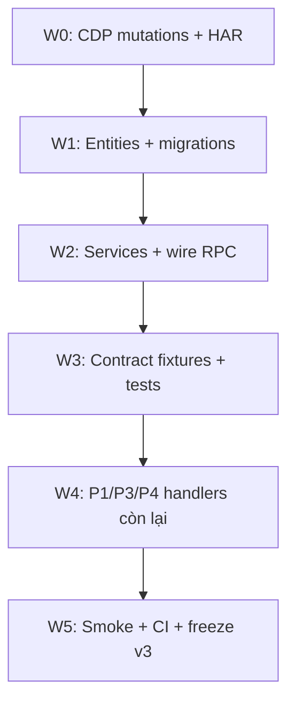

# Kế hoạch đóng gap + Prompt thực thi (đầy đủ)

> **Mục tiêu:** Giải quyết **đầy đủ** các vấn đề sau báo cáo testing (2026-06-23): RPC 0% wired, module B/C rỗng, entity thiếu, contract test thiếu phase, mutations CDP thiếu.  
> **Baseline:** 81 routes merged, 29 tables, 5/5 Jest pass (chỉ P2/P3/P4 fixture validation), BE build pass, runtime RPC → `NotImplementedException`.  
> **Tham chiếu:** [`plan-be-phase-bc-ladiwork-automation.md`](../plan-be-phase-bc-ladiwork-automation.md), [`plan-phases-gap-supplement.md`](plan-phases-gap-supplement.md), [`docs/reverse/schema-freeze-bc.json`](../docs/reverse/schema-freeze-bc.json)  
> **Ngày:** 2026-06-24

---

## 0. Bối cảnh — "vấn đề trên" cần giải quyết

Sau khi chạy CDP Phase A/B/C và testing BE, audit cho thấy **logic B/C chưa thực sự triển khai** dù scaffold đã có:

| Hạng mục | Trạng thái thực tế | Hậu quả |
|----------|-------------------|---------|
| `LadiflowDispatcherService.handlers` | `{}` — 35 route trong `TODO_ROUTES` | Board LadiWork → 501 |
| `LadiflowV5DispatcherService.handlers` | `{}` — 5 route TODO | Flow editor → 501 |
| `RpcDispatcherService.handlers` | `{}` | `application/update` capture được nhưng BE không xử lý |
| `ladiwork.module.ts`, `automation.module.ts` | `@Module({})` rỗng | Không service/entity/repository |
| Mappers B/C | Identity + `TODO(PR-BC-*)` | Response shape không khớp CDP |
| Entities | Không có `lp_crm_pipeline`, `lp_crm_deal`, `lp_flow` | Không persist trial data |
| Contract test | 3 fixture + 1 spec (chỉ validate file tồn tại) | Không test handler thật |
| CDP mutations | 1 route (`application/update`) | Thiếu `crm-deal/*`, `flow/*` create/save |
| `lp_customer` | ~4/68 cột | P3 `customer/list` không đủ field |

**DoD tổng:** ≥40 handlers wired, ≥5 mutations CDP, ≥25 Jest tests, board + flow editor RPC 200 local, `schema-freeze-v3.json`.

---

## 1. Bảng vấn đề → Wave → PR

| ID | Vấn đề | Mức | Wave | PR | Prompt |
|----|--------|-----|------|-----|--------|
| G-01 | RPC handlers = 0 (ladipage + ladiflow + v5) | 🔴 | W2, W4 | PR-GAP-01 | W2-1..W2-6, W4-1..W4-4 |
| G-02 | `ladiwork/`, `automation/` module rỗng | 🔴 | W2 | PR-GAP-02~07 | W2-1..W2-4 |
| G-03 | Entity/migration `lp_crm_deal`, `lp_flow`, `lp_crm_pipeline` | 🔴 | W1 | PR-GAP-08 | W1-1, W1-2 |
| G-04 | Mapper stubs (identity + TODO) | 🟠 | W2 | PR-GAP-09 | W2-1..W2-4 |
| G-05 | Contract test thiếu P1, PA, PB, PC | 🟠 | W3 | PR-GAP-10 | W3-1, W3-2 |
| G-06 | Mutations CDP: deal/flow/app activate | 🟠 | W0 | PR-GAP-11 | W0-1..W0-4 |
| G-07 | `lp_customer` 4/68 cols (P3) | 🟠 | W1 | PR-GAP-12 | W1-3 |
| G-08 | Probe BC permission denied | 🟡 | W0 | — | Dùng CDP browser, bỏ qua probe |
| G-09 | `misc/` types trùng `ladiwork/` | 🟡 | W3 | PR-GAP-13 | W3-3 |
| G-10 | Smoke script + CI gate | 🟡 | W5 | PR-GAP-14 | W5-1, W5-2 |

---

## 2. Ma trận phụ thuộc

```
W0 (CDP mutations) ──┐
                     ├──► W3-1 (fixtures cần mutation samples)
W1 (entities) ───────┼──► W2 (services + wire RPC)
                     └──► W3-2 (contract test cần seeded DB)
W2 (pilot RPC) ──────────► W4 (wire còn lại)
W3 + W4 ─────────────────► W5 (smoke + freeze v3)
```

| Task | Phụ thuộc | Có thể song song |
|------|-----------|------------------|
| W0-1, W0-2, W0-3 | Session auth OK | ✅ với nhau |
| W1-1, W1-2 | CDP schema merged | ✅ với nhau |
| W1-3 | `lp_customer` types | Song song W1-1/2 |
| W2-1 | W1-1 | — |
| W2-2 | W1-1, W2-1 | — |
| W2-3 | W2-1, W2-2 | — |
| W2-4 | W1-2 | Song song W2-1..3 |
| W2-5 | — | Song song W2-1 |
| W3-1 | W2 ít nhất 3 pilot wired | — |
| W3-2 | W3-1 + W2 | — |
| W4-* | W2 registry (W2-6) khuyến nghị | W4-1/2/3 song song |
| W5-* | W3-2 pass | — |

---

## 3. Chọn điểm bắt đầu

| Mục tiêu ngắn hạn | Bắt đầu từ | Lý do |
|-------------------|------------|-------|
| Board LadiWork chạy local | **W1-1 → W2-1 → W2-2** | Pilot có giá trị demo cao nhất |
| Flow editor chạy local | **W1-2 → W2-4** | `flow/show` apiv5 là blocker editor |
| Đóng gap CDP trước | **W0-1 → W0-2 → W0-3** | Mutations là input cho mapper write-path |
| CI xanh nhanh | **W3-1 → W3-2** (sau W2 pilot) | Fixture + contract gate |
| Full pipeline 1 session | **PROMPT MASTER** (§12) | Agent dài, theo Wave 0→5 |

**Trial IDs (dùng trong mọi prompt):**

| Resource | externalId |
|----------|------------|
| Pipeline | `6a3a8d71da6cd800128221ee` |
| Stage | `6a3a8d71da6cd800128221f2` |
| Deal | `6a3a8eafda6cd800128266cf` |
| Flow | `6a3a8bd0da6cd8001281cbd2` |

---

## 4. Lộ trình 6 Wave (3–4 tuần)



| Wave | Thời gian | Kết quả đo được |
|------|-----------|-----------------|
| **W0** | 2–3 ngày | `mutationRoutes >= 5`, HAR phaseB/C |
| **W1** | 3–4 ngày | Migration pass, seed trial data |
| **W2** | 5–7 ngày | ≥10 RPC handlers wired, board + flow editor 200 |
| **W3** | 2–3 ngày | Contract test ≥20 routes, CI pass |
| **W4** | 4–5 ngày | ≥40/81 handlers wired |
| **W5** | 1–2 ngày | Smoke green, `schema-freeze-v3.json` |

---

## 5. Wave 0 — CDP mutations & HAR (G-06, G-08)

**Lệnh WSL (bắt buộc qua Windows path):**

```bash
cmd.exe /c "cd /d D:\monorepo-project-workspace\liora-monorepo\tools\cdp-reverse-engineer && node node_modules\tsx\dist\cli.mjs src/index.ts --config <CONFIG> --headed"
```

**Sau mỗi capture:**

```bash
cd tools/cdp-reverse-engineer
rtk npm run merge:schema && rtk npm run export:ts-types && rtk npm run export:contract-fixtures
```

### W0-1: Headed capture mutations Phase B (deal create/update)

**DoD:** `crm-deal/create` hoặc `crm-deal/update` trong `ladipage-post-apis.json`; merge `mutationRoutes >= 2`.

**PROMPT W0-1** (copy nguyên khối):

```
Bối cảnh: Monorepo liora-monorepo. CDP tool tại tools/cdp-reverse-engineer.
Phase B LadiWork = crm-deal trên board Kanban tại:
  https://appv6.ladipage.com/ladiwork/board/6a3a8d71da6cd800128221ee
Session: .session/ladipage-appv6-auth.json (37 cookies)
Config hiện có: config.phaseB-ladiwork-mutations.json, config.phaseB-ladiwork-board.json

Nhiệm vụ:
1. Inspect UI board — cập nhật selector trong config.phaseB-ladiwork-mutations.json HOẶC tạo config.phaseB-ladiwork-mutations-headed.json.
2. Chạy headed: npm run capture:phaseB:mutations -- --headed (hoặc cmd.exe path ở trên).
3. Thao tác TẠO deal thật (fill form + Lưu) trên board trial.
4. Nếu selector fail: export HAR thủ công → chuyển sang W0-4.
5. Chạy merge:schema && export:ts-types && export:contract-fixtures.
6. Báo cáo: routes mới, mutationRoutes count, sample request body crm-deal/create|update.

Ràng buộc:
- Mọi lệnh terminal dùng tiền tố rtk.
- Không đoán field — chỉ dùng sample từ ladipage-post-apis.json.
- Không sửa BE trong task này.
```

---

### W0-2: Headed capture mutations Phase C (flow save)

**DoD:** ≥1 mutation `flow/*` trong `unique-routes.json`; `flow/show` apiv5 có graph đầy đủ.

**PROMPT W0-2:**

```
Bối cảnh:
- Automation flow editor: /automation/flows/6a3a8bd0da6cd8001281cbd2/edit
- Read-path host: api.ladiflow.com — Editor host: apiv5.ladiflow.com
- Config: config.phaseC-automation-mutations.json, config.phaseC-automation-flow-editor.json

Nhiệm vụ:
1. Chạy capture:phaseC:mutations --headed từ /automation/flows.
2. Deep-link editor, thêm 1 node, Save flow — bắt POST mutation.
3. Bổ sung wait/click sau Save trong flow-editor config nếu thiếu.
4. Merge schema; verify lp_flow fields từ mutation response.
5. Cập nhật docs/reverse/schema-freeze-bc.json nếu route count đổi.

DoD: ≥1 mutation route flow/* trong output/merged/unique-routes.json.
Ràng buộc: rtk prefix; không sửa BE.
```

---

### W0-3: Phase A activate app + application mutations

**DoD:** Phase A mutations ≥3 Ladipage POST; `application/list` có Automation `status_active: true`.

**PROMPT W0-3:**

```
Bối cảnh:
- Kho ứng dụng URL: https://appv6.ladipage.com/apps (KHÔNG /applications)
- Phase A mutations trước redirect dashboard — 0 POST
- Config: config.phaseA-kho-ung-dung-mutations.json, config.phaseA-kho-ung-dung-read.json

Nhiệm vụ:
1. Tạo config.phaseA-kho-ung-dung-mutations-headed.json — url /apps, pauseForLoginMs nếu cần.
2. Headed: activate Automation, pin LadiWork, mở app từ catalog.
3. Capture application/update, kiểm tra application/list drift.
4. Merge + export contract fixtures application/list và application/update.

DoD: phaseA-mutations có ≥3 Ladipage POST; Automation status_active true trong list response.
```

---

### W0-4: HAR fallback parser (khi headed fail)

**DoD:** Script parse HAR → `output/har-parsed/phase{B,C}/ladipage-post-apis.json` merge được.

**PROMPT W0-4:**

```
Bối cảnh: W0-1 hoặc W0-2 fail selector — cần HAR manual từ Chrome DevTools.

Nhiệm vụ:
1. Tạo tools/cdp-reverse-engineer/src/har/parse-har.ts:
   - Input: .har file
   - Filter: POST tới api.ladiflow.com, apiv5.ladiflow.com, api.ladipage.com
   - Output: format giống ladipage-post-apis.json (url, method, request, response)
2. Thêm npm script: "parse:har": "tsx src/har/parse-har.ts"
3. Cập nhật merge-captures.ts — đọc output/har-parsed/** nếu có.
4. Test với 1 HAR mẫu từ board hoặc flow editor.

DoD: merge:schema nhận routes từ HAR; mutationRoutes tăng.
```

---

## 6. Wave 1 — Entities & Migrations (G-03, G-07)

### W1-1: Migration lp_crm_pipeline + lp_crm_deal

**PROMPT W1-1:**

```
Bối cảnh:
- Schema: tools/cdp-reverse-engineer/output/merged/schema-tables-merged.json
- Types: apps/ladipage-backend/libs/ladipage-types/src/ladiwork/
- Module: apps/ladipage-backend/src/modules/ladiwork/ (hiện @Module({}) rỗng)
- Reference: apps/ladipage-backend/src/modules/ecom-store/entities/order.entity.ts
- Mapper stub: ladiflow-rpc/mappers/ladiwork/pipeline.mapper.ts (identity TODO)

Nhiệm vụ:
1. Tạo CrmPipelineEntity (lp_crm_pipeline, 28 fields), CrmDealEntity (lp_crm_deal, 21 fields).
2. externalId (Mongo _id), tenantId, ownerId, pipelineId, stageId.
3. stages[] trên pipeline → JSONB column.
4. TypeORM migration (kiểm tra DB package project trước — Prisma hay TypeORM).
5. Seed: pipeline 6a3a8d71da6cd800128221ee + deal 6a3a8eafda6cd800128266cf từ CDP sample.
6. Export entities trong ladiwork.module.ts (providers TypeOrmModule.forFeature).

DoD:
- rtk npx nx run ladipage-backend:build pass
- migration up/down pass
- KHÔNG wire RPC trong PR này
```

---

### W1-2: Migration lp_flow + lp_integration

**PROMPT W1-2:**

```
Bối cảnh:
- Types: libs/ladipage-types/src/automation/
- flow/show sample: output/phaseC-automation-flow-editor/*/ladipage-post-apis.json
- Module automation/ rỗng
- LadiflowV5 TODO: flow/show, integration/list-all, recurring-topic/list

Nhiệm vụ:
1. FlowEntity (lp_flow, 22 fields + graph JSONB từ flow/show).
2. FlowTagEntity, IntegrationEntity.
3. Migration + seed flow 6a3a8bd0da6cd8001281cbd2 với graph từ CDP.
4. Wire AutomationModule — TypeOrmModule.forFeature only.

DoD: build pass; FlowEntity.graph là JSONB.
```

---

### W1-3: Mở rộng lp_customer 68 fields

**PROMPT W1-3:**

```
Bối cảnh:
- CustomerEntity ~4 cột; CDP lp_customer 68 fields
- Plan: plans/plan-be-phase3-4-implementation.md Stage 2
- Fixture: test/contract/fixtures/phase3/customer__list.json

Nhiệm vụ:
1. Đọc libs/ladipage-types/src/crm/customer.types.ts + schema-tables-merged lp_customer.
2. ALTER CustomerEntity: P0 columns + JSONB metadata/customFields/groups.
3. Cập nhật ladiflow-rpc/mappers/customer.mapper.ts — entity → LpCustomer list shape.
4. Fields mới optional — không breaking REST hiện có.

DoD: customer/list mapper trả ≥20 fields khớp fixture phase3/customer__list.json.
```

---

## 7. Wave 2 — Services + Wire RPC (G-01, G-02, G-04)

**File dispatcher cần wire:**

| Dispatcher | File | TODO routes |
|------------|------|-------------|
| Ladiflow | `ladiflow-rpc/ladiflow-dispatcher.service.ts` | 35 |
| Ladiflow V5 | `ladiflow-v5-rpc/ladiflow-v5-dispatcher.service.ts` | 5 |
| Ladipage | `ladipage-rpc/rpc-dispatcher.service.ts` | ~20 |

### W2-1: PipelineService + wire crm-pipeline/list (pilot #1)

**PROMPT W2-1:**

```
Bối cảnh:
- LadiflowDispatcherService.handlers = {} (line 54)
- Mapper: ladiflow-rpc/mappers/ladiwork/pipeline.mapper.ts — identity stub
- Guard: ladiflow-rpc/ladiflow-context.guard.ts (owner-id header)
- CDP sample: output/merged/ hoặc phaseB-ladiwork-board/

Nhiệm vụ:
1. Tạo modules/ladiwork/services/pipeline.service.ts:
   - list(body): paginate, filter tenant
   - search(body): category ALL
2. Implement mapLadiworkPipelineRpcItem — CrmPipelineEntity → LpCrmPipeline (bỏ TODO).
3. LadiflowRpcRegistrar implements OnModuleInit — register:
   - 'crm-pipeline/list' → pipelineService.list
   - 'crm-pipeline/search' → pipelineService.search
4. Response: { data: { total, limit, items }, message: 'Thành công', code: 200 }
5. Unit test PipelineService; integration test POST /ladiflow/1.0/crm-pipeline/list.

DoD: không còn NotImplementedException cho crm-pipeline/list.
Chạy: rtk npx nx run ladipage-backend:test
```

---

### W2-2: DealService + crm-deal/list + get-summary (pilot #2)

**PROMPT W2-2:**

```
Phụ thuộc: W1-1, W2-1

Nhiệm vụ:
1. DealService.listByStage(body) — pipeline_id + pipeline_stage_id từ request.
2. DealService.getSummary(body) — aggregate counts per stage.
3. Wire: crm-deal/list, crm-deal/get-summary.
4. deal.mapper.ts — 21 fields đầy đủ.
5. Empty trial → items: [] (không 404).

DoD: curl local với owner-id header trả deal list cho board trial.
Test: unit list + summary.
```

---

### W2-3: LadiworkDashboardService + 6 dashboard routes

**PROMPT W2-3:**

```
Wire routes:
- ladiwork-dashboard/config, list-pipelines, attention-stats
- member-performance, job-status-stats, pipeline-by-stage

Nhiệm vụ:
1. LadiworkDashboardService — aggregate CrmDealEntity + CrmPipelineEntity.
2. dashboard.mapper.ts — chart shape khớp CDP.
3. Wire 6 handlers vào LadiflowDispatcher.
4. Stub phụ (empty hợp lệ): crm-filter, crm-label, crm-organization, crm-staff-configuration.

DoD: 10/16 Phase B routes wired; nx test pass.
```

---

### W2-4: FlowService + ladiflow-v5 flow/show (pilot #3)

**PROMPT W2-4:**

```
Phụ thuộc: W1-2

Bối cảnh:
- LadiflowV5Dispatcher — apiv5.ladiflow.com
- flow-editor.mapper.ts có TODO
- flow/show sample: output/phaseC-automation-flow-editor/

Nhiệm vụ:
1. FlowService.list() — api.ladiflow flow/list.
2. FlowService.showGraph(flowId) — FlowEntity.graph JSONB.
3. Wire V5: flow/show, integration/list-all, recurring-topic/list.
4. Wire Ladiflow: flow/list, flow-tag/list-all, broadcast/list, integration/list-all.
5. automation/integration.mapper.ts, flow.mapper.ts — implement thật.

DoD: POST apiv5 flow/show trả graph; 7/9 Phase C routes wired.
```

---

### W2-5: application/update — ladipage-rpc

**PROMPT W2-5:**

```
Route: POST api.ladipage.com/2.0/application/update
Sample: { lang, code: "LadiWork", status_active: true, status_pin: true }

Nhiệm vụ:
1. ApplicationService trong landing/ hoặc settings/.
2. Wire RpcDispatcher: application/update, application/list.
3. Persist status_pin, status_active (store metadata hoặc lp_application).

DoD: application/update không NotImplementedException.
```

---

### W2-6: Dispatcher registry pattern

**PROMPT W2-6:**

```
Vấn đề: 3 dispatcher đều private handlers = {} không onModuleInit.

Nhiệm vụ:
1. LadiflowRpcRegistry implements OnModuleInit:
   register(routeKey, handler) trong onModuleInit
2. Áp dụng ladiflow-rpc, ladiflow-v5-rpc, ladipage-rpc.
3. Feature module tự đăng ký qua registerRoute() — tránh god file.
4. Comment ngắn ở dispatcher.service.ts.

DoD: grep "registerRoute\|handlers\[" ≥10 registrations; build pass.
```

---

## 8. Wave 3 — Contract fixtures & Tests (G-05, G-09)

### W3-1: Export fixtures toàn phase

**PROMPT W3-1:**

```
Bối cảnh:
- tools/cdp-reverse-engineer/src/export-contract-fixtures.ts
- Fixtures hiện tại: phase2, phase3, phase4 (3 files)
- Test: test/contract/contract-fixtures.spec.ts — chỉ validate file tồn tại

Nhiệm vụ:
1. Mở rộng export theo phase:
   - phase1: ladi-page/list, store/info
   - phaseA: application/list
   - phaseB: crm-pipeline/list, crm-deal/list, ladiwork-dashboard/config
   - phaseC: flow/list, flow/show (apiv5)
2. Output: test/contract/fixtures/{phase}/{resource}__{action}.json
3. Format: { route, request, response, capturedAt }

DoD: ≥15 fixture files; mỗi response.code === 200.
```

---

### W3-2: Contract test suites per phase

**PROMPT W3-2:**

```
Nhiệm vụ:
1. test/contract/phaseB-ladiwork.contract.spec.ts:
   - Gọi LadiflowDispatcher (hoặc supertest) với body từ fixture
   - Assert keys response.data khớp fixture (allow extra, fail missing required)
2. phaseC-automation.contract.spec.ts — tương tự
3. phaseA-appstore.contract.spec.ts
4. contract-fixtures.spec.ts — dynamic glob fixtures/**/*.json

DoD: nx run ladipage-backend:test ≥20 tests pass.
Test local dispatcher + seeded DB (sqlite in-memory hoặc testcontainers).
KHÔNG mock production API.
```

---

### W3-3: Dọn misc/ types trùng lặp

**PROMPT W3-3:**

```
Nhiệm vụ:
1. Xóa hoặc re-export misc/ → ladiwork/, automation/ trong ladipage-types.
2. Cập nhật index.ts.
3. Grep thay import @liora/ladipage-types/misc → ladiwork/automation.
4. nx run ladipage-types:build && ladipage-backend:build

DoD: 0 duplicate type definitions.
```

---

## 9. Wave 4 — Wire handlers P1/P3/P4 (G-01 mở rộng)

### W4-1: P3 CRM read-path

**PROMPT W4-1:**

```
Phụ thuộc: W1-3

Wire ladiflow-rpc:
- customer/list, customer/show, customer/customer-detail
- segment/list, customer-tag/list, customer-tag/list-all
- custom-field/list-all

Dùng CrmFacade + CustomerService; customer.mapper.ts 68 fields.

DoD: fixture phase3/customer__list.json pass contract test.
```

---

### W4-2: P4 Analytics RPC

**PROMPT W4-2:**

```
Wire ladipage-rpc (apiv5.sales):
- report/overview, report/top-product

AnalyticsService aggregate OrderEntity; analytics.mapper.ts.

DoD: fixture phase4/report__overview.json pass contract test.
```

---

### W4-3: P2 Ecom pilots

**PROMPT W4-3:**

```
Wire RpcDispatcher:
- order/list-order, product/list-products
- store/info, store/get-user-info

DoD: ≥15 ladipage-rpc handlers wired; phase2 fixture pass.
```

---

### W4-4: P1 Landing pilots

**PROMPT W4-4:**

```
Wire RpcDispatcher:
- ladi-page/list, ladi-page/show (builder-bridge — source JSONB lazy)
- domain/list, form-config/list

DoD: phase1 fixtures pass; website module có PageService cơ bản.
```

---

## 10. Wave 5 — Smoke, CI, Freeze v3 (G-10)

### W5-1: Smoke test script

**PROMPT W5-1:**

```
Nhiệm vụ:
1. scripts/ladipage-smoke-test.mjs:
   - Hit 10 RPC: pipeline/list, deal/list, flow/show, customer/list,
     order/list-order, report/overview, application/list, ...
   - Assert code === 200
2. package.json: "smoke:ladipage": "node scripts/ladipage-smoke-test.mjs"

DoD: exit 0 trên local với seeded tenant.
```

---

### W5-2: CI gate + schema-freeze-v3 + validation

**PROMPT W5-2:**

```
Nhiệm vụ:
1. CI step: ladipage-backend:test, ladipage-backend:build (nx affected).
2. docs/reverse/schema-freeze-v3.json:
   - routeCount, handlersWiredCount, contractTestCount, mutationRoutes
   - phaseCoverage: P1..PC percent
3. scripts/validate-phase-artifacts.py — 29 checks + handlersWired >= 40.

DoD: freeze v3 committed; mỗi phase read-path ≥80%.
```

---

## 11. PROMPT theo vai trò (tách session)

### Agent CDP / Reverse

```
Chỉ làm Wave 0 (W0-1..W0-4). Không sửa BE.
Mục tiêu: mutationRoutes >= 5, merge 81+ routes, cập nhật schema-freeze-bc.json.
Đọc: plans/plan-gap-closure-prompts.md §5.
Báo cáo: routes mới, đường dẫn output folder, mutation count.
```

### Agent BE Core

```
Chỉ làm Wave 1 + Wave 2 (W1-1..W1-3, W2-1..W2-6).
Không chạy CDP. Schema truth: output/merged/schema-tables-merged.json.
Pilot: crm-pipeline/list, crm-deal/list, flow/show.
Sau mỗi task: rtk npx nx run ladipage-backend:build && rtk npx nx run ladipage-backend:test
```

### Agent QA / Contract

```
Chỉ làm Wave 3 + Wave 5 (W3-1..W3-3, W5-1, W5-2).
Mục tiêu: ≥20 contract tests, smoke script, CI gate.
```

### Agent Review

```
Review diff theo plans/plan-gap-closure-prompts.md.
Kiểm tra: handler wired? mapper khớp CDP? test cover fixture? TODO còn?
Output: checklist PASS/FAIL G-01..G-10.
```

---

## 12. PROMPT MASTER — Đóng gap toàn bộ (1 session dài)

```
Bạn là agent triển khai backend Ladipage rebuild trong monorepo liora-monorepo.

Đọc trước:
- plans/plan-gap-closure-prompts.md
- plan-be-phase-bc-ladiwork-automation.md
- docs/reverse/schema-freeze-bc.json
- tools/cdp-reverse-engineer/output/merged/

Trạng thái hiện tại:
- CDP: 81 routes, 29 tables, Phase B 16 routes, Phase C 9 routes
- BE: RPC dispatchers handlers = {}; ladiwork/automation modules rỗng
- Test: 5/5 pass nhưng chỉ validate 3 fixture files (P2/P3/P4)
- Mutations: 1 (application/update)
- Mappers B/C: identity + TODO

Thực hiện theo thứ tự Wave 0 → 5. Mỗi wave:
1. Implement code
2. rtk npx nx run ladipage-backend:build && rtk npx nx run ladipage-backend:test
3. Báo cáo: files changed, routes wired, tests added

Ưu tiên tuyệt đối (nếu thiếu thời gian):
1. W2-1, W2-2, W2-4 — pilot RPC board + flow editor
2. W3-1, W3-2 — contract tests B/C
3. W0-1, W0-2 — mutations CDP

Ràng buộc:
- Mọi lệnh shell dùng tiền tố rtk
- CDP trên WSL: cmd.exe /c "cd /d D:\monorepo-project-workspace\liora-monorepo\tools\cdp-reverse-engineer && node node_modules\tsx\dist\cli.mjs ..."
- Không đoán API field — trace từ ladipage-post-apis.json
- Response RPC: { data, message, code: 200 }
- Ladiflow header: owner-id; Ladipage/sales: store-id
- Không refactor ngoài phạm vi task

Kết thúc: bảng % hoàn thành G-01..G-10 + đề xuất PR stack Graphite.
```

---

## 13. Checklist hoàn tất (DoD tổng)

| # | Tiêu chí | Target | Verify |
|---|----------|--------|--------|
| 1 | RPC handlers wired | ≥40/81 | `grep registerRoute` |
| 2 | Mutation routes CDP | ≥5 | schema-freeze-v3 |
| 3 | Contract fixtures | ≥20 files | `fixtures/**/*.json` |
| 4 | Jest tests | ≥25 pass | `nx test` |
| 5 | Entities migrated | pipeline, deal, flow | migration list |
| 6 | Smoke script | exit 0 | `npm run smoke:ladipage` |
| 7 | Board UI local | RPC 200 | curl crm-deal/list |
| 8 | Flow editor local | flow/show 200 | curl apiv5 flow/show |
| 9 | schema-freeze-v3 | committed | docs/reverse/ |
| 10 | misc/ cleanup | done | grep duplicate types |

---

## 14. Thứ tự PR đề xuất (Graphite stack)

```
PR-GAP-11  W0 CDP mutations (+ HAR parser)
PR-GAP-08  W1 entities B/C
PR-GAP-12  W1 customer 68 cols
PR-GAP-02  W2 PipelineService + wire
PR-GAP-03  W2 DealService + wire
PR-GAP-04  W2 Dashboard + wire
PR-GAP-05  W2 FlowService + v5 wire
PR-GAP-06  W2 application/update
PR-GAP-09  W2 registry pattern
PR-GAP-10  W3 contract fixtures + tests
PR-GAP-01  W4 remaining RPC P1-P4
PR-GAP-14  W5 smoke + CI + freeze v3
```

---

## 15. Lệnh nhanh sau mỗi wave

```bash
# CDP
cd tools/cdp-reverse-engineer
rtk npm run merge:schema && rtk npm run export:ts-types && rtk npm run export:contract-fixtures

# BE
cd ../..
rtk npx nx run ladipage-types:build
rtk npx nx run ladipage-backend:build
rtk npx nx run ladipage-backend:test
```

---

## 16. Template báo cáo sau mỗi wave

```markdown
## Wave X — Báo cáo

| Metric | Trước | Sau |
|--------|-------|-----|
| handlers wired | | |
| mutationRoutes | | |
| Jest tests | | |
| fixtures | | |

### Files changed
- ...

### Blockers
- ...

### Next wave
- ...
```

---

## 17. Tham chiếu file

| File | Vai trò |
|------|---------|
| [`plan-be-phase-bc-ladiwork-automation.md`](../plan-be-phase-bc-ladiwork-automation.md) | Kiến trúc BE B/C |
| [`plan-phases-gap-supplement.md`](plan-phases-gap-supplement.md) | Gaps P1–4 |
| [`schema-freeze-bc.json`](../docs/reverse/schema-freeze-bc.json) | Contract freeze B/C |
| `tools/cdp-reverse-engineer/output/merged/` | Nguồn sự thật schema |
| `apps/ladipage-backend/test/contract/` | Contract tests |
| `apps/ladipage-backend/src/modules/ladiflow-rpc/ladiflow-dispatcher.service.ts` | 35 TODO routes |