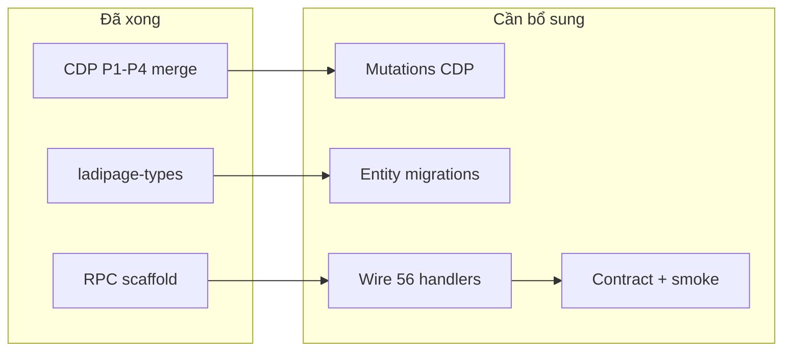

# Kế hoạch bổ sung — Gaps toàn phase (CDP + BE + Test)

> **Mục tiêu:** Đóng toàn bộ khoảng trống còn lại sau Phase 1–4 (CDP đã merge 56 routes / 21 tables; BE RPC ~0% wired).  
> **Nguồn sự thật:** `tools/cdp-reverse-engineer/output/merged/` + audit BE 2026-06-23  
> **Tham chiếu:** `plan-be-phase1-2-implementation.md`, `plan-be-phase3-4-implementation.md`, `plan-reverse-engineering-ladipage.md`  
> **Ngày:** 2026-06-23

---

## 1. Tổng quan trạng thái

| Lớp | Đã xong | Còn thiếu | % hoàn thành |
|-----|---------|-----------|---------------|
| **CDP capture** | 56 routes, 21 tables, types codegen | Mutations 0; 4 bảng empty; `ladi-page/report` | ~90% |
| **Schema / Types** | `ladipage-types` 21 bảng | `lp_company`, `lp_dashboard`, `lp_product_category/tag` | ~85% |
| **BE Entities** | Scaffold cơ bản P1–2 | `lp_customer` 4/68 cols; `lp_segment` lệch tên | ~30% |
| **BE RPC handlers** | Module scaffold | **0/56** route wired (`ladipage-rpc` + `ladiflow-rpc`) | ~5% |
| **BE Business logic** | REST CRM/Analytics/Dashboard | RPC adapter + mapper CDP shape | ~40% REST only |
| **Automated test** | 1 spec file (jest broken) | Contract test, smoke, jest config | ~5% |



---

## 2. Gaps xuyên phase (Cross-cutting)

Áp dụng cho **mọi phase** — ưu tiên làm trước khi wire từng route.

### 2.1. CDP — Mutations = 0 (Cao)

| # | Việc bổ sung | Cách làm | Output |
|---|--------------|----------|--------|
| X-1 | Capture mutation toàn phase | Chạy `*-mutations.json` với `--headed` + HAR backup | `ladipage-post-apis.json` có create/update/delete |
| X-2 | Parse HAR → merge | Script `har-to-post-apis.ts` (tùy chọn) hoặc manual diff | Bổ sung vào `output/merged/` |
| X-3 | Cập nhật `classifyRoute` | Đảm bảo `mutationRoutes > 0` trong schema-draft | DTO create/update có sample |

**Lệnh:**

```bash
cd tools/cdp-reverse-engineer
npm run capture -- --config config.phase1-landing-mutations.json --headed
npm run capture -- --config config.phase2-banhang-mutations.json --headed
npm run capture -- --config config.phase3-khachhang-mutations.json --headed
npm run merge:schema && npm run export:typeorm && npm run export:ts-types
```

### 2.2. BE — RPC layer chưa wire (Cao)

| # | Việc bổ sung | File / module |
|---|--------------|---------------|
| X-4 | Registry + inject handlers | `ladipage-rpc/rpc-dispatcher.service.ts` — bỏ empty `handlers{}` |
| X-5 | Ladiflow dispatcher wire | `ladiflow-rpc/ladiflow-dispatcher.service.ts` — 16 routes |
| X-6 | Mapper thật (bỏ TODO) | `ladiflow-rpc/mappers/*`, `ladipage-rpc/mappers/*` |
| X-7 | API Gateway host mirror | Proxy `api.ladiflow.com`, `apiv5.sales.ldpform.net` → backend |

### 2.3. BE — Entity vs CDP lệch (Cao)

| Entity hiện tại | CDP target | Việc bổ sung |
|-----------------|-----------|--------------|
| `CustomerEntity` (4 cols) | `lp_customer` 68 fields | Migration alter + JSONB groups |
| `SegmentEntity` → `lp_segment` | `lp_customer_segment` 16 fields | Rename table hoặc `@Entity` align |
| `CustomerTagEntity` (1 col) | 13 fields | ALTER + mapper |
| `OrderEntity` (~12 cols) | 144 fields | Nhóm P0/P1/JSONB (plan P1–2) |
| `ProductEntity` (~10 cols) | 66 fields | Nhóm P0/P1/JSONB (plan P1–2) |

### 2.4. Test infrastructure (Trung bình)

| # | Việc bổ sung | Deliverable |
|---|--------------|-------------|
| X-8 | Jest config `ladipage-backend` | `jest.config.ts` + `ts-jest` / `@swc/jest` |
| X-9 | Contract test suite | `test/contract/fixtures/` từ `ladipage-post-apis.json` |
| X-10 | Smoke test script | `scripts/db/ladipage-tenant-smoke-test.js` (CRM + RPC + reports) |
| X-11 | CI gate | `pnpm test:contract` fail nếu key mismatch > 5% |

### 2.5. Schema gaps — bảng thiếu itemFields

| Bảng | Nguyên nhân | Cách đóng |
|------|-------------|-----------|
| `lp_company` | Trial — `crm-organization/list` items `[]` | Seed 1 company trên trial → re-capture |
| `lp_dashboard` | `dash-board/*` status 0 headless | Headed `/dashboard` hoặc fallback aggregate từ `CustomerEntity` |
| `lp_product_category` | list response empty | Tạo category trên store trial |
| `lp_product_tag` | list response empty | Tạo tag trên store trial |
| `lp_page_report` | `ladi-page/report` chưa capture | Probe + phase4-page headed |

---

## 3. Phase 1 — Landing (bổ sung)

**Baseline CDP:** ~15 routes landing | **BE:** `website` scaffold rỗng

### 3.1. CDP cần bổ sung

| # | Route / artifact | Gap | Hành động |
|---|------------------|-----|-----------|
| P1-C1 | `ladi-page/create`, `update`, `delete`, `duplicate`, `publish` | Mutation 0 | Headed editor + mutations config |
| P1-C2 | `data-form-error/list` | status 0 / 499 Enterprise | Document skip; stub empty hoặc gói trial |
| P1-C3 | `apiv5.ladipage.com/2.0/ladi-page/show` | Có capture | Giữ làm truth cho `builder-bridge` |
| P1-C4 | `asset-list` | Có từ editor capture | Map → `file-manager` |

### 3.2. BE cần bổ sung

| # | Module / route | Ưu tiên | Việc cụ thể |
|---|----------------|---------|-------------|
| P1-B1 | `website` module build | **P0** | `PageService`, `PageTagService`, entities `lp_page`, `lp_page_tag` |
| P1-B2 | `ladi-page/list` RPC | **P0** | Handler #1 pilot — list 41 fields |
| P1-B3 | `ladi-page/show` RPC | **P0** | `builder-bridge` — full `source` JSONB lazy load |
| P1-B4 | `domain/list` | P1 | Module `domain` |
| P1-B5 | `form-config/list` | P1 | `FormConfigEntity` |
| P1-B6 | `theme-list`, `list-show-case` | P1 | `TemplateEntity` |
| P1-B7 | `lp_page_content` | P1 | Tách `source` JSON lớn khỏi `lp_page` |
| P1-B8 | Publish flow | P1 | `publish` module ↔ `PageService.publish()` |

### 3.3. DoD Phase 1 bổ sung

- [ ] 15/15 route landing có handler hoặc documented stub
- [ ] `lp_page` migration + entity 41 fields
- [ ] Contract test `ladi-page/list`, `ladi-page/show`
- [ ] FE smoke `/ladipage`, `/editor/:id`

---

## 4. Phase 2 — Bán hàng (bổ sung)

**Baseline CDP:** ~23 routes ecom | **BE:** `ecom-store` CRUD cơ bản, thiếu adapter

### 4.1. CDP cần bổ sung

| # | Route | Gap | Hành động |
|---|-------|-----|-----------|
| P2-C1 | `order/create`, `product/create`, … | Mutation 0 | Headed form submit |
| P2-C2 | `product-category/list`, `product-tag/list` | Empty items | Seed data trial |
| P2-C3 | `checkout/list`, `checkout-config/list` | Có route, logic phức tạp | Detail page capture thêm |
| P2-C4 | `order-history/list` | status 0 một số capture | Re-capture order detail |
| P2-C5 | `filter/list` | Empty | Tạo saved filter trên UI |
| P2-C6 | `inventory/list`, `shipping/list` | Empty trial | Seed inventory + shipping |

### 4.2. BE cần bổ sung

| # | Route RPC | Ưu tiên | Việc cụ thể |
|---|-----------|---------|-------------|
| P2-B1 | `order/list-order` | **P0** | `OrderService.listRpc()` — 144-field list subset |
| P2-B2 | `order/show` | **P0** | Include `order_details`, tags, custom_fields |
| P2-B3 | `product/list-products` | **P0** | 66-field mapper |
| P2-B4 | `product/show`, `product/search` | **P0** | Show full + search form đơn |
| P2-B5 | `order-tag/*`, `product-tag/*` | P1 | Tag services RPC |
| P2-B6 | `custom-field/list` | P1 | Đã có service — thêm RPC |
| P2-B7 | `checkout-config/list`, `page-checkout/list-store` | P1 | Service mới |
| P2-B8 | `payment/list-gateways` | P1 | Delegate `payment` module |
| P2-B9 | `order-history/list`, `filter/list` | P2 | Service mới |
| P2-B10 | `customer/show` (sales) | P0 | Facade → CRM `CustomerService` |
| P2-B11 | `lp_order` alter migration | **P0** | 144 fields nhóm hóa |
| P2-B12 | `lp_order_item` align | **P0** | 27 fields từ `order_details` |
| P2-B13 | Order status machine + totals recalc | P1 | Business logic Stage 5 |

### 4.3. DoD Phase 2 bổ sung

- [ ] 23/23 route ecom có handler
- [ ] `order/list-order` contract test pass
- [ ] `order/show` includes nested `order_details`
- [ ] FE smoke `/ecommerce/orders`, `/ecommerce/products`

---

## 5. Phase 3 — Khách hàng / CRM (bổ sung)

**Baseline CDP:** 16 ladiflow routes | **BE:** `ladiflow-rpc` scaffold, **0 handlers**, `CustomerEntity` 4 cols

### 5.1. CDP cần bổ sung

| # | Route | Gap | Hành động |
|---|-------|-----|-----------|
| P3-C1 | `customer/activity` | status 0 headless | Re-capture detail headed |
| P3-C2 | `customer/customer-detail` | invalid/empty sample | Navigate `/customers/:id` headed |
| P3-C3 | `customer/create`, `segment/create`, `tag/create` | Mutation 0 | `phase3-mutations` headed |
| P3-C4 | `crm-organization/list` | items `[]` | Seed company trial |
| P3-C5 | `sync-error/list` | Chưa trong merged routes | Navigate `/customers/sync-errors` |
| P3-C6 | `customer/list` | status 0 một số run | Probe `api-probe-phase34` + headed |

### 5.2. BE cần bổ sung

| # | Route / artifact | Ưu tiên | Việc cụ thể |
|---|------------------|---------|-------------|
| P3-B1 | `ladiflow-rpc` wire handlers | **P0** | Inject 16 handlers vào dispatcher |
| P3-B2 | `customer/list` | **P0** | `CustomerService.listRpc()` + mapper 68→list subset |
| P3-B3 | `customer/show` | **P0** | Full show + tags + segments + stats |
| P3-B4 | `customer/activity` | **P0** | Bảng `lp_customer_activity` + feed từ orders |
| P3-B5 | `customer/customer-detail` | **P0** | Extended show shape |
| P3-B6 | `segment/list` | **P0** | Align `lp_customer_segment` + `multi_conditions` |
| P3-B7 | `customer-tag/list` + `list-all` | **P0** | Tag RPC |
| P3-B8 | `custom-field/list-all` | **P0** | Definitions only |
| P3-B9 | `crm-organization/list` | P1 | `CompanyService.listRpc()` |
| P3-B10 | `customer/list-customer-merge` | P1 | Dedup phone/email detection |
| P3-B11 | `lp_customer` migration | **P0** | externalId + JSONB addresses/channels/stats |
| P3-B12 | Mappers bỏ TODO | **P0** | `customer.mapper.ts`, `segment.mapper.ts`, `tag.mapper.ts` |
| P3-B13 | `owner-id` guard | **P0** | `ladiflow-context.guard` ↔ tenant mapping |
| P3-B14 | Dual CRM facade | P1 | Output luôn LadiPage shape khi `isCrmEnabled()` |
| P3-B15 | Stubs P2/P3 | P2 | `broadcast/list`, `call-center/*`, `ladipage-notification/list` |

### 5.3. DoD Phase 3 bổ sung

- [ ] 16/16 ladiflow route có handler (hoặc stub documented)
- [ ] `lp_customer` ≥ 90% field P0+P1 trong `customer/show`
- [ ] Contract test `customer/list`, `segment/list`
- [ ] FE smoke `/customers`, `/customers/segments`, `/customers/tags`

---

## 6. Phase 4 — Báo cáo / Analytics (bổ sung)

**Baseline CDP:** `report/overview`, `report/top-product` OK | **BE:** REST analytics có, RPC chưa wire

### 6.1. CDP cần bổ sung

| # | Route | Gap | Hành động |
|---|-------|-----|-----------|
| P4-C1 | `ladi-page/report` | Chưa capture | phase4-page headed + probe hosts |
| P4-C2 | `report/sales`, `conversion`, `customers` | Chưa capture | Tab `/reports` headed từng tab |
| P4-C3 | `dash-board/list-subscriber-by-time` | status 0 | Headed `/dashboard` |
| P4-C4 | `crm-insight-folder/list` | Empty trial | Seed widget hoặc document empty OK |
| P4-C5 | Per-page report từ landing menu | Menu click fail headless | Config phase4 đã cải thiện — chạy lại headed |

### 6.2. BE cần bổ sung

| # | Route / artifact | Ưu tiên | Việc cụ thể |
|---|------------------|---------|-------------|
| P4-B1 | `report/overview` RPC | **P0** | `AnalyticsService.overviewRpc()` — chart shape LadiPage |
| P4-B2 | `report/top-product` RPC | **P0** | Aggregate `order_item` → `LpAnalyticsReport` 10 fields |
| P4-B3 | `dash-board/list-subscriber-by-time` | **P0** | `DashboardService.subscribersByTimeRpc()` |
| P4-B4 | `analytics.mapper.ts` bỏ TODO | **P0** | Internal DTO → RPC response |
| P4-B5 | `dashboard.mapper.ts` bỏ TODO | **P0** | Subscriber series shape |
| P4-B6 | `ladi-page/report` composite | P1 | overview + page_id filter + leads count |
| P4-B7 | `crm-insight-folder/list` | P1 | Stub `{ items: [] }` hoặc entity `lp_analytics_widget` |
| P4-B8 | Date range `+07:00` parser | **P0** | Shared `parseLadipageDateRange` |
| P4-B9 | Report cache 5 phút | P2 | Redis optional |
| P4-B10 | REST ↔ RPC parity | P1 | `GET /analytics/reports/sales` ≡ subset `report/overview` |

### 6.3. DoD Phase 4 bổ sung

- [ ] `report/overview` + `report/top-product` contract test pass
- [ ] `dash-board/list-subscriber-by-time` trả series (fallback từ customers nếu CDP gap)
- [ ] FE smoke `/reports`, `/dashboard`, landing row → Báo cáo

---

## 7. Lộ trình bổ sung (ưu tiên thực thi)

### 7.1. Wave 0 — Hạ tầng (Tuần 1)

| ID | Task | Phase | Owner |
|----|------|-------|-------|
| W0-1 | Jest config + chạy `order-customer.resolver.spec.ts` | X | BE |
| W0-2 | Wire pattern: 1 pilot handler `order/list-order` | P2 | BE |
| W0-3 | Wire pattern: 1 pilot `customer/list` ladiflow | P3 | BE |
| W0-4 | Wire pattern: 1 pilot `report/overview` | P4 | BE |
| W0-5 | `schema-freeze-v2.json` snapshot | X | CDP |

### 7.2. Wave 1 — Read-path RPC (Tuần 2–3)

Ưu tiên **P0 routes** — FE không load được nếu thiếu:

```
P2: order/list-order, order/show, product/list-products, product/show
P3: customer/list, customer/show, segment/list, customer-tag/list-all
P4: report/overview, report/top-product
P1: ladi-page/list, ladi-page/show
```

### 7.3. Wave 2 — Entity migrations (Tuần 3–4, song song Wave 1)

```
lp_order alter → lp_order_item → lp_product alter
lp_customer alter → lp_customer_segment align → lp_customer_tag alter
lp_page + lp_page_content
```

### 7.4. Wave 3 — CDP mutations + empty tables (Tuần 4–5, song song)

```
Headed mutations P1, P2, P3
Seed trial: category, tag, company, inventory
Re-capture: dash-board, customer/activity, ladi-page/report
merge:schema → refresh types
```

### 7.5. Wave 4 — Business logic + contract (Tuần 5–6)

```
Order status machine, totals recalc, inventory subtract
Customer stats denormalize, activity feed
Segment count refresh
Contract test suite ≥ 95% key match
ladipage-tenant-smoke-test.js (~30 cases)
```

### 7.6. Wave 5 — Mutations RPC + FE smoke (Tuần 6–7)

```
customer/create, segment/create, order/create, ladi-page/create
Full FE smoke checklist 4 modules
API Gateway host mirror production
```

---

## 8. Kế hoạch PR bổ sung (DAG gộp)

```
main
 │
 ├─ PR-GAP-01  jest + contract test harness
 ├─ PR-GAP-02  RPC wire pattern (3 pilots: order/list, customer/list, report/overview)
 │
 ├─ [P1] PR-GAP-10  lp_page migration + website module + ladi-page/list|show
 ├─ [P2] PR-GAP-20  lp_order alter + order/list|show RPC
 ├─ [P2] PR-GAP-21  product/list|show|search RPC
 │
 ├─ [P3] PR-GAP-30  lp_customer alter + ladiflow handlers (8 routes P0)
 ├─ [P3] PR-GAP-31  activity + customer-detail + merge list
 │
 ├─ [P4] PR-GAP-40  report/overview|top-product RPC + dashboard subscriber
 ├─ [P4] PR-GAP-41  ladi-page/report composite
 │
 ├─ PR-GAP-50  CDP headed mutations merge (all phases)
 ├─ PR-GAP-51  schema-freeze-v3 + types refresh
 │
 └─ PR-GAP-60  smoke test + FE wiring + routes.md
```

**Quy tắc merge:** Mỗi PR phải có ≥ 1 contract test cho route mới; không merge handler không có test.

---

## 9. Ma trận theo dõi (copy vào sprint board)

| Route | CDP | Entity | RPC handler | Contract test | FE smoke |
|-------|-----|--------|-------------|---------------|----------|
| `ladi-page/list` | ✅ | ❌ | ❌ | ❌ | ❌ |
| `ladi-page/show` | ✅ | ❌ | ❌ | ❌ | ❌ |
| `order/list-order` | ✅ | 🟡 | ❌ | ❌ | ❌ |
| `order/show` | ✅ | 🟡 | ❌ | ❌ | ❌ |
| `product/list-products` | ✅ | 🟡 | ❌ | ❌ | ❌ |
| `customer/list` | ✅ | ❌ | ❌ | ❌ | ❌ |
| `customer/show` | ✅ | ❌ | ❌ | ❌ | ❌ |
| `segment/list` | ✅ | 🟡 | ❌ | ❌ | ❌ |
| `report/overview` | ✅ | N/A | ❌ | ❌ | ❌ |
| `report/top-product` | ✅ | N/A | ❌ | ❌ | ❌ |
| `dash-board/list-subscriber-by-time` | 🟡 | N/A | ❌ | ❌ | ❌ |

Chú thích: ✅ done | 🟡 partial | ❌ missing | N/A aggregate-only

---

## 10. Ước lượng bổ sung

| Wave | Nội dung | Ngày (1 dev) | Ngày (2 dev) |
|------|----------|--------------|--------------|
| W0 Hạ tầng | jest, pilots, freeze | 3–4 | 2 |
| W1 Read RPC | 12 route P0 | 8–10 | 5–6 |
| W2 Migrations | 6 bảng chính | 5–7 | 4 |
| W3 CDP bổ sung | mutations + seed | 3–4 | 2 |
| W4 Logic + contract | business + tests | 5–7 | 4 |
| W5 Mutations + smoke | create flows + FE | 4–5 | 3 |
| **Tổng bổ sung** | | **28–37** | **20–26** |

*Đã bao gồm phần còn thiếu của P1–2 (chưa wire RPC) và P3–4 (scaffold only).*

---

## 11. Rủi ro khi bổ sung

| Rủi ro | Mitigation |
|--------|------------|
| Headed CDP không chạy được trên CI | HAR manual + fixture commit |
| `owner-id` vs `store-id` mapping sai | Integration test 2 tenant |
| 68 customer fields — mapper drift | Contract test bắt buộc mỗi PR |
| Build nest-core flaky | `nx reset` + pin cache policy |
| Trial account limits | Document stub + `assertLpCrmWritable` |

---

## 12. Action items tuần này

| # | Việc | PR | Phase |
|---|------|-----|-------|
| 1 | Tạo `jest.config.ts` cho `ladipage-backend` | PR-GAP-01 | X |
| 2 | Pilot wire `customer/list` + contract fixture | PR-GAP-02 | P3 |
| 3 | Pilot wire `report/overview` | PR-GAP-02 | P4 |
| 4 | Migration draft `lp_customer` từ `typeorm-hints.json` | PR-GAP-30 | P3 |
| 5 | Chạy headed `phase3-mutations` + merge | PR-GAP-50 | P3 |
| 6 | Cập nhật ma trận §9 sau mỗi PR merge | — | X |

---

## 13. Tham chiếu

| File | Vai trò |
|------|---------|
| `plan-be-phase1-2-implementation.md` | Chi tiết BE P1–2 |
| `plan-be-phase3-4-implementation.md` | Chi tiết BE P3–4 |
| `plan-reverse-engineering-ladipage.md` | CDP methodology |
| `output/merged/schema-draft.json` | `gaps[]` live |
| `output/merged/unique-routes.json` | 56 routes checklist |
| `output/merged/schema-tables-merged.json` | Entity field truth |