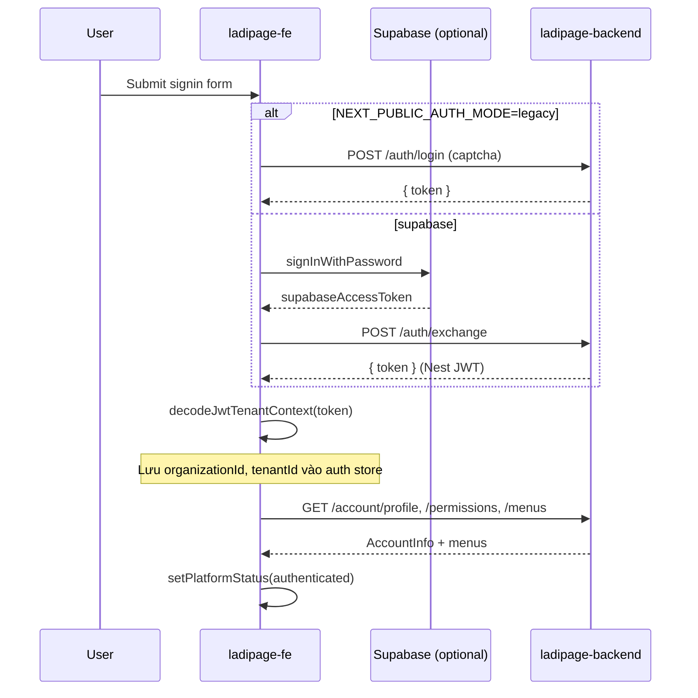
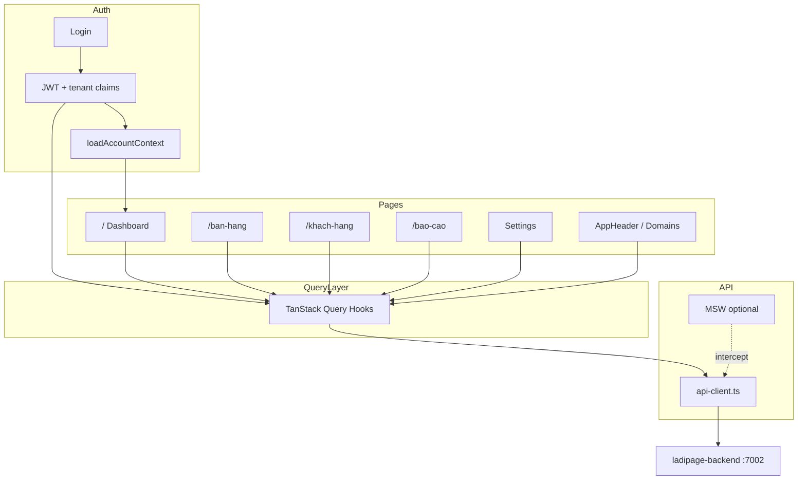

# LadiPage — Workflow tích hợp Frontend

Tài liệu mô tả các luồng đã triển khai trong `ladipage-fe` theo `sub-plan.md`: kiến trúc, luồng dữ liệu, mock API, và cách kiểm thử.

---

## 1. Kiến trúc tổng quan

```
┌─────────────────────────────────────────────────────────────────┐
│  Browser (Next.js 16 — ladipage-fe)                             │
│  ┌──────────────┐  ┌──────────────┐  ┌──────────────────────┐ │
│  │ MswProvider  │→ │QueryProvider │→ │ AuthProvider + Pages │ │
│  └──────────────┘  └──────────────┘  └──────────────────────┘ │
│         │                  │                    │               │
│         ▼                  ▼                    ▼               │
│  MSW handlers      TanStack Query         Zustand auth store    │
│  (mock optional)   (cache + mutations)   (nestToken, tenant)  │
│                           │                    │               │
│                           └────────┬───────────┘               │
│                                    ▼                           │
│                         api-client.ts (Axios)                  │
│                         unwrap ResOp { code, message, data }   │
└────────────────────────────────────┬───────────────────────────┘
                                     │ Bearer JWT
                                     ▼
┌─────────────────────────────────────────────────────────────────┐
│  ladipage-backend (:7002/api)                                   │
│  JwtAuthGuard → TenantInterceptor → TenantGuard → Controllers   │
└─────────────────────────────────────────────────────────────────┘
```

### Provider stack (`src/app/layout.tsx`)

Thứ tự bọc từ ngoài vào trong:

1. **ThemeProvider** — dark/light mode
2. **MswProvider** — khởi tạo MSW khi `NEXT_PUBLIC_API_MOCKING=true`
3. **QueryProvider** — TanStack Query client (staleTime 30s)
4. **AuthProvider** — hydrate token, refresh, redirect `/signin`
5. **SidebarProvider** — layout admin

---

## 2. Luồng xác thực & Tenant Context (FE-0 / FE-7)

### 2.1 Đăng nhập



**File liên quan:**

| Vai trò | File |
|---------|------|
| Login UI | `src/components/auth/SignInForm.tsx` |
| Auth service | `src/features/auth/services/platform-auth.service.ts` |
| JWT decode | `src/features/auth/utils/jwt-decode.ts` |
| Store | `src/features/auth/stores/auth.store.ts` |
| Bootstrap | `src/features/auth/providers/AuthProvider.tsx` |

Sau login, `platform.tenant` chứa `organizationId`, `tenantId`, `activeTenantId` từ JWT. Mọi request business gửi kèm `Authorization: Bearer <nestToken>`.

### 2.2 Refresh token (401)

```
Request → 401
  → tokenRefreshService.refreshNestToken() (dedupe bằng refreshPromise)
  → retry request với token mới
  → thất bại → clearAllAuth() → redirect /signin?redirect=...
```

---

## 3. Luồng API Client (FE-0)

### 3.1 Pattern endpoint

Mỗi module có file `src/lib/api/endpoints/<module>.api.ts`:

```typescript
// Ví dụ
dashboardApi.getSummary()  → GET /dashboard/summary
billingApi.getUsage()      → GET /billing/usage
ecomApi.listOrders()       → GET /ecom/orders
```

`api-client.ts` tự động:

- Gắn Bearer token từ Zustand
- Unwrap `ResOp`: `code === 0` → trả `data`, ngược lại throw `ApiBusinessError`
- Retry một lần khi 401

### 3.2 TanStack Query

Hooks trong `src/features/<module>/hooks/`:

| Hook | Query key | API |
|------|-----------|-----|
| `useDashboardSummary` | `dashboard.summary` | GET /dashboard/summary |
| `useDashboardOnboarding` | `dashboard.onboarding` | GET /dashboard/onboarding |
| `usePlans` | `billing.plans` | GET /plans |
| `useBillingUsage` | `billing.usage` | GET /billing/usage |
| `useOrders` | `ecom.orders` | GET /ecom/orders |
| `useCustomers` | `crm.customers` | GET /crm/customers |
| `useSalesReport` | `analytics.sales.{from}.{to}` | GET /analytics/reports/sales |

Mutations (`useCreateOrder`, `useSubscribe`, …) invalidate query keys liên quan sau khi thành công.

### 3.3 Mapper (Backend ↔ UI type)

| Mapper | Mục đích |
|--------|----------|
| `ecom.mapper.ts` | `OrderItem` API → type FE (`ban-hang`), format ngày VN, giữ `orderId` |
| `crm.mapper.ts` | `CustomerItem` API → type FE (`khach-hang`) |

### 3.4 ApiState

Component `src/components/common/ApiState.tsx` — hiển thị loading spinner, error message, hoặc empty state thống nhất trên các page.

---

## 4. MSW — Phát triển độc lập (FE-0)

### Khi nào bật

```env
NEXT_PUBLIC_API_MOCKING=true
```

### Cách hoạt động

1. `MswProvider` mount → import `src/mocks/browser.ts`
2. `setupWorker(...handlers)` intercept fetch/XHR tới `NEXT_PUBLIC_API_URL`
3. `onUnhandledRequest: "bypass"` — request không mock vẫn đi tới BE thật

### Endpoints được mock

| Nhóm | Paths |
|------|-------|
| Dashboard | `/dashboard/summary`, `/dashboard/onboarding` |
| Billing | `/plans`, `/billing/usage`, `/billing/subscribe`, `/billing/portal`, `/billing/cancel` |
| Ecom | `/ecom/orders` (GET/POST/PATCH) |
| CRM | `/crm/customers`, `/crm/segments` |
| Analytics | `/analytics/reports/sales`, `business`, `customers` |
| Settings | `/settings/workspace`, `/settings/integrations` |

Dữ liệu mẫu: `src/mocks/data.ts`. Response format: `{ code: 0, message: "success", data: ... }`.

---

## 5. Luồng theo module / page

### 5.1 Dashboard — `/` (FE-1)

```
Page mount
  → useDashboardSummary() + useDashboardOnboarding() + useCustomersReport(range)
  → ApiState bọc widget khách hàng
  → Hiển thị:
      - Greeting: profile.nickname
      - Tổng KH / KH mới: summary API
      - Progress bar: onboarding.completedCount / totalCount
      - Phân khúc: customersReport.segments
```

UI roadmap (tabs landing-page, website, …) vẫn giữ mock UI; số liệu KPI lấy từ API.

### 5.2 Bán hàng — `/ban-hang` (FE-2)

```
useOrders()
  → GET /ecom/orders
  → mapApiOrdersToFe()
  → OrdersList

Tạo đơn (CreateOrderModal)
  → useCreateOrder().mutateAsync()
  → POST /ecom/orders
  → invalidate ["ecom","orders"] + dashboard.summary

Duyệt / Spam
  → findOrderIdByCode(orders, code)
  → PATCH /ecom/orders/:orderId/status
```

Sub-tabs products/categories/inventory: UI có sẵn, chưa wire API đầy đủ.

### 5.3 Khách hàng — `/khach-hang` (FE-3)

```
useCustomers() → GET /crm/customers → CustomersList

Thêm KH → useCreateCustomer() → POST /crm/customers
```

Delete / bulk status: chưa có API delete trên BE → handler no-op.

### 5.4 Báo cáo — `/bao-cao` (FE-4)

Đã bỏ toggle `isSimulated`. Thay bằng **date range picker** (from/to) trên page.

| Tab | Hook | API |
|-----|------|-----|
| Sales | `useSalesReport(range)` | GET /analytics/reports/sales |
| Business | `useBusinessReport(range)` | GET /analytics/reports/business |
| Customers | `useCustomersReport(range)` | GET /analytics/reports/customers |
| Jobs / Automation | dateRange prop | BE stub → zeros |

Charts map trực tiếp `ReportChartDto` (labels + series) sang ApexCharts qua `ComparisonChart`.

### 5.5 Cài đặt — `/facebook-ads/cai-dat` (FE-5)

Redirect: `/settings` → `/facebook-ads/cai-dat` (`next.config.ts`).

```
useWorkspaceSettings()     → GET /settings/workspace  → hiển thị tên workspace
useIntegrationsSettings() → GET /settings/integrations → load Facebook token
onBlur token field       → useUpdateIntegrations() → PUT /settings/integrations
```

Theme mode vẫn lưu `localStorage` (không qua API).

### 5.6 Billing & Nâng cấp (FE-6)

**AppHeader — nút "Nâng cấp":**

```
Click → UpgradeModal open
  → usePlans() → danh sách Free/Pro/Enterprise
  → Chọn plan → useSubscribe({ priceId })
  → POST /billing/subscribe → { clientSecret }
  → Stripe EmbeddedCheckout (cần NEXT_PUBLIC_STRIPE_PUBLISHABLE_KEY)
```

**DomainsConfig — popover giới hạn:**

```
useBillingUsage() → domains.used / domains.limit
atDomainLimit?
  → Click "Tạo tên miền" → mở popover thay vì modal
  → "Nâng cấp gói cao hơn" → UpgradeModal
```

Header cũng hiển thị `planTierLabel(usage.subscriptionTier)` và `credits.balance`.

---

## 6. Shared types (`@liora/api-types`)

Đồng bộ từ `liora-monorepo/libs/ladipage-types` → `ladipage-fe/packages/@liora/api-types`.

Import trong FE:

```typescript
import type { DashboardSummaryDto, PlanDto } from "@liora/api-types";
```

Cập nhật thủ công khi BE thêm field — xem `packages/@liora/api-types/SOURCE.md`.

---

## 7. Biến môi trường

| Biến | Mặc định | Mô tả |
|------|----------|-------|
| `NEXT_PUBLIC_API_URL` | `http://localhost:7002/api` | Base URL backend |
| `NEXT_PUBLIC_API_MOCKING` | `false` | Bật MSW |
| `NEXT_PUBLIC_AUTH_MODE` | `legacy` | `legacy` hoặc `supabase` |
| `NEXT_PUBLIC_STRIPE_PUBLISHABLE_KEY` | — | Stripe Embedded Checkout |

---

## 8. Kết quả testing (chạy lại)

### 8.1 FE — `npm run test:api` (ladipage-fe)

**Kết quả: 6/6 PASS** (backend `:7002` đang chạy)

| Test | Kết quả |
|------|---------|
| GET /health/ready → 200 | ✓ |
| ResOp wrapper | ✓ |
| POST /auth/exchange rejects invalid token | ✓ |
| GET /account/profile → 401 without auth | ✓ |
| GET /plans reachable | ✓ |
| GET /dashboard/summary → 401/403 without auth | ✓ |

### 8.2 FE — `npm run build`

**PASS** — TypeScript + 33 routes compile thành công.

### 8.3 BE — `ladipage-tenant-smoke-test.js` (liora-monorepo)

**Kết quả: 6/20 PASS, 14 FAIL**

| Nhóm | Chi tiết |
|------|----------|
| ✓ Auth foundation | Server reachable, Supabase signIn, JWT issued |
| ✓ Tenant claims | JWT có `organizationId` + `tenantId` |
| ✗ Business APIs | 14 endpoint trả **403** (TenantGuard / org context trên request) |
| ✗ GET /plans | HTTP **500** |
| ✗ GET /billing/ | HTTP **404** (path không tồn tại — đúng là `/billing/usage`) |

**Ý nghĩa cho FE:**

- Luồng auth + JWT tenant **đã đúng** ở tầng token.
- Khi BE trả 403, FE nên dùng **MSW** (`NEXT_PUBLIC_API_MOCKING=true`) hoặc fix BE TenantInterceptor trước khi test integration thật trên browser.
- Smoke test FE (`test:api`) chỉ kiểm tra contract công khai, không cần token.

---

## 9. Hướng dẫn chạy test

```bash
# 1. Khởi động backend
cd liora-monorepo
pnpm dev:ladipage

# 2. FE smoke (không cần đăng nhập)
cd ladipage-fe
npm run test:api

# 3. FE build
npm run build

# 4. BE tenant smoke (cần Supabase credentials trong .env)
cd liora-monorepo
node scripts/db/ladipage-tenant-smoke-test.js

# 5. FE dev với mock (không phụ thuộc BE business APIs)
# .env.local: NEXT_PUBLIC_API_MOCKING=true
npm run dev
```

---

## 10. Sơ đồ luồng dữ liệu đầy đủ (sau login)



---

## 11. Việc cần làm tiếp (BE + FE)

1. **Fix BE 403** trên business endpoints sau khi JWT đã có `tenantId` — kiểm tra `TenantInterceptor` + `TenantGuard` + CLS context.
2. **Fix GET /plans 500** — lỗi server khi list plans.
3. Wire thêm FE-2 sub-tabs: products, categories, inventory.
4. Thêm E2E test (Playwright) cho Dashboard + Upgrade modal.
5. Script CI sync `@liora/api-types` từ `libs/ladipage-types`.

---

*Tài liệu cập nhật: 2026-06-16 — sau lần chạy test lại.*